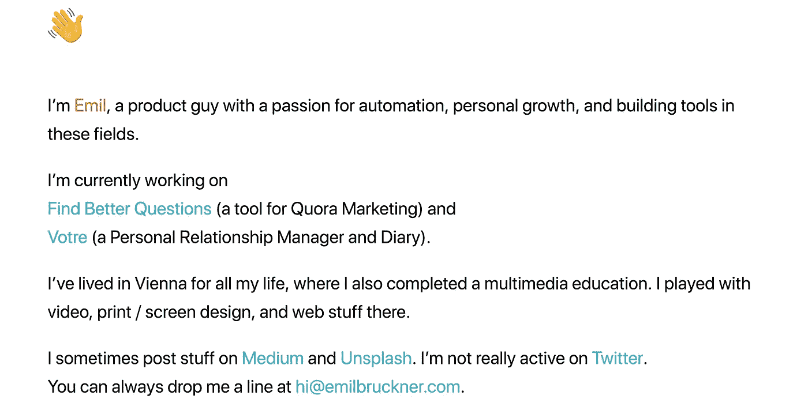
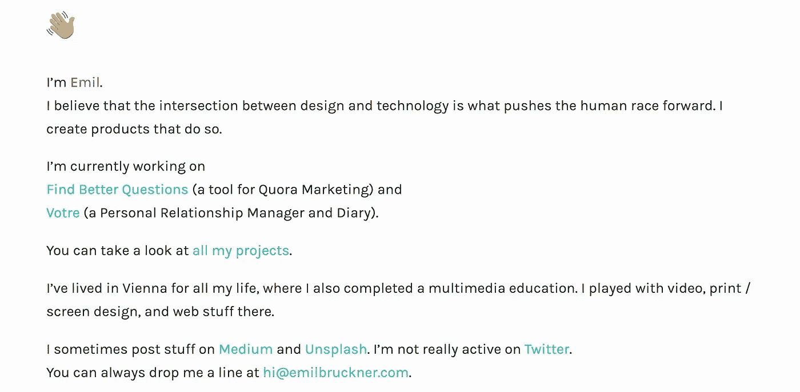
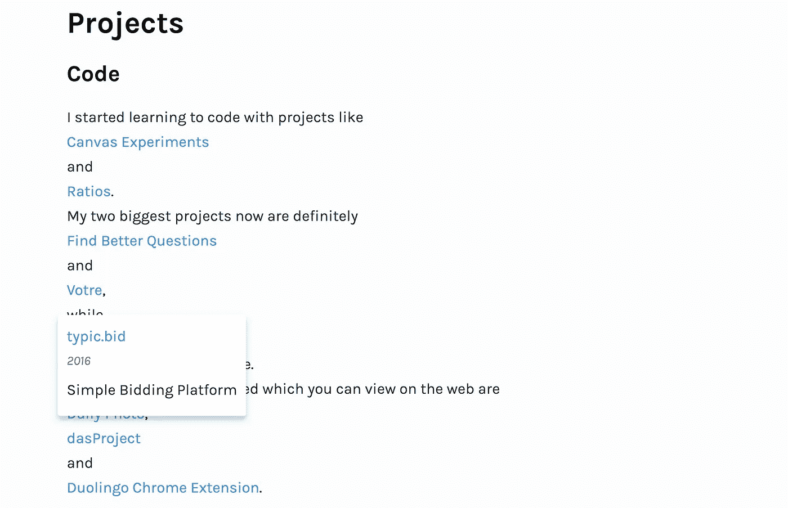

# 如何不像一个开发者那样创建你的投资组合

> 原文：<https://medium.com/hackernoon/how-not-to-create-your-portfolio-as-a-developer-2e514ef642ba>

## 为什么我要这么做，为什么你不应该这么做

许多开发者都有某种网站。我也一直有一个。这是网络上的一个空间，你可以在这里描述自己。与 Twitter 上的个人资料不同，你可以设定框架，展示一张中性的自己的照片。

对我来说很重要的一点是，搜索我名字的人能很快知道我是谁，我在做什么。他们也不应该依赖搜索来找到我所有的社交资料。

这就是为什么我以前的网站看起来像这样:

我真的很喜欢。它做了我想让它做的所有事情。但我们都知道这不是投资组合。没关系。个人网站不必是作品集，但我还是想要一个。我想要它的原因和大多数人创建它的原因一样:为了找工作(是的，你可以雇佣我)。

## 我以前的网站有什么问题？

我确实提到了我最重要的工作，但是最缺乏的是关于它们的更多的上下文。人们应该能够感受到我一直在做什么，而不用花几个小时来检查我的工作。

下一个版本应该实现以上所有内容，再加上提及几个项目，并告诉读者更多关于它们的信息。换句话说，我需要一个项目页面，和单独的项目页面。

## 技术部分

由于之前的版本已经有了[盖茨比](https://www.gatsbyjs.com/)——是的，我确实加载了几段文字——它直接增加了一些页面。这就是静态站点生成器的用途。

填写项目页面实际上是相当多的工作，但除此之外，我的作品集也差不多完成了。
但如果是的话，我也不会写这篇文章。就我对创建投资组合的建议而言，这是你应该停止的地方。无论你的梦想组合是什么样子，你都有 80%的把握，你可以把时间花在真正重要的事情上，比如申请工作。

但我有一个愚蠢的想法，我的投资组合至少应该在某些方面有点特别。

这是我最后得到的结果:

除了把介绍换成另一个我不喜欢的，我只加了一个我项目的链接。

耗费我全部精力的是这个:

The projects page

## 主要思想

你可以从主页进入一个项目，而不需要重新显示整个页面。当您打开一个项目时，卡片会放大并显示其所有内容。当你合上卡片，或者只是继续滚动，你就回到了项目页面。我想这是我从 https://techcrunch.com/那里偷来的想法。

那么是什么痛苦让它变得不值得呢？

*   动画片
*   卷动
*   动画片

我甚至还没有完成所有关于动画的边缘场景。此外，当改变路线或关闭卡片时，管理页面应该滚动到哪里是一个真正的挑战。

最终，它在移动设备上看起来不太好，所以我也必须编写一个“正常”的版本，它只有正常的路线转换。

我花了超过 90%的时间在这个网站上，让它更有趣一点。这与我的目标不一致，我也不太清楚当时为什么还要建造它。

## 只需建立一个简单的网站

作为一名前端开发人员，你的网站不应该难看，但你不必展示你的网站本身的能力。你不必重新发明网站的构建方式。坚持那些已经被证明了几百次的东西，你将会以最小的风险节省大量的时间。

## 为什么我没有听从这个建议？

我猜你可以玩一会儿的事实就是为什么建立一个个人网站很有趣。你希望它是浏览起来有趣的东西。稍微反映你个性的东西。我也喜欢冒险。

哦，如果你正在招聘，别忘了看看[我的作品集](https://emilbruckner.com/)😉。