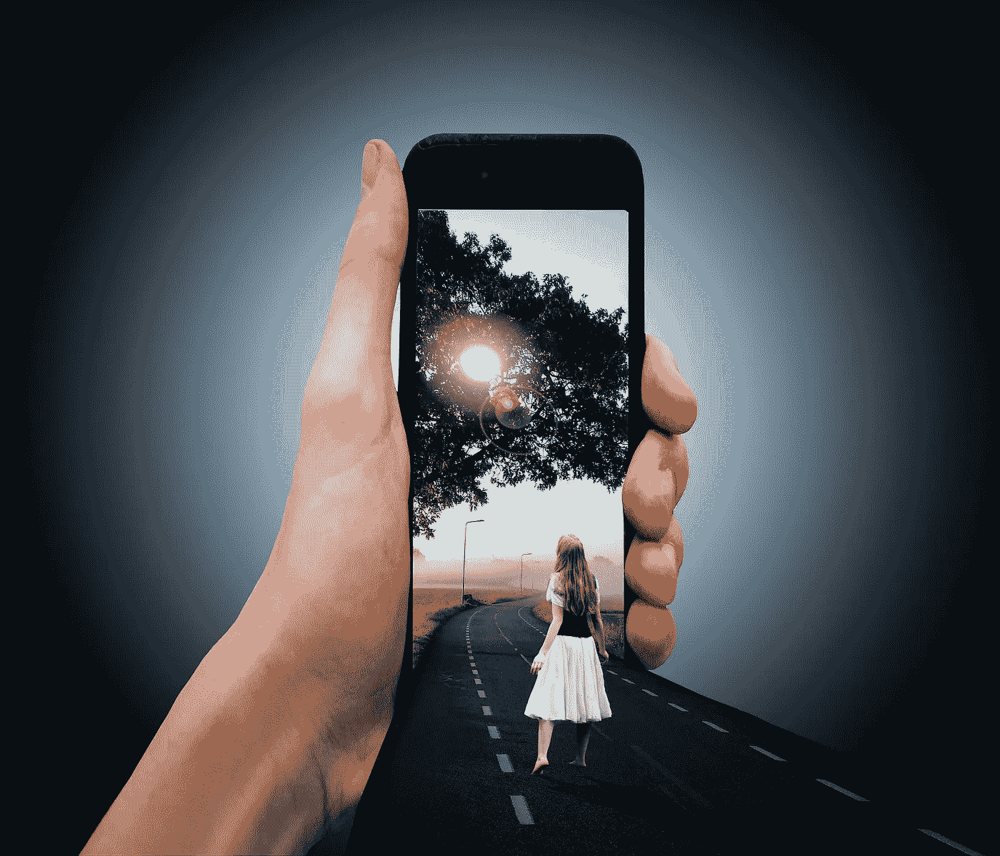

# 如何不看手机

> 原文：<https://medium.com/hackernoon/how-not-to-look-at-your-smartphone-4b80c5b539>

Image Source: Pixabay.com

每次我去健身房，我都会把手机落在家里。这是我多年来一直遵循的做法。

我相信我花在身体和健康上的一个小时比什么都重要。

但是在我的左边和右边，我看到几个人在跑步机上打电话，给他们的家务助理下达指令，或者谈论生意…

我确信他们是善意的，只是想优化他们的时间…但是如果一个人的心总是在别处，他怎么能集中注意力呢？

技术正在入侵我们生活的方方面面，我们需要在它完全超越我们的思想和身体之前建立一些界限。

因此，我开始在媒体上发表名为“技术排毒”的文章，这样我们就可以一起更加意识到脱离数字世界的重要性。

我是一名作家兼编辑兼博客写手，不用说，互联网已经消耗了我的生活……因此，寻找与互联网脱离的途径成了我的一项使命。

我的日常锻炼——瑜伽、散步或健身房——看到我有意识地关掉手机并把它收起来。当我读书的时候，我也会让手机保持静音，因为我不喜欢被打扰。

我远离手机的另一种方式是在不同的房间充电…有一段时间，这让我忘记了它，我可以更有效地专注于其他任务。

我还认为，我们的大多数活动，无论是开车、走路，甚至是做饭，都需要我们全神贯注……在这种时候，最好还是把手机放在一边，或者保持静音，专注于手头的工作。

我看到几个人停下来用手机发短信，当其他步行者这样做的时候，我会阻止他们…我必须承认我也这样做过几次。

那时我才意识到，作为人，我们正变得多么不合群，看着我们的手机，而不是街上的人，或者美丽的天际线，或者鸟语花香。

如今，我低头拾起落下的花……每天都发现新的图案和几何图形，新的配色方案。

我们所有人都需要找到方法来转移我们对无处不在的智能手机的注意力——这个小工具开始变得比生活本身更重要。

我希望你们每个人都能在下面写下一个如何不看手机的解决方案，并与读者分享你们是如何成功或不成功地不屈服于手机的。

*如果你喜欢这个博客，为它鼓掌，与你的网络分享，并关注我。*