# 如何不推广您的分散式交换平台发布

> 原文：<https://medium.com/hackernoon/how-not-to-promote-your-dex-launch-dc535d82559d>

MetaMorph.pro 刚刚推出了去中心化交易平台(DEX ),这是我见过的最糟糕的 T2 游击式网络营销(T3)。这是一个典型的黑幕&不良行为、明星效应和付费机器人的案例，让我来解释一下:

一切都是从 Reddit [/r/0xProject](https://www.reddit.com/r/0xProject/comments/9yxvec/binance_vs_metamorphpro_0xprotocol/) 上一个引起我注意的帖子开始的，因为我之前从来没有听说过 MetaMorph.pro，也因为用户/u/[**Flucboii**](https://www.reddit.com/user/Flucboii)**似乎是正确的**

**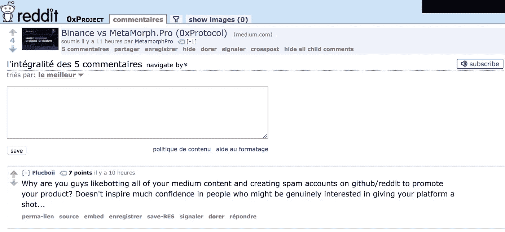**

**“币安 vs MetaMorph.pro”的帖子在 Medium 上有 6.2k 的点击量，这对于一个关于最近推出的 DEX 的随机帖子来说是疯狂的(从规模来看，[我的 100k 阅读量的帖子有 1.6k 的点击量](/@MaxenceCornet/coinhive-review-embeddable-javascript-crypto-miner-806f7024cde8)、**以及 IDEX 最常用和最受欢迎的 DEX 的大多数 Medium 帖子，** [**的点击量不到 1k)**](https://medium.com/aurora-dao)**

**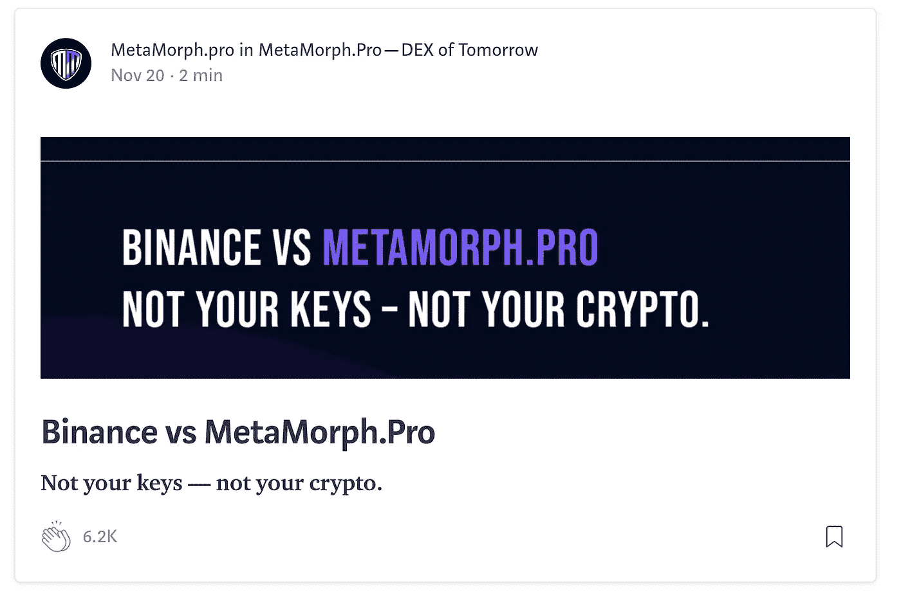**

**此外，MetaMorph.pro 在 Medium 上的每个帖子都有大约相同的鼓掌量，约为 6.2k:**

**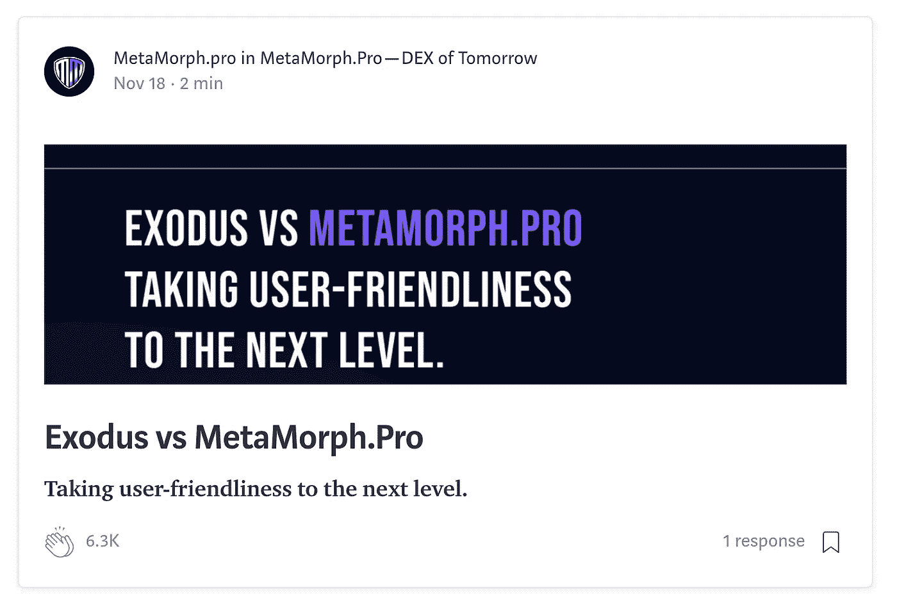**

**6.3K for “Exodus vs MetaMorph.pro”**

**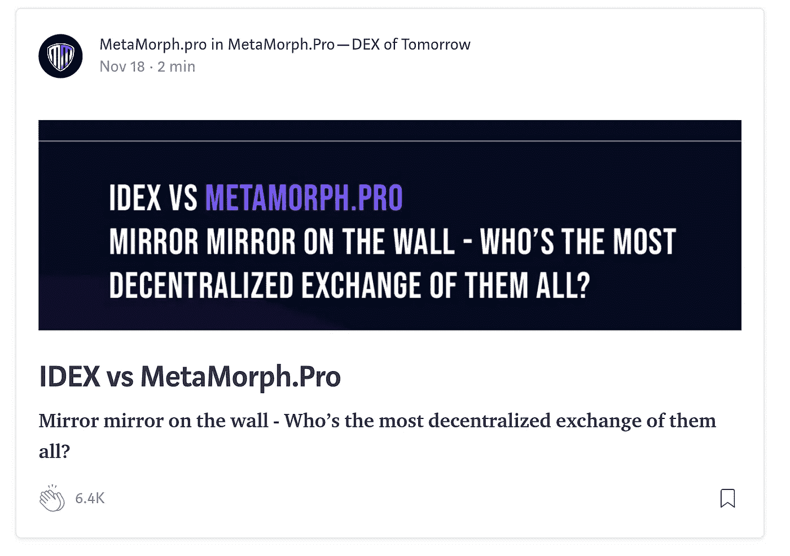**

**6.4K for “IDEX vs MetaMorph.pro”, can you notice the pattern ? ;)**

**现在，让我们深入了解一下那些为帖子鼓掌的人:**

**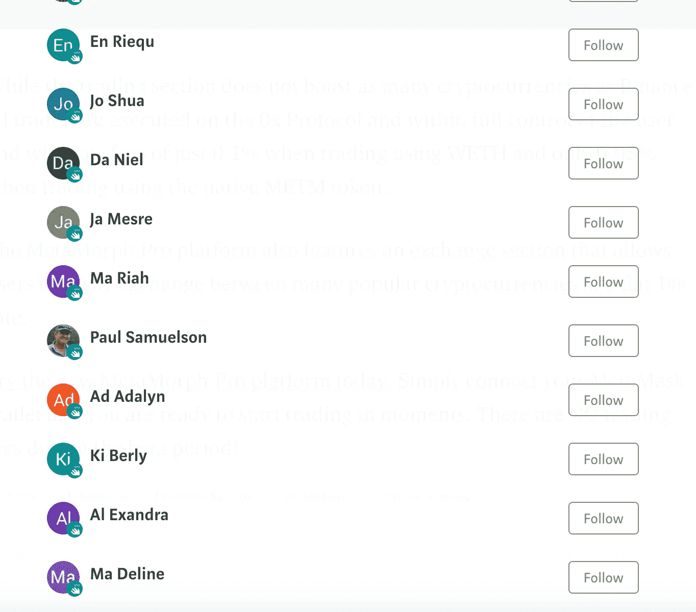**

**用户都是中等非成员，所有的名字共享相同的模式:2 个字母的名字，然后是一个随机的姓氏，让我们检查他们的配置文件:**

**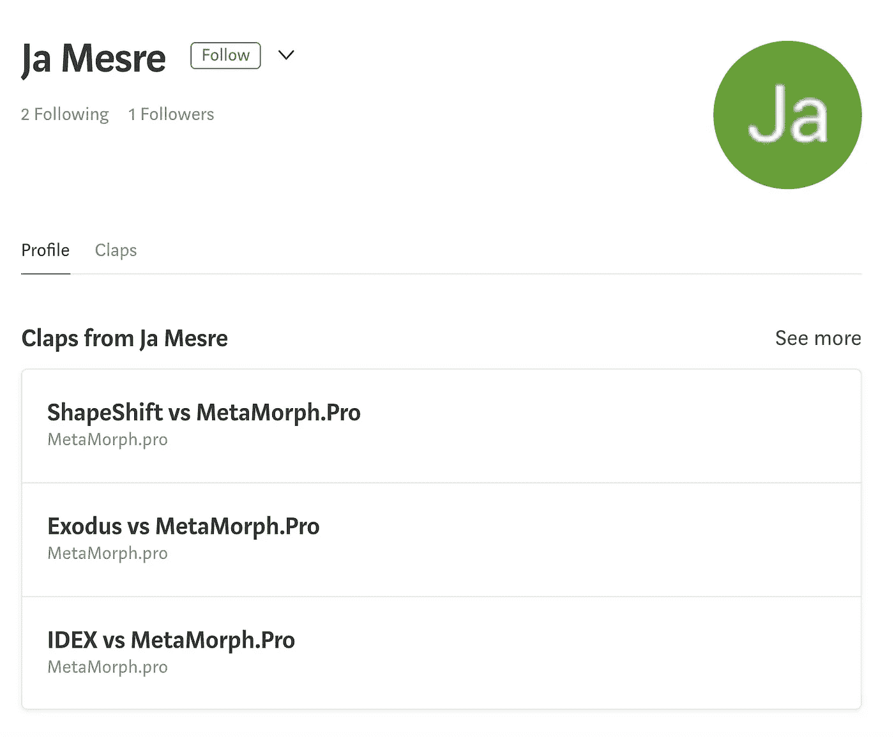****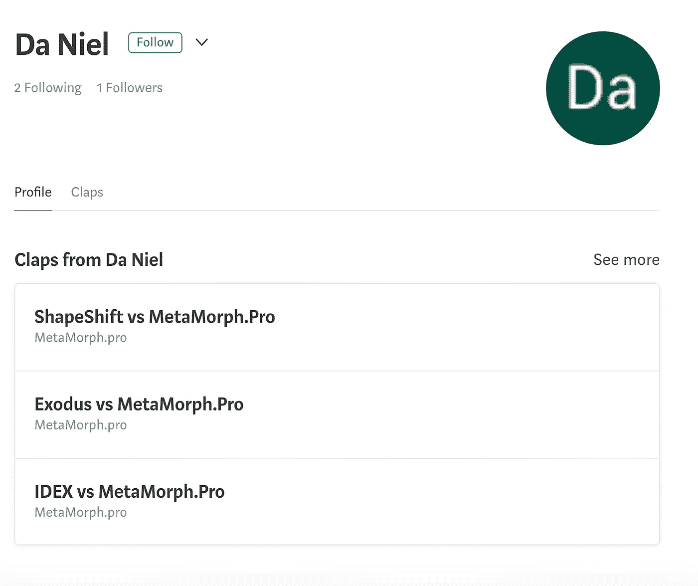****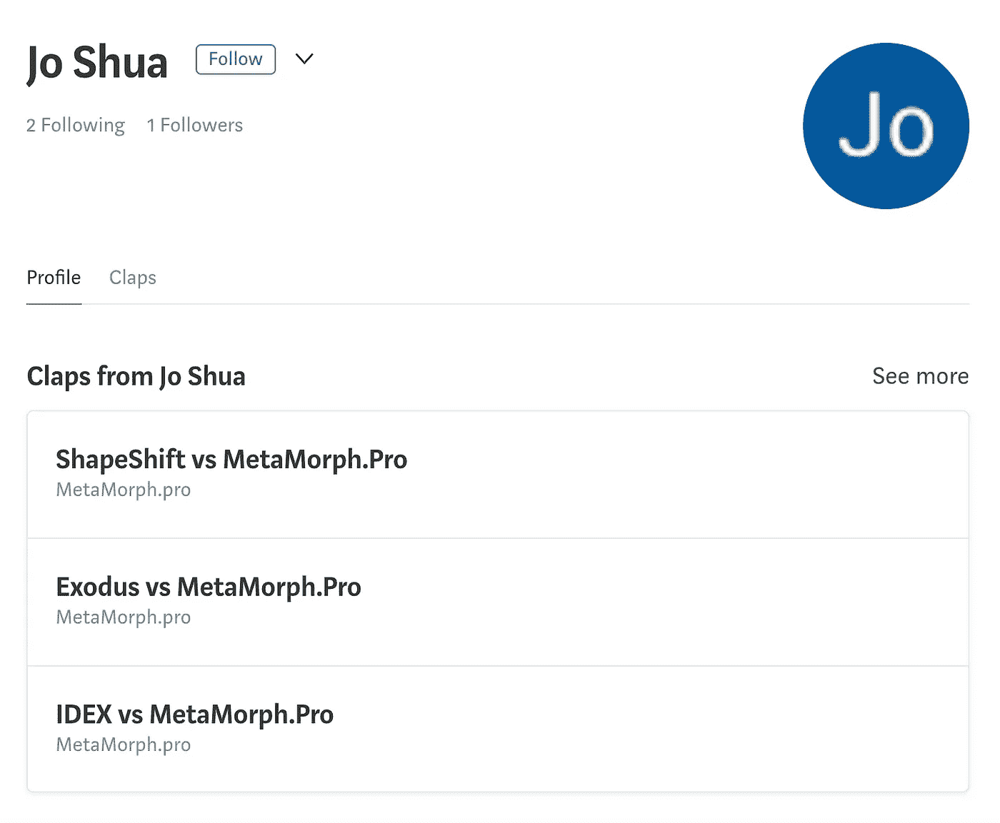****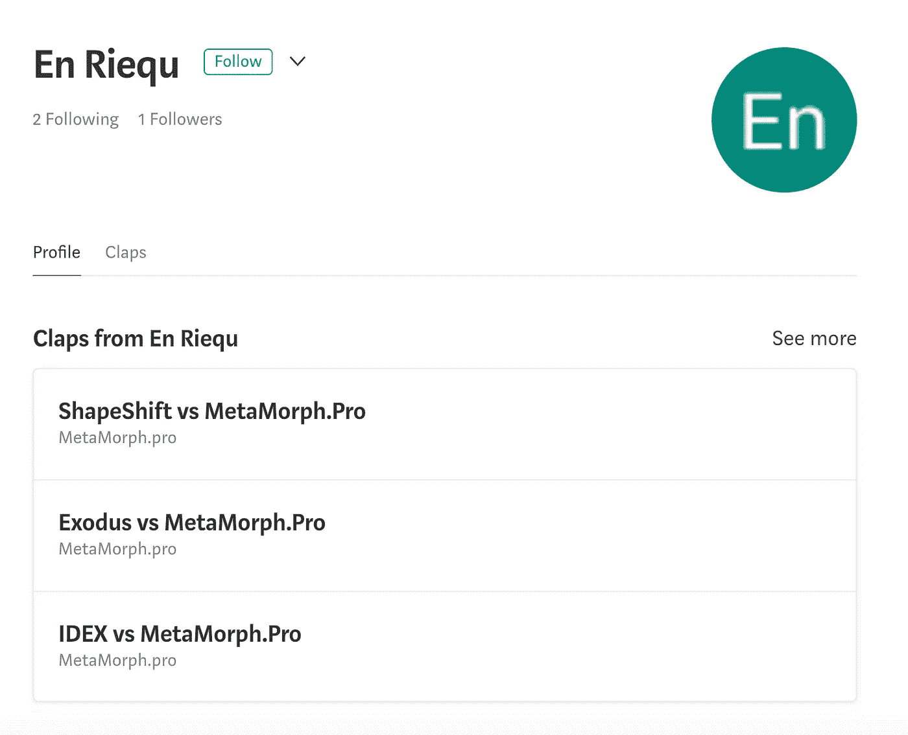**

**看来“Da niel”、“En Riequ”、“Jo Shua”和“Ja Mesre”真的很爱 MetaMorph.pro，他们在为 MetaMorph.pro 的每一个中帖鼓掌，当然他们从来没有拍过别的。**

**我检查过的每一个鼓掌声都来自这种用户账户**

**因此，我们可以看到机器人在 Medium 上的一些明显用法，现在让我们看看他们是如何在 Reddit 上推广 DEX 的:**

**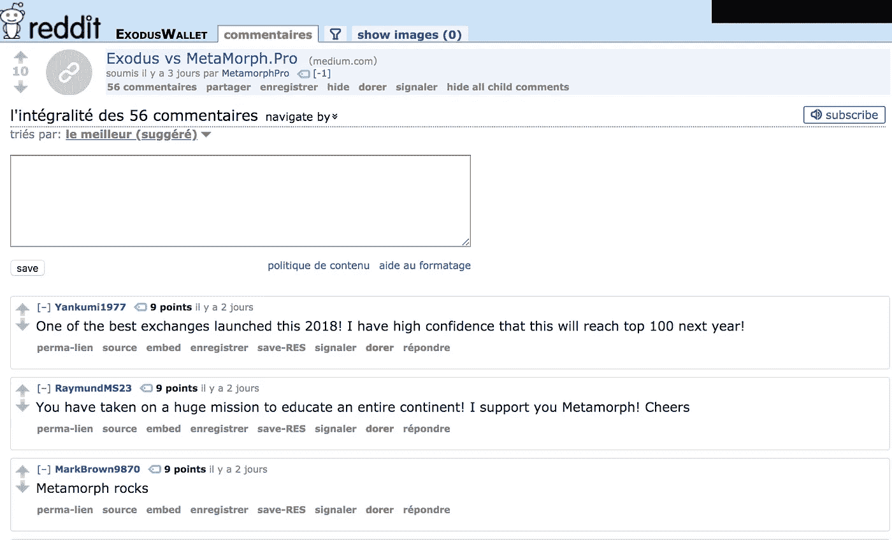**

**Of course, people on /r/ExodusWallet are rooting against Exodus…**

**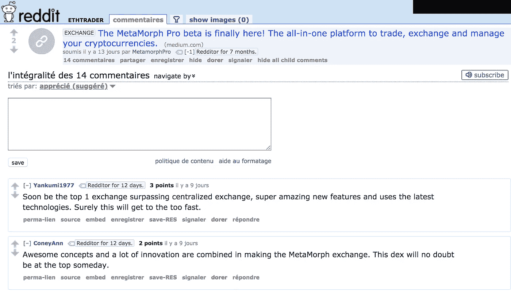**

**LOL at the most upvoted comment, seems so legit**

**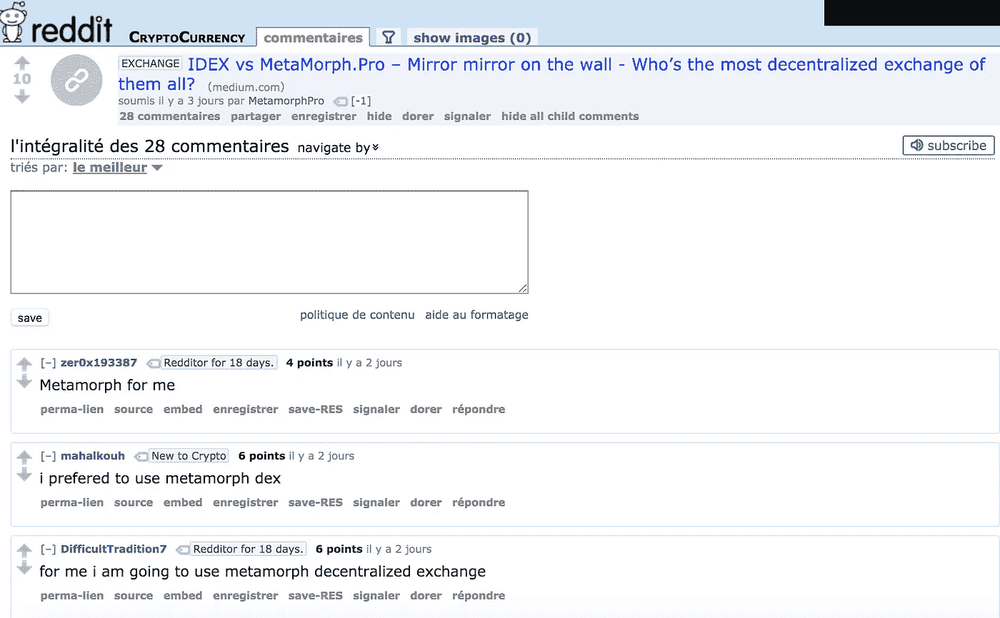**

**Everybody seems to be rooting for the unknown DEX rather then IDEX, it seems so legit again**

**如果你曾经使用过 Reddit，你就会知道那些评论是不自然的，它们要么是由机器人生成的，要么是由付费用户写的，他们不知道自己在说什么，好 ol '[astro turming](https://www.reddit.com/r/NoStupidQuestions/comments/6cy10r/whats_astroturfing/)。**

**现在最好的是 MetaMorph.pro 的市场部连市场都不懂，Exodus *是钱包，*根本不跟一个 DEX 竞争，完全是两码事，同样的事情也适用于 Shapeshift。**

**整个“Exodus vs MetaMorph.pro”或者“Shapeshift vs MetaMorph.pro”没有任何意义。**

**至少 IDEX 是 DEX，币安是 exchange，所以“IDEX vs MetaMorph。亲”或“币安与变形。Pro”并不完全荒谬。**

****作为结论:**
——如果你想推广你最近推出的 DEX，不要使用机器人来推广你的帖子，或任何见不得人的技术
——如果你确实使用机器人，至少不要使用相同的模式为每个用户生成名字
——**如果我不能信任你的营销技术，我也不会信任你来管理我的(加密)钱****

**如果您有任何意见或问题，请随时在 [Twitter](https://twitter.com/MaxenceCornet) 上联系。也可以查看我的小游戏[cryptoguessinggame.com](https://cryptoguessinggame.com/)**