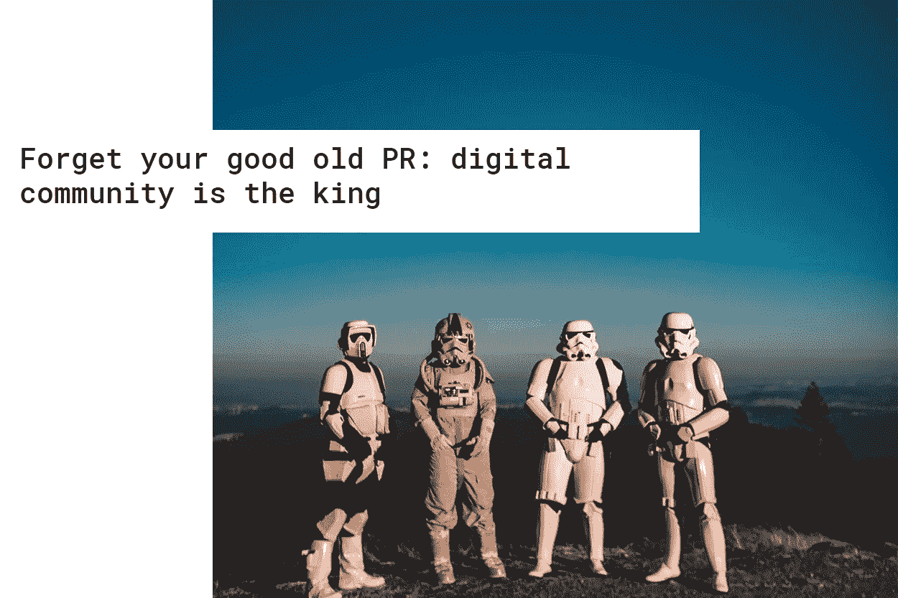

# 忘记你以前的公关，数字社区才是王道

> 原文：<https://medium.com/hackernoon/how-not-to-run-an-ico-a-crypto-dummys-guide-310a4bad6fba>

奥尔加·格里尼纳

我已经涉足 ICOs 的狂野西部很长一段时间了，我不得不承认:crypto 的大多数营销人员仍然不知道这个行业到底是如何运作的。

## 尊重加密圣地

在深入探讨成功的后工业化公关策略的该做和不该做的事情之前，让我们试着在更广的范围内搞清楚一些事情。为什么区块链突然成了大家的宠儿？全球经济进程发生了什么？理解以区块链和非财务动机为精髓的全球社会经济转变，是发展以用户参与为核心的高效营销的基础。

后工业商业模式的全球范式转变将社区和用户参与带到了前台。客户将最积极地参与新形式的业务，从而将他们的角色转变为比单纯的社交媒体更大的角色:现在是用户与首席执行官和经理一起参与业务运营。这就是为什么当努力想出如何获得大规模用户响应的想法时，人们应该问的第一个问题是*‘我如何让他们想参与进来，参与到我们正在打造的这件事情当中？’*

理解去中心化商业模式的本质也很重要。这基本上是关于建立生态系统，让社区有机会带来价值，同时从平台本身获得一些额外的价值。自然， ***以社区为中心的战略并不是推销一种产品或服务。*** 它是关于参与和互动，以实现价值的相互有机交换，以期围绕基于真实使用/编程案例的项目建立一个忠诚的强大社区，与炒作无关，但与业务和技术有关。

更重要的是，建立一个卓越社区的目标对于成为一个成功的区块链产品来说似乎是至关重要的，并且实际上有这样做的剧本:

#1 —最大化您的初始令牌分发

# 2——将项目的使命和价值观整理成文

#3 —培养富有成效的在线讨论

#4 —提供支持

#5 —建立一个资助项目

#6 —支持社区运营的组织

# 7——传播消息

#8 —玩得开心

## 获得那些该死的有机追随者

还是想不出如何让有机社交媒体关注？给内容为零的页面注入一些流量。你好，我是明显队长:至少努力转发一些麦卡菲的推文。或者，我在这里为你准备了一个叫做“删除一切”的作弊代码:这里你基本上是在说“哎呀，我们从来没有开始这个页面”。这就是你如何结束再也没有机会吸引观众，这可能是更好的。反正没人会买你的代币。

每个人都想成为独一无二的第一区块链平台，利用最酷的技术。然而，你或许可以比要求潜在投资者加入白名单更有创意，希望他们立即感到有特权获得一个可疑的机会，申请投资一个从未有人听说过的东西。做一点小小的努力来吸引观众怎么样？“我要硬币电报！”，可能是我从愚蠢的首席执行官那里听到的最常见的要求。他们都疯狂地渴望它。但是等一下，你们听说过 Alexa rank 吗？我不是要摧毁“世界上阅读量最大的加密媒体”，但确实有排名更高的科技媒体！我甚至没有在这里谈论 Techcrunch。求助于主要的媒体出版物，这些出版物聚焦于已经存在了很长时间的技术，吸引了热衷于高质量讨论的观众。现在我们谈论的是观众参与。Tokeneconomy、Consensys、比特币基地博客以及一些个人博客是我最喜欢的。相信我，你的潜在投资者、爱好者以及最重要的投资基金和其他大玩家都在那里。

《上个赛季菲亚特工业》中的任何品牌总监都会大声疾呼，如果他看到你试图削减聘请设计师的成本，而是使用“一些基本的图像来填充空间”。记住，傻瓜，与你的品牌战略相一致的视觉效果是至关重要的。“好吧，那我们就做贴纸！”现在你正在到达那里。还记得我吹嘘的用户参与度吗？发起一场设计竞赛怎么样——让人们变得有创造力，相信我，结果会大大超过你的 KPI。我遇到了一个由新兴平台 Akropolis 运营的社区任务，里面有各种各样的小测验和谜语。他们的 Telegram 的社区参与在某个时候变得非常大，我非常确定他们在产品的技术实现方面也从社区驱动的策略中获得了最多。注意守则

这里有一个我最喜欢的:' '我们稍后会填写 GitHub 页面，反正没人能读懂那该死的代码！你错了，笨蛋。把代码弄清楚，让它弹出来。或许可以考虑雇佣不会告诉你代码是“私有”的首席技术官:他可能没有代码，或者你的 ICO 是骗局——除非这是你最初的计划。人们可以通过复制粘贴代码行或从竞争对手的页面窃取代码而不受惩罚的时代已经一去不复返了。请不要宣布 ICO 的开始日期，直到你让 ERC-20 启动并运行。因为实际上可能会有一些人真的想转移他们宝贵的比特币来购买你的代币。

## 任何事情都在公共关系中进行

有一件事每个人都选择不去注意，但它却在私下进行，那就是贿赂。这听起来可能有点言过其实，但这确实是事实。媒体渠道到处向读者提供付费公关，交易所涉嫌(或事实上)操纵资产价格，而专家评级意见被购买一定数量的 BTC。

想要成为区块链企业家的人找到我，天真地要求我在 ICO 工作台上回顾他们的项目，或者在 Cointelegraph 上提及他们的项目。其中一些是相当直截了当的付费邀请。让我印象深刻的是，那些黑幕 ico 连令牌化的本质都没想得到。你们有没有问过自己，为什么要在区块链经营业务？同时，在 ICO 项目中，架构对于设计业务流程至关重要，因此令牌对投资具有吸引力，并且在扩展项目时既有外部市场价值增长的潜力，也有内部价值增长的潜力。没有多少创业公司有能力处理这个问题:通常情况下，业务本身和代币是对立的。老实说，在有些情况下，如果根本不引入令牌，企业实际上会运营得更好。 *我认为一个成功的 ICO 本质上是好的产品、有效的营销策略和恰当的市场定位的结合，’*

瓦西里·苏马诺夫说，他也在 LinkedIn 上分享了令人讨厌的消息。

从更大的范围来看，这对整个区块链工业的影响是相当惊人的。不仅名誉岌岌可危。那些“狡猾的企业家”为了将代币推向交易所并抬高价格而推出代币，只是在摧毁我们对新技术的善意。

我们说完了吗？我只想卖掉那些代币，伙计。嘿，我是想帮你。最后一件事:ICO 清单。非常重要:“我们覆盖的列表越多，购买代币的人就越多”。嗯，有时候——或者更多，几乎每次——质量胜于数量。检查出一个很好的旧的 Alexa 排名的最受欢迎的网站的巨大列表——没有人会下降超过前 10 名。

## 深入挖掘，努力思考

对于那些为“该死的 ICO”挠头的首席营销官来说，最重要的一点是:忘掉你那些以产品/市场为中心的老策略吧，它们在这里根本不适用。区块链的使命:为社区创造价值是一项基础技术，它提供了一个机会来创建社区可以自己带来价值+从平台获得额外价值的系统。**非财务动机**是后工业经济中的关键因素。

更多有趣的东西在这里:[https://www.technomads.wtf/](https://www.technomads.wtf/)