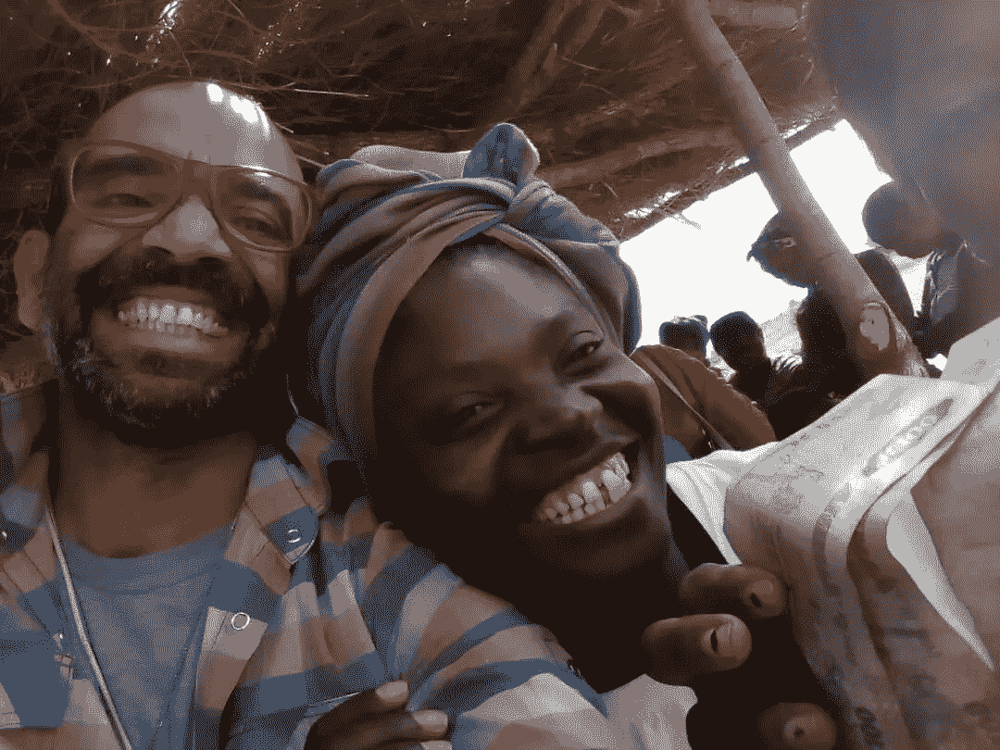

# 一家区块链公司如何迎合没有银行账户的人

> 原文：<https://medium.com/hackernoon/how-one-blockchain-caters-to-the-unbanked-da5e3db878cb>

## 通过身份获得尊严

Image Credit — Ashish Gadnis

BanQu 通过一项开创性的举措，为没有银行账户的人提供了一个永久的基于身份的解决方案。区块链即服务软件公司旨在通过识别那些在脆弱情况下保持匿名的人来解决全球贫困问题。BanQu 于 2016 年由 Ashish Ghadnis 和 T2 Hamse Warfa(他本人是来自索马里的难民)共同创立，通过为未认证者提供 T4 经济和交易身份，赋予他们一个身份，以便他们能够平等地参与全球经济。

## BanQu 如何给没有银行账户的人一个身份

全球约有 25 亿人很少或根本无法获得信贷和银行服务，这将他们归类为没有银行账户/银行服务不足的个人。这一类别的人往往包括难民、境内流离失所者和世界上最贫穷的人，他们仍然被排除在全球经济之外，没有他们的教育、金融历史、过去就业的记录或获得银行和信贷服务所需的其他信息。

BanQu 为没有银行账户的人提供了一个身份，允许他们通过简单的短信功能手机创建一个安全的在线个人资料，因为生活在极端贫困中的人可能无法使用智能手机。用户跟踪从教育资格到交易历史(如收获信息)的所有信息，这对农民来说至关重要，从而逐步建立信用历史。有了这些信息，他们可以开立银行账户，申请小额贷款，拥有房产，甚至获得医疗保健和其他基本服务。与现代服务相结合，让没有银行账户的人成为全球经济的一部分。

通过该计划，BanQu 致力于实现几个联合国[可持续发展目标](http://www.undp.org/content/undp/en/home/sustainable-development-goals.html)并创造商业模式，不仅在商业上取得成功，而且在发展中国家和不发达地区产生积极的社会影响,从而赋予了无银行账户者一种身份。

## 通过服务实现可持续发展目标

*   健康和幸福:公司的经营原则是，每个人都应该有一份健康记录，以便及时得到护理。释放区块链技术的力量，保护个人隐私。它希望提供关于出生登记、疫苗接种、艾滋病毒和其他医疗用品的准确和实时信息，以及传染病爆发的预警。这些对那些在冲突、自然灾害和被迫移徙时期受打击最大的人非常有帮助。
*   **优质教育:**公司的认证教育平台(职业或其他)允许青年获得认可，以获得就业，为他们自己和社区建立经济复原力。对于被排除在全球经济之外的[弱势青年](https://www.linkedin.com/pulse/banqu-thrilled-announce-its-upcoming-impact-investing-ashish-gadnis/)来说，认证教育记录加上培训经历至关重要。
*   **性别平等:**发展中国家的一个现实是，与男性相比，女性(尤其是农民和微型企业家)更有可能陷入贫困，因为她们无法平等地获得有偿工作、教育和财产。由于无法获得金融服务，他们无法提供基本的收获历史、作物/商品定价和土地/资产权利。BanQu 为没有银行账户的人提供了一种身份，以解决新兴市场女性农民和微型、小型和中型企业的性别不平等问题。通过将它们连接到全球供应链，该公司计划创建可以从世界任何地方访问的交易记录。
*   **陆地生活:** BanQu 的平台旨在提供农业供应链的可追溯性。这增加了从制造商到农民的端到端透明度。该公司正在试行小块农民土地测绘，重点是拉丁美洲的女农民。这可能为农民由于过时的财产登记或缺乏土地权利而难以获得土地的情况铺平道路。
*   **目标合作:**2018 年 6 月，BanQu 与全球领先的酿酒商百威英博(Anheuser-Busch InBev)合作，将多达 2，000 名[赞比亚农民](https://www.prnewswire.com/news-releases/banqu-launches-trailblazing-partnership-with-anheuser-busch-inbev-to-revolutionize-supply-chain-transparency-in-zambia-300703561.html)连接到一个移动平台，他们预计收获并销售 2，000 吨木薯。这种技术驱动的方法可以帮助农民在赞比亚 8 月份的生长季节结束前生产出用于啤酒的高质量淀粉。

通过该应用程序，BanQu 为没有银行账户的人提供了一个身份，迄今已将 8 个国家的 15，000 多名最后一英里农民、流离失所者和难民链接到该平台。此外，该公司的目标是到 2028 年通过使用区块链技术帮助 1 亿人摆脱极端贫困。

## **原载于**[**The Borgen Magazine**](http://www.borgenmagazine.com/banqu-gives-an-identity-to-the-unbanked/)**由** [**蒂娜扎迪**](https://www.linkedin.com/in/deenazaidi)