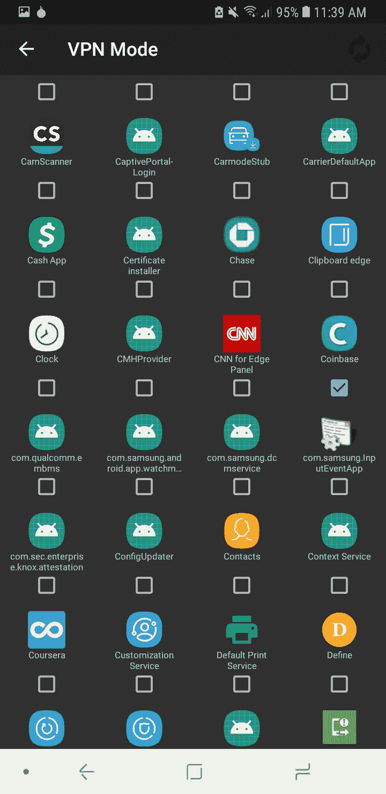

# 洋葱路由如何节省您的密码

> 原文：<https://medium.com/hackernoon/how-onion-routing-can-save-your-crypto-32b005b318e5>

[Source](https://www.thesslstore.com/blog/what-is-mining-cryptocurrency/)

注意:这篇文章是为 Android 用户写的。当我为其他平台找到合适的解决方案时，我会更新它。

在这篇文章中，我将解释如何使用[洋葱路由](https://en.wikipedia.org/wiki/Onion_routing)来保存你钱包中的加密货币。

[Mt.Gox](https://blockonomi.com/mt-gox-hack/) 和 [Maple change](https://twitter.com/MapleChangeEx/status/1056582662435954688?s=09) hacks 已经证明，在交易所拥有加密货币是不安全的，因为整个基础设施都可能被黑客攻击/洗劫。我们唯一的其他选择是将加密货币存储在钱包中。

即使我们有像[比特币基地](https://wallet.coinbase.com/)这样的带有安全基础设施的钱包(到目前为止没有已知的黑客攻击)，黑客仍然有一种可能的方式可以访问你的加密货币，即通过安装**键盘记录器**。

键盘记录器是一个安装在主机上记录所有击键的 bug。现在，加密货币最安全的特征是保护你账户的唯一私人密钥可以被记录，黑客可以访问你所有的密码。即使区块链是安全的，用户界面仍然容易受到攻击。

现在我将为这个问题提供一个解决方案。

# 解决方案:

1.  用户必须首先安装带有 Tor 的 [Orbot: Proxy，这是一个用于 Android 的洋葱路由器。](https://play.google.com/store/apps/details?id=org.torproject.android)
2.  安装后，轻敲**启动**按钮。

Tap on Start

3.点击突出显示的设置图标。

Tap on settings icon

4.从应用程序列表中选择比特币基地。我假设你已经安装了[比特币基地](https://play.google.com/store/apps/details?id=com.coinbase.android&hl=en_US)或者任何相关的钱包。

Select Coinbase app

5.现在点击比特币基地图标打开现在使用 Tor 网络的应用程序。

使用 Tor/Onion 网络的优点是它是多层的，并且总是在几分钟内改变到新的身份(或者可以由用户手动改变)。因此，黑客很难在你的设备上植入漏洞并记录你的**私钥。**

以下引文是我写这篇文章的动机:

> “网络必须按照规则来组织。他们要求统治者执行这些规则。对抗作弊者。”~海军拉维坎特。

感谢您阅读我的文章。

**注:**
本文来自莱特州立大学智能实验室在裴勇博士指导下完成的研究工作。

莱特州立大学:[https://www.wright.edu/](https://www.wright.edu/)
计算机科学与工程系:[https://www . Wright . edu/degrees-and-programs/profile/Computer-Science](https://www.wright.edu/degrees-and-programs/profile/computer-science)
裴勇俊博士:[https://people.wright.edu/yong.pei](https://people.wright.edu/yong.pei)

*如有任何问题，欢迎随时给我发* [*邮件*](mailto:pamanalionline@gmail.com) *。也可以通过*[*Linkedin*](https://www.linkedin.com/in/amanali1/)*联系我。你也可以关注我的* [*微博*](https://twitter.com/aliandco) *。*

*为了入门区块链阅读我的* [*文章*](https://hackernoon.com/blockchain-learning-path-2019-e54d6763dd6c) *发表于*[*hacker noon*](https://hackernoon.com/)

