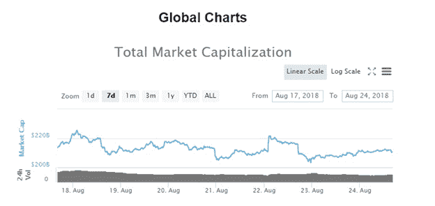
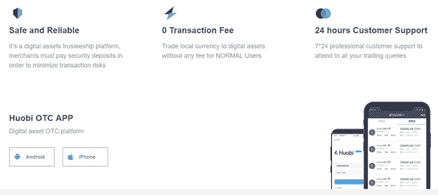

# 场外交易如何帮助我的加密投资最大化

> 原文：<https://medium.com/hackernoon/how-otc-trading-helped-maximize-my-crypto-investment-685ca06d14ce>

## 尽管有太多的场外交易平台，我将展示为什么 [Huobi Global](https://www.hbg.com/en-us/topic/invited/?invite_code=946q3) 一直是我投资的首选场外交易平台，以及我如何通过这个平台积累更多的回报。

[Dawid Zawiła](https://unsplash.com/@davealmine) | Unsplash

F 对于许多大型加密货币投资者来说，现有的交易所往往无法提供他们偏好的交易习惯所需的必要流动性或物流运作。 [TABB 集团最近](https://uk.finance.yahoo.com/news/otc-much-larger-bitcoin-exchange-212305761.html)披露，场外交易市场的交易量是交易量的 2-3 倍。在为知名投资者处理大量交易时，许多交易所缺乏流动性是几个问题的首要问题。短时间内在现有公共交易所清算数亿美元的加密货币可能会让市场崩溃。如果没有足够的买入订单来帮助转换卖出订单，这种情况尤其明显。但是通过使用 [Huobi OTC](https://www.hbg.com/en-us/topic/invited/?invite_code=946q3) 进行谨慎的交易，我能够提供一个坚实的基础，鼓励我最大限度地利用我的加密投资。

# **什么是场外交易？**

场外交易是通过一个分散的交易商网络进行的，交易商是专业人士，他们的工作是为这些证券和硬币“做市”，同时为客户简化交易。场外交易是为高交易量的交易者提供的服务；因此，它将只适用于选定的个人和团体。许多大型交易商青睐场外交易，机构投资者或高净值个人也经常青睐场外交易。

场外交易可以通过以下方式进行:

## ➲ **券商**

这些平台提供定制服务，允许高交易量交易者执行大宗交易，同时通过拥有大量加密货币的流动性提供商获得资金，避免任何滑点问题。

## ➲聊天室

**这种场外交易的方法托管在许多 IRC 渠道上，允许交易者之间进行 P2P 交易。**

## **➲ **自动取款机****

**更常见的是，比特币 ATM 机被安装在允许客户将菲亚特转换为加密货币硬币的地方，而无需通过在线交易所。然而，这个过程通常非常缓慢和繁琐。**

# ****近期市场走势**📉**

**继 8 月 10 日至 15 日的市场大屠杀之后，市场已经设法稍微稳定下来。比特币的价格一直在横向波动，而替代比特币的价格涨跌互现。乙醚继续其高波动性，现在固定在 280 美元左右。比特币一直在寻找向 6900 美元关口的反弹，但最终涨幅被抹去，并修正至 6260 美元附近的盘中低点。然而，比特币现在已经缓慢反弹至 6400 美元至 6600 美元的区域，将整合情绪延续至人们认为已经逃离的区间。**

**随着美国证券交易委员会(SEC)昨日不批准 8 只比特币相关 ETF 的最新消息，BTC 价格做出反应，从 6550 美元跌至 6280 美元。然而，在过去的 24 小时内，市场迅速反弹，从 6280 美元跃升至 6550 美元。鉴于未来支持的 ETF 获得 SEC 批准的可能性非常低，它们随后的拒绝应该不会对 BTC 的价格产生太大影响，这解释了快速复苏的原因。**

****

**There was a little dump following SEC rejection news, however this was followed by a quick corrective rally, dismissing any losses | [Source](https://coinmarketcap.com)**

# **🚀**OTC 如何提供更高的投资回报****

**在有幸目睹并广泛参与了臭名昭著的 2017 年末牛市之后，我将我的许多 altcoin 头寸清算到菲亚特，并持有总头寸约 55，000 美元。我全年继续持有这笔资金，耐心地等待合适的机会出现。8 月 14 日，随着 BTC 价格今年首次跌破 6000 美元至 5971 美元，这种情况在本月早些时候出现了。我们决定将全部资金投入 BTC，并耐心持有。经过彻底的研究，我决定使用场外交易作为我的首选交易方法，更确切地说是场外交易。选择这条路线的主要原因——**滑移**。**

**在像加密这样不稳定的市场中，滑点是经常发生的。滑点指的是交易者在交易中期望的价格和实际收到的价格之间的差异。这可以转化为购买加密货币时的较高价格，或出售时的较低价格；当交易所的卖家希望他们的硬币有不同的价格时，就会出现滑点。下单后，订单簿从最便宜的价格到最贵的价格。**

**如果我购买少量的比特币，这不会是一个问题，但是由于我购买的数量非常大，滑点将随着购买数量的增加而增加，因为我将不得不在订单簿上继续购买。但是通过使用 Huobi OTC，滑点被完全避免了，因为订单只有一个购买比率。火币 OTC 能够找到一个单独持有大量比特币的卖家，并与我配对销售，同时允许卖家通过他们选择的方法接收付款。还有一种可能性是，如果我因为任何原因对配对的卖家不满意，我可以要求去找下一个不满意的卖家。这与集中交易形成对比，在集中交易中，如果我对价格或费用不满意，可能没有任何合适的替代方案。**

# ****火币场外使用案例****

**以下视频不仅很好地展示了 Huobi OTC 提供的服务，也很好地概述了 OTC 交易的一般工作方式。**

**Huobi have released a video explaining the simple process required on how to get started | [Source](https://www.youtube.com/watch?v=r00_WCbzVtY)**

**为了能够快速顺利地开始场外交易，读者可以通过[Play Store](https://itunes.apple.com/us/app/huobi-app/id1023263342?mt=8)/[Google Play](https://play.google.com/store/apps/details?id=pro.huobi)下载火币 app，或者访问[https://otc.huobi.com](https://otc.huobi.com/)。接下来，这是一个简单的注册过程。完成后，读者需要登录并执行以下步骤:**

**➲ **第一步:**选择想要交易的数字资产(以“购买 BTC”为例)，根据自己的意愿选择价格和支付方式，点击“购买 BTC”**

**➲ **第二步:**输入您想要的总额/金额，点击“确认”。**

**➲ **第三步:**在订单页面，确认订单的金额(总额)和支付方式。**

**➲ **第四步:**在弹出的“确认支付”窗口中，点击“确认”。**

**➲ **第五步:**等待卖家发布数字资产。**

**➲ **第六步:**卖方释放数字资产后，交易完成。**

**请注意，付款后 5 或 10 分钟，订单仍未完成；读者可以选择通过“呼叫”图标联系卖家。**

## ****在平台上张贴广告****

**当然，除了买入选项，场外交易用户还可以选择卖出选项来清算他们持有的加密货币。为此，用户需要执行以下操作:**

**➲ **第一步:**普通用户必须完成“身份验证”，才允许发布广告。**

**➲ **第二步:**每条广告的最高金额上限为 2 BTC/20 eht/20000 usdt/2000 EOS/5000 ht。(更高的广告金额，需要申请成为认证商家)**

**➲ **第三步:**普通用户的 OTC 账户必须维持相当于 0.01 BTC 的最低总资产，否则广告将被离线发布或隐藏。**

**➲ **第四步:**这只适用于非中国地区用户。**

****

**The Huobi OTC Platform had a massive role in helping me maximize my existing funds by allowing the most efficient form of OTC purchasing | [Source](http://otc.huobi.com)**

## ****对于已验证的商户，以下规则适用:****

**➲ **第一步:**经过验证的商家将接受我们对其个人信息的严格背景调查，并被要求支付保证金。**

**➲ **第二步:**通过验证的商家可以发布更高的购销广告。**

**➲ **第三步:**经过验证的商家可以使用唯一的 v 标志。**

**➲ **第四步:**通过认证的商户可享受一对一专属客服和商户培训计划。**

*****免责声明:*** *请仅将此信息作为我的* ***自己的*** *意见，在任何情况下都不应视为财务建议。做任何决定前请记住***🤓****