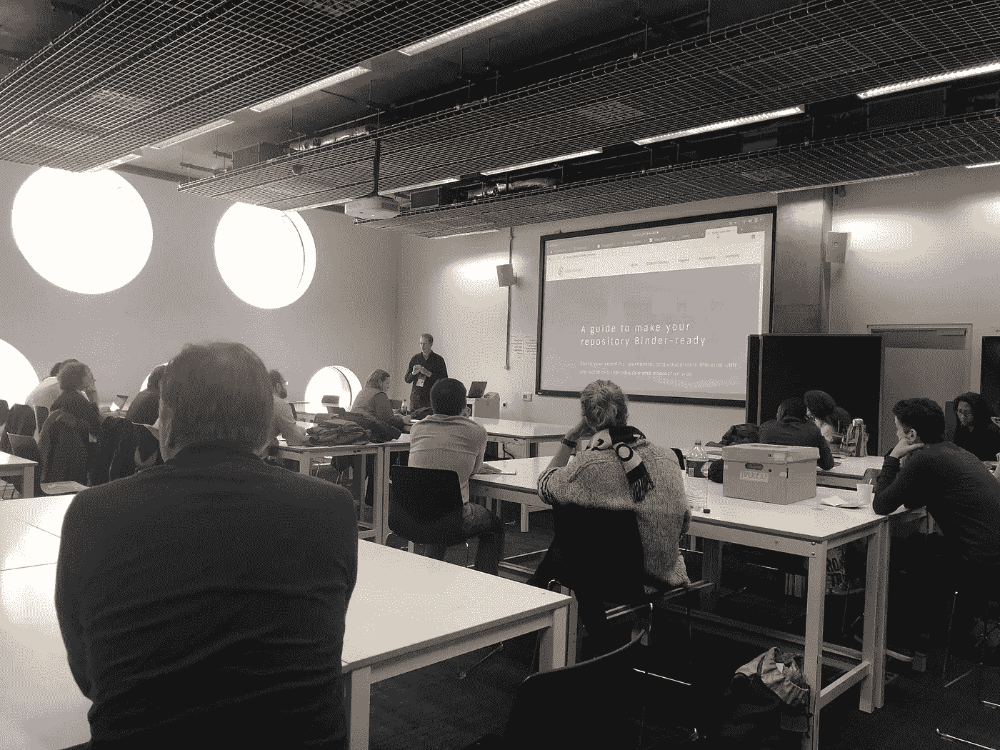
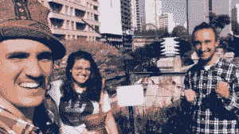
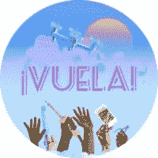
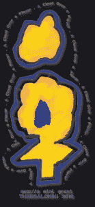
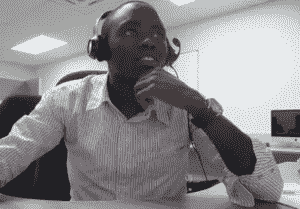

# 人们如何改变世界一次 5000 美元

> 原文：<https://medium.com/hackernoon/how-people-are-changing-the-world-5k-at-a-time-b5f44716650e>

当我在 [MozFest](https://mozillafestival.org/) 上读到这个会议标题时，我不知道会发生什么……5K 怎么会产生影响。我傻眼了，瞬间好奇…

…资金充足吗？这些是什么类型的项目？这些变革者来自哪里？**这些人是谁？#CantEvenRightNow**

在我透露他们是谁之前(这并不神秘，你可以向下滚动)，在你迷失在他们的项目和惊奇之前，我想分享我的一个收获。

**主要收获:对于任何和所有有抱负的公民黑客/发明家/社会企业家/创意人来说，总有空间去尝试和试验你的创意。有人会听，会听见你！**

所有这些项目的美妙之处在于，它们都是付诸行动的小规模想法。Mozilla 倾听了这些获奖者想要提升工作和激情的呼声。我知道我们中的许多人可能会对分享我们的想法感到紧张，甚至申请这样的项目…但我深深地鼓励你尝试，再尝试。

好了，说够了，现在来看看这些人是谁:

EITCHA 团队合影

**项目:**Escola erinterante de Tecnologia cidad Hacker—EIT cha
**导语:***Leonardo Sehn Alves*
**地点:**巴西
**简介:** EITCHA 是一个项目，旨在向巴西阿雷格罗港周边学校的孩子们教授开放科学、公民科学、开放软件和硬件、开放数据和信息安全。项目负责人将领导为期 3 天的研讨会，通过教授学生如何通过学校的气象站编程、部署和收集数据来展示这些概念。
**了解更多，参与其中:【http://eitcha.org/】网站—/Gitlab 资源库—[https://gitlab.com/eitcha](https://gitlab.com/eitcha)**

**项目:**在马达加斯加建立一个开放的数据社区
**牵头:***Fabienne Rafidiharinirina*(Twitter:[@ asso maidi](https://twitter.com/@assomaidi))
**地点:**马达加斯加
**描述:**该项目旨在为年轻学生开发并实施一个为期五个月的培训项目，让他们参与到在马达加斯加建立一个开放的数据社区中来。这将通过数据培训课程、在线和实地数据收集以及创建专门用于发布非营利组织收集的数据的开放数据平台来实现。
**了解更多参与:**[http://www . association-maidi . mg](http://www.association-maidi.mg/)

**项目:**活页夹工作坊
**牵头:** *Tim 负责人*(Twitter:[@ betatim](https://twitter.com/@betatim)/GitHub:[@ betatim](https://github.com/betatim))
**地点:**瑞
**简介:**在六个多月的时间里，该项目的负责人将为希望学习使用活页夹来改进该工作室将在欧洲的三场活动中接受测试。
**多学习多参与:**[https://mybinder.org/](https://mybinder.org/)

**项目:** ETER ||一个免费/自由的教育用空气质量监测器&研究
**负责人:***Julieta Arancio*(Twitter:[@ cassandreces](https://twitter.com/@cassandreces)/GitHub:[@ thessaly】](https://github.com/thessaly)
**地点:**阿根廷
描述:一个为期六个月的项目，与高中教师共同开发一个开源空气质量监测器的原型。这将伴随着开放教育资源的发展，围绕为什么和如何运行开放科学学校项目。
**多学习多参与:**[https://github.com/rlyehlab/eter](https://github.com/rlyehlab/eter)

Vuela！意思是“飞！”用西班牙语。图片由@teddiet.wee 设计

**项目:**开放科学无人机工具包
**导语:** *古斯塔沃·佩雷拉·伊鲁霍&帕兹·贝尔纳多*(推特:[@ gpereyrairujo](https://twitter.com/@gpereyrairujo)&[@ Paz byc](https://twitter.com/@PazByC))
**地点:**阿根廷&智利
**描述:**通过智利七个开放协作的工作坊&阿根廷
**多学习多参与:**[https://osf.io/fscn4/](https://osf.io/fscn4/)

**项目:** DNA 测序到人
**负责人:***Lisa Thalheim*(Twitter:[@ li5a](https://twitter.com/@li5a)/GitHub:[@ lthalheim](https://github.com/lthalheim))
**地点:**德国
**描述:**这个项目的目标是通过举办一系列关于 a)创建开源硬件和协议的研讨会，将 DNA 测序交给业余爱好者
**了解更多，参与其中:**【https://github.com/lthalheim/DITSeq】T42

**项目:**促进全纳 STEM 教育—触觉材料& 3D 打印
**导语:***Nikolaos Nerantzis*(Twitter:[@ Nerantzis](https://twitter.com/nerantzis)/GitHub:[@ Nerantzis](https://github.com/nerantzis))
**地点:**希腊
**简介:**以促进全纳 STEM 教育为目标，本项目旨在打造将通过在小学高年级&中学举行的五个系列研讨会来制作材料。
**了解更多，参与其中:**[https://acoaf.wordpress.com](https://acoaf.wordpress.com/)

**项目:**开放知识地图爱好者
**领导:** *马克西·施拉姆*(Twitter:[@ ok _ Maps](https://twitter.com/ok_Maps)/GitHub:[@ OpenKnowledgeMaps](https://github.com/OpenKnowledgeMaps))
**地点:**奥地利
**描述:**开放知识地图寻求建立一个全球范围的超级用户和大使社区，让用户更积极地参与到开放知识地图平台的创建过程中，并使他们能够传播视觉文学的知识他们将通过编写培训材料、设立社区协调员和社区基础设施来做到这一点。
**多学习多参与:**[https://openknowledgemaps.org](https://openknowledgemaps.org/)

项目负责人 Caleb Kibet 的照片

**项目:**促进肯尼亚开放、可复制和合作的生物信息学研究
**牵头:***Caleb Kibet*(Twitter:[@ Calkibet](https://twitter.com/@Calkibet)/Gitter:[@ kipkurui](https://github.com/kipkurui))
**地点:**肯尼亚
**说明:**该项目旨在通过组织会议、研讨会和黑客活动，在内罗毕宣传和促进开放和可复制的生物信息学研究目标群体是当地大学的研究生和积极性很高的本科生。
**了解更多参与:**[https://github . com/kipkurui/OpenScienceInBioinformatics-Kenya](https://github.com/kipkurui/OpenScienceInBioinformatics-Kenya)

所以你有 it 人员，一些真正了不起的人合作。我鼓励你花时间去寻找那些和你交谈的人，并参与其中。或者……适用于程序本身。**呜呜！感谢阅读！**