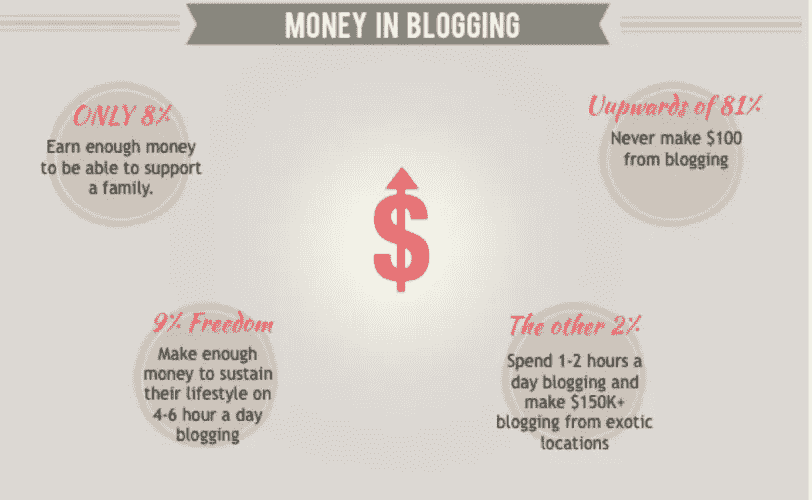
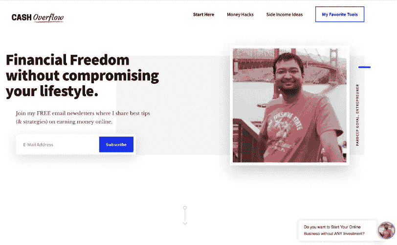
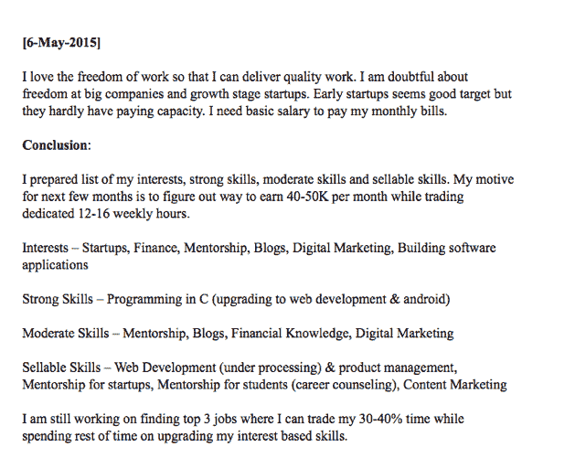
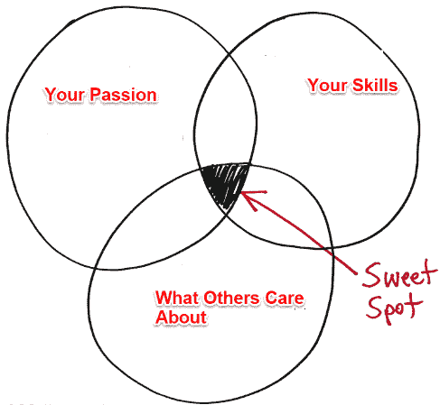
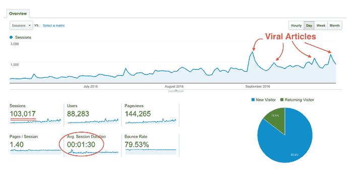
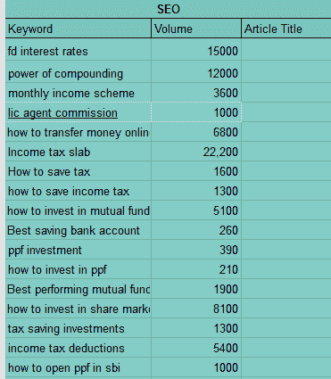
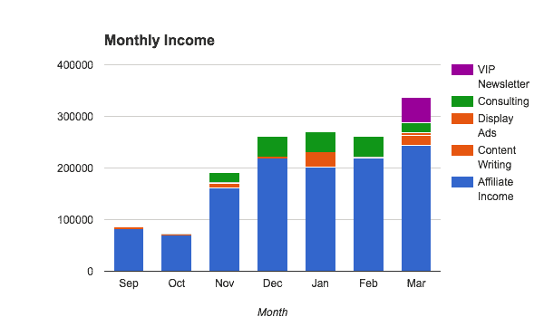

# 帕拉德普·戈亚尔如何建立一个每月收入 3000 美元的盈利博客

> 原文：<https://medium.com/hackernoon/how-pradeep-goyal-built-a-profitable-blog-generating-more-than-3000-per-month-ea96f850e6a2>

## [推送面试](https://www.facebook.com/groups/Pushstarter) 07:

## [帕拉德普·戈亚尔](https://www.linkedin.com/in/pardeepgoyal/)如何在不花钱进行付费营销的情况下，建立一个每月产生 3000 美元利润的博客。

随着[**WordPress**](https://wordpress.com/)[**Wix**](https://www.wix.com/)**[**Medium**](/)等平台的兴起，开博客已经成为一小时的活动。**

**每天都有数百万博客通过这些平台发布，更不用说整个互联网了。**

**是的，开一个博客已经变得很容易，但是把它建成一个有利可图的生意仍然具有挑战性。****Blogging.org 也同意这一点:******

********

****[**Blogging.org**](https://blogging.org/)****

****我得到了采访 [**帕拉德普·戈亚尔**](https://www.linkedin.com/in/pardeepgoyal/)[**cash overflow**](https://www.cashoverflow.in/)的创始人的机会。****

## ****通过这次采访，他分享了:****

> ****“他如何建立了一个盈利的博客，每月收入超过 3000 美元，而无需花钱进行付费营销”****

****这是[**push interview**](https://www.facebook.com/groups/Pushstarter/)**系列**第七期面试**:帮你的面试**[**push start**](https://www.facebook.com/groups/Pushstarter/)**[**push start**](https://www.facebook.com/groups/Pushstarter/)。******

****如果你碰巧错过了，可以看看我们之前关于“ [**我如何建立印度最活跃的创业社区之一**](https://hackernoon.com/how-i-built-the-most-active-startup-community-of-india-dfd83e8fe687) ”的采访。****

**** [## 我如何建立印度最活跃的创业社区之一

### 我从零到一建立创业社区的旅程

hackernoon.com](https://hackernoon.com/how-i-built-the-most-active-startup-community-of-india-dfd83e8fe687)**** 

# ****你是🕴Who 吗？****

********

******Hey** [**Pushstarters**](https://www.facebook.com/groups/Pushstarter/)**!** [**Pradeep**](https://www.linkedin.com/in/pardeepgoyal/) **this side :)******

****嘿 [**Pushstarters**](https://www.facebook.com/groups/Pushstarter/) ！我是 [**帕迪普·戈亚尔**](https://www.linkedin.com/in/pardeepgoyal/) ，一个金融极客，内容[营销](https://hackernoon.com/tagged/marketing)专家，一个早期创业公司的成长顾问。****

****我在一家 IT 公司工作了 7 年，在辞职前担任技术主管，共同创立了两家创业公司——[**SchoolGennie**](https://www.crunchbase.com/organization/schoolgennie)**和**[**pocket science**](https://inc42.com/resources/shutdown-pocketscience/)。********

****在我的前两次创业都没有找到成功之后，我在 2015 年 5 月创办了[**cash overflow**](https://www.cashoverflow.in/)**，帮助人们产生被动收入，实现财务自由。******

******自 2015 年 5 月推出以来， [CashOverflow](https://www.cashoverflow.in/) 已实现有机增长，目前每月有 **200，000 名访客**。******

# ****🤔 [**现金溢出**](https://www.cashoverflow.in/) 是怎么回事？****

********

******The current version of** [**CashOverflow**](https://www.cashoverflow.in/)****

****[CashOverflow](https://www.cashoverflow.in/) 是一个专注于两件事的个人理财门户网站——***财务充裕度&财务自由度*** 。虽然它们听起来很相似，但两者之间有细微的差别。****

> ****经济富足是指通过某些方式满足你的欲望，即使你可能还不富裕。****
> 
> ****财务自由就是建立足够的财富，让你不再为钱而紧张，不再关心生活中金钱以外的事情。****

*******有了这个重点，***[***cash overflow***](https://www.cashoverflow.in/)***提供了关于存钱、投资和赚被动钱的实用见解。*******

****我的愿景是帮助人们建立第二收入来源——然后拉着他们的手管理他们的钱和生意，无论他们是通过自由职业、咨询、博客还是创业赚钱。****

****如果你登陆我的网站，你会学到一些省钱或者挣钱的东西。****

# ****💯是什么促使你开始 [CashOverflow](https://www.cashoverflow.in/) ？****

****当我在 2013 年开始我的第一家[创业公司](https://hackernoon.com/tagged/startup)时，我 90%是技术人员，10%是营销人员。****

****作为联合创始人，我以撰写销售文案、博客帖子、社交媒体营销等形式承担了数字和内容营销的工作。****

****我的第一次创业失败了，我在 [**LinkedIn**](https://www.linkedin.com/pulse/how-we-lost-rs-1500000-startup-shutdown-before-first-pardeep-goyal/) **，**[**your story**](https://yourstory.com/2015/11/startup-shut_down/)**和**[**startup karma**](https://www.startupkarma.com/startup-and-shutdown/)**上公开分享了案例研究。**********

> ****我失败了，但鉴于我对创业的热爱以及我将获得工作和实现自己想法的自由，我很清楚我必须开始一项在线业务。****

## ****为了弄清楚我真正想开始做什么，我做了以下练习:****

******第一步:**写下我的想法。****

******第二步:**记下了我的初级&其他副技能。****

****第三步:写下我的核心兴趣，包括我热爱的领域。****

******第四步:**回忆上一次帮助别人，让他开心的时候。****

## ****这是我在 2015 年做的运动的真实快照:****

********

****做完这个练习后，我意识到个人理财是我真正喜欢的一个领域。从金融新闻、金融产品、信用卡、省钱秘笈、投资哲学、所得税法等等。****

****我喜欢为企业家和自由职业者谈论任何金融方面的事情。****

*****这再加上我对内容营销日益增长的热爱，使得*[*cash overflow*](https://www.cashoverflow.in/)*对我来说是一件轻而易举的事情。*****

********

****这就是我如何开始 [CashOverflow](https://www.cashoverflow.in/) 并兼职做了将近一年。我慢慢掌握了窍门，并开始喜欢它，但我没有从[现金溢出](https://www.cashoverflow.in/)中赚到任何钱。****

****我加入了儿童保健领域另一家名为 [Babygogo](https://www.babygogo.in/) 的初创公司，担任内容营销主管。我帮助这家初创公司建立了最初的内容营销、病毒式文章和视频。我在网络和社交媒体上建立了有机增长渠道。****

****[我们的一个视频在网上疯传，一天之内点击量达到 100 万次](https://yourstory.com/2016/06/facebook-viral-video-recipe/)，到现在这个视频吸引了 700 万次点击**。******

****在 Babygogo 工作了一段时间后，我意识到这家初创公司的雄心与当初不同，并限制我以内容营销主管的身份做我认为对公司最有利的事情。****

******于是，我辞掉了工作，决定从 2016 年 9 月开始全职做 CashOverflow。******

****老实说，我害怕冒这个险，因为它可能会导致重大损失。但是，我对自己有信心，我一定会在 2016 年 12 月前找到一些收入来源。****

****我为我的读者发布了[我的年度收入报告](https://www.cashoverflow.in/annual-income-report-2017)，并将继续每年发布收入报告。****

****所以，不用担心钱和失败，我开始全职创建 CashOverflow。****

## ****正如亚马逊首席执行官杰夫·贝索斯所说:****

> ****我知道如果我失败了，我不会后悔，但我知道我可能会后悔的一件事是没有尝试。****

# ****🤑**你是如何将博客作为自己的生意来经营的？******

****我在 [**WordPress**](http://wordpress.org/) 上建立了我的网站，这非常容易。我所需要的只是一个 [**托管服务**](https://www.website.com/beginnerguide/webhosting/6/1/what-is-web-hosting?.ws) **，一个注册的** [**域名**](https://www.website.com/beginnerguide/domainnames/8/1/what-is-a-domain-name?.ws) **，**和**一个**[**WordPress**](https://wordpress.org/)**账号**来让事情开始运行。****

## ****我网站的第一个简单版本:****

****[**存档链接**](https://web.archive.org/web/20150531234308/http://www.cashoverflow.in:80/)****

****启动你的网站需要不到 60 分钟的时间，我在这里 解释了启动博客或网站的**s**[**step by step process。(域名仅需 2 美元，高性能主机仅需 48 美元)**](https://www.cashoverflow.in/start-blog/)****

****但是仅仅是网站或博客不会让任何人成功。****

****我们应该明白如何经营我们的博客作为一个可以每月产生被动收入的业务。我的文章里就是这么说的。****

****我最冒险的假设是，人们对阅读实用的省钱技巧感兴趣(关于旅游、信用卡、购物、税收等)。****

****为了验证我的假设，我需要一个种子观众。为此，我建立了一个小型私人社区，并向他们征求对我内容的反馈。(现在我已经将这个社区扩展到一个策划的 [**脸书小组——博客对商业**](https://www.facebook.com/groups/1779634662346946/) )。****

## ****有两种方法来定义你的受众。第一种是常规途径****

*   ****定义人口统计****
*   ****确定我的听众的目标和兴趣****
*   ****定义引发行动的情绪****
*   ****弄清楚我的读者到底对我有什么期望****
*   ****查看我的博客和对他们文章的评论****
*   ****在脸书小组和 Quora 上向我的观众提问****

****另一种方式是我实际做的——*我只是相信我的观众和我一样，都喜欢省钱。*****

> ****当你的目标受众和你一样时，就很容易写出内容。他们有着相同的生活目标，经历着相同的挣扎和痛苦。****

****带着这个信念，我开始写好的内容，并把它们发表在我的博客上。通常，我是根据我的直接经验来写作的。****

****博客获得了流量，评论开始涌入，我的读者喜欢这些文章。这让我相信我的博客是有市场的，我通过我的文章为他们提供了真正的帮助。****

# ****🤝你是怎么获得你的初始用户的？****

> ****我想让 CashOverflow 有机增长，这意味着避免任何付费渠道，比如脸书谷歌广告。****

****因此，我设计了以下三步内容策略来获得最初的吸引力，并进一步增长到每月 20 万的流量。****

*   ****内容创作****
*   ****内容分发****
*   ****衡量和优化****

******内容创作**涉及一个**的短期战略，**涉及一个**的长期战略。******

******短期战略**是写人们喜欢分享的文章，而**长期战略**是从谷歌搜索中带来大量流量，也称为 **SEO** 。****

****第一年我只发表了 18 篇文章。但是人们喜欢我出版的任何东西。****

> ****从第一天起，我就注重质量而不是数量。到目前为止，我在博客上只发表了大约 50 篇文章。****

****随着我写的文章像病毒一样传播开来，并为 CashOverflow 带来了必要的流量，短期策略变得很成功。****

********

******Web Traffic stats of** [**CashOverflow**](https://www.cashoverflow.in/)****

****同样，对于**长期战略**，我进行了关键词研究，列出了人们正在搜索和撰写内容的主题列表。****

## ****下面是我以前写作前如何确定主题的一个快照:****

********

******My content creation strategy******

****但是，无论你的内容有多好，内容创作本身并不能帮助你带来有针对性的流量。因此，一旦我在 [CashOverflow](https://www.cashoverflow.in/) 上发布了内容，下一个任务就是**内容分发**，这又涉及到两个策略****

*   ****链接建筑****
*   ****文章推广****

> ******链接建设**是从其他网站获取指向你自己网站的超链接的过程，这样搜索引擎会发现你的网站/内容，并在搜索结果中提高你的排名。****

****因此，为了建立链接，我联系了我所在行业的数百人，包括不同的媒体出版物和利基网站。****

****通过这个策略，我能够在这些平台上发表 100 篇文章(客座博文)来换取 [**到我网站的反向链接**](https://moz.com/learn/seo/backlinks) 。一些知名人士是****

*   ****[Entrepreneur.com](https://www.entrepreneur.com/)****
*   ****[生活黑客](http://www.lifehacker.co.in/)****
*   ****[赫芬顿邮报](http://www.huffingtonpost.in/)****
*   ****[你的故事](https://yourstory.com/)****
*   ****[Inc42](https://inc42.com/)****

****因为这些出版物/网站的质量非常高，我的内容开始在搜索结果中排名靠前，所以 CashOverflow 的权威增加了。****

******这就是我如何进一步增加流量的。******

****随着链接的建立，每当我发表一篇关于[现金泛滥](https://www.cashoverflow.in/)的新文章，我都会联系 **LinkedIn、**和 **Email** 上的人，广泛宣传这篇文章。****

****最后，作为**衡量&优化策略的一部分，**我在 [**谷歌分析**](https://en.wikipedia.org/wiki/Google_Analytics) 的帮助下持续衡量我网站的流量，并相应地改进我的内容策略。****

****我非常依赖于 [**SEO**](https://searchengineland.com/guide/what-is-seo) ，因为这与我在 [CashOverflow](https://www.cashoverflow.in/) 上做的事情非常契合。SEO 并不总是适合所有人的好策略。我要求一些创业公司完全忽略 [SEO](https://searchengineland.com/guide/what-is-seo) ，专注于 [**内容营销**](http://contentmarketinginstitute.com/what-is-content-marketing/) 的其他领域。****

## ****公式如下:****

> *****商业目标= >内容策略= >结果*****

****内容策略必须与业务目标一致，而不仅仅是会话数量。****

> ****你应该知道如何从你的访问者中找到付费客户，否则即使获得高流量后，一切都会崩溃。****

# ****💰你的商业模式是什么？****

****我像做生意一样经营我的博客，但我有意识地避免赚钱，直到它的月流量达到大约 3 万。****

****我开始分别以 20:80 的比例对**广告和**联盟营销进行试验，以测试哪种广告更适合我的业务，同时又不会影响读者的体验。****

> ****即使是今天，你也不会在我的网站上看到广告。我将广告保持在最低限度，并专注于其他领域，因为读者的体验对我来说非常重要。****

****我的收入来源之一是来自**的联盟营销。我建立了联盟伙伴关系，涵盖**金融产品、网站托管、亚马逊联盟、旅游相关预订、**和**内容营销工具。********

*****最初，在大约 30，000 的流量下，我每月能够产生 60，000 卢比的收入。*****

****最终，在过去的一年里，我通过多元化经营建立了一系列其他收入来源，每月为我带来**300，000 卢比，如下图**所示。****

********

******My income streams******

## ******这些收入流包括:******

*   ****联盟营销****
*   ****与品牌的伙伴关系****
*   ****内容写作****
*   ****付费时事通讯****
*   ****展示广告****
*   ****咨询****
*   ****内容营销课程****

****如果你像做生意一样经营你的博客，你可以使用下面的见解来使你的博客利润翻倍。****

> ****博客业务有两个方面，大多数人都没有意识到。****

## ******前端，在我的网站上每个人都可以看到。******

****它看起来像一个简单的博客，但实际上，在文章里面有一个隐藏的转换漏斗。我们有意识地保持低数量的文章，以提供最大限度的相关内容给那些希望在印度省钱、投资或创造被动收入的人。****

****文章的流动是以一种方式设计的，人们寻找开始在线业务或自由职业工作**注册我的电子邮件**。****

## ******后端，完全由企业所有者控制。******

****在每月 20 万访客中，大约有 3000 人注册了我的邮箱。****

****我通过电子邮件给他们发送免费的 pdf 和有价值的内容。经过几天的观察(邮件打开/点击模式)，我将 50%的人从我的邮件漏斗中移除。****

****除去不相关的订阅者后，我有超过 10，000 个电子邮件订阅者，他们高度关注我的电子邮件。我根据订户的兴趣和业务水平，有选择地将产品折扣分享给他们。****

****通过这种方式，他们可以受益于加入我的时事通讯，因为他们可以得到免费的建议和他们喜欢的产品的折扣。****

****我继续从我的业务前端和后端赚钱，而不违背道德规范。****

> ****我不会推广每一个给我佣金的产品。相反，我有选择地分享我相信会让我的观众受益的产品。在 90%的情况下，我使用与我的观众分享的同一产品。****

# ****💪作为一个 Solo 创始人，你是如何让自己保持动力的？****

****我在家工作已经很多年了，所以我习惯独自工作。当我看不到工作的影响时，我会失去动力。****

> ****这就是为什么我在身边建立了一个社区，让我每天都有动力产生有价值的内容。****

# ****🏁你未来的目标是什么，你打算如何实现它们？****

## ****我为自己设定了两个突出的未来目标。****

******第一个目标**是确保我在 [CashOverflow](https://www.cashoverflow.in/) 上发布有价值的内容，能够真正帮助读者追求财务自由。****

****我还投入巨资帮助其他人成功开设博客并获得被动收入。我会把更多的时间给那些正在做有意义的工作的创业者和博客作者。****

****我正计划在德里和班加罗尔举办物理研讨会，但这些研讨会将对有限的观众开放。****

****我不再担心增长的流量或为 [CashOverflow](https://www.cashoverflow.in/) 带来更多收入。****

****第二个目标与营销关系更大。我打算建立一个自由的数字营销机构——每个过程都非常透明，每个成员都可以获得客户的建议、收入/支出报告、资源分配和利润分配。****

****一切都将在自愿的基础上进行。我将促进这一进程，但希望在几年后社区自动运行。****

# ****🌋到目前为止，你面临的最大挑战是什么？****

****我创办了高级时事通讯(每周一封见解深刻的电子邮件)，帮助 1000 人开始和发展在线业务。最大的挑战是让他们致力于自己的工作。人们一建立网站或博客就期待结果(金钱)。****

****为了让他们投入，我开始给他们布置任务，并要求他们在谷歌表格中填写进度。当会员连续两个月没有提交他们的进度时，我就把他们从简讯中删除了。****

****我已经在这篇文章中分享了细节——我的经验&经营 9 个月付费电子邮件简讯的心得 (强烈推荐给任何经营基于内容的在线业务的人。)****

****这是双向的，我失去了一些真正优秀的成员，他们因为一些个人问题而无法填写表格，还有一些人感谢我每个月都推动他们跳墙。****

****我停止在高级简讯中招募新成员，因为现在我已经从迄今为止加入的 500 多人中筛选出了大约 250 名充满激情和忠诚的成员。今后我会继续和他们合作。****

# ****🗒，你对刚开始的人有什么建议？****

> ****由于 [Pushstarters](https://www.facebook.com/groups/Pushstarter/) 是正在建立网上业务的企业家，我建议他们甚至在推出产品之前就开始营销。****

****通过做自由职业赚钱，直到你开始从你的博客或创业赚钱。花 30%的时间做自由职业，70%的时间发展业务。****

****内容营销是一个经济的选择。直到今天，我在营销上还没有花一分钱。所有的增长都是有机的，我真正的利润是我周围的人。在我的业务中做任何重大事情之前，我都会征求他们的意见和建议。****

> ****在你的企业周围有一个社区是最大的资产，因为他们会帮助你制造正确的产品。尽可能让他们参与到产品的规划、设计和营销中来。****

# ****✉️:我们怎样才能和你联系上？****

****可以在**[**Linkedin**](https://www.linkedin.com/in/pardeepgoyal/)**[**脸书**](https://www.facebook.com/pardeep.goyal) **或**[**Twitter**](https://twitter.com/pardeepg)**上联系我**。************

## **非常感谢你的阅读！如果你喜欢，请鼓掌支持👏🏻还有分享帖子。请随意发表评论💬下面。**

## **想成为印度最活跃的创业社区的一员吗？**

***在* [***上发送请求 Pushstart***](https://www.pushstart.in/join-network-community) *成为我们不断壮大的大家庭的一部分。***

***嘿！Neeraj 这里，* [***的创始人，Pushstart***](http://pushstart.in/feed) *，印度最活跃的企业家群体。我每周都会发布对成功企业家的采访。**[***脸书***](https://www.facebook.com/jneeraj0807)***|***[***Linkedin***](https://www.linkedin.com/in/jneeraj0807)***| neeraj . Joshi @ pushstart . in |***[***Twitter***](https://twitter.com/jneeraj0807)【***