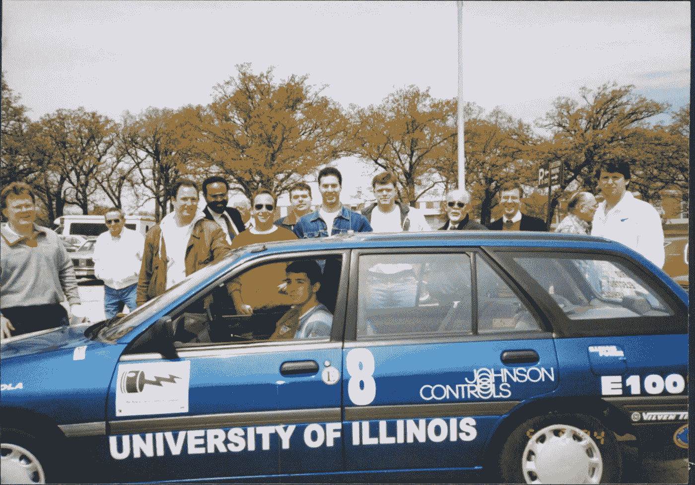
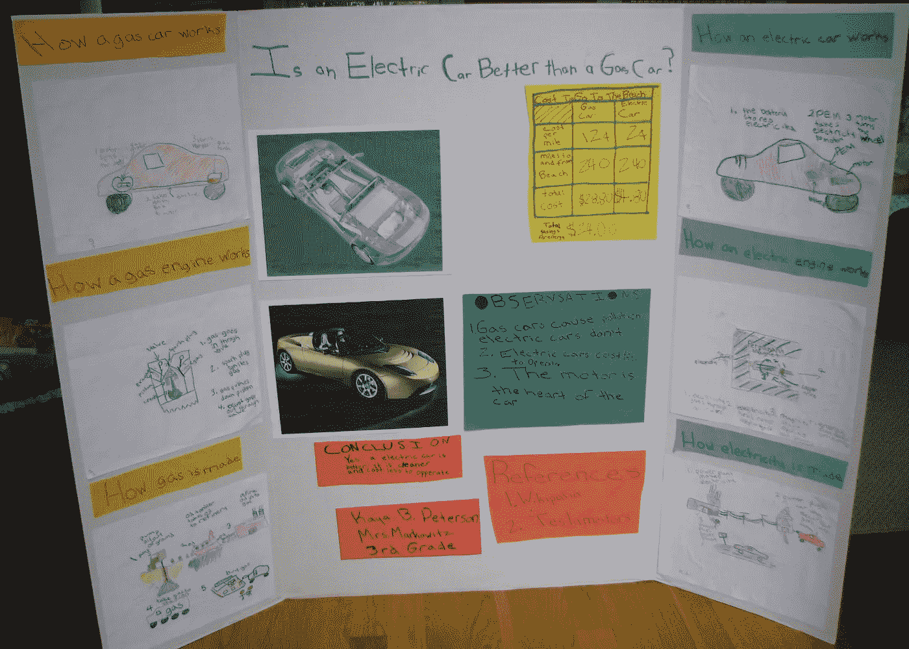
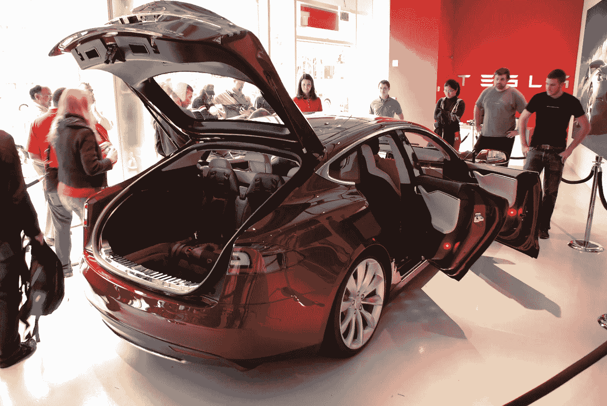
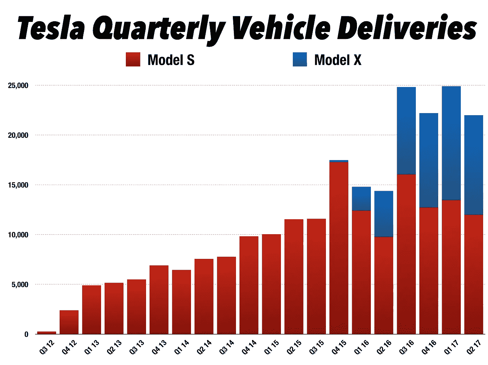
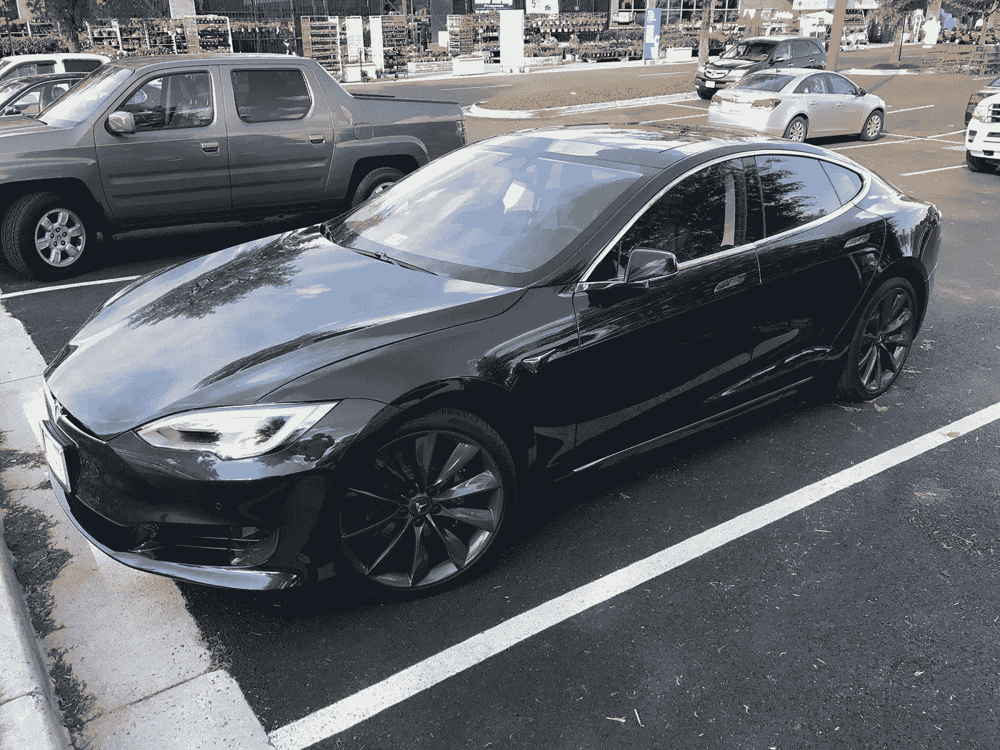
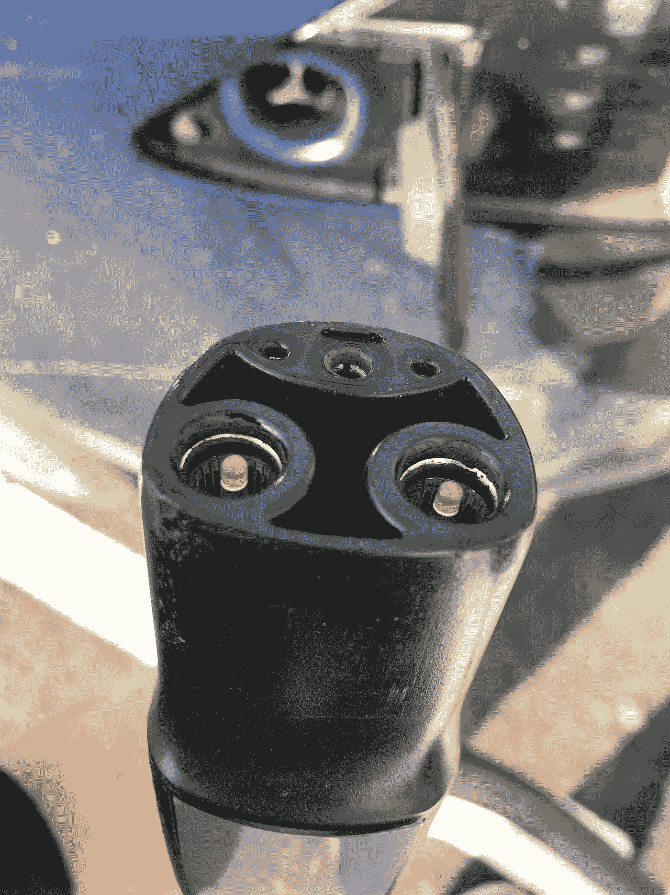
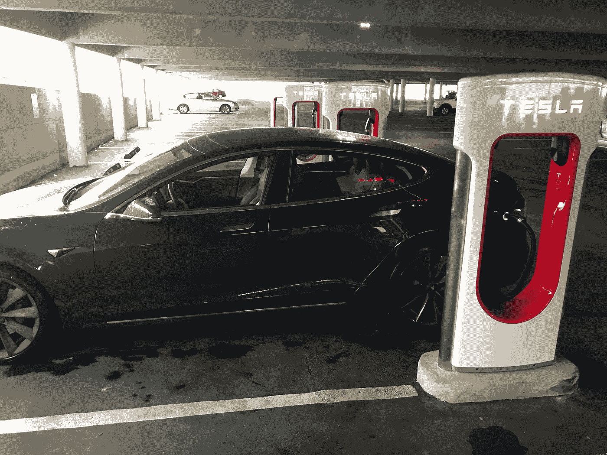
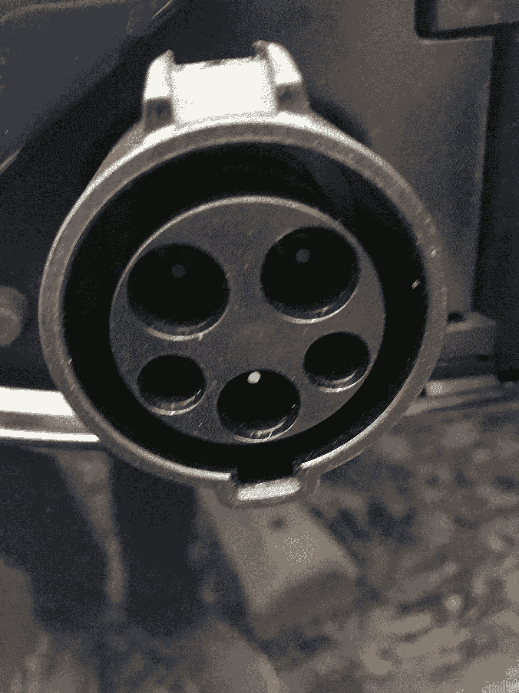
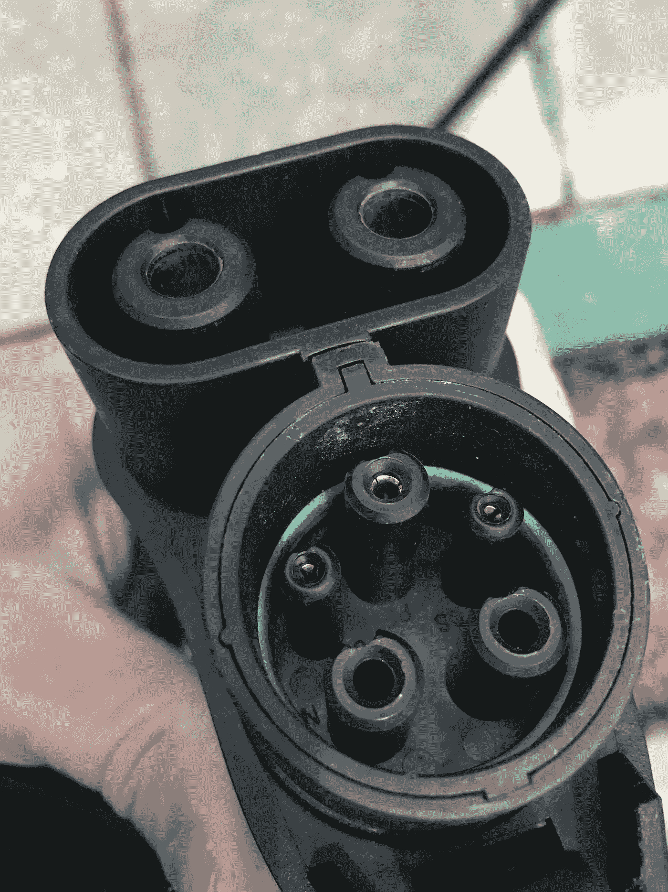

# 充电网络为电动汽车的增长做了怎样的准备？

> 原文：<https://medium.com/hackernoon/how-prepared-is-the-charging-network-for-the-growth-in-electric-vehicles-5989ad6e1851>

A 1992 Converted Escort Wagon — courtesy of [AVTC](https://www.flickr.com/photos/doeavtc/8188362995/in/album-72157632016611439/)

25 年来，我一直在等待电动汽车超越燃气汽车。在大学里，我参加了第一次混合动力汽车挑战赛，在获得电气工程学位之前，我在 UIUC 团队工作。鉴于当时的巨大进步和我看到的从事这项工作的天才工程学生，我确信变革就在眼前。内燃机将被淘汰，混合动力[技术](https://hackernoon.com/tagged/technology)将成为电池技术赶上来之前的桥梁。我甚至挣扎着决定是加入职场还是留在研究生院从事这个项目。这就是未来——对吗？那是 1992 年的秋天。

# 特斯拉汽车的到来——2008 年推出跑车

我从未对电动汽车失去兴趣，从我第一次看到特斯拉的时候，我就是它的超级粉丝。虽然 Roadster 超出了我的价格范围，但我还是关注了它上市的每一个细节。虽然有些人很惊讶电动汽车可以表现得这么好(248 马力，244 英里的范围)，但对我来说这是一个漫长的等待。

My daughters science fair entry in 2008

现在，最初的 Roadster 车型只生产了 500 辆，因此不需要庞大的充电站分销网络。当时的竞争集中在混合动力上，特别是并行传动技术。像丰田普锐斯和雪佛兰沃蓝达这样的汽车可以在动力传动系统上连接电动和汽油发动机。

我们在早期 HEV 比赛中研发的车辆是串联混合动力车。对于 series，气体驱动发动机用于给电池充电，而不是直接驱动轮胎。这离我梦想的电动汽车的未来更近了。

依赖并行技术也意味着为电动汽车建立分销网络的紧迫性微乎其微。这些汽车的电池能量耗尽意味着燃料等级可能会下降，但汽车仍然可以行驶。因此对移动充电的需求不大。

# Model S——量产电动车的诞生

在成功推出 Roadster 后，讨论转向了更实惠的汽车——这种汽车将扩大电动汽车的认知度，以及对分销网络的需求。

2011 年，我和妻子参观了 DC 的一家经销商，查看了 Model S 的早期版本，首批车型于 2012 年开始交付。

Tesla Showroom in 2011 with Model S Preview (aka Signature Series)

随之而来的是增长，到 2015 年底，已有 10 万辆特斯拉电动汽车上路——开始创造对充电站的需求激增。

[Growth in Tesla Model S & X Deliveries](https://seekingalpha.com/article/4086094-tesla-q217-delivery-recap-raising-2017-delivery-estimate)

# 冒险一试

一年前，我终于决定买一个。它于 2017 年 4 月交付，我一直在了解电动汽车的日常操作和充电。这让我对分销网络的状况有了第一手的了解，我很高兴终于有了自己的电动车！

My 2017 Tesla Model S

# 家庭充电是必须的

作为拥有电动汽车的一部分，你需要熟悉家里的电线，以了解各种选择。就我们的房子而言，在提车之前，我们雇了一名电工在车库里安装了一个 240 伏的墙上插座。这类似于你需要的任何大型电器——用 240 伏电压运行的电烘干机、洗碗机或冰箱。考虑到这个插座的巨大消耗，我们将它作为一个单独的电路添加到断路器面板。

我们的房子建于 1994 年，有足够的能力让我们进行这种改造，电工与县检查员一起处理审查。这是一个额外的成本(大约 1500 美元)，但非常值得投资。从长远来看，这就像增加一个洒水系统，增加名义价值，以抵消家庭开支。我认为，如果人们今天建造房屋，他们自然会将这一点纳入设计中。

在车上，特斯拉提供了一根从标准 240V 插座连接的电缆，根据我们的配置，它可以在 4-6 小时内完全充满电池。一旦建立了充电常规，就非常容易了，插头是直插式的(见下图)。

自从我开始在家里充电后，我们的电费并没有明显增加，而且不再支付每加仑 2 美元以上的汽油费用也抵消了零售价格。

Standard coupling for Tesla charging

# 高速充电——有效！

在扩大电动汽车生产的同时，特斯拉在美国建立了高速充电站网络。这些在出城通勤时非常方便。耦合和上面一样，但是能量传递的速度要快得多。如果我只需要补充能量跑完 50-100 英里，通常只需要 10-20 分钟。我经常在弗吉尼亚州/DC/马里兰州地区旅行，现在已经去过大部分这些增压站。大多数附近都有食品或零售点，感觉就像去加油站一样。

My car recharging at a high-speed Tesla facility in Maryland

# 独立站点收费？

在特斯拉网络上寻找高速充电站并不总是很方便。这是事情变得有点复杂的地方，但一个生态系统正在发展，所有潜在的电动汽车车主都应该监控。

你可以进入免费和收费的充电站。最大的叫做 [Chargepoint](https://www.chargepoint.com/) ，他们有一个很棒的移动应用程序，可以显示可用的位置和状态。电费比我家当地公用事业公司的收费高很多(3-4 倍),但是很方便。互联网上有许多其他资源来显示充电位置。一些办公室、酒店和大学独立提供充电设施，有时是免费的。

鉴于在中立地点充电意味着这项服务应该适用于所有电动汽车，而不仅仅是特斯拉。特斯拉附带有适配器，包括下面照片中的那个。SAE J1772 是这类位置最常见的接口。

Coupling for SAE J1772 connection

## Epic 充电器故障

现在我在路上尝试充电时有过几次不好的经历。最糟糕的是最近住在一家提供高速充电的酒店，但当我进入摊位时，我看到了一个新的适配器——可怕的 SAE Combo(下图)。

Coupling for a SAE Combo (CSS) charger

在与酒店维修人员一起度过一个小时，拨打充电装置上的支持号码，并与特斯拉支持人员交谈后，我发现了以下问题。

1 —此端口是一个新的“[标准](https://en.wikipedia.org/wiki/Combined_Charging_System)，支持高容量充电。
2——它和我买特斯拉时得到的适配器不兼容。
3——特斯拉不出售与之配合使用的适配器。我在酒店呆了整整三天，没有看到任何人使用它。

这凸显了未来电动汽车充电网络的潜在缺陷。产品需要兼容，无论是谁编写的规范，如果它们不能与拥有超过 50%的[电动汽车市场份额](https://evobsession.com/electric-car-sales/)的产品一起工作，它们就不是标准。幸运的是，20 分钟路程外有一个特斯拉超级充电站，它就在一辆 BW3 的旁边——所以危机避免了！

## 慢速充电

我看到的另一个差距是一些现有的非特斯拉站的充电率。我有过充电时间不到 10 英里/小时的加油站，大多数只有 20 英里/小时。如果我一整天都在办公室，有十个小时的时间充电，那就可以了，但是对于较短的时间，那就不太有效了。

充电站是一项投资，因此可能会有一种类似于传统加油站的商业模式，可以将其视为一种服务。消费者需要将这一点考虑到他们的购买决策中，因为我看到的 ROI 计算器假设电力的零售价格(即 0.10 美元千瓦时)，而不是大幅加价以收回充电设备的成本。

# 结论

电动汽车市场在 2017 年创下了记录，比 2016 年增长了 45 %( T1 ),从绝对数字来看，美国新增了 10 万辆汽车。随着新的特斯拉 Model 3 开始交付，这一数字可能会在 2018 年大幅增加。一些估计认为[特斯拉可能在明年交付 15 万辆](https://seekingalpha.com/article/4134861-tesla-model-3-production-ramp-2500-2017-150000-2018-vc-firm-predicts)。

作为一名电动汽车车主，我将非常关注分销网络如何跟上，以及他们使用的充电技术是否有任何变化。未来会是开放的标准，充电器兼容所有人，还是真的是一个由特斯拉和其他电动汽车制造商主导的封闭平台？