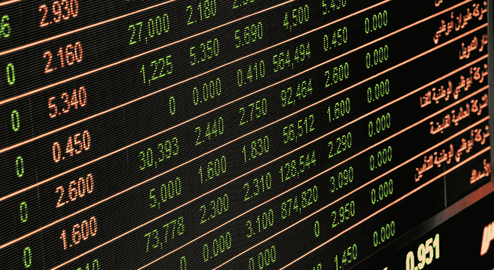

# 进行 51%的攻击是多么有利可图——一个非常简单的逐步计算

> 原文：<https://medium.com/hackernoon/how-profitable-it-is-to-do-a-51-attack-a-very-simple-step-by-step-calculation-10572715c0b8>

> “有了充足的利润，资本就非常大胆了。一定的 10%。将确保其在任何地方就业；百分之二十。一定会产生渴望；百分之五十。，积极无畏；百分之百。会使它随时准备践踏一切人类的法律；百分之三百。，没有犯罪，它会顾忌，也没有风险，即使它的主人被绞死的机会。”
> 
> (T. J .邓宁，l. c .，第 35、36 页。)

最近发生了一系列攻击，从[比特币](https://hackernoon.com/tagged/bitcoin)黄金到 Verge，现在是莱特币现金。起初，人们对那些“意外”感到震惊，价格大幅下跌，每个人都在担心自己的投资。

然而，在事件之后，那些开发团队会宣布他们已经为更安全的散列算法改变了他们的加密，或者添加了更多的确认块。投资者终于深吸一口气，感谢上帝，他们的资产得到了保护。

这个循环一次又一次地重复。坦白说，经过 2018 年的那三次袭击，我已经习惯了这种新趋势。51%攻击是密码世界的新时尚。

虽然已经采取了很多措施来解决这个问题，但大多数都是勉强拖延。它们只能减缓攻击者的速度，而不能阻止繁荣。对于那些目前安全的硬币来说，巨大的危险正等待着他们。

为了让我们理解这些袭击的深层原因，我们必须了解罪犯或袭击者的动机。他们为什么要这么做？金钱，名誉？当我们把注意力转移到金钱上，更具体地说，转移到攻击的回报率上，事情就开始变得明朗了……

# 成本和利润分析

这里，我们对 51%的攻击进行简单的成本和利润分析。每个具有基本代数知识的人都能够分析数据并得到结果。

*当前时间是 2018 年 8 月 2 日 15:00。下面所有的分析都是基于这个时间。*

比如，我们会用雌雄同株……

这是一枚很小的硬币，但你知道大概意思。

首先，我们想知道 Monoeci 的整个 netHash。我用 [whattomine](https://whattomine.com) 得到它的 NetHash，2.47 秒/秒，阻塞时间是 2 分钟。

[https://whattomine.com/asic](https://whattomine.com/asic)

我们很容易看到它使用的哈希函数是 X11。

然后我们去 niceHash 买一些 X11 哈希能力。

[https://www.nicehash.com/marketplace/x11?lang=en](https://www.nicehash.com/marketplace/x11?lang=en)

从 niceHash 的订单簿中，我们可以看到目前有 267+225 Th/s 要出售。所以我们可以购买超过 51%的哈希能力来攻击雌雄同株。

我们在这里需要小心。因为我们在给网络注入新的哈希力量，实际上我们要购买 2.47*51/50= 2.519 Th/s 来压缩别人，能够随心所欲的攻击。

然后我们计算一下购买 1 秒钟散列值的价格。

[https://www.nicehash.com/doc-api](https://www.nicehash.com/doc-api)

使用 niceHash 的 API，我们可以得到 X11 的平均价格。在这里，X11 是算法 3。

所以均价是 0.0196。我们在这里也应该小心。从上面的订单中我们可以看到，价格是 0.0196 BTC/日。我们需要把它兑换成美元/英镑/英镑，以便我们计算成本。

[https://api.nicehash.com/api?method=stats.global.24h](https://api.nicehash.com/api?method=stats.global.24h)

今天的 BTC 价格是 7707 美元。所以 0.0196 BTC/TH/DAY = 0.0196 * 7707/(24 * 3600)= 0.001748 美元 TH/s 我们还要额外买 51%的 hash，也就是 2.519 Th。51%攻击 1s 的最终结果是 0.004404 美元。

[https://coinmarketcap.com/](https://coinmarketcap.com/)

但是我们不能为了 1 而攻击，并且成功地加倍花费。在确认交易有效之前，我们需要攻击几个街区。从 whattomine API 来看，雌雄同株的封锁时间是 2 分 120 秒。所以攻击一个街区的成本是 0.528 美元

现在我们到了一个非常有趣的部分。我听说过 51%攻击，但叙事是什么？它是如何工作的？

## 双倍消费是如何运作的？

51%的攻击并不意味着你可以得到每个人的钱，(顺便说一句，如果你对此感兴趣，寻找智能合同攻击。)而是把一个人的硬币加倍花到另一个地址而不是原来的地址。

通常，攻击者可能选择双倍花费他们硬币来交换。你要拿别人的钱，总会找别人的金库。在这里，攻击者的目标只是交易所的钱包。这是加密世界中最富有的钱包之一。

攻击者将他们的硬币存入交易所(他们要攻击的硬币)，然后他们将它们兑换成其他更具流动性的硬币。(back 瑞士联邦理工学院)接下来，他们将其他硬币放回钱包，并将之前交易的双倍消费放入钱包。

详细解释可以看这里:[https://cryptoattack.io/51attack/intro](https://cryptoattack.io/51attack/intro)

51%攻击/双花攻击通常就是这样的。我们回到我们的分析。

## 回到我们的分析

如果目标是交易所，攻击者可能会将他们当前的所有硬币兑换成其他硬币，因此他们在这里寻求最大流动性，价格并不重要。

在真实场景中，攻击者可能会选择接受订单簿中的所有订单，以实现最大流动性并尽快取回其他硬币。因此，在我们的分析中，我们只是假设攻击者可能用最大交易所的 2h 交易量来购买特定的硬币。

对于雌雄同株来说，最大的交换是隐花，成交量是 231494。对于 2h 的交易量，我们得到 19291.17 美元。这是 51%攻击的可能利润。

[https://coinmarketcap.com/currencies/monacocoin/#markets](https://coinmarketcap.com/currencies/monacocoin/#markets)

费用呢？

通常交换可能需要 3-6 个街区的时间作为确认时间。我们只是假设攻击者会等待 6 个街区，然后交换他们的硬币，并加倍消费。继续我们的[计算](https://hackernoon.com/tagged/calculation)，一次 51%攻击的成本是 3.168 美元

你能在这里看到结果吗？

回报率巨大！！！

608900% !!!

这比一开始投资以太坊要有利可图得多……当有强烈的动机时，就有攻击者。你猜……

就像时间复杂度分析一样，我们可以关注量级而不是常数。

那么增加区块确认时间会起作用吗？对一些人来说，这是可行的，但对另一些人来说，你必须将确认时间延长到另一个数量级。

改变算法可能有效。这要看你换成什么哈希算法了。如果这是一个受欢迎的，你仍然处于巨大的风险之下，因为人们可以非常容易和便宜地购买哈希功率。

更好的解决方案是使用 POS 而不是 POW。但是复制粘贴在这里似乎不起作用。这不像叉比特币或莱特币代码，你简单的点击 Github 上的叉…...开发团队可能仍在谷歌上寻找一些解决方案😎。

## 对投资者而言

投资者应该得到警告。所以我和我的朋友创建了这个网站:[https://cryptoattack.io/](https://cryptoattack.io/)给你一些关于一些硬币的攻击风险的见解，帮助你做出更好的决定。

[https://cryptoattack.io/](https://cryptoattack.io/)

我们在这里使用相同的计算，数据每 10 分钟更新一次。

[https://cryptoattack.io/risk/coin/5b29c97821903d6ebc560374](https://cryptoattack.io/risk/coin/5b29c97821903d6ebc560374)

# 明智点！