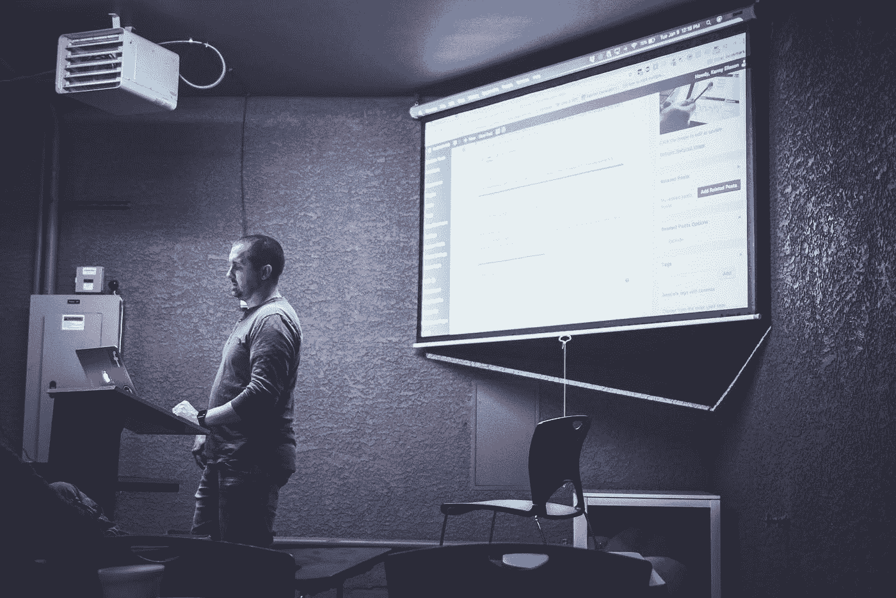
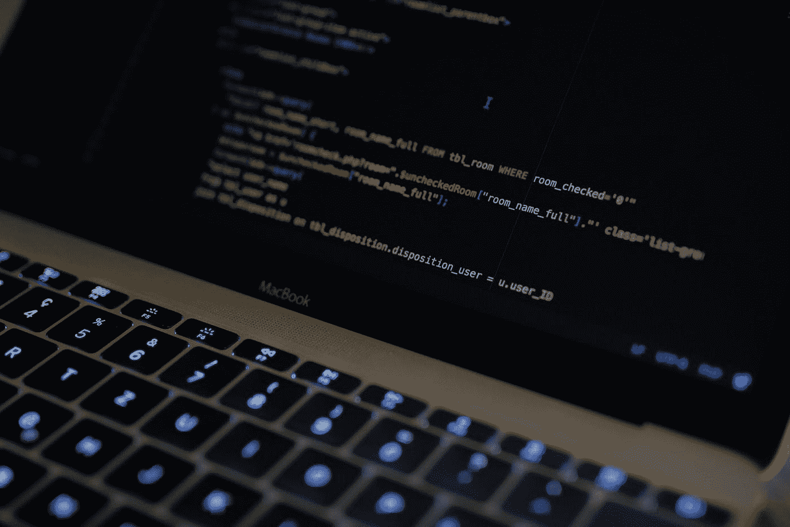

# 基于项目的学习和区块链如何改善职业发展行业

> 原文：<https://medium.com/hackernoon/how-project-based-learning-and-blockchain-can-improve-the-professional-development-industry-985cb6238781>

当我们在今天的职业生涯中考虑职业发展时，我们会考虑两件事之一。第一个选择是回到学校继续攻读另一个学位。虽然这是几年前的首选方法，但它导致了比一个人应该拥有的更多的大学债务，而且现在某些领域的课程没有像它们应该的那样及时更新。

第二种选择是参加在线课程，以便学习新技能。当你已经在一个特定的行业工作时，问题是网上找到的课程往往集中在初学者身上，或者它们本质上是非常理论化的。意思是，你已经掌握了所提供的概念，或者你正在学习对你的工作没有多大帮助的无聊概念。此外，由于动力不足，你很难自己掌握学习进度。

提高职业发展行业是一个持续的过程，因为要求在不断变化，但一些方法可以做到这一点，如应用[新的学习方法](https://www.bie.org/about/why_pbl)和[区块链标记化](https://ledu.education-ecosystem.com/)。

# 空间中的空隙

困扰世界各地高校的一个主要问题是，世界正以惊人的速度变化。这意味着他们在与未来技术相关的学科中教授的概念(如网络安全、人工智能等。)几乎可以在学生一毕业就变得过时。当你考虑到学士或硕士学位所需的成本和时间投入时，这就变得非常没有吸引力了。

如果你选择像 Udemy、Coursera 或 Lynda 这样的网站上的在线课程，那么你就会遇到另一个问题。这些网站上的课程是面向初学者的，所以如果你处于中级水平，那么你没有太多选择。

# 新的学习方法

随着时间的推移，坐在教室里进行理论学习的方式遇到了越来越多的阻力。教室环境非常适合介绍新的主题和理解基础知识。对于非初学者来说，仅仅真正掌握材料是不够的，这样对个人学习概念是有益的。

改善这种情况的一个方法是通过基于项目的学习。[基于项目的学习](https://hackernoon.com/why-do-college-students-and-professionals-like-learning-with-projects-f3a49860bedc)让学生和专业人士通过边做边学的理念更快地学习。学生们不再只关注基于纸张的死记硬背，而是接受挑战，自己解决实际问题。

当涉及到编程、人工智能或增强现实等未来热门话题时，基于项目的学习也很重要。通过实际项目学习是完全理解这些主题，然后能够在专业环境中使用这些知识的唯一方法。基于项目的学习创造了一个更加以学生为中心的学习环境，在这个环境中，他们能够利用团队合作和沟通技巧来解决问题。这反映了在工业界工作的真实经历，而这在课堂环境中并不总是适用的。

# 象征性职业发展

虽然基于项目的学习是改进专业发展行业的重要一步，但另一种方法是加入区块链。[教育生态系统](https://ledu.education-ecosystem.com/)正在使用区块链令牌化作为促进职业发展的一种手段。虽然我们也使用基于项目的学习方法，但我们改善行业的主要方法是通过教育代币；对生态系统中的学习者以及创建项目的指导者的奖励。

[与课堂教学相比，在线课程的完成率](http://androiddeveloper.galileo.edu/2018/02/07/is-it-completion-rate-still-a-challenge-for-moocs/)往往较低。其中一个原因是学生没有动力继续学习。许多在线课程都是免费的，或者与大学课程相比非常便宜。代币化允许完成课程的学生因其进步而获得代币奖励。即使是制作这些课程的教师，有时也会对他们在其他在线教育平台上提供的课程的薪酬感到不满。教育生态系统计划通过教育令牌来解决这些问题。个人完成的项目越多，或者教师创建的高质量项目越多，他们获得的代币就越多。尽管令牌是在我们的 LiveEdu 平台上使用的公用令牌，但它可以像比特币一样在加密货币交易所交易，这意味着学生可以通过学习获得报酬，教师可以通过教学获得额外的奖金。教育代币(LEDU)目前可以在 [Bibox](https://www.bibox.com/exchange?coinPair=LEDU_ETH) 和 [Gate.io](https://gate.io/trade/LEDU_ETH) 加密货币交易所购买。

随着学生寻求新的和改进的学习形式，职业发展是一个必须继续发展的行业。大学毕业或通过职业生涯的初级阶段后，继续学习变得更加困难。然而，通过基于项目的学习和区块链令牌化，职业发展可以成为每个人而不仅仅是少数人受益的事情。

*如果您希望了解更多关于项目学习和整合区块链的好处，请随时查看* [*教育生态系统博客*](https://medium.com/edu-coins) *了解更多阅读材料和平台更新。*