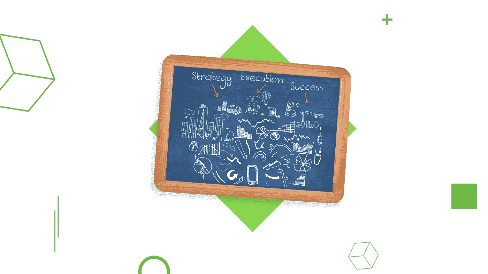
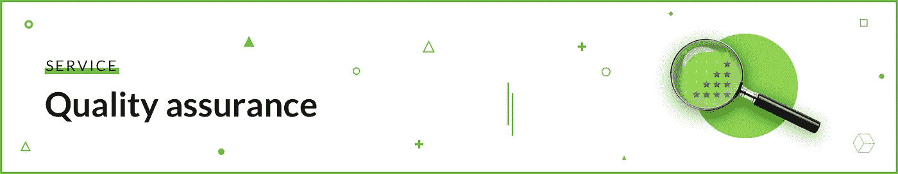
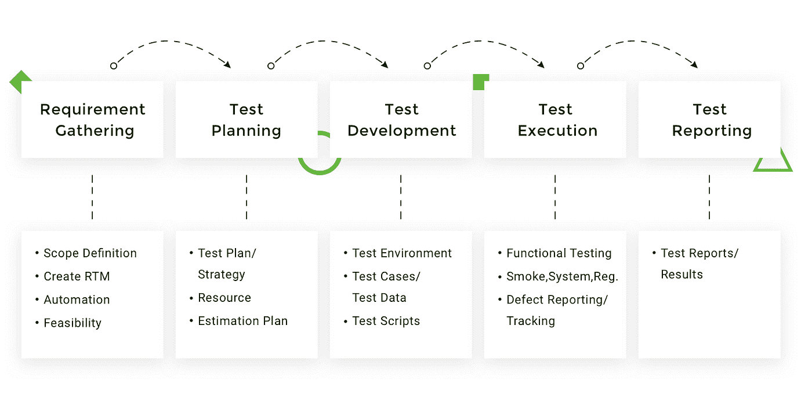
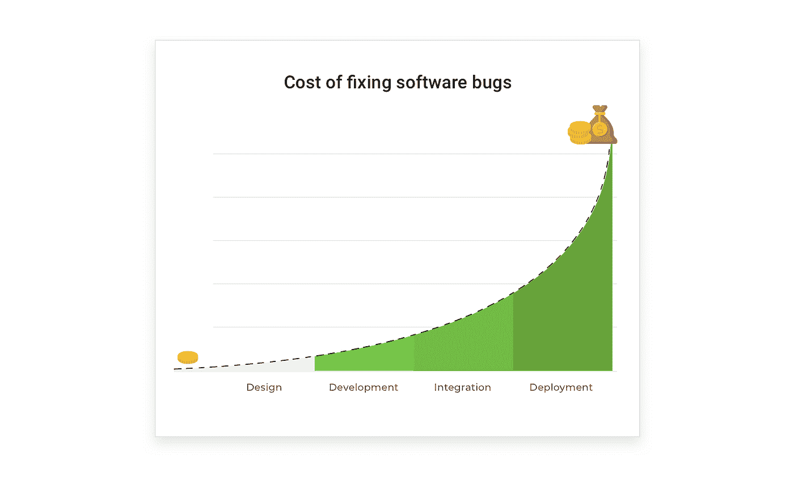
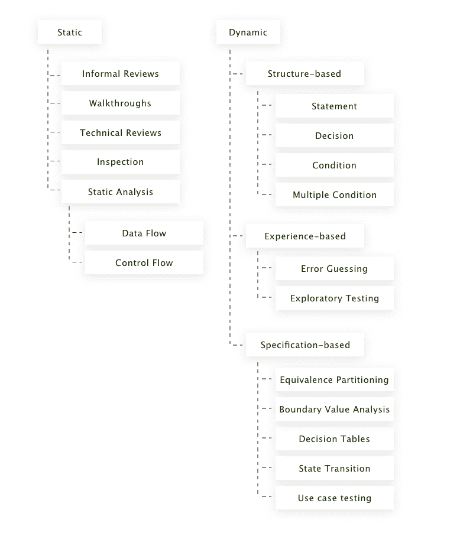

# 质量保证如何节省您的资金和产品

> 原文：<https://medium.com/hackernoon/how-quality-assurance-can-save-your-money-and-your-product-53d21e5d2e2e>

> 在 Django Stars 博客上阅读这篇关于 QA 的文章的原文。

我记得当苹果麦金塔的语音演示因为没有人检查而失败时，史蒂夫·乔布斯是多么的不耐烦和紧张。好吧，实际上我不记得了，我只是看了丹尼·鲍伊尔的电影，但它很有意义。

检查或保证质量是在展示麦金塔电脑、软件产品或晚餐前必须做的事情。

不过，我们今天不打算谈论食物和饮料。相反，让我来分享一下我的想法，关于为什么软件需要被测试，团队中 QA 工程师的作用，以及在一个典型的软件开发公司中软件测试是如何工作的。

先说一些简单的定义。

[**品质保证**工程师](https://djangostars.com/services/python-django-development/?utm_source=medium&utm_medium=hackernoon.com&utm_campaign=why%20you%20need%20qa&utm_content=Quality%20Assurance%20engineers)助力打造优质产品。他们如何提供帮助？—你问。他们在开发开始之前就预防了缺陷，因此确保了最终结果的过程质量。

**缺陷**(又名 bug 又名这种狗屎不会工作)是一段错误的代码，使系统无法执行其所需的功能。换句话说，当某件事不顺利或不尽如人意时。

我现在将尝试用几点来总结 QAs 所做的事情。质量保证工程师:

*   定义项目需求
*   在开发过程的所有阶段预防和识别软件产品中的缺陷
*   评估产品的质量
*   测试产品的可用性

我想强调的是，QA 总是考虑用户，并试图从用户的角度评估工作。QAs 与开发人员紧密合作，组成一个团队，真正创造出高质量的产品。

现在我将告诉你软件测试生命周期(STLC)的五个阶段，QA 的作用，以及测试如何帮助你的业务。

## 你可能也喜欢

 [## 如何成功地为开发团队设定任务

### 有句谚语说“去我不知道的地方，拿我不知道的东西”，通常，最讽刺的是，这…

djangostars.com](https://djangostars.com/blog/successfully-set-tasks-development-team/?utm_source=medium&utm_medium=hackernoon.com&utm_campaign=why%20you%20need%20qa&utm_content=youmayalsolike) 

**STLC:何时以及为何需要 QA**

大多数使用[敏捷](https://hackernoon.com/tagged/agile)方法的[软件开发](https://hackernoon.com/tagged/software-development)公司在 **sprints** 工作——为期两周，列出要完成的任务。每个 sprint 包括 STLC 的五个阶段，到最后，团队应该实现需求的某个部分。

除非团队中有 QA，否则有些缺陷可能永远不会被发现，只有在正式推出后才会被真正的用户发现。QA 工程师通过在开发开始前规划测试用例来减少整体开发时间。QA 的工作范围是*保证产品的质量*。

现在，让我们研究软件测试生命周期的所有 5 个阶段

**第一阶段——需求收集**

在创建软件之前，团队必须知道他们到底要开发什么。软件产品的技术描述是其**需求**。它们描述了所需服务的功能、应该包括哪些特性，有时还描述了构建该服务所需的技术。

在这个阶段，QA (1)分析需求，(2)确定所有期望的组件是否相互兼容，以及(3)试图防止(预测)一旦编码开始团队可能面临的问题。在向开发团队提出需求之前预防缺陷可以为您节省大量资金。

除了分析技术要求，QA **还验证产品。**验证是从商业角度评估产品的过程。它的目的是检查产品是否对客户有用，也就是说，生产它是否有意义？

如果未经验证，产品可能永远得不到关注，只会成为历史。验证也确保了产品带来的利润。如果没有利润，为什么首先要这么做呢？

**第二阶段—测试计划**

测试计划是定义测试策略的活动，即 QAs 测试整个产品需要多少时间和资源。规划包括项目范围、目标、负责角色和测试环境。

这个阶段允许团队避免不可预测的突发事件。有一个列出要采取的行动的计划会让 QAs 在测试时间到来时不会忘记任何事情。

**第三阶段——测试开发**

既然活动已经计划好了，是时候建立一个测试环境并创建测试用例了。测试用例是 QA 需要采取的一系列行动，以检查代码中没有错误，一切正常。在这之后，QAs 构成了验收标准——一个软件必须满足才能被认为是成功的标准。当测试用例准备好并且验收标准达成一致时，实际的测试就开始了。

**第四阶段——测试执行**

这是测试。基于前面阶段的结果——需求收集、测试计划和开发——QAs 执行符合系统技术细节的测试。如果测试没有发现任何缺陷，QA 工程师会将其标记为通过；如果测试失败，这意味着代码有问题，QAs 会向开发人员发送一份关于这个错误的报告。如果这样，QAs 确保整个系统将被测试。

**第五阶段——测试报告**

测试结束后，团队讨论什么有效，什么无效。这有助于我们在未来的测试周期中改进测试。为了避免 QAs 和开发人员之间的误解，最好记录每个检测到的 bug，然后用报告进行检查。

___________________________________________________________________

所以现在你知道 QA 工程师在开发过程中做什么了。让我们总结一下为什么这项工作如此重要。为什么软件产品需要 QAs:

*   **安全交易。尤其是处理购物的应用程序。除非完全检查，否则可能会出现用户向随机的人付费，而不是你。双重检查以防止金钱损失。**

*   **省钱**。QA 发现漏洞越晚，修复它的成本就越高。修复一个错误可能会导致另一个，另一个。最终，由于一个缺陷，你将不得不重写整个系统。经验法则:预防胜于治疗。
*   **保护自己的名誉**。如果用户启动了你的应用程序，由于一些错误，第一次体验很糟糕，他们就不太可能再尝试了。那是因为先入为主，很难改变。不要让他们认为你不在乎。
*   **确保产品质量**。除非经过测试，否则软件产品可能永远不会上线。*质量*包括很多方面，其中很多是 QAs 的工作。
*   **监控过程**。QA 工程师不断提醒团队，他们正在努力取悦用户，满足特定的需求。它让每个人都确信最终产品会和计划的一样。

在下一部分，我将讲述 STLC 如何与开发过程重叠，解释 QA 和 QC 之间的区别，并给出 QA 工程师使用的一些测试技术的一般描述。

**质量保证**

开发和测试必须同步。这是一个简单的规则，但许多人倾向于忽视它。QA 工程师倾向于在计划测试之前考虑开发人员此刻正在做什么。他们作为一个团队行动。负责生产高质量软件产品的团队。除非 QAs 和开发人员一起工作，否则很可能会有许多延迟和不一致，这将导致低质量的结果。

现在我将告诉你*保证质量*和*软件测试之间的区别。*

**质量控制**

与 QA 不同，质量控制是一门专注于测试已经开发的系统的学科。质量控制工程师识别软件缺陷并报告它们。所以基本上，QC 是 QA 的一部分，在代码写完之后。

当 QA 在之前**开始开发产品时。在一些项目中，不需要 QA，只需要 QCs。当一个团队被要求在发布之前检查系统时，就会发生这种情况。我们可以粗略地说 QA 包含 QC。**

有些人试图将 QC 角色与其他角色结合起来，比如软件开发。然而，在自己的代码中找到缺陷通常比在别人的代码中更难。另外，这项工作需要一些理论基础和测试技能。从某种意义上说，没有经验的人不能保证质量。

现在你知道 QAs 做什么和为什么做，让我们看看有什么测试技术。

**测试设计技术**

测试设计技术帮助我们为一个特定的项目选择一组好的测试。每种技术都包括识别特定类型错误的测试。测试设计技术的选择取决于(1)项目要求；(2)产品的状态，以及(3)软件产品的类型。

下图显示了最常见的测试设计技术。

让我们仔细看看我们需要的每一种技术和案例。

*   **静态**。这些测试在代码执行之前检查源代码、功能和需求规格。静态测试开始于软件开发的最早阶段。
*   **基于结构的**。这些测试分析代码的内部逻辑和结构。他们识别代码中错误和缺失的逻辑和错别字。这些是某些东西不工作的最常见原因。
*   **基于规格说明的**又名*黑盒测试*，检查软件的功能而不进入代码。基于项目需求，我们选择合适的测试来帮助我们获得测试用例。在这里，一切都取决于产品需求。
*   **基于经验的**。经过几年的工作经验，许多 QA 知道开发人员最常失败的地方。一般来说，这是基于自身质量保证经验的测试。

这是一个非常一般的概述，所以不要假设它是关于四组测试设计技术的。所需硬技能的数量使得非 QA 人员几乎不可能保证软件产品的质量。

**底线**

无论一个产品看起来有多简单，在高质量的软件背后都有大量的工作。正如 Don Norman 所指出的:“*好的设计实际上比糟糕的设计更难被注意到”。*在大多数情况下，QA 工程师通过检查一切是否正常来让人们享受好产品。

质量保证包括许多活动，从测试到审查结果。大多数软件产品需要 QA 工程师(1)设定一个成熟的开发过程，(2)确保发布软件的质量，(3)在用户发现错误之前防止系统中的错误。QAs 使用各种技术来检查一个系统是否满足所有规定的要求，以及它“应该”满足的要求。

没有特殊技能，测试一个系统是不容易的，即使是有经验的开发人员也不太可能成功。这就是为什么最好的团队让 QA 和开发人员一起工作——在追求高质量软件的过程中结合他们的技能。

> 如果你觉得这篇文章有用，请点击👏下面的按钮:)