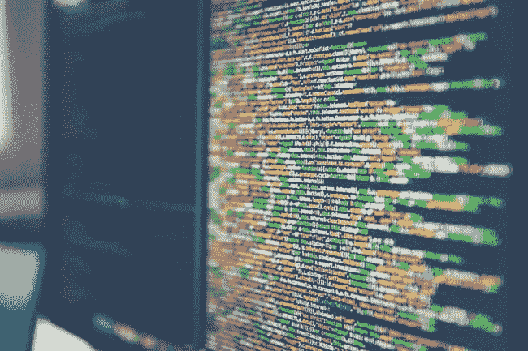
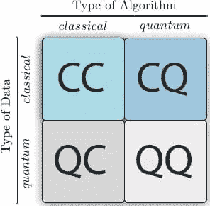

# 量子计算和机器学习如何协同工作

> 原文：<https://medium.com/hackernoon/how-quantum-computing-machine-learning-work-together-bc61d0f1b3a>

到目前为止，我们都(至少稍微)熟悉了[机器学习](https://www.themartec.com/insidelook/machine-learning-dev-impact)和人工智能的概念——但是到底什么是量子计算呢？如果你没有在每日滚动 SlashDot 和 TechCrunch，量子计算可能已经从你的技术词典中消失了。光是这个名字就让人联想到某种复杂的科幻超级计算机类型的设置。你猜怎么着？那不是很离谱。

我们坐下来与两位深入研究人工智能/量子计算领域的专家交谈， [Amit Bansal](https://www.linkedin.com/in/amit-bansal-5249011/) ，董事总经理，分析交付主管 APAC&[T5 的人工智能交付主管埃森哲](https://www.accenture.com/au-en/careers?src=JBCAMP&c=car_employeeexperie_10266893&n=jpc_0518) 和 [Vaibhav Namburi](https://www.linkedin.com/in/vaibhavnamburi/) ，[**five 2 one**](http://five2one.com.au/)**&dveloper . io 的主管，告诉我们未来会发生什么。**

# **什么是量子计算？**

**首先，我们不打算在这里讨论量子计算的细节——因为我们可能会在这里呆一整天。**

**相反，班萨尔设法用一句话概括了量子计算的前提:**

**“量子计算机是基于量子物理学原理工作的设备，”他开始说道。“我们目前使用的计算机是用晶体管制造的，数据以二进制 0 和 1 的形式存储。量子计算机是使用被称为量子位(quantum bits)的亚原子粒子构建的，量子位可以同时处于多个状态。量子计算机的主要优势是可以以超音速执行高度复杂的运算。因此，它们解决了目前不可行的问题。”**

**[注:如果你对这个问题的冗长答案感兴趣，请访问[一个量子计算的交互式介绍](https://davidbkemp.github.io/QuantumComputingArticle/)以获得一个好的演练。]**

# **量子计算可以解决哪类问题？**

**“量子计算机最重要的好处是它可以解决复杂问题的速度，”班萨尔说。Bansal 指出，虽然他们的工作速度快如闪电，但“他们没有能力解决不可判定或 NP 难题类的问题。”量子计算将能够解决一个问题集，然而它并不适用于所有的计算问题。**

**通常，量子计算机擅长解决的问题集涉及大量输入的数字或数据处理，如“复杂的优化问题和通信系统分析问题”——通常需要超级计算机几天、几年甚至几十亿年才能完成的计算。**

**作为量子计算机能够立即解决的例子，经常被拿出来的应用是强 RSA 加密。由[微软量子团队](https://cloudblogs.microsoft.com/quantum/2018/05/02/the-quantum-computing-effect-on-public-key-encryption/)最近进行的一项研究表明，这很有可能是事实，计算出这在大约 2330 量子比特的量子计算机上是可行的。**

**英特尔、微软、IBM 等重量级公司制造的最尖端的量子计算机目前都徘徊在 50 量子位左右，然而谷歌最近宣布了他们的 72 量子位项目[bristle cone。鉴于摩尔定律和目前这些系统的发展速度，强 RSA 确实可能在 10 年内被破解。](https://ai.googleblog.com/2018/03/a-preview-of-bristlecone-googles-new.html)**

# **人工智能和机器学习**

**人工智能一词如今被广泛使用，然而，正如南武里所说，“人工智能是一个经过提炼的概念，即机器将能够执行具有人类智能特征的任务。”**

**他继续阐述道，“机器学习(ML)的核心是一种实现人工智能的简单方法，人工智能/ML 可以帮助加速和解析大量数据，同时创建和分析预测模型和趋势，这将有助于揭示我们不容易确定的模式。”**

**机器学习是一种更快的确定和分析这些模式的方法(而不是使用传统的编码算法),可以用于许多不同的应用，然而，它在人工智能中的应用却引起了全世界的热议。**

# **机器学习和量子计算的交集**

**你现在可能已经猜到，量子计算有可能使机器学习人工智能解决方案在处理数据集方面比传统计算解决方案快得多——尽管你不能以传统方式编写这些 ML/AI 算法。**

**然而，这两个领域的交叉甚至不止于此，受益的不仅仅是人工智能应用。正如班萨尔解释的那样，量子计算机实现机器学习算法和传统的机器学习方法被用来评估量子计算机之间存在一个“交叉区域”。这个研究领域正在以如此惊人的速度发展，以至于它催生了一个全新的领域，叫做[量子机器学习。](https://en.wikipedia.org/wiki/Quantum_machine_learning)**

**这个跨学科的领域非常非常新。“最近的工作已经产生了可以作为机器学习程序的构建模块的量子算法，但硬件和软件挑战仍然相当大，全功能量子计算机的开发仍然遥遥无期，”班萨尔说。**

****

***机器学习的 4 种方法，根据所研究的系统是经典的还是量子的，以及信息处理设备是经典的还是量子的来分类。***

# **使用量子计算的人工智能的未来**

**由量子计算推动的人工智能的未来看起来一片光明，实时人类模仿行为几乎已成定局。**

**正如班萨尔所说，量子计算将能够“解决复杂的 AI 问题，同时获得复杂问题的多个解决方案。这将导致人工智能以类似人类的方式更有效地执行复杂的任务。同样，一旦我们能够采用基于人工智能的量子计算机，在实际情况下能够实时做出优化决策的机器人也将成为可能。”**

**这个未来会有多远？嗯，考虑到目前只有少数几个世界顶级公司和大学正在开发(物理上巨大的)量子计算机，目前缺乏所需的处理能力，让一群机器人模仿人类跑来跑去可能是一个公平的办法——这可能会让一些人放松，让其他人失望！只建一个吗？也许不会太远…**

# **经典计算和量子计算将如何协同工作？**

**量子计算机永远不会“取代”经典计算机，这仅仅是因为经典计算机更擅长和/或更有效地解决一些问题。**

**班萨尔沉思道，“未来可能的情况是，量子计算将增加经典算法的子程序，这些子程序可以在量子计算机上有效地运行，例如采样，以解决特定的商业问题。例如，一家寻求零售配送理想路线的公司可以将问题分成两部分，利用每台计算机的优势。”**

**Numburi 喜欢区块链的用例，建议用它来“加速对极其滞后的工作证明系统的许可，这是区块链现在保持正确所必需的。量子计算机可以处理这个时代的处理计算机的水平，而时代不能。”**

**我们所能说的就是保持关注！**

# **想参与量子计算或机器学习项目？**浏览我们的** [**职位列表**](https://www.themartec.com/jobs) **找到你梦想中的角色。****