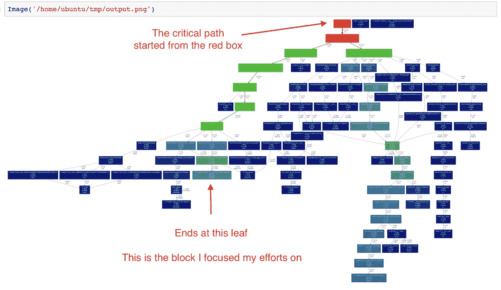

# Re2 如何打破我的瓶颈

> 原文：<https://medium.com/hackernoon/how-re2-shattered-my-bottleneck-e18d77afbf6e>

几乎在一夜之间，一个主要的数据管道系统成为了公司的主要瓶颈，需要一个解决方案，而且要快！

幸运的是 Re2 在那里救援。通过很少的工作，我成功地将系统运行时间减少了大约 15%。

在这篇文章中，我将分享如何使用 Gprof2dot 漂亮的图像渲染来找到瓶颈，当然，Re2 是什么以及如何使用它。

> 这篇文章解决了我在 Python 框架中遇到的一个难题，但是因为所有主要语言都有 Re2 实现，所以阅读这篇文章还是有价值的。

# **缓解瓶颈的策略非常简单**

*   **第一步:**认清最疼的地方
*   **第二步:**减轻痛苦
*   第三步:重复第一步，直到得到想要的结果

听起来很简单，对吧？理论上是这样的。
通常情况下，实施是你成功的关键。

# **第一步:认清哪里最疼**

就像任何曾经在电视上看到一个人谈论戒酒会的人一样，他会说: ***“处理你的问题的第一步是认识到它的存在”*** ，在我们的情况下，这意味着测量和找到瓶颈。

这个系统是一个用 Python 编写的非常简单的 ETL 系统，所以我决定先从转换部分开始。

我花了几个小时将代码的主要部分提取到一个独立的进程中，完成后我开始了一个 [Jupyter 笔记本](http://jupyter.org/.)。
使用 cProfile 内置 python 包和 gprof2dot，我运行了以下代码来测试它——

这是 Gprof2dot 生成的图像:

**如果这是您第一次遇到 Gprof2dot 库**的话，简单解释一下:我得到的图像是一个测量我们代码的配置文件，它为每个主要块确定了我们的代码访问该块的时间，以及每个块在总运行时间中所占的总时间。

深蓝色的是“冷”区域，是我们研究中有趣的部分。从红盒子开始，一直“冷却”到树叶的路径是值得研究的有趣路径。

每个框都有以下格式:

在下面的下一张图中，我看着小路尽头的叶子。

如果你看上面的框，你可以看到它是一个在 GenericTextInTextSearch 类中名为 doesTextFit 的方法。系统在代码上花费了 32.05%的运行时间，但只有 4.94%的时间是在方法的实际代码上，其余 95%的时间是在从 doesTextFit 调用的代码上。2，221，386 是这个代码被调用的次数。
更有趣的部分是 doesTextFit 调用了另一个方法，它花了大约 26%的时间。
这是我决定集中注意力的方法。

> 在叶框中可能会发生这样的情况，括号中的 ***自我时间***——和自我时间上方的 ***总时间***——不相加。
> 当执行时间过短，导致舍入误差过大时，会出现这种情况。别担心。

***“方法‘搜索的’_ sre。SRE _ 模式对象"*** 来自 Python 内置库——Regex[库](https://hackernoon.com/tagged/regex)***re***。
结果是，有很多活动部件的系统，在单个库调用的单个方法上花费了大约 26%的时间。

所以现在我开始尝试寻找 Python 内置方法的替代品。

原来是有的。我对此感到非常惊讶。

# **第二步:减轻痛苦**

我看到了这两篇文章:

*   [Python，灾难性正则表达式](http://www.benfrederickson.com/python-catastrophic-regular-expressions-and-the-gil/)
*   [正则表达式匹配可以简单快速](https://swtch.com/~rsc/regexp/regexp1.html)

他们基本上告诉我，我生活在一个谎言中——我一直认为正则表达式是匹配字符串最有效的方式。事实证明，它可能是这样开始的，但是在这个过程中的某个地方，我们牺牲了——在所有主要的编程语言中——性能[来换取特性](https://hackernoon.com/tagged/performance)。

拯救之道是回到基础:基于状态机的正则表达式！

# **内置的 Regex 引擎有什么问题？**

***TL；*博士**出尔反尔。

当内置的正则表达式试图匹配一个字符串时，它遵循一种贪婪的算法模式。首先尝试匹配整个字符串，当失败时，尝试分别匹配整个字符串和剩余字符上的负一个字符。然后在整个字符串上减去两个字符，并分别在剩下的两个字符上，等等。如果没有匹配，引擎注定会失败，它只是在迭代所有不同的组合之前不知道。

这个过程既费时又费空间。

# 那么还有什么选择呢？

介绍肯·汤普森。你可以在他的[维基页面](https://en.wikipedia.org/wiki/Ken_Thompson)上读到更多关于他的信息，但这里是 TL；博士列举了他的成就:

*   Unix 操作系统
*   b(编程语言)——C 的祖先
*   UTF-8
*   Go(编程语言)
*   基于状态机的正则表达式！

最后一点在这张对比图中得到了最好的体现:

左边的是 Perl，但是代表了主要的编程语言，右边的是 Thompson 方法。确保你注意到左边的是**秒**，右边的是**微秒(！)**。

他是怎么做到的？状态机。

可以把正则表达式想象成一个状态机，它是由你想要匹配的表达式构建而成的。

引擎遇到的每一个 char 都会促使它做出下一个决定，如果在它的旅程结束时它到达了“最终”状态。然后引擎找到了匹配。

如果不匹配，则不匹配。

像这样的解的空间复杂度，是正则表达式有不同状态的数量。时间复杂度是被检查文本的长度。

考虑到这一点，我出去看看是否能找到 Thompson 引擎的实现，我找到了 Google 的优秀人员，他们用 C++实现了 Re2。

为了在 Python 中集成 Google Re2，我不得不使用第三方包装器 [py-re2](https://pypi.python.org/pypi/re2/) ，但对于 Java，有 [Google Re2/J 项目](https://github.com/google/re2j)或 [Brics](http://www.brics.dk/automaton/) ，我们在 Taboola 中，在我们的 Java 代码中使用 Brics，你可以在这个伟大的博客中阅读这两个项目的比较: [brics-vs-re2j](https://blog.rapid7.com/2016/03/15/brics-vs-re2j/) 。

代码中的集成就是这么简单:

重要的是要记住，并不是 re 中的所有功能都存在于 re2 中。所以我所做的，以及如果你打算使用这个解决方案，你应该做的，是分析你所有的正则表达式调用，并确保你得到预期的结果。

尽管上图承诺性能提升了几百倍，但我得到的性能提升只有 40%-50%。我没有抱怨，这几天的工作还算不错。

# **第三步:重复第一步，直到得到想要的结果**

我从来没有到这一部分，希望，如果你使用这个引擎，你也不会…

# **没有银弹**

我在这里描述的系统的具体情况是，大多数正则表达式的比较在没有匹配的情况下结束。
所以有了一个新的正则表达式引擎，比常规的回溯引擎更快地返回“不匹配”,效果真的很好。您需要在您独特的场景中测试它，看看您将获得多少性能提升。

第二件要检查的事情是你使用的正则表达式，如果它需要回溯来完成它的比较，它将不会工作，你将得到 Segfault。但是，把它们改写成更简单的语法应该不会太难。

第三件需要监控的事情是构建确定性自动机时的状态爆炸问题，这可能发生在一些 Re2 实现中，例如在 Java 实现中:例如 Brics 库，但在 Google Re2 中不会发生。代价在于性能。

您需要检查的最后一件事是返回值，可能会有这样的情况，预期的结果与您之前的结果不同。例如，在得到 False 之前先得到一个 null。

底线是，在升级到新版本的库之前，您需要执行相同的评估过程。事情可能会变，所以你需要小心。

话虽如此，即使只有百分之几的改进，它如此容易集成的事实使它成为一个“地板上的钱”的场景。

**好运**，随时联系我寻求帮助和指导。