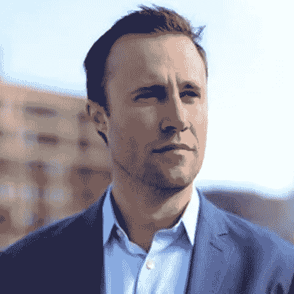
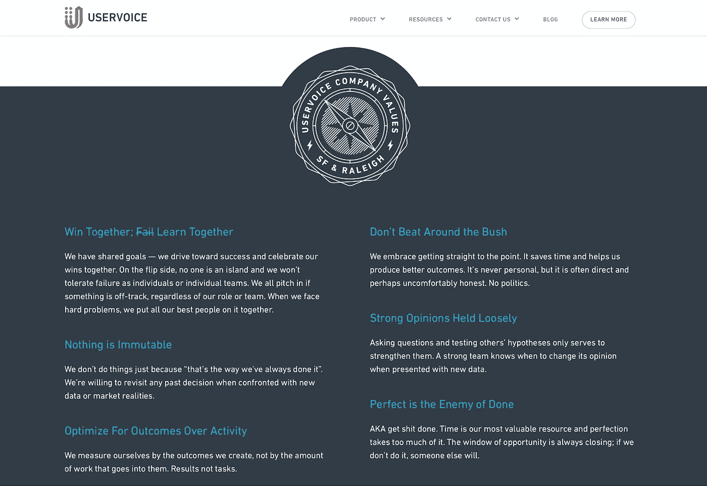
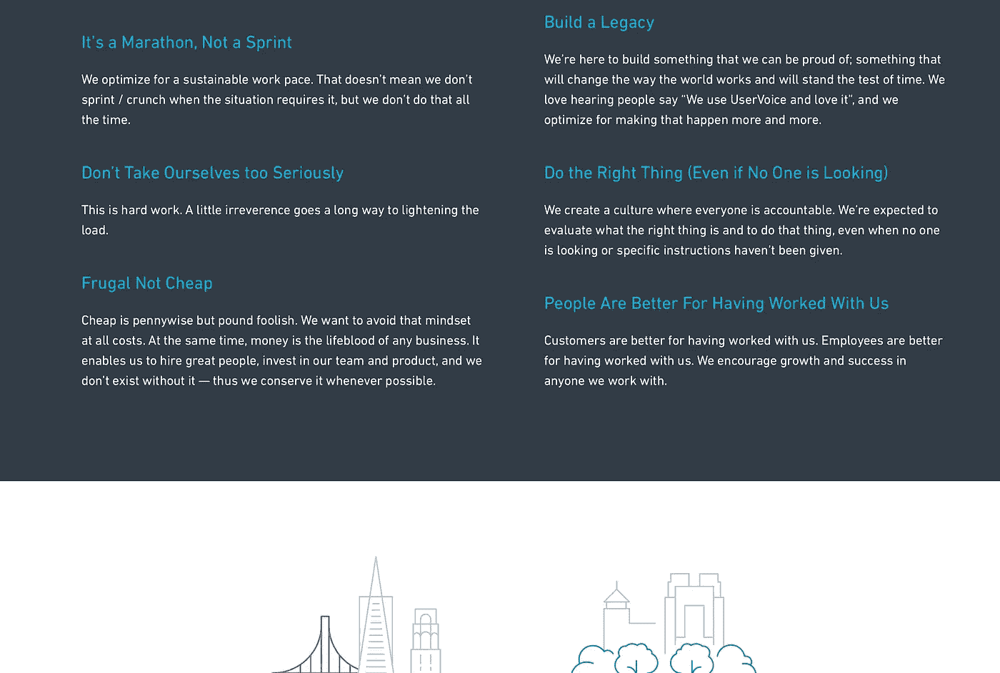

# UserVoice 的创始人兼首席执行官 Rich White(首次与 Kiko 进行 YC 合作)如何打造公司文化

> 原文：<https://medium.com/hackernoon/how-rich-white-first-ever-yc-batch-with-kiko-founder-ceo-of-uservoice-is-building-company-16399db53ac3>

**与 UserVoice 创始人兼首席执行官 Rich White 的对话，内容是关于他如何在 UserVoice 建立公司文化**

嗨，我是拉玛，[good ripple 的创始人](https://hackernoon.com/tagged/founder) /首席执行官。 [GoodRipple](https://goodripple.com) 帮助你在 Slack 和我们的其他产品上匿名向你的同事发送有趣的积极信息， [Avocado Culture](https://avocadoculture.com) 帮助你每周查看你的公司价值观是如何实现的，因此你可以实时建立强大的公司文化[。我和](https://hackernoon.com/tagged/culture)[用户之声](https://medium.com/u/12b382d2a758?source=post_page-----16399db53ac3--------------------------------)的创始人&首席执行官[理查德·怀特](https://medium.com/u/12b382d2a758?source=post_page-----16399db53ac3--------------------------------)进行了一次有趣的交谈，我想分享一些我们谈论的事情。我第一次见到他是在一个叫做峰会的创始人网络活动上。我非常欣赏他细致入微的思维。

Rich White, cofounder/CEO of UserVoice

**在圣克鲁斯的艰难起步和“不惜一切代价工作”的态度**

Rich 作为 Kiko(第一批 YC)早期团队的一部分，正在开发一个日历解决方案，他发现他们花了太多时间来接收用户的反馈，而且没有好的方法来大规模接收反馈。 [UserVoice](https://www.uservoice.com) 就是在这样的背景下开始的:用智能的产品反馈打造更好的产品。里奇告诉我早期的节俭和便宜的生活方式。两位联合创始人在圣克鲁斯(Santa Cruz)租了一个地方住在一起(这比住在湾区便宜多了)。早期的生活告诉了今天的价值观之一:“节俭而不廉价”。里奇回忆说，他们经常开车上 280/101 号公路(highways ),到著名的沙丘路(Sand Hill Rd)去见风险投资家，一个人开车，另外两个人工作，为了继续工作，他们会交换司机/乘客的角色。当要离开圣克鲁斯时，一位联合创始人对里奇说，他会想念当地的公交车通勤，因为在公交车上可以看到壮观的海岸线景色，里奇想知道在这些公交车上他一直在埋头工作，是什么景色！

最初的几名员工都是有家室的人，这影响了早期的文化

随着 UserVoice 将最初的几名员工添加到团队中，他们中的一些人有了家庭，工作方式必须改变，以允许这些员工在工作中做出贡献，并能够与家人共度时光。这种文化是这样的:你在白天认真工作，然后回家和家人在一起(并且在一天的工作时间内更加灵活)。这个地方可能没有其他初创公司看起来或感觉那么有趣，其中一些初创公司很容易被误解为成人游乐场。为了提高工作效率，UserVoice 尝试了在家工作和没有会议的日子，来帮助每个人提高工作效率。考虑到员工有家庭的背景，这种文化很自然地发生了。

**对文化的有意审视:写在墙上的公司价值观让我们发现了我们是谁**

UserVoice 的第一位社区经理也第一次帮助阐明了公司的价值观。墙上写着 10 个数值。写下这些价值观的效果是，人们觉得价值观反映了他们，价值观是他们可以团结在一起的东西。然而，在这个过程中，公司内部的分歧变得很明显——80%的公司真正喜欢这种文化，20%不喜欢。分裂的原因之一是人们希望公司为他们服务。20%的人想要看电影之夜、快乐时光，而其他人并不真正想要(可能是因为他们有其他的喜好，比如和家人在一起)。结果是，在几个月的时间里，20%的人离开了公司。

**创始人/首席执行官的转折点:里奇意识到公司文化是他需要拥有的东西，而不是外包(甚至是内部的)**

在此之前，里奇并没有将公司文化视为优先事项，也没有拥有公司文化。随着分裂及其影响，里奇意识到他甚至不能在内部外包公司文化，并决定更多地拥有文化，并从那时起一直拥有文化。

**阐明公司价值观的过程:由领导者设定意图的合作过程**

在公司的整个生命周期中，有几次里奇向我讲述了他是如何阐述公司文化的。他创建了 4 个由不同人员组成的头脑风暴小组(一组在公司工作了很长时间的人，一组刚到公司的人，一组女性，一组来自同一办公室(旧金山和/或罗利)的人，一组来自管理团队的人)。每个小组被要求就公司价值观提出 3-5 个想法。所有提交的想法，Rich 将它们映射在一起，并审查它们，发现只有 10%没有真正反映用户的声音。然后，他制定了一份“半决赛”草案，并将其发送给团队进行反馈。他们的一个价值观是“没有神圣的牛”，一个反馈是这种表述可能会被一群人视为冒犯，这导致该价值观变为“没有什么是永恒不变的”。这个过程并不总是一帆风顺。在形成文化的过程中，高管团队内部出现了强烈的分歧:一组人希望有一个非常深思熟虑的决策方法，而另一组人认为他们应该更快地做出决策。有意创造文化的过程突出了这两种思维方式，并允许执行团队探索它们。接下来的对话让高管团队意识到两种运营模式都很重要，这体现在价值观上:优化结果而非活动。

公司成长:公司文化必须成长！

UserVoice 的价值观之一曾经是:‘要有同理心，不要做 d..k。随着 UserVoice 越来越多地开始为大型企业客户提供服务，人们意识到这种价值虽然在内部很容易理解，但有可能会向客户传达错误的信号。更好的表达方式是:“做正确的事情(即使没人看)”。

**一旦公司价值观被重新阐述:人们会觉得这些东西很重要，这就成了“预防未来文化蔓延的疫苗”**

里奇注意到，一旦价值观被写在墙上，人们就会觉得这些东西很重要。这些是地上的木桩。它们也是预防未来文化蔓延的疫苗。当公司超过 50 名员工时，为成长中的组织奠定基础变得很重要。这些数值公布在用户之声的网站上。希望加入的人可以感觉到这个组织是否适合他们。在内部，在每月一次的全体大会上，荣誉被授予实践这些价值观的人。一些经理会将这些价值纳入绩效评估。在招聘过程中，价值观成为寻找合适文化的一部分。一旦价值观上了墙，员工们就开始在他们的工作对话中大量引用它。

**一个公司价值，它的意义变得扭曲了——迭代价值**

有一种价值观被引用，但这种价值观背后的意图被曲解了:“要有同理心，不要做傻瓜。”..k’——被人们用来表示他们觉得其他人被忽视了..当这些人只是在讨论想法的时候。这导致了价值观的反复，包括:“不要拐弯抹角”。Rich 提到，UserVoice 在过去几年中(2008 年、2011 年、2014/15 年)对公司价值观进行了几次阐述，并计划在今后 6 个月内再次阐述。他在这种背景下提出的一个问题是:我们是否觉得我们没有度过这一关？

**里奇给其他公司领导的关于文化的建议——早点拥有公司文化！**

在他自己的旅程中，他希望自己能更早地完成找出并写下公司价值观的练习。*创始人要有自己的公司文化*。他发现团队觉得他们肩负着明确公司价值观的使命。人们喜欢用它们来招聘——因为这样更容易谈论公司和用户之声是谁。里奇说，不要让公司价值观过于理想化。他的经验法则是 80%是你现在的样子，20%是有抱负的。我问 Rich，UserVoice 的理想价值是什么，以及这个价值一旦被表达出来后会如何发挥作用。他说:‘一起赢；( *Fail* ) Learn Together”是一种理想，这有助于团队走出团队不寻求帮助的“无声失败模式”。抱负价值有助于让人们注意到来自不同办公室的团队是如何不相互寻求帮助，并默默失败的。有了价值，就有了动力和正确的框架来解决 CEO 参与的问题，这有助于团队更好地合作。

**在 Rich 作为一个组织的创建者的旅程中，有哪些人或哪些想法影响了他？**

几年前，里奇偶然发现了乔尔·波尔斯基的作品，他设计了 Fogbugz、Fog Creek Software、Stack Overflow、Trello。乔尔对工程师的良好工作环境有着强烈的看法，他反其道而行之。他是一个反向投资者(不仅仅是为了与众不同)。当每个人都有开放式办公室时，他认为人们想要自己的办公室。37 signals(现在的 Basecamp)也是这样做的。标准的硅谷模式是无限的假期和开放的合作。37 个信号认为正常工作时间是一件好事(每周最多 40 小时，一年中有 6 个月每周最多 32 小时)。里奇说，这些影响让他能够跳出框框思考。

**截至 2017 年 12 月的 UserVoice 公司价值:**

**很想听听你的想法。下一个你想听哪个领导的？**