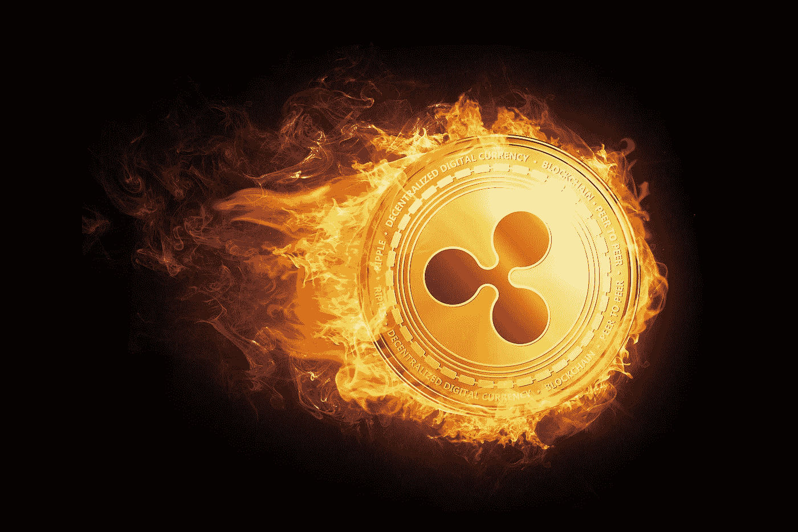

# Ripple 如何终结公用令牌 ICOs

> 原文：<https://medium.com/hackernoon/how-ripple-could-spell-the-end-for-utility-token-icos-cd840fe3c79b>

Ripple 可能是尚未讲述的最成功的公用事业令牌故事之一。Ripple coin (XRP)目前的交易价格为每枚代币 78 美分，在加密货币中的市值排名第三(仅次于比特币和以太网)。涟漪是一个大问题，但在某一点上它甚至更大。

在 2018 年 1 月的短暂时间里，Ripple 的联合创始人兼执行董事长克里斯·拉森(Chris Larsen)在区块链拥有 599 亿美元的 Ripple tokens，比马克·扎克伯格(Mark Zuckerberg)在脸书的股票还多。他的 Ripple holdings 也一度让拉森成为世界第五大富豪，因为 Ripple 的股价在一年内飙升了 30，000%以上。

拉森比谷歌的创始人更富有。

**涟漪如何变得轰动**

Ripple 实际上是由 Ryan Fugger(当时叫 Ripplepay)在 2004 年创立的[，是一个以债务为中心的点对点支付网络，本质上是一个虚拟信用额度的网络。Ripple 于 2004 年成立，这使得它比中本聪于 2009 年首次构想的比特币还要古老。](https://bitcoinmagazine.com/articles/introducing-ripple/)

虽然 Ripple 在早期表现出一些采用，但它在规模上受到其集中式网络的内在限制(在这种网络中，你必须被网络中已经存在的人邀请)，因此 Ripple 从未进入主流对话，直到 2012 年 Ripple 决定改造其业务。进入一线管理:

Jed McCaleb——一名程序员，负责创建第一个比特币交易所 Mt. Gox，在 Mt. Gox 解散前，他因窃取了 85 万枚比特币而声名狼藉，并永远玷污了它的名字

克里斯·拉森(Chris Larsen)——连续创业者，在线抵押贷款公司 E-Loan 和个人对个人贷款公司 Prosper 的联合创始人。

Larsen 和 McCaleb 共同设想 Ripple token 是比特币的替代品，这种替代品的交易速度更快，效率更高，因为所有的 Ripple token 都是预先开采的。根据 Ripple 网站的报道，Ripple 可以在 4 秒钟内完成支付，相比之下，以太坊需要 2 分钟，比特币需要一个多小时，传统系统需要 3-5 天。

当我们今天所知的 Ripple 网络在 2012 年启动时，总共创造了 1000 亿枚 Ripple 硬币，但 Ripple 的权力机构决定不立即向公众发布所有令牌，而是随着时间的推移发布一小部分囤积的硬币。Larsen 和 McCaleb 为自己保留了 200 亿个硬币，其余的归公司所有。迄今为止，Ripple 仍托管着近 500 亿 Ripple。

然而，XRP 代币只是 Ripple 业务的一小部分。Ripple 最热门的元素，以及它真正的吸引力，不是它的令牌，而是它的业务。RippleNet 是一款开源软件，可以在全球范围内实现钱包之间的资金转移。Ripple token 只是众多可以通过 RippleNet 转账的货币之一。

革命性的？不完全是。但它跨越国界的效率很高，这吸引了包括桑坦德银行和美国运通在内的一百多家银行的注意。然而，值得注意的是，银行可以使用 RippleNet，而不实际使用 XRP 令牌，这是许多投资者都忽略的事实。说到投资人…

**可能揭开涟漪的官司**

2018 年 5 月 3 日，瑞安科菲[对瑞普](https://static1.squarespace.com/static/5938711a9de4bb74f63b4059/t/5aebc4112b6a28e0ef4a0381/1525400594617/Coffey+v+Ripple+Labs+Complaint.pdf)提起集体诉讼。Ryan 是一名投资者，他在 2018 年 1 月令牌价值爆炸时以 2.60 美元的价格购买了 Ripple 作为投资。科菲以 1.30 美元的价格卖掉了他的波纹币，损失了 585 美元。

你可以争辩那又怎样？谁在乎一个投资者损失了 500 美元。这是个小数目，投资者一直在赔钱。有什么大惊小怪的？通常，你说故事到此结束是对的，因为古老的格言“投资者当心”至今仍然适用。在初创公司的投机活动中，投资赔钱是正常的。如果每一项投资都保证不亏钱，或者投资者能拿回他们的钱，那么就不会有卖家；只会有买家。

这种情况和这起集体诉讼的不同寻常之处在于，科菲声称 Ripple 向投资者出售了未注册证券。如果是真的，那就是欺诈。有了这种索赔，一个普通投资者可以很容易地去法院，并得到他们的损失。因为这是一个集体诉讼，它在理论上代表了所有购买 Ripple 的美国投资者。

这相当于投资者可以要求该公司偿还数十亿美元的索赔。这将摧毁 Ripple 及其创始人，包括首席执行官布拉德·加林豪斯(McCaleb 离开 Ripple 并创办了 Stellar，拉森在去年卸任首席执行官后现任执行董事长)。这起诉讼还提到了其他人，他们雄心勃勃地要起诉连锁反应食物链中的每一个人，包括那些向投资者推销连锁反应的人。

根据该诉讼，该诉讼“源于被告通过向散户投资者未经注册销售 XRP 筹集数亿美元的计划，违反了州和联邦证券法的注册规定。”

该诉讼进一步声称，“被告从那以后通过向公众悄悄出售 XRP 获得了巨额利润，这实质上是一种永无止境的首次硬币发行。”诉讼继续利用 Ripple 试图贿赂交易所将 XRP 上市，以及他们将 XRP 与 RippleNet 合并，作为误导投资者和试图抬高 XRP 价格的进一步证据，这与 Ripple Labs 带来的资金直接相关。

由于科菲(很可能还有大多数 XRP 投资者)购买代币时都有合理的利润预期，而 Ripple Labs 本身也将 XRP 作为一项有前途的投资进行营销，因此在 SEC 的眼中，XRP 确实是一只证券。

如果科菲的诉讼成功，这对密码行业是一个严重的打击。它不仅回避了有多少加密货币实际上是证券的问题，还意味着每一个在 XRP 上市的交易所都有麻烦，除非它们是在 SEC 注册的交易所或使用 ATS 的经纪交易商。提示:在 XRP 上市的交易所中，这一数字为零。

随着对监管的呼声越来越高，这场诉讼很可能成为改变加密游戏名称和清理未注册交易所的转折点。如果第三大硬币不安全，那么名单上的人都不安全。