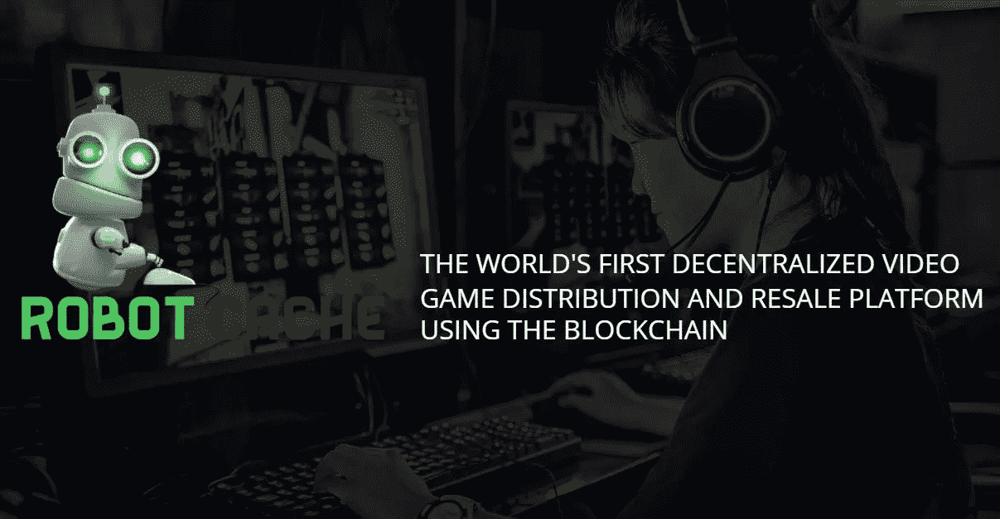
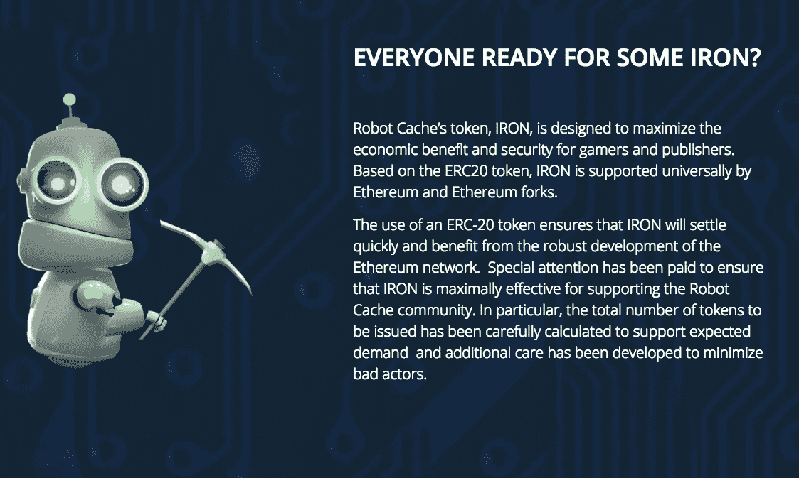
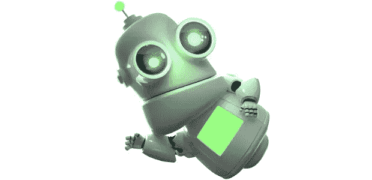

# RobotCache:分散 270 亿美元的 PC 游戏产业

> 原文：<https://medium.com/hackernoon/how-robotcache-is-going-to-disrupt-the-27-billion-pc-gaming-industry-3ec1901ec7ba>

## 创始人访谈

## 采访机器人缓存的布莱恩·法戈和李·雅各布森

*免责声明:我不接受文章的付款，也不以任何方式投资或参与 RobotCache 及其团队，除了下面的对话范围之外。。*

我总是被新的行业所吸引。我认为他们是一个公平的竞争环境。当我开始为小企业管理社交媒体账户时，我迈出了进入现实世界的第一步。我认为社交媒体是新鲜和令人兴奋的东西。人们并不真正理解它的价值，但它很快成为大多数企业最佳实践的一部分。

在社交媒体之后，我潜入了基于电子竞技和视频游戏内容的世界。我与[路易·塞萨里奥](https://medium.com/u/ca8400d3bc01?source=post_page-----3ec1901ec7ba--------------------------------)、[吕勒普道场](http://www.lvlupdojo.com)共同创办的公司。电子竞技的世界和社交媒体一样诱人。这让人想起了狂野的西部。当我的朋友 Erik 卖掉 FaZe 看守名单上的一个球员时，他实际上设定了看守球员的价格。仅仅因为他是第一个把它卖给另一个团队的人。我想成为其中的一部分，因为我觉得我已经接近底层了。对我来说这意味着我更有可能颠覆这个行业。

现在，同样对刺激的需求驱使我去做加密。这个行业足够年轻，几年的经验不会让任何人有太多的领先优势。几年的优势可能会被更努力、更聪明的工作以及为社区带来比其他人更大的价值所抵消。

如果你几个月前告诉我，我将有机会与那些拿走了我的两个爱好——视频游戏和加密货币——并找到了成功颠覆这两个行业的方法的人交谈:我可能不会相信你。

在参加了一次 ICO 推广日之后，DNA 基金[把我介绍给了布莱恩·法戈和李·雅各布森。我告诉活动中的一些人，我来自电子竞技/视频游戏的世界，他们很快提供了介绍。Brian & Lee 正在开发一个名为](/@ThisIsDNA) [RobotCache](https://www.robotcache.com/) 的项目，该项目目前已经接近公开预售的尾声。

**机器人缓存**是:

> *“全球首个使用区块链的分散式视频游戏分发和转售平台”*

从本质上讲，RobotCache 是 Steam 的区块链版本，对模型进行了一些关键的调整。机器人缓存允许出版商大幅降低他们出售视频游戏的费用，并允许用户转售他们以数字方式购买的游戏。用户可以出售他们的游戏，换取支持 RobotCache 的令牌 IRON。

> Steam 是一个数字游戏分发平台，用户可以在这里购买 PC 游戏，视频游戏发行商可以出售他们的游戏标题，收取 30%的费用。

Image from [RobotCache.com](http://RobotCache.com)

老实说，我去电子游戏店的唯一原因是我可以转卖我的游戏。我可以把一个游戏的实体拷贝带进 GameStop，并以很低的价格出售。当你在网上购物时，你为这种便利付出的代价是:无法通过卖回你的二手游戏来收回任何成本。

我甚至在 GameStop 退货政策中找到了一个小漏洞来解决这个痛点。如果你买了二手游戏，并在一周内归还，你可以无限期地交换游戏，而不必支付比最初购买更多的费用。

我知道，我是一个*犯罪天才*。

RobotCache 正在开发的平台意味着:我不仅不用再欺骗 GameStop。我可以继续购买新游戏，并在自己舒适的家中把它们卖回给其他用户。这对我、GameStop 和游戏发行商都有好处。参与该交易的每个人都可以通过使用 RobotCache 受益。

*你们中有多少人的 Steam 账户上下载了数百款视频游戏？*

*你现在还玩多少这样的游戏？*

我不经常使用“破坏性”这个词。要真正颠覆一个行业，你必须想出一个对相关各方都“双赢”的解决方案。你还能如何让看门人和行业巨头允许现状改变？话虽如此，但在整个面试过程中，我发现自己的下巴一次次掉在桌子上。

也许是因为我是一个超级书呆子，或者也许 RobotCache 真的会颠覆价值 270 亿美元的 PC 游戏产业。

# **面试**

## 礼萨:你能告诉我你的背景吗？

Lee Jacobson, CoFounder of RobotCache

**Lee** :所以，和 Brian 一样，我在 80 年代初年轻的时候就开始用 BASIC 语言编写视频游戏，当时我还在用我的 Atari 400 电脑。我放弃了我在美国空军学院的大学教育，这让我的父母非常失望。

玩老款雅达利游戏时，我想，这是一个多么神奇的工作场所啊。如果我能去这家叫做雅达利的疯狂公司工作，只是去扫地，我会很高兴的！

当我还是个孩子的时候，那是一个神奇的时代，所以我决定进入这个行业。我曾在几个游戏开发工作室工作，然后在 90 年代末加入维珍娱乐，并在那里工作了几年。我后来加入了中途岛游戏公司(有人称之为“真人快打之家”)，我们在那里做了很多很棒的游戏。我离开了生产部门，进入了业务开发角色:许可、业务开发、数字分销和开发者关系。

我在那里工作了 13 年，然后我们把公司卖给了华纳兄弟，你瞧，我发现自己来到了小时候梦想的公司雅达利。只是我没有扫地，而是负责全球出版和授权业务..太疯狂了。那时我已经完成了。

Brian Fargo, CoFounder of RobotCache

布莱恩:我的背景是我认识李很久了！

我自己在这个行业也有一段时间了。大多数人因为我参与的游戏而认识我，例如荒地，辐射。我帮助创立了一些伟大的公司，如 BioWare 和暴雪。然后我在 2002 年开始了 inExile，设法回到制作角色扮演游戏的起点。然后，由于众筹，我在 Kickstarter 上筹集了超过 1000 万美元，Fig. Did 荒地 2，折磨:努梅涅拉的潮汐，吟游诗人的故事，以及明年即将到来的荒地 3。

我的背景主要是制作和管理疯狂的视频游戏。

## **礼萨:太棒了。考虑到你们现在正在做的项目，你们两个都有相当丰富的相关经验。不幸的是，这是区块链创始人身上罕见的特质。**

**李**:我们有很多磕磕碰碰，这是肯定的。

布莱恩:我们的投资者也经常这么说。我想他们很欣赏这一点。从一开始，我们的商业模式就是:非常受关系驱动。我们必须让出版商注册并插入我们的 API，以及其他任何可能需要的努力。我们认识这些人已经几十年了。与一些从未涉足该行业的全新团体相比，他们更有可能与我们做生意。我们绝对有优势。

## **Reza:我很想了解一下你们是如何涉足区块链的？是什么让你掉进兔子洞的？**

布莱恩:布洛克·皮尔斯 3、4 年前就开始数落我了，不停地唠叨。我仍然不高兴他没有更努力地唠叨我，所以我买了更多！

他让我思考这个问题。自从布洛克做《魔兽世界》的挖掘工作时，我就认识他了，我对他作为认识到数字物品价值的先驱给予了很大的赞扬。人们会为数字产品支付真金白银。现在看来这是显而易见的，但在当时这是一件新鲜事。

我认识他很久了，是他让我进入状态的。去年他向我挑战。他说要拿出好东西，他会支持的。因此，我开始阅读大量白皮书和区块链的好处，并提出了机器人缓存的整个概念。

## 礼萨:我上周二才第一次见到布洛克，他很有个性。从那以后，我有机会更多地了解了他的历史，我非常感激他为这个行业所做的一切。以及他对波多黎各的指控。我可能很快就要出去了。

**布莱恩**:他超级古怪又聪明，绝对是个人物。我喜欢角色。

## **礼萨:他们是唯一真正有趣的人！机器人缓存的灵感是什么，你的啊哈时刻是什么？**

布莱恩:和大家一样，我也读过很多白皮书，其中有一些共同的主题。一是减少对中间人的需求。在我们这个行业，最大的中间人是 Steam。他们拿 30%的佣金，控制 90%的市场。

如果会有业务中断，我想，“这是一个好的开始”。

另一个啊哈时刻，我想我真的在半夜醒来…

李:是的，他打电话给我，非常兴奋，简直是疯了。

布莱恩:是的，我打电话给李，“李，你不会相信的”。这似乎是一个显而易见的想法，但我当时正在阅读区块链的所有权链和密码学。让它如此强大的是，你可以以一种几乎无法破解的方式确信，某样东西不可能同时存在于两个地方。这让我想到，“好吧，如果我能说服出版商他们的书是 100%安全的——那么他们可能会允许我建立一个网站，人们可以在那里转售它们”。

此外，由于我有很多额外的利润可以给，我可以通过给他们从另一个网站的新销售中获得的相同的 70%来保持他们转售的完整性。当这两个人走到一起时，我有了“啊哈时刻”。我叫李像一个疯狂的傻瓜一样漫无边际。

## 哇，真是天才。这对盗版的未来有很大的影响。它有可能使盗版内容变得不可能。

Brian:我喜欢它的另一点是，你提到的隐私让我想起了它:有一大群人根本不相信数字版权管理(DRM)保护。他们觉得，如果他们买了某样东西，他们就拥有了它，应该能够用它做他们想做的事情。你可以让他们与出版商就许可与销售等诸如此类的问题进行争论。但是我认为我们能同意的一件事是，你不能让 DRM 免费并允许人们转售。

这两种状态不可能存在。

它为不喜欢 DRM 的人创造了一个令人信服的论点，希望他们同意，“现在我可以转售我的游戏并获得退款”，这可能是拥有某种保护的令人信服的理由。

## 雷扎:你介意解释一下什么是数字版权管理吗？

**布莱恩**:它代表数字版权管理(DRM)。这是版权保护。人们把它放在他们的产品上，这样用户就必须登录到一个服务器来验证他们是否拥有某样东西。所以不能随意抄袭送人。

## **礼萨:所以每次我想玩我以前的室友买的游戏时，我的 Xbox 上就会弹出这个游戏？**

布莱恩:没错。

## **Reza:我看到《福布斯》的一篇文章，作者说 RobotCache 的目标是“解决当前像 Steam 这样的数字分发平台的缺点”。你认为这些缺点是什么？**

Brian :我认为是第三方商店的高额利润和缺乏转售游戏的能力。

李:以及治疗，或者说缺乏治疗，一直是一个问题。

布莱恩:没错。

## **Reza:你认为 Steam 是独立游戏发行的垄断者吗？他们是许多小型游戏开发商的看门人。作为业内有经验的人，这种说法有任何真实性吗？**

布莱恩:他们就像一个仁慈的独裁政权。

听着，我很尊重蒸汽公司的人。我们期望与他们共存。对我来说:有网飞，还有 Hulu。我们从来没有声称我们想拿出蒸汽。有一个巨大的馅饼仍然在那里，一个政党在这个市场上处于第二位，这可能是相当大的。目前，是的，他们控制了大部分市场份额。我认为当人们开始转售这些游戏时，会有一些有趣的动态出现。

这些文章并没有得到完整的图片，例如福布斯的文章，它需要时间来解释这一切。我给你一个简单的动态。我们允许出版商和开发商调整佣金。在二手游戏销售中，他们得到 70%，消费者得到 25%，我们得到 5%。但是出版商可以拨号上网说，“这个月给用户 50%的佣金”，然后看看会发生什么。我想他们会发现月销售额并没有受到负面影响。他们会发现他们可以给用户更多的东西。如果他们看到，他们从推动朋友从佣金中购买游戏的人那里获得了增量销售，那么这将是一个真正的游戏改变者。25%很好，但如果 50%突然变成事实。你可以在我们的网站上购买游戏，然后拿回一半的钱，这有很大的颠覆性。

## Reza:这个功能允许用户转售他们的游戏，我们之前讨论过，你称之为你的啊哈时刻。你介意多讲一点这是如何工作的吗？

**李**:从根本上说，这是非常基本的。正如 Brian 所提到的，DRM 确实与我们所拥有的相联系，它是一个类似 Steam 的客户端，周围嵌入了一个令牌。这是一个验证谁拥有有效许可证的过程，一旦游戏售出，许可证将使用智能合同重新分配，它将成为区块链的一部分。

在过去，你必须有一堆书面的分许可，并且必须生成一堆合同。想象一下有一百万份合同，这是不切实际的。使用智能合约和区块链，我们可以预先确定和预先设置。当玩家把他们的游戏拿出来出售时，他们可以决定他们是想要铁还是现金。一旦发生这种情况，所有的 DRM 都会得到更新，从他们的库中取出，放入其他人的库中，所有这些都使用智能合同在区块链上注册。

## **礼萨:我看到游戏玩家可以用他们的游戏电脑开采铁矿。我已经有很多游戏玩家联系我，询问他们的 PC 规格是否足以开采以太币或其他货币。当你提到人们可以在你的网站上采矿时，会不会有人用游戏电脑采矿会比以太坊的采矿效果更好？还是本质上功能一样？**

布莱恩:这是一个类似的功能。大多数人没有加密货币，没有自己的数字钱包，也没有我的。想要最大化采矿利润的人会想要加入采矿池。我们的环境没有摩擦。你只需点击一个按钮，你就可以采矿。矿工们做出了贡献，我们用铁来奖励他们，他们可以用铁来购买游戏。

我们吸引的其实是无摩擦的挖掘努力，而不是试图最大限度地发挥机器挖掘能力的人。

## **Reza:这几乎是一种吸引更多用户的方式，与其说是你的平台，不如说是整个加密货币——通过创造一种无摩擦的体验，让人们尝试加密，看看它是什么样的。**

布莱恩:没错。我们正在与 NVIDA 讨论某些事情，但我们在 NVIDA 的联系人不属于我。大多数人不想经历设置这一切的麻烦，所以我们为世界其他地方。

## **Reza:你认为未来发行商可以使用铁作为游戏中的货币吗？**

是的，我们已经接触了许多提供免费游戏的公司，我们觉得他们很重要，如果他们愿意，我们的 IRON 将专注于他们的游戏。我们已经与非常著名的公司就同样的事情进行了多次对话。我们绝对认为这是一种可能性，并希望鼓励它。不仅在我们的平台内部，还与其他第三方合作。我希望有一天，无论你在什么平台上，都可以使用铁作为支付方式。就像你使用贝宝一样。这为成千上万的游戏打开了大门。甚至是我们生态系统之外的生物。所以是的，绝对是的。我们看到这一过程将在未来几年内不断发展。

## **礼萨:想到有人在 WoW 或其他 RPG 中工作并赚取货币，然后注销并使用这些货币在物质世界中购买东西，这真是太疯狂了。我无法想象这对你们来说有多疯狂，考虑到你们在这个行业已经呆了这么久。**

**李**:它也让我们大吃一惊。我们昨天与一家 MMO 开发商进行了一次对话，他们正在做一款免费游戏，他们对区块链非常感兴趣，并且已经在围绕它进行开发。他们从皮肤里出来，因为有这么多的人，就像 Brian 提到的，在游戏中，也是 crypto 的粉丝。不仅仅是千禧一代，还有游戏玩家本身。他们希望有一个地方或渠道来花掉这些钱并从中获利。它获得了很多热情。

Brian :我们看到的一件事，击中了你的要害，我们看到 RobotCache 成为想在区块链开发的开发者的聚集地。不是每个人都想推出自己的硬币并编写自己的代码。我们是开源的，没有摩擦。我们认为，因为我们将有成千上万的游戏和开发者+开源，我们将成为人们去的地方。它超越了买卖游戏的理念。它有望成为一个繁荣的开发社区。

Lee**:当你加入基于技能的游戏时，这是向成熟的电子竞技又迈进了一步。当你想加入一个电子竞技团队时，你不能只去迪士尼的电视节目，你必须努力向上。我们看到人们能够在基于技能的赌博中挑战他们的朋友，并随着时间的推移建立他们的排名，最终他们可以过渡到电子竞技。**

## **雷扎:你的所作所为给我留下了最深刻的印象，那就是你已经得到了所有出版商的同意。我发现，不仅仅是在区块链，对许多公司来说，最大的进入障碍是让现有行业或现状的看门人接受它们，并允许它们运营。你提到你已经有几个出版商了。这个过程对你们来说怎么样？**

**布莱恩:一开始我们必须向他们解释区块链。我们去那里，他们会说帮助我们理解。我们开始解释，他们说，这真的很棒，这真的很聪明。这是一个事实的结合，他们喜欢商业模式，喜欢改变现状的想法，他们认识我和李已经有 20-30 年了，所以他们相信我们会贯彻我们所说的话。**

****李**:我们给他们 95%的利润当然有帮助，每个人都想要更高的利润。**

## ****礼萨:你可能是我在这个领域唯一交谈过的联合创始人之一，我真的相信没有其他人可以与之竞争。如果没有你的经验和相关的人脉，肯定不行。我并不想滔滔不绝，但我对你们正在做的事情和已经取得的成就印象深刻。我看不出有谁真的能比你执行得更快或更好。****

**布莱恩:我们有不公平的优势。**

**李:我们就要它了！**

## **礼萨:你必须这么做！能拿哪拿哪。**

**李:对布莱恩来说，这只是一个再教育的过程。当我们能够帮助他们理解它能有多大时，它就发生了。没有人来真正扰乱这个行业。这是一个转变，他们不仅赚了更多的钱，而且通过回馈给玩家，他们看起来真的很关心他们的粉丝。这是一个双赢的局面。很少有机会能让发行商和游戏玩家双赢。与此相反，一个赢一个输。这就是我认为这是特别的，他们明白这一点。**

****Brian:** 我们得到的最好的赞美之一是，投资者觉得他们听到的一些其他想法是寻找问题的解决方案。这对消费者和出版商来说绝对是现实世界的好处。我们得到了很多积极的评价。**

## **Reza:我认为你真正需要做的两件事是把出版商和用户带到平台上。你已经讨论了如何吸引出版商，你有什么吸引用户的高层次计划吗？**

**Lee: 对于游戏玩家来说，能够将游戏转售给他们的朋友是件大事。它不存在。我的一个朋友有一个儿子，他的 Steam 账户上有 300 个游戏。他已经很少玩这些游戏了，他很希望能把其中的 50%卖掉。他在大学预算内，没有很多额外的钱，所以能够出售和购买下一个大型游戏——我们认为这将会经常发生。当你将此与其他营销计划和游戏玩家奖励(如代币空投和奖金)相结合时，这对他们来说也是一种胜利。我们将根据你成为用户的时间长短，你在平台上的使用情况，随机进行空投——游戏化将被嵌入到网站中。然后，当你加入采矿和基于技能的游戏，我们认为有很多令人信服的理由让玩家来看看我们。**

****布莱恩**:我们也会和其他拥有大型生态系统的人站在一起。所以我们会做战略性交易。我们已经用 Wax 做了一个，我们将空投令牌到他们的系统中，并将互相交叉促进流量。你可以期待未来会有更多这样的事情发生。**

## ****礼萨:你目前处于预售阶段，当前一轮的条款是什么，如果有人对你感兴趣，应该如何联系你？****

**布莱恩:他们可以去我们的网站，****。**所有的 SAFT 协议都在那里，整个过程都可以在网上处理。即使你是机构，你也可以通过那里联系到我们。****

****李:是 tokensale@robotcache.com****

****我们的竞选活动只剩下几周了。对于机构投资者来说，最低 50 万美元，打六折。对于合格投资者，最低 50，000 英镑，享受 25%的折扣。我们没有公开出售代币，这样做似乎没有意义。****

## ******Reza:我注意到，一些高管和顾问拥有更大网络的公司，那些创始人拥有更多相关经验的公司，已经开始选择私下销售，并使用空投来分发令牌。Everipedia 的 Mahbod 告诉我，他认为空投是未来筹资的首选方式。随着 ICO 开始受到打击，区块链之外的初创公司看到了融资的潜力——这正是区块链开始创造的。******

****布莱恩:我们同意。我们认为这将是未来的趋势。****

****李:绝对是。****

****— — — — — — — — — — —****

# ******RobotCache 令牌销售详情******

## ******要了解更多关于参与公开预售的信息，请访问 RobotCache.com******或发送电子邮件**[**【tokensale@robotcache.com】**](mailto:tokensale@robotcache.com)**。********

## ********令牌生成事件时间线********

*   ********机构预售:**1 月 17 日—4 月 1 日******
*   ********认证公开预售:**2 月 15 日—4 月 1 日******
*   ********代币生成活动:**2018 年第三季度******