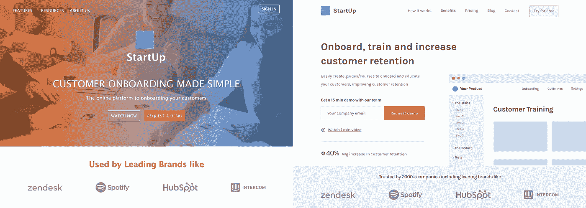
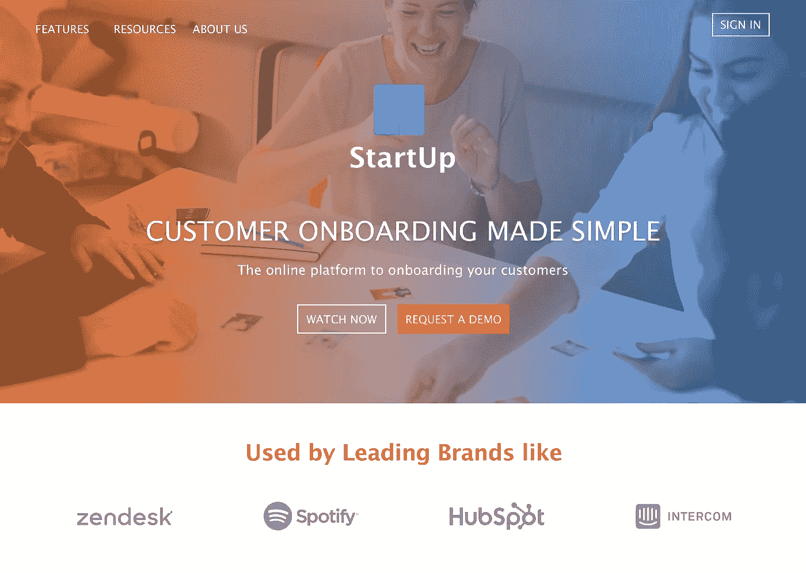
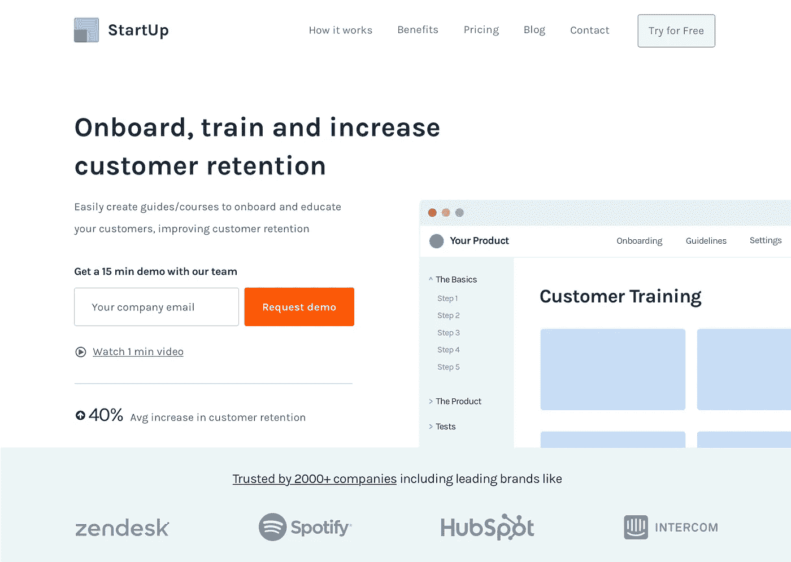

# SaaS 登陆页面如何在几秒钟内创造一个杀手级的印象

> 原文：<https://medium.com/hackernoon/how-saas-landing-pages-can-create-a-killer-impression-in-seconds-de70cf3c5ee5>

Normal vs Improved example

# 你只有 5 秒钟的时间！！😬

让我们面对现实吧，人们的注意力从未如此之低，而且人们从未有过如此多的软件选择或购买公司，这意味着，如果你不能让你的潜在客户理解它的作用，以及它如何在页面顶部为他们提供价值，你就极大地增加了他们根本不转化的风险。

# 为什么要固定页面顶部？

这是你的公司给潜在客户的第一印象，如果你做得不好，你会失去 90%的客户，所以解释你如何改善这一点可以提高网站的整体转化率。我也想让这篇文章简短可行，所以我现在只关注一个部分。

# 这个例子中的公司

我用一家虚假公司作为例子，这是基于我在 [SaaS](https://hackernoon.com/tagged/saas) 登陆页面中发现的最常见错误，相信我，这仍然比平均水平要好…

# 这个“公司”做什么

这家公司提供了一个[工具](https://hackernoon.com/tagged/tool)，你可以创建课程或指南来帮助需要一些培训的公司使用他们的工具，并确保他们的客户从产品中获得最大收益，因此，它有助于降低这类公司通常经历的高流失率。

# 当前版本的问题

Your typical SaaS Landing page (A bit better than average actually)

*   由于颜色和背景图像，标题和 CTA 的可读性变得更差，因此效果更差。
*   库存照片不会给人留下非常专业的印象，因为这些照片被用在了大量不同的模板中，这可能会让人们觉得这家公司不太成熟。
*   我建议永远不要全部大写！它消除了字母的形状和高度之间的巨大差异，只是让一切更难阅读。
*   标题非常模糊，如果我们想让人们继续滚动(而不是永远失去那些线索)，我们需要看一看它的作用。

# 致命印象的公式

不要误解我的意思，每个案例都是不同的，但除了确定每个产品服务的独特异议或卖点之外([我的免费电子邮件课程](http://bit.ly/2xwP2fz)的第 2 步和第 3 步)。

1.  **简介/标题—** 这个标题应该开始回答出现的第一个异议“这是什么？”。
2.  **支持文字** —利用这一段(标题下方)来支持并简要解释解决方案的工作原理或它将解决什么问题。
3.  **CTA—**有些人可能准备尝试一下，要么是因为他们更愿意尝试，要么是因为你正在解决的问题对他们来说是一个巨大的痛点。无论如何，你应该总是有清晰可见的 CTA，这样如果人们有兴趣尝试/购买，他们就不必去找 CTA，相信我，这比你想象的更常见…
4.  **预览** —你不能相信人们会阅读你的文章(相信我，他们不会)，所以你需要展示问题或你的解决方案看起来像什么，以提供更多的背景，并支持这一部分的其他三个要点

**好的头球要求:**

*   简要回答“这是什么？”以及“它是做什么的？
*   激发持续浏览页面的兴趣，这样你就可以继续向他们推销
*   有清晰的 CTA，有很多对比，在人们想转换的情况下突出出来。
*   展示解决方案或问题可能的样子。从第四点可以看出，以工具的图像为例。

# 我该如何解决这个问题

How I’d improve this

*   这个大而粗的标题传达了软件的用途，并简要提到了目标是增加客户保留率。
*   为了支持标题的信息，下面这一段简要解释了该工具如何提高客户保持率。
*   请注意，这一次我提到了演示的时长，以使它看起来像是一个较低的承诺，并将控制权交还给潜在客户。通常，如果您不添加这种类型的激励措施，您可能会因为不知道这一步具体是什么而遭到一些反对，在这种情况下，潜在客户通常担心演示会浪费大量时间，并且他们会在之后收到销售团队的垃圾邮件，这会导致他们犹豫不决。
*   我对视频使用了同样的技巧，说“看 1 分钟的视频”,让它看起来更短和/或更容易理解产品。
*   展示你所提供的东西是很重要的，要么展示产品的图片(就像你在这里看到的)，要么用插图/图片来提供更多的背景信息。
*   这里有两种形式的社交证明，比如提到平均留存增长的统计数据(也就是他们当前客户获得的结果)和知名公司的徽标。他们的主要功能是围绕产品/服务建立权威，并提高页面上进一步解释的任何东西的感知价值。

## ▶️[免费视频分解]

# 打破我用来帮助 SaaS 初创公司将访客转化为客户的漏斗

[**下面是视频的链接**](http://bit.ly/2Na6Of6)

# 📨需要帮助你的网站创收吗？

我很乐意讨论你的问题，所以请在评论中告诉我你的现状、需求或目标👇或者…

[**服务**](http://www.cortes.design/pricing)

**想聊天？** [此处安排免费咨询](http://www.cortes.design/consultation)

**邮箱:** pedro@cortes.design

## 关于 SaaS 登陆页面的进一步阅读

你可以在我的博客上找到关于为 SaaS 优化网站的每周文章。

 [## 没有转换？以下是您的登录页面无法转换的 4 个原因

### 根据我的经验，我可以告诉你，大多数页面转换不好的原因至少可以归结为以下四点之一…

www.cortes.design](https://www.cortes.design/post/some-traffic-but-no-conversions-here-are-4-reasons-your-page-is-not-converting-any-why)  [## SaaS 登陆页面如何在几秒钟内创造黑仔印象

### 如果你不能在人们访问你的网站的前几秒钟给他们留下好印象，你就没有机会…

www.cortes.design](https://www.cortes.design/post/how-saas-landing-pages-can-create-a-killer-impression-in-seconds)  [## 打破旨在获取更多线索的 SaaS 登录页面

### 在这篇文章中，我将向你展示我是如何设计一个概念页面来捕捉线索的，在这种情况下，它是…

www.cortes.design](https://www.cortes.design/post/breaking-down)  [## 围绕异议设计登录页面！

### 在我的每一篇文章中，我都试图解释可以改进产品的通用技术…

www.cortes.design](https://www.cortes.design/post/design-landing-pages-around-objections)  [## 优化 SaaS 登陆页面的交通温度

### 这些人对你的产品、你的公司或者你如何解决他们的问题一无所知，而你可以…

www.cortes.design](https://www.cortes.design/post/optimizing-for-traffic-temperature-in-saas-landing-pages)