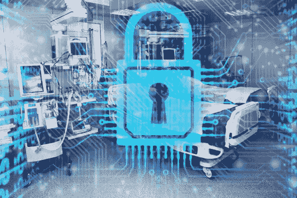

# 医疗技术对黑客来说有多安全？

> 原文：<https://medium.com/hackernoon/how-safe-is-healthcare-technology-from-hackers-4e4fcdfece2d>

Source: [Mass Device](http://www.massdevice.com/wp-content/uploads/files/story_art/hospitalcybersecurityhackinglarge3x2.jpg)

医疗保健技术每天都在不断发展，区块链、远程医疗和 3D 打印机正在被全国各地的医疗专业人士所使用。但仍有一个问题有待回答:这项技术能被黑客侵入吗？如果是这样，这可能意味着医疗记录的危险后果，敏感信息可能被泄露。在本文中，我们将研究这种技术如何潜在地威胁安全性，并给出组织如何确保其信息安全的提示。

# **3D 打印机可以被黑吗？**

虽然 3D 打印有时会花费几个小时的时间，并且在设计产品时非常困难，但这并没有阻止行业尽最大能力利用它。阿迪达斯和通用电气等几家公司正在使用 3D 打印技术推进 T4 的生产和制造。使用数字文件，3D 打印机可以制造出大量的三维立体物体。

医院正在利用这项技术在医疗保健行业取得历史性的进展。3D 打印正在[创造放射学领域的创新](https://cahsonline.uc.edu/resources/brst/articles/how-can-radiology-leverage-3d-printing/)，这是一门利用医学成像技术帮助诊断和治疗疾病的科学。根据辛辛那提大学的说法，“3D 打印现在正在放射学领域流行起来，因为专业人员可以将其用于教育、研究和其他目的。

但是 3D 打印机对于黑客来说是完全安全的吗？正如《哈佛商业评论》[指出的那样](https://hbr.org/2017/10/3d-printing-gives-hackers-entirely-new-ways-to-wreak-havoc),在过去的 10 年里，封闭系统主导了 3D 打印行业。这意味着 3D 打印机只能使用制造商的树脂和软件。但是一些公司正在转向一个更加开放的系统，这个系统有很多优点，但是也威胁到安全。《哈佛商业评论》称:“一旦进入开放环境，病毒通过多方和信息流传播的速度会比在封闭系统中传播的速度更快。”。

黑客经常通过关闭服务器、破坏数据和闯入计算机数据库来攻击个人，但 3D 打印将黑客攻击的可能性提升到了新的可怕水平。通过破坏 3D 打印机文件，黑客可以导致产品故障，引发伤害、产品召回和诉讼。全国各地的研究人员现在正在寻找打击这些网络攻击的方法，其中一种预防方法可能很简单，就像听 3D 打印机发出什么声音一样简单。

# **区块链能被黑吗？**

区块链有助于跟踪机器内部的交易，已经被各种不同的行业在[以开创性的方式](https://hackernoon.com/how-blockchain-technology-can-revolutionize-the-healthcare-sector-31fe9301575)使用。从保险机构到唱片公司，区块链技术正在彻底改变各行业存储和跟踪数据的方式。通过使用区块链技术，医疗专业人员能够更有效地管理数据和开展研究。甚至还有区块链技术能够通过监测手部卫生来跟踪医院的清洁程度。

随着区块链网络被全世界这么多不同的组织使用，我们是否知道它对黑客来说是安全的？区块链技术确实容易受到黑客的攻击，在这些系统中有许多黑客可以攻击的途径。区块链网络的用户被给予私钥，用于签署账户交易，如果黑客获得访问权，他们可能会窃取信息和破坏数据。区块链平台的安全性也可能因软件错误而受损，这些错误发生在软件实现的开发过程中。

区块链技术像任何其他系统一样容易受到黑客的攻击，用户需要掌握必要的技能来保护自己免受网络攻击。有几个应用程序可以帮助防止区块链网络中的网络攻击，如防止身份被盗的 Civic 和使用人脸识别技术识别用户的 Biometrics.io。使用这些工具，公司可以保持他们的网络安全，并确保他们的数据免受黑客攻击。

# **远程医疗可以被黑吗？**

远程医疗在医疗领域变得越来越普遍，这让来自农村社区的[市民受益匪浅。现在甚至有了像心电图设备这样的家用诊断工具](https://www.beckershospitalreview.com/healthcare-information-technology/how-telemedicine-is-transforming-treatment-in-rural-communities.html)，它可以跟踪心脏健康状况，并检测何时心脏病发作。有几个智能手机应用程序有助于推进远程医疗的可能性，例如 CVS 最近宣布的[minute clinic 服务，该服务允许用户通过智能手机上的视频对话由医生进行诊断和治疗。](https://www.usatoday.com/story/money/2018/08/08/cvs-minuteclinic-telemedicine-telehealth/928004002/)

尽管这项技术正在帮助更多的社区找到医疗服务，并提供更简单的治疗和诊断方式，但它真的像我们想象的那样安全吗？虽然远程医疗被认为比许多其他形式的医疗保健技术更安全，但黑客仍然可以使用几种类型的勒索软件来劫持医疗设备的操作并窃取数据。

勒索软件是黑客用来提取付款或信息的一种技术，其中目标计算机被锁定，直到黑客的要求得到满足。勒索软件通常通过加密策略来执行，黑客通常会要求以比特币等在线货币的形式支付。[这类网络攻击正处于历史最高水平](https://www.ontrack.com/blog/2018/01/11/cybercrime-rise-protect-ransomware-2018-2/)，当你成为目标时[知道该做什么](https://www.nytimes.com/2017/05/15/technology/personaltech/heres-how-to-protect-yourself-from-ransomware-attacks.html)很重要。

为了避免隐私和安全问题，远程医疗网络需要遵守 HIPAA，HIPAA 代表健康保险便携性和责任法案。该法案有助于医疗记录的隐私化，防止健康信息落入黑客手中。远程医疗技术需要遵守 HIPAA 的指导方针，其中包括实施安全通信系统，只允许授权用户获得服务，并实施保护措施以防止意外或恶意违规。遵循这些规则，远程医疗技术更加安全，网络攻击也更少。