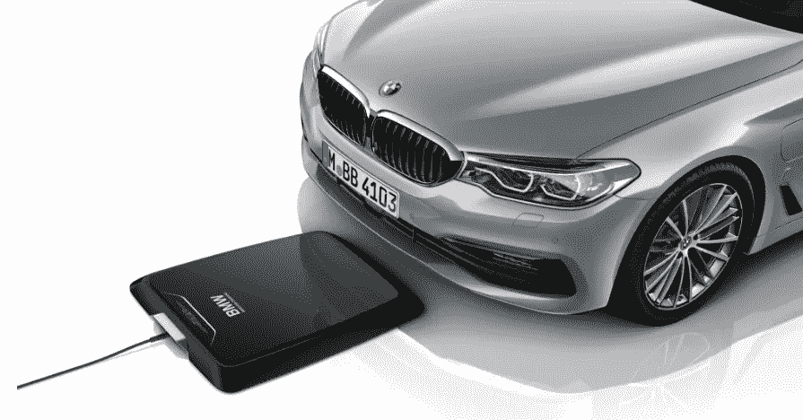
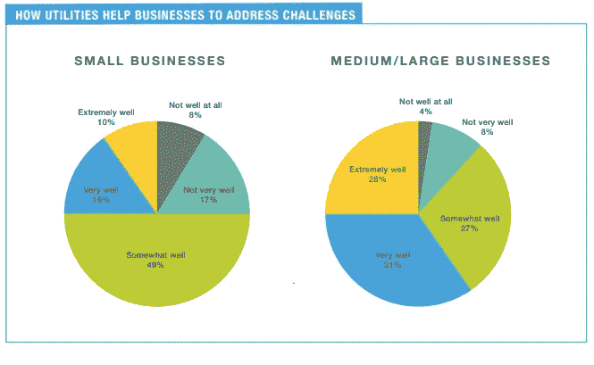

# 特斯拉是 2018 版的‘更好的地方’(以及给所有创始人的教训)吗？

> 原文：<https://medium.com/hackernoon/how-shai-agassi-is-saving-elon-musk-and-the-lesson-for-all-founders-b82a47b1f6a1>

By Better Place — Shai Agassi, CC BY 2.0, [https://commons.wikimedia.org/w/index.php?curid=47787552](https://commons.wikimedia.org/w/index.php?curid=47787552)

2005 年至 2014 年间， [Shai Agassi 承诺他将在世界各地建造的更好的电动汽车和电池交换站将彻底改变汽车行业](https://www.fastcompany.com/3028159/a-broken-place-better-place)。2009 年，他奚落了现有的汽车公司，暗示他将通过制造价值 2 万美元的电动汽车，在世界各地的电池交换站停车，来扰乱他们价值 6 万美元的豪华车市场。沙伊·阿加西登上了所有名副其实的科技杂志的封面(包括《连线》杂志上@丹尼尔·罗斯写的文章)。阿加西在达沃斯、TED 演讲，并且是深夜电视节目的嘉宾。他是一位炙手可热的创始人，曾以 4 亿美元的价格将自己的前一家初创公司出售给 SAP，并毫不费力地筹集了 9 亿美元用于收购 Better Place。就在它升起的时候，更好的地方已经死了。

## Better Place 的损失是我们的收获

但是“更好的地方”就这么消失了吗？我说不。我们从 Better Place】得到的是特斯拉的想法，为尚未生产的电动汽车争取 5000 美元和 1500 美元的预订。我们从 Better Place 得到的是经济的设计，包括硬件和成本，公用事业公司和[特斯拉](https://hackernoon.com/tagged/tesla)的充电站。Better Place 嘲笑过的一些汽车公司会继续开发电池充电技术[考虑到电池更换的技术难度和复杂性。相反，公司专注于上个月刚刚推出的无线(感应)充电技术，以避免更换电池，即使你选择不使用世界各地都可使用的插入式充电设施。更好的地方没有死。Better Place 推动了行业的发展。公司可能已经不存在了，但我们都从公司犯下的错误中受益。](https://hackernoon.com/tagged/technology)

Courtesy: BMW [https://www.press.bmwgroup.com/global/article/detail/T0281369EN/charging-even-easier-than-refuelling?language=en](https://www.press.bmwgroup.com/global/article/detail/T0281369EN/charging-even-easier-than-refuelling?language=en)

## 特斯拉是下一个更好的地方吗？

我们能把 Better Place 比作特斯拉吗？尤其是在特斯拉庆祝一周内制造出 5000 辆 [3 的突破之际？抛开阿加西和埃隆·马斯克傲慢的比较/暗示，我想说我们正处于电动汽车发展的一个非常不同的时代。技术进步很大(尤其是电池技术)，消费者的观念已经从对里程焦虑的担忧转移到](https://www.cnet.com/roadshow/news/tesla-five-thousand-model-3s-per-week/) [69%的企业甚至考虑将电动汽车](https://etsinsights.com/reports/utility-business-customer-survey-energy-management-piecing-together-puzzle-small-medium-large-customer-perspectives/)作为其内燃机车队的节能/清洁替代品[。这是一个采用电动汽车的不同时代，我敢说，我们可能正在跨越电动汽车前沿采用的鸿沟。许多在这个“能源空间”做生意的公司，尤其是公用事业公司，将看不到正在发生的真实情况；公用事业业务模式过于依赖于过去的情况，行业无法理解这一点。](https://www.sciencedirect.com/science/article/pii/S136192091630774X)

[Courtesy: Zpryme/Ecova Research: **The Utility Business Customer Survey on Energy Management**](https://etsinsights.com/reports/utility-business-customer-survey-energy-management-piecing-together-puzzle-small-medium-large-customer-perspectives/)

可能不是特斯拉让我们跨越从早期采用者到大众市场的鸿沟，[由于我写了许多关于她的问题，有很多资金在做空该股](https://www.linkedin.com/pulse/why-tesla-needs-apple-upgrade-seyi-fabode/) e .传统汽车制造商也加入了这一潮流(见上文宝马)，实际上可能会让我们到达那里。不过，特斯拉绝对在做的是让普通消费者对设计精美的电动汽车更感兴趣。就向前几步..类似于 Better Place 如何让特斯拉发展到今天的水平。埃隆·马斯克应该给沙伊·阿加西送辆特斯拉。或者至少请他喝一两杯。

*报名参加* [*博学月刊，它被称为“善良的知性兔子洞*！](https://www.getrevue.co/profile/seyifabo)