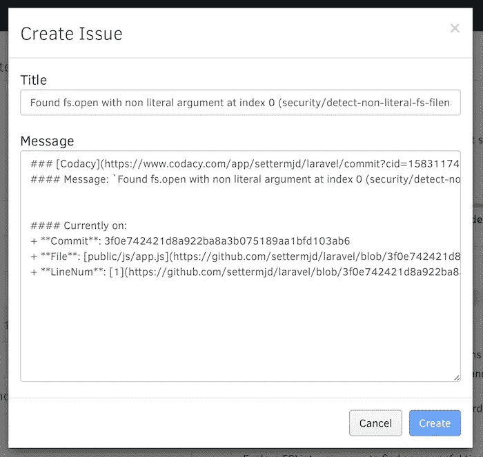

# 学习科特林的捷径

> 原文：<https://medium.com/hackernoon/how-static-code-analysis-helps-you-rapidly-fix-software-vulnerabilities-7b45498cedfb>

# 1.7 亿美元的以太坊漏洞是如何被阻止的

> 披露: [**Codacy**](https://goo.gl/s8fRSz) ，自动化代码评审平台，之前赞助过黑客 Noon。对于黑客正午的读者来说，他们的 [**使用这个代码提供 15%的折扣:HACKERNOON**](https://goo.gl/s8fRSz) **。**

近年来，出现了大量引人注目的安全漏洞。其中包括阿什利·麦迪逊、Telegram 和 BitFinex，但最重要的是 Equifax 和 Yahoo！。

这些漏洞暴露了超过 40 亿个人的记录。可以想象，随着他们的出现，安全性得到了越来越多的关注。

这是应该的。互联网以及运行于其上的服务对于现代生活的运行已经变得如此重要。当那里出现问题时，会给许多人带来灾难性的后果。

因此，作为软件开发人员，我们比以往任何时候都更加意识到，如果我们创建了一个可以通过互联网访问的应用程序，那么它就是一个潜在的目标。

也就是说，应用程序安全性并不总是容易实现的——尤其是在为那些时间和预算都很紧张的老板工作时。

但是就像测试一样，安全是我们必须承担的责任，因为我们是编写代码的人。

幸运的是，正如使用测试工具来帮助我们彻底测试我们的代码一样，有一些工具可以帮助我们找到潜在的安全漏洞。他们被称为*静态代码分析工具*。

## 什么是静态代码分析？

如果你以前没有听说过这个术语，[根据 OWASP](https://www.owasp.org/index.php/Static_Code_Analysis) ，静态代码分析:

> 通常指运行静态代码分析工具，这些工具试图通过使用诸如污点分析和数据流分析等技术来突出“静态”(非运行)源代码中可能存在的漏洞。

正如描述所表明的，这些工具不仅仅是发现安全漏洞。他们还可以扫描广泛的其他问题，包括*编码标准违反*、*未使用的代码*、*性能问题*，以及*易错代码*。

不管您使用哪种软件语言，都有许多静态分析包可供使用。除了这些软件包，还有一系列在线服务，通常能够扫描多种语言和框架。

下面是 PHP 的一个简短列表(因为它是我最熟悉的语言):

*   [OWASP WAP: Web 应用程序保护](https://www.owasp.org/index.php/OWASP_WAP-Web_Application_Protection)
*   [旁路分析器:](https://github.com/exakat/php-static-analysis-tools)静态分析，用于检测 PHP 应用程序中的旁路漏洞
*   [psecio/parse:](https://github.com/psecio/parse) 一个静态扫描工具，用于检查 PHP 代码中潜在的安全相关问题
*   [PHP-malware-finder:](https://github.com/nbs-system/php-malware-finder) 尝试使用恶意软件/web shell 中常用的 PHP 函数来检测混淆/可疑代码以及文件
*   用于安全目的的静态分析器
*   [编码](https://www.codacy.com)

有了这些库和服务，如果您认为静态代码分析是解决安全问题的灵丹妙药，那也情有可原？比如说；

1.  编写您的代码
2.  运行分析仪
3.  纠正它发现的问题
4.  你完了！

从某些方面来说，这个过程就是一剂灵丹妙药。但是它也不是没有限制的；你需要知道的限制。

其中包括:

*   **在软件扫描过程中识别误报和漏报。**在一个更大的代码库中分析代码可能会很困难。例如，如何验证对函数的所有调用，以及向这些调用传递什么参数？如何以编程方式验证一个更大的调用链中的函数？
*   难以检测难以发现的漏洞，例如访问控制错误和错误配置。应用程序的各个方面通常都是基于配置的。一个主要的例子是配置访问控制列表。如果被扫描的应用程序是以这种方式构建的，并且静态代码分析器只检查代码，它可能会报告应用程序不包含已知的漏洞，但会遗漏 ACL 错误配置。更何况，一个静态分析器怎么能完全理解 ACL 列表呢？

这只是在使用静态代码分析时要记住的两个缺点；还有其他人。也就是说，静态代码分析是一种很好的方法，可以在客户和用户遇到安全问题之前，自动识别大范围的安全问题。

虽然并不完美(但确实如此),但它对发现代码中的问题大有帮助，这些问题通常不会被一致且可预测地检测到。

## 静态代码分析还有其他好处

回到积极的方面，除了发现安全问题，静态分析工具还可以用来教育开发人员关于安全问题以及如何编写更安全的代码。

设计良好的测试不仅能发现有效的问题，还能解释为什么会发现问题。

其次，他们可以帮助团队对他们正在生产的软件的安全准备度产生信任感。它们不是万灵药，但它们仍然有助于了解质量正在提高。

第三，它们是自动化的，因为它们可以与您团队的开发工具集成。其中包括 *PhpStorm* 等 ide，以及 [Phing](https://www.phing.info) 、 [Ant](https://ant.apache.org) 、 [Make](https://www.gnu.org/software/make/) 、 [Codeship](http://codeship.com) 和 [Capistrano](http://capistranorb.com) 等开发管道。

例如，您可以将 WAP 作为运行配置[集成到 PhpStorm 中，并间歇地运行它。你也可以将它集成为 Git 提交钩子的一部分。](https://www.jetbrains.com/help/phpstorm/working-with-run-debug-configurations.html)

将它们与现有的工具和工作流程相集成将有助于确保它们得到一致的使用。众所周知，如果某个东西太难设置或使用，它很可能会被避免——即使它是世界上最好的工具！

## 有一点要记住！

到目前为止，您可能认为应该扫描的是您的应用程序代码。你不会错的。但是我们是孤立地写代码吗？我们曾经写过没有外部依赖的代码吗？

我建议，除非它是一个非常小的脚本，否则它至少会有一个依赖项，如果不是几个的话。具体来看我花了大部分时间使用的语言 PHP，我会说，通常情况下，它们至少有一个非常明显的依赖——应用程序框架。

如果你看一下 PHP 的一些顶级框架( [Laravel](https://www.cvedetails.com/product/38139/Laravel-Laravel.html?vendor_id=16542) 、 [Zend Framework](https://www.cvedetails.com/vulnerability-list/vendor_id-5025/product_id-24644/Zend-Zend-Framework.html) 和 [Symfony](https://www.cvedetails.com/product/22402/Sensiolabs-Symfony.html?vendor_id=11981) )，你会发现它们中的每一个都至少有一些漏洞，这些漏洞会导致利用漏洞。如果你用的是 Ruby，那么 [Ruby on Rails](https://www.cvedetails.com/vulnerability-list/vendor_id-12043/product_id-22568/Rubyonrails-Ruby-On-Rails.html) 呢？如果你用的是 Python，那么 [Django](https://www.cvedetails.com/product/18211/Djangoproject-Django.html?vendor_id=10199) 呢？

这并不意味着对这些框架中的任何一个进行黑客攻击。我提到它们只是为了指出，您必须全面考虑您的安全问题。确保您检查了您的外部依赖项和框架，以查看它们是否有需要修补的漏洞。

## 一个分步示例

既然我们已经对静态代码分析有了很好的介绍，并开始考虑扫描什么，那么让我们来研究如何使用静态代码分析来发现并解决代码中的安全问题。

在这个例子中，我们将使用 Codacy 来扫描[Laravel 框架代码库](https://github.com/laravel/framework)，这是 PHP 最流行的应用程序开发框架。

我们不会太深入 Codacy。我们将只讨论我们需要知道的基本内容，这样您就可以大致了解服务和扫描是如何工作的。但是，如果您想进一步探索，请随意。

## 首先:将项目导入到 Codacy 中

要让您的项目进入 Codacy，您需要做的第一件事就是导入它。如果您的 Codacy 帐户链接到 GitHub 或 Bitbucket 帐户，这是非常微不足道的。

如果是这样的话，正如你在上面的图片中看到的，滚动项目列表，选中一个或多个你想要导入的项目。

之后，项目的代码将被*评审*、*克隆*、*分析*。根据项目的大小，这可能需要一点时间。

值得一提的是，我昨天导入了一个大项目，准备时间大约为 15 分钟。然而，我从未发现导入过程通常需要超过 3-5 分钟。

## 第二:查看安全漏洞

一旦项目完成，您将被重定向到项目的仪表板，您可以在上面看到。由于 Codacy 执行大范围的静态代码分析，不仅仅是针对安全问题，您将会看到针对这些领域的项目分析。

但是，您可以在仪表板的左下方，就在“**打开拉取请求**”的上方看到一个鸟瞰式安全评分。

要查看安全漏洞，请单击左侧导航菜单中的“**安全**”。在那里，你会看到 Codacy 用来对安全问题进行分类的 15 个类别；包括 *Auth* ， *CSRF* ， *DoS* ， *SQL 注入*，以及 *XSS* 。

只有标有红叉的类别包含安全问题。

有一点要记住:默认情况下，并非所有的安全模式都是启用的。这可能是一件好事，取决于你的项目的年龄。在我使用的例子中，[是 Laravel](https://github.com/laravel/laravel) ，这不是一个问题。

正如您所料，您可以看到它的性能非常好。但是在*文件访问*、*输入验证*、*其他*和 *Regex* 中确实显示有问题。在“ **Other** 中查找，可以看到一个问题被标记在一个文件中。其他类别仅指同一文件。

*旁注；作为一个 PHP 爱好者，我很自豪没有发现 PHP 的问题。*

## 第三:看待问题

查看该问题，可以看到它突出显示了“**泛型对象注入接收器**”作为`public/js/app.js`中的问题。进一步展开，您可以看到关于为什么标记该问题以及它可能意味着什么的相当详细的描述。

这里值得注意的是，*还是*，突出显示的问题可能是误报或漏报。因此，在审查问题时，您必须具有洞察力，并确定它们是否确实是一个问题。

## 第四:解决问题

当您发现一个真正的问题，需要修复的东西，您可以从仪表板开始这样做。Codacy 在两个方面帮助你。首先，仪表板会给你一个估计的修复时间。在这个 bug 的情况下，预计修复时间不会超过 15 分钟。

其次，您可以直接从问题在 GitHub 或 Bitbucket 中创建一个问题。点击“**设置**”(**查看文件**)`->`**GitHub**`->`**创建问题**旁边的 cog 图标)弹出一个窗口，如下图所示。

该窗口包含一个默认问题标题，其中预先填充了已识别的问题，以及一条包含一些默认信息的消息，这些信息包括消息、提交哈希、文件名和行号。

然后，您可以通过将来的拉请求来解决该问题，然后重新扫描代码库以确保不再报告该问题。

## 结束

这是对静态代码分析的快速介绍，如何将它集成到您的开发工具和工作流中的一个或多个地方，以及如何使用它来识别(并跟上)您的应用程序中的安全漏洞的工作示例。

如果这是您第一次听说这个概念和工具，我强烈建议您浏览一下提供的工具列表，以及进一步阅读部分中的链接。

这样，您将逐步扩展您的知识，了解如何开发更安全、更健壮的软件。如果你想了解更多关于 Codacy 的知识，请随意[报名参加为期 14 天的试用](https://www.codacy.com/signup)，并开始分析你的申请。

> 阅读更多关于 Codacy 博客 **的文章。**