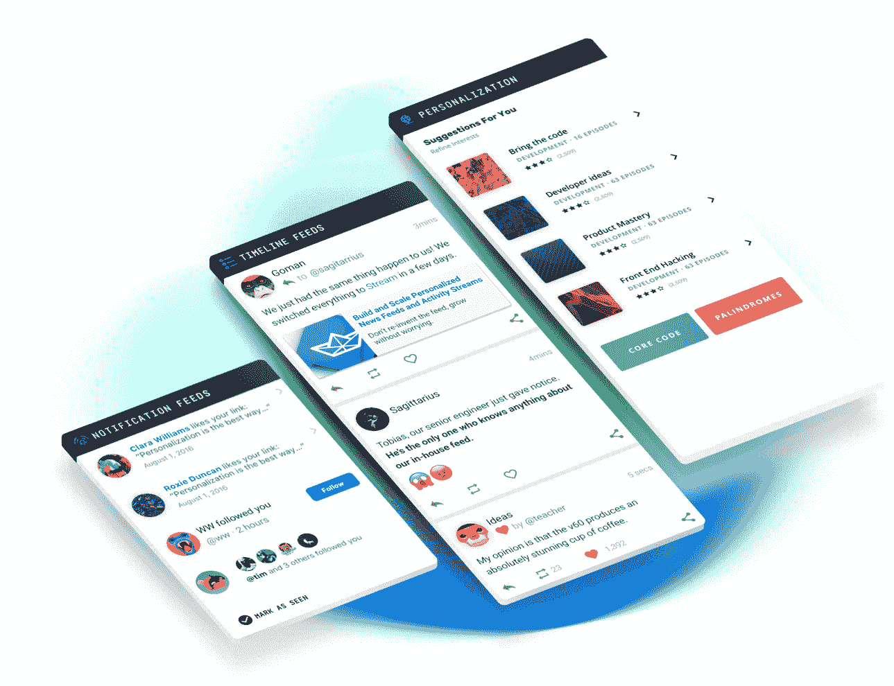

# Stream 如何开始构建新闻提要

> 原文：<https://medium.com/hackernoon/how-stream-started-building-news-feeds-bfd064ddf054>

## 创始人访谈

> 披露: [Stream](https://goo.gl/LxzcfX) ，可扩展提要的 API，之前赞助过 Hacker Noon。

*今天，我们将采访他们的首席执行官 Thierry Schellenbach，了解他的公司的起源、规模和发展方向。*

[**大卫**](https://medium.com/u/7f91547ce9c9) **:让我们从一些数字开始。你们公司的规模和牵引力如何？**

蒂埃里(Thierry):[托马索(Tommaso)](https://twitter.com/tommasobarbugli)和我大约在 3 年前开始了 Stream。开始时，只有我们两个人做所有的工程工作。不久之后，我们被纽约的 Techstars 录取了——这是我们真正腾飞的时候。截至今天，我们有 600 家公司依赖于[流](https://goo.gl/LxzcfX)。我们还为超过 3 亿最终用户提供订阅源，每月处理大约 340 亿次订阅源更新。很难相信我们在如此短的时间内取得了这种增长！

**3 亿终端用户。那太多了。在分销方面，你的大客户是否占据了大部分份额？**

是的，我们几个最大的客户拥有数亿用户。当然，并不是所有这些都是活跃的，但我们的大客户驱动了这 3 亿人中的很大一部分。

**爽。所以你真的是新闻提要方面的专家。在过去的 10-15 年里，它们真的爆炸了——从一个不存在的东西变成了给我们提供大量新闻的东西。如果可以的话，请给我一个让我们期待的新闻提要成为可能的技术里程碑，以及让你感到兴奋的新闻提要的即将到来的突破。**

众所周知，雅虎、脸书、Twitter 和 Linkedin 等公司已经在 feed 技术上投入了大量资金。早在 2010 年初，为了跟上他们的大规模增长，他们不得不突破当时的可用极限。我们中的许多人仍然记得早期脸书的停电或 Twitter 的失败鲸。

> 一个巨大的突破是 NoSQL 数据库的建立。为了扩展新闻提要，有必要拥有一个非常强大和高吞吐量的数据库。

大规模运行新闻订阅需要一个非常强大和高吞吐量的数据库。像 Cassandra、Kafka、RocksDB、Twemproxy、FlockDB、Voldemort 和 Tornado 这样的项目是由从事一些最大的新闻提要的公司创建的，并且是我们今天看到的许多主要新闻提要的组成部分。

有趣的是，只有 15%的客户开发了社交应用——这也是人们最初想到 feeds 时的想法。目前，Feeds 为各种应用程序中的内容发现提供了动力。开发者正在将 Stream 用于 B2B 应用、交通系统、教育平台、音乐、体育、电子商务等。

你认为 NoSQL 减少了加载故事和找到合适故事的时间吗？

毫无疑问，Stream 使用了 Go、RocksDB 和 Raft 的组合。

(*阅读这篇 StackShare 帖子，了解使 Stream 能够为超过 3 亿用户* [*提供信息的技术*](https://stackshare.io/stream/stream-and-go-news-feeds-for-over-300-million-end-users) *。)*

**公司插入你的 API 而不是自己构建新闻提要的常见原因是什么？**

我们看到公司与 Stream 整合的最大原因是上市时间。另一大原因是成本。试着考虑构建自己的内部 feed 解决方案以及与之相关的所有移动部件和组件——这是一个令人望而生畏的想法！例如，许多 feeds 运行在 9 个不同的服务器集群上，这些集群包括:

*   API 服务器
*   消息代理
*   自动扩展工作集群
*   数据库集群(Cassandra 是一个常见的选项)
*   实时基础设施
*   Redis 作为分发实时工作和处理锁的后端
*   分析基础设施
*   机器学习 API
*   机器学习工人基础设施

构建、记录、监控和维护是一件令人头疼的事情。

> *随着用户群的增长，即使是最简单的订阅源也会变得昂贵。通常，Stream 比托管内部解决方案要便宜得多。*

我们甚至看到已经在内部创建了一个 feed 的公司转而使用 Stream，仅仅是因为它更经济实惠。

碰巧的是，这是我们创建 Stream 的一个重要原因。我在之前的公司有过这样的经历。我们需要在内部开发 feed 技术，这很快成为我们技术堆栈中非常昂贵的一部分。这是我们看到的常见主题。

> *以 Instagram 这样的公司为例，即使在规模很小的时候，他们也在托管和维护自己的订阅源上花费了大量资金。*

[Dubsmash](https://getstream.io/blog/dubsmash-switches-to-stream-from-an-in-house-solution/) 还在我们的一个案例研究中讲述了他们的内部 vs 流体验。

**我想您之前已经谈过这个问题，但是 Stream 的哪个方面降低了托管成本，成为您的竞争优势？**

我们整个团队致力于为 600 多家公司开发饲料技术。正因为如此，我们不得不在高可用性、监控和优化上花费大量的时间和精力。成本优势的一部分来自于这种专注，以及我们将工作分散到 600 个应用上的能力。

在技术方面，成本优势来自 Stream 的 3 项功能:

*   我们使用一个名为 Keevo 的内部数据库，建立在 [RocksDB](http://rocksdb.org/) & [Raft](https://github.com/hashicorp/raft) 之上，专门针对 feeds 进行了优化(Linkedin 和 Instagram 也做类似的事情)。
*   流使用读时扇出和写时扇出的组合。
*   我们的各种服务都是由 Go 提供动力的(除了 [www.getstream.io](http://www.getstream.io) 和机器学习，它们使用 Python)。

这些是最突出的技术方面，但在过去几年中，还有数百个更小的优化。

**那么，最简单的方法是什么来展示你的 API 的强大呢？**

和许多事情一样，我相信当你是一名开发人员并且你正在尝试一个新的解决方案时，如果它易于使用，它确实会有所帮助。考虑到这一点，我们制作了一个 5 分钟的互动教程:[getstream.io/try-the-api/](https://goo.gl/LxzcfX)。它允许你在浏览器中尝试 Stream 的 API。

你能告诉我们你以前的公司 Fashiolista 吗？

我们在大约九年前创办了这家公司。有点像 Pinterest 出现之前的 Pinterest。我们经历了一段疯狂增长的时期。

**你的用户来自哪里？**

我们的用户大多来自杂志。我们有一些大型杂志和博客。有影响力的人开始推广这款应用并分享他们的个人资料，这带来了大量的流量。如果你看看流行的时尚博主，你会发现他们拥有大量的受众。这个空间相当大。我们在短短几个月内就发展到了几百万会员，这是一次令人兴奋的经历。

然而，一旦我们有了数百万的会员，一切似乎都分崩离析了。虽然我们能够很容易地修复大多数坏掉的东西，但有一件事我们一直有困难，那就是饲料。

**哪里会破，为什么会破？**

> *由于数据高度关联，订阅源的缩放尤其棘手。这不是一个线性问题，随着网络规模的增长，它会变得更加困难。*

您会注意到的第一件事是，对于一些用户来说，提要开始加载缓慢，这是一个非常常见的问题。Twitter 曾经有过他们的[失败鲸](http://www.whatisfailwhale.info/)。一开始，脸书有五秒钟的装载时间。这个问题源于所有的数据都是相互关联的。

**说到这里，我听说你还创建了一个构建 feeds 的开源解决方案。社区对此有何反应？**

大约五年前，我开始了[流框架](https://github.com/tschellenbach/stream-framework)。当时，雅虎普林斯顿有一些关于 feed 技术的好论文，但是没有开源解决方案。Stream-Framework 很快成为构建提要最广泛使用的开源解决方案。

因此，我最终与许多开发提要的开发人员进行了交谈。虽然 Stream-Framework 比从头开始构建要容易得多，但是设置、维护和构建 API 仍然是一个巨大的麻烦。部署可扩展且高度可用的解决方案的最低成本也非常高。

这是建立 Stream 的原因之一。Stream 的技术堆栈经过高度优化，易于通过 API 访问。

从一个开源项目到一家公司可能非常困难。那么，你对那些试图做同样事情的人有什么建议呢？当我说困难时，我指的是从逻辑上做这件事的想法。

我的建议是关注行业趋势，给人们他们想要的东西。我们注意到的最相关和最有趣的趋势是，开发者开始利用 API 来做他们的应用程序以外的事情。公司开始提供应用程序的特定组件作为服务。想想电子邮件的 Sendgrid，搜索的 Algolia，短信的 Twilio，支付的 Stripe，地图的 Mapbox。这个清单还在继续。streaming 是为应用程序添加提要乐高积木。

我个人认为这是开发者开公司的大好时机。如果你在某个领域有深厚的专业知识，你可以利用它来建立一家公司。当然很难，但是可能性越来越大。

**为您的客户提供支持。您处在一个有趣的位置，因为您看到不同行业和不同用例的新闻提要活动。我对你的客户的新闻反馈的迭代很好奇。那么，你是如何看到他们从 Stream 所做的学习和发展到他们希望 Stream 如何为他们的客户提供更好的体验，以及这种反馈回路是如何工作的？你认为这有什么用？**

最近我经常看到的一个特性是[聚合](https://getstream.io/blog/aggregated-feeds-demystified/)。例如，假设你的一个朋友打开了一个应用程序并添加了 100 个项目，应用程序开发人员/设计人员将根据对他们的平台有意义的内容来汇总这些更新。聚合对于减少提要中的噪声非常有帮助。

我看到越来越多的应用程序正在做的另一件事是“当你不在的时候”类型的体验。以脸书和推特为例。虽然这些平台中有一些用户每天都会回来，但大多数使用 feeds 的应用程序的用户每周甚至每月都会回来一次。

**你最好赢得那一刻，当他们带着好的内容回来的时候。**

没错。我们不仅看到应用程序创建聚合提要，还看到除了基本的按时间顺序排列的提要版本之外，应用程序还使用个性化。通过这种方式，用户在返回应用程序时可以获得量身定制的相关内容。虽然这些是我们看到的主要东西，当然实时仍然是它的一大部分。许多开发人员会确保他们的提要实时更新。几年前，这曾经是一个非常时髦的话题。如今这是理所当然的——用户希望在你看着他们的时候事情会更新。

**那么，未来五年或十年，Stream 会是什么样子？我的意思是，长期愿景是什么？**

我认为提要最有趣的部分是它们是我们发现在线内容的主要方式。无论你在 Instagram、Feedly 或 [Winds](https://getstream.io/winds/) 上的粉丝，在 Quora 上的话题，在 Spotify 上的音乐，在 Youtube 上的创作者，还是在金融应用中的股票，底层技术都是基于 feeds 的。由于技术相对年轻，现在的应用程序仍在与提要作斗争。看到 Stream 如何帮助这些应用程序改进内容发现令人兴奋。

**在入职体验中，您如何确保展示“心流”的力量并让员工快速通过？我想这本身就是一个有趣的项目。**

作为开发人员，我们已经研究和测试了许多产品，所以我们从经验中知道什么是真正有效的，什么是无效的。一旦我们创建了一个我们认为功能强大的版本'[Try API](https://goo.gl/LxzcfX)'，我们就请我们的开发人员朋友来浏览教程，而我们就坐在他们旁边。这种定性反馈非常有助于使 Stream 易于使用。