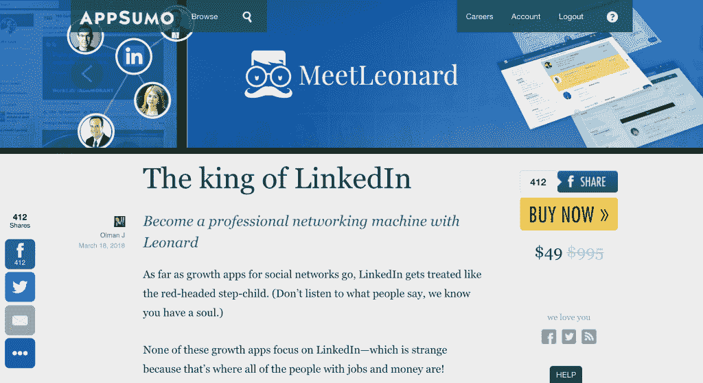
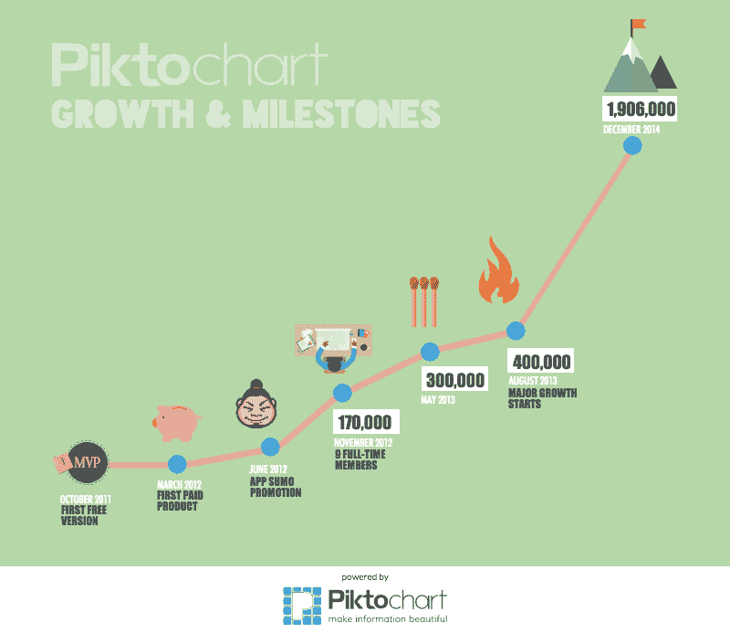
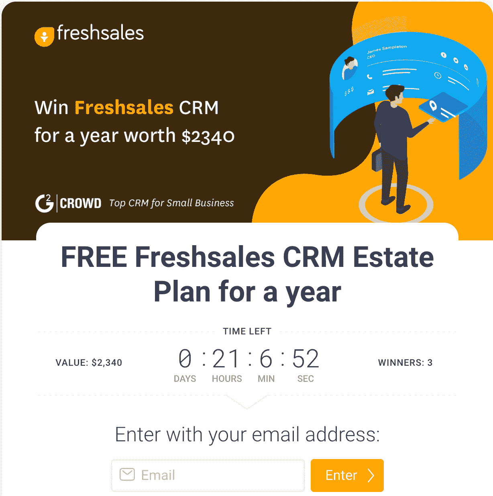
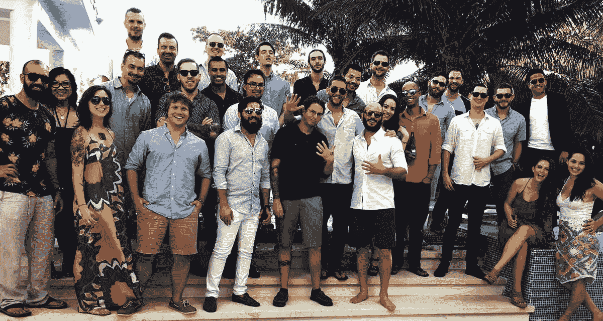
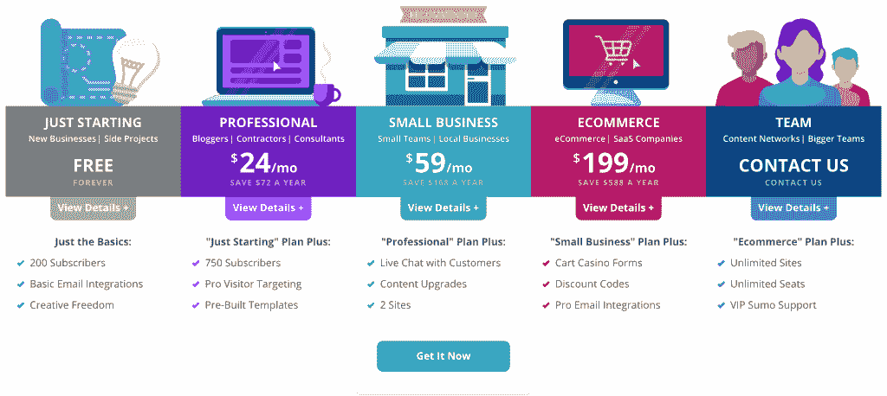

# 相扑如何凭借精干的销售团队成长为 8 位数的业务

> 原文：<https://medium.com/hackernoon/how-sumo-grew-to-an-8-figure-business-with-a-lean-sales-team-fb75662b69f3>

## 相扑销售的秘方

虽然没有销售成功的灵丹妙药，但有一些屡试不爽的销售策略，所以你不必重新发明轮子。 ***销售秘笈***[***fresh Sales***](https://www.freshworks.com/freshsales-crm/?utm_source=Blog&utm_medium=Secret%20Sauce)*介绍各行各业的顶级销售领袖，让你深入了解他们的销售方法*。

安东·塞佩托夫是 Sumo.com 的销售副总裁。相扑提供战略和工具，帮助电子商务公司获得更多的客户。像哈克贝里、T21、托尼·罗宾斯和防弹咖啡这样的公司都使用相扑。相扑的姐妹企业[AppSumo.com](https://medium.com/u/9d17b16d2fa8?source=post_page-----fb75662b69f3--------------------------------)，是一个提供数字分销商品和在线服务的日常交易网站，拥有超过 70 万活跃用户。

安东六年前在 AppSumo 开始了他的职业生涯，从一名初级销售代表到现在领导整个 Sumo.com 销售团队。安东负责 AppSumo 的收入增长，包括开展促销活动、收购交易等。2015 年，AppSumo 推出了[Sumo.com](http://sumo.com/)，从那时起，他就以不同的身份参与相扑。

## 在加入相扑之前，你在之前的公司从事营销工作。在 Noah Kagan 的“OkDork”播客中，你提到你不确定是否会转向销售。从市场营销到销售的转变如何？

我之所以跳过去，是因为我坚信 AppSumo 所做的事情，就是帮助创业者和小企业获取新客户。这对我非常重要。作为一名企业家，我想尽我所能提供帮助。我发现 AppSumo 的销售更多的是与公司合作，而不是“销售”本身。

这是关于与 Dropbox、Evernote、Freshsales 等优秀的软件公司合作。向企业家受众推广，这对每个参与者来说都是双赢的。我看到这是一个令人满足和兴奋的角色，所以我想尽我所能提供帮助。

## 还有你不确定销售的那部分。

当很多人想到销售时，他们会想到电话推销——与那些可能当面拒绝你的人交谈。这种事经常发生，不可否认。

你可能没有意识到的是，每个人在生活中都会做一点点销售。当你申请大学入学或找工作时，你在卖东西:你自己。因此，我脱离了销售的负面条款，并意识到我实际上会做的是为公司带来收入。这就是商业发展的现实方式。

## 你什么时候意识到自己真的是一名推销员？你有没有“啊哈！”安东，你销售生涯中最重要的时刻是什么？

看到由我完成的“销售”直接导致的结果一直是我销售的驱动因素。对大多数销售人员来说都是如此。见证你所做的工作在金钱/结果/快乐方面的直接影响是“啊哈！”销售时刻。

事实上，我想到了一个故事。2011 年， [Piktochart](https://piktochart.com/) 成立，这是一家基于网络的信息图表应用公司。我自己也用过这个工具，并且非常喜欢它。我们想把它推广给 AppSumo 的观众，让更多的人可以使用它，我们联系了 Piktochart 团队。

他们当时是一个小团队，正在寻找发展业务的方法。我们主动联系他们，提出在 AppSumo 上向 70 万名创业者推广他们的产品。发生了什么事？Piktochart 赢得了数千名新客户，甚至将 AppSumo 交易称为 Piktochart 历史上最大的交易撮合者。

这次推广是一次绝对的双赢，我们的观众和 Piktochart 都对活动感到满意。这不是 B2B 这是人与人之间的交流。我接近 Piktochart 是因为我喜欢并尊重他们，我想和他们一起工作。我们建立了良好的关系，然后我们能够将这种关系转化为对他们、对我们、对我们的客户的双赢。

## 太棒了。Piktochart 看到的那种价值可能不是你第一次接近他们时他们会想到的。

## 有时，在讨论开始时很难展示价格的价值。你对销售人员的建议是，如何根据价值而不是价格进行销售？

你需要能够向客户展示你将推动他们的切实成果。这是我们在相扑比赛中最有意义的领悟。例如，电子商务公司通过促销电子邮件营销赚了一大笔钱，并且依赖于增加他们的电子邮件列表。我们相扑知道，我们可以为他们的业务创造真正的价值，因为我们可以帮助他们建立电子邮件列表，并获得更多的客户。

我们走近电子商务公司，了解他们目前如何从现有流量中获取新客户。然后，我们向他们展示 1-2 个他们正在失去客户的地方，以及他们需要实施来解决这个问题的确切策略和工具。对于一家成长中的电子商务公司来说，每一个新客户都很重要。我和我的团队日复一日地工作，以确保我们在每一个电话中都这样做。你需要向每个客户展示你能提供的投资回报。

我们向他们展示，他们每个月都会损失 10，000 美元的新客户。相扑的费用是多少？只有一小部分。当客户看到这种类型的 ROI 时，他们并不关心定价。这是基于价值的销售。这是关于展示你能为他们的业务提供的价值，当这种价值可以量化时，销售就容易多了。它可以是任何东西——将员工生产率提高 50%,每月增加 X 美元的销售额，等等。这种类型的价值应该让他们启动和运行。

## 早些时候，销售团队习惯于在销售人员中寻找进取心这一基本特征。

## 但是我觉得现在移情是销售人员的重要特征。相扑专业销售人员的同理心有多重要？

同理心非常重要，因为你要站在和你说话的人的角度考虑问题。这就是我喜欢“销售”的原因。这与销售的输赢无关。如果你了解到你卖给客户的东西对他们的业务来说并不重要，也不会产生重大影响，你应该接受它们并不适合你。

我认为同情是必不可少的，因为你想确保你在帮助他们。也许在过去，销售人员只是想变得有说服力；我认为再也不会是这样了。而是要确保双方都很合适。

## Anton，除此之外，你希望销售代表具备哪些技能才能加入你的团队？

对我来说，到目前为止，我寻找的最重要的特质是“协同能力”我们有与客户合作的特定方式。我们是咨询型的，我们有同理心，但是可咨询性对我来说非常重要。如果我的队友是可训练的，他们能够适应，他们可以成为最好的客户经理/SDR 等。在世界上。我寻找能很好地接受反馈的人。人总是有自己做事的方式。但是，如果你是可训练的，并适应不断变化的世界和我们与客户交谈的方式，那么你就可以永远是一个顶级的表演者。

我寻找的第二个词是“hustle”，我知道这个词现在被过度使用和滥用了。但是当我说我寻找忙碌时，我并不是说我只是想让他们长时间工作，拼命工作。我在人们身上寻找的“干劲”是那些总是努力做得更好的人的特质。这些人总是想学习，总是想进步，总是想在他们所做的事情上做到最好。

第三个是‘我喜欢和他们聊天吗？’。我寻找那种能在电话里让我微笑的人。友好的交谈有助于你与人交流。一些销售代表在使用脚本时会变成机器人，我不太喜欢这样。每个人都是不同的，所以每次谈话也应该不同。

Sumo Team

## 安东，我们喜欢你和诺亚保持相扑公司文化的方式，一部分是愚蠢的，一部分是有趣的。

## 你如何确保销售团队和新员工采用这种方式？你如何保留这种文化？

我们相扑的核心价值观之一是“努力工作，一起娱乐”，这种文化对我们至关重要。我如何确保我们遵循这种文化是通过向相扑的每个人灌输这种哲学。

某些人以非常严肃和专业的态度对待他们的工作场所，这对于某些行业来说非常好。但对我们来说，我们与企业家和小企业一起工作，激情和勇气是极其重要的。我希望我的团队成员也能如此。

如果他们喜欢自己的工作，那么他们会玩得很开心。我总是告诉我的团队，我希望他们有自己的个性。我们团队的每个人都有独特的个性。我希望他们做自己。例如，一个对某些人来说很傻的笑话对说它的人来说可能很好笑。通过鼓励他们做自己，我们允许他们的个性发光。

我听了很多电话，我能感觉到销售人员压力很大，他们正在努力完成销售。对我来说，更重要的是放松和享受谈话，而不用担心电话的结果，即使你碰巧没有达成那笔交易。

我向你保证，在顾客面前做你自己会有所收获。要么你签协议，要么他们会把你介绍给其他有需要的人。或者，谁知道呢，你可能最终和他们成为最好的朋友，甚至和他们结婚！所以，找乐子是必不可少的。

## 我们在 [Freshworks](https://www.freshworks.com/) 用相扑，我不记得和相扑的售货员说过话。那么，相扑的销售流程是怎样的？

相扑有一个免费计划，所以我们有很多客户注册了免费的永久计划。我们使用各种技术来丰富这些客户的数据，包括 Clearbit、SimilarWeb、SEMRush 和其他工具。在接触这些联系人之前，我们会根据我们的资格标准筛选出理想的目标。

我们的 ICP(理想客户档案)我们的目标是一个具有一定规模和员工人数的电子商务公司。我们有一个 VAs(虚拟助理)和 [SDRs](https://www.freshworks.com/freshsales-crm/sdr-sales-development-reps/?utm_source=blogs) 团队，他们会仔细检查注册名单，并相应地对每个联系人进行资格审查。

然后，我们和他们见面或打电话。我们打电话或开会的目的绝不是向客户推销，而是帮助优化和发展他们的电子商务业务。我们的客户经理帮助他们与 Sumo 建立联系，并帮助他们解决导致客户流失的问题。之后，我们的成功团队负责持续开发和培养他们，以确保他们对产品满意。

我们的对外销售流程也非常相似。我们的增值服务和特别提款权团队审查来自 Shopify 和其他渠道的客户名单，并确定潜在客户。然后，该团队联系他们，让他们打电话，并帮助他们进行设置。

## 在相扑运动中，帮助你发展业务的是什么？有什么原则或秘密可以分享吗？

我们以前做的事情之一是试图向太多人出售我们的服务——这对我们来说收效甚微。“小众”和“大众”之间的竞争很难，但随着时间的推移，我们已经变得越来越好。现在我们只针对电子商务公司。

过去，我们试图向媒体出版物推销相扑。我们接触了纽约的大型媒体公司，甚至关闭了一些客户。问题？他们几乎没有从相扑中得到任何实际的结果/价值。那时我们决定加倍投资电子商务公司，因为他们看到了使用相扑的荒谬投资回报率。我们认识到关注核心客户很重要，不要忘乎所以地试图向每个市场销售。

另一件对我们很有效的事情是确定我们的目标市场。成千上万的电子商务公司使用 [Shopify](https://www.shopify.com/) 来运营他们的电子商务商店，所以我们集中精力寻找使用 Shopify 的公司。让顾客感受到我们的存在是第二件对我们很有效的事情。

## 你每天关注的三个指标是什么？

1.  每月经常性收入(MRR)
2.  通话跟踪——我的 [SDR](https://www.freshworks.com/freshsales-crm/sdr-sales-development-reps/?utm_source=blogs) 团队建立的通话数量。因为如果你没有建立通话，我们就不会达成交易。因此，我会查看本月我们建立了多少个电话，以及它们是否在正轨上。
3.  我们有多少合格的销售线索？营销推动了多少销售线索？

## 你经常听到的典型销售异议是什么，你会如何处理？

最常见的销售异议是“我需要考虑一下”或“我需要和我的团队谈谈这个问题。”我总是听到他们。这些回应会导致在第一次电话之后建立许多后续电话。当有人说他们需要考虑使用你的服务时，这里面有一个隐藏的反对意见，你需要去了解。

问问你自己——“为什么他们需要考虑这个问题？”或者“为什么他们需要和他们的团队讨论这个问题？”。我和我的团队学会处理这种情况的最好方法之一是诚实和坦率，这样我们就不会浪费他们和我们的时间。我们说“看，让我们不要浪费我们的每一个时间。我能感觉到有些事让你犹豫了。什么事？”。我们努力发现真正的异议，然后我们可以处理。

避免误解销售中隐藏的异议的最佳方式是与客户一起解决。这会节省你很多时间。

## 当今销售中有哪一种被误导的做法？

最大的误导实践是销售演示的概念，或将与潜在客户的对话称为“销售演示”。不是演示，是对话。与潜在客户的对话不应该是推销你的产品或服务，也不应该是逐个功能地演示你的产品。这可能适用于/可能不适用于所有企业。对我们来说，这是关于在我们客户的网站上找出 2-3 个他们可以通过使用你的产品来改进的地方，这将使他们专注于他们的业务增长。

> 不是演示，是对话。

## 你认为销售行业更需要什么？

回到我之前说的，销售行业，总的来说，应该有更多有趣的，真实的对话。如果你与客户进行有趣且富有成效的对话，将会建立更多的关系而不是交易。而且，我们都应该与客户建立牢固的关系。

## 安东，你最喜欢的提高效率的方法是什么？

这听起来很容易，但是请:有一个待办事项清单。

我用[来表示](https://en.todoist.com/)。过去，我使用 Moleskine 笔记本，但现在我已经开始在线管理它。每天早上我都会坐下来，列出一天要做的事情。在一天结束的时候，我确保每一件事情都被检查过了。

## 你桌子上的三样东西？

一个相扑品牌的水瓶。我喝了很多水，你也应该喝！

我未婚夫写给我的一张便条，是我们在相扑比赛中打进最难的一球时写给我的。它激励我去做我正在做的事情。

一台配有[缩放](https://medium.com/u/c4c2efc9bc0a?source=post_page-----fb75662b69f3--------------------------------)会议室的电脑，由我们在奥斯丁的团队提供。所以，我可以一直看到他们，和他们说话。

## 你推荐的销售读物有哪些？

[“从不可能到必然:超高速增长的公司如何创造可预测的收入”](http://fromimpossible.com/)作者[亚伦·罗斯](https://medium.com/u/6838d7a1cdc?source=post_page-----fb75662b69f3--------------------------------)和[杰森·m·莱姆金](https://medium.com/u/e67120d2dec7?source=post_page-----fb75662b69f3--------------------------------)。我刚让我的整个团队都读过这本书。每一家 SaaS 公司都应该读的神奇的书。

 [## PandaDoc 如何在两年内从 100 万美元增长到 1000 万美元

### 潘达多克销售的秘方

hackernoon.com](https://hackernoon.com/pandadoc-growth-10-million-1d5f82e4c26f) 

— — — — — — — —

[*Freshsales*](https://www.freshworks.com/freshsales-crm/?utm_source=Blog&utm_medium=Secret%20Sauce) *是一款专为帮助你停止杂耍多种工具而打造的销售 CRM。非常适合小型企业，让企业耳目一新。*

*虽然没有销售成功的灵丹妙药，但有一些屡试不爽的销售策略，所以你不必重新发明轮子。****fresh Sales 销售秘笈*** *介绍各行各业的顶级销售领袖，让您深入了解他们的销售方法。请在评论中给我们留言，或者发邮件给 nivas.ravichandran@freshworks.com，提出你的建议。*

对我在这个博客上的合著者[贾娜妮·德瓦拉卡纳思](https://medium.com/u/e4a2ef3257ff?source=post_page-----fb75662b69f3--------------------------------)和[丽贝卡·理查德](https://medium.com/u/514b26d2e749?source=post_page-----fb75662b69f3--------------------------------)大声喊出来！