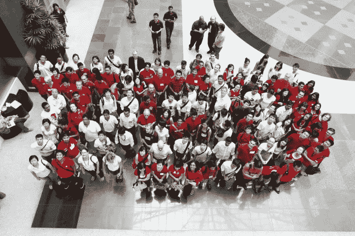
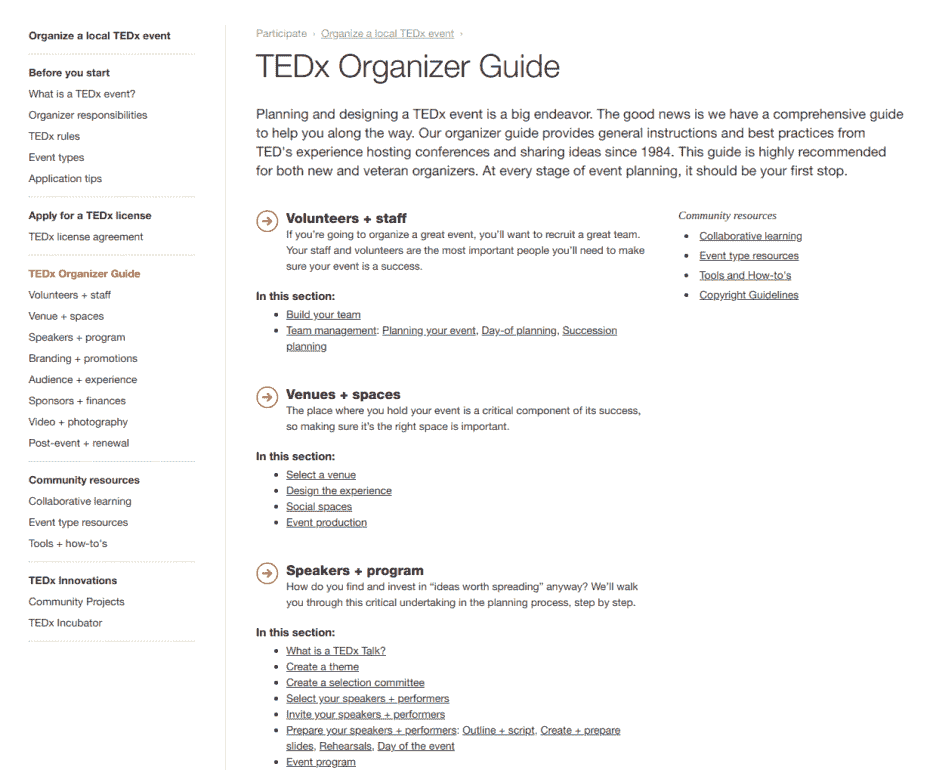

# Ted 演讲是如何在九年内从一个单一事件发展到 2600 多个年度事件的

> 原文：<https://medium.com/hackernoon/how-ted-talks-went-from-a-single-event-to-2600-yearly-events-in-nine-years-ce00b023bde0>

无论你是 TED 演讲的粉丝，还是觉得它们有点精英化——2012 年，数千人观看了超过 10 亿次的演讲，116 种语言的演讲和 179 个国家的当地活动——你都不能否认，它们实际上传播了许多挑战现状的鼓舞人心的想法。

这就是为什么今天我要向你们展示 TED Talks 从一个迎合几千人的封闭会议成长为一个媒体巨头的步骤和策略，当他们决定免费分享其内容和品牌时，他们的成功达到了另一个水平。

拿起茶、咖啡或任何你最近喜欢的饮料，准备好打开你的心扉，迎接一个不太可能的轨迹。TED 是一个不可思议的例子，它展示了如何培育不止一个，而是多个社区来扩大你的组织，让你的努力和影响成倍增长。

# 第 0 步:第一次有希望的尝试，但是太快不能奏效

TED 的故事开始于 1984 年，比万维网早五年。它始于建筑师和反传统者理查德·索尔·沃尔曼在加利福尼亚州蒙特雷组织的一次会议。

沃曼看到技术、娱乐和设计领域开始以有趣的方式融合在一起。因此，他去寻找硅谷、好莱坞和学术界最优秀、最聪明的人，他们能够说明这种融合。

为此，他组织了第一次只有受邀者才能参加的 TED 会议，有 1000 人可以支付 4000 美元(或更高)观看 18 分钟的演示，包括索尼的[光盘](https://blog.ted.com/happy-30th-birthday-compact-disc-watch-a-demo-from-the-first-ted-in-1984/)、T2 的电子书、卢卡斯影业的尖端 3D 图形，以及数学家伯努瓦·曼德尔布罗演示如何使用他不断发展的分形几何理论绘制海岸线的演示。

尽管阵容强大，这项活动还是赔钱了。所以 TED 关闭了它的大门，直到 6 年后 Wurman 决定再试一次。

尽管遇到了这一挫折，他们还是验证了一种没有讲台的 18 分钟会议的新形式，这让他们的观众兴奋不已。这足以让我们相信泰德正在做一些事情。

以下是 Wurman 从第一次活动中学到的一些[经验:](https://www.fastcompany.com/3059830/the-founder-of-ted-shares-what-it-takes-to-build-the-world)

*   TED 的第一步是验证一种新的会议活动方式。这是三个创新:一个新的 18 分钟形式，没有讲台，一组精心策划的演讲者和精心策划的观众。
*   如果你在一个创新领域，**寻找、策划和聚集那些正在悄悄酝酿发展新产业的地下项目。**
*   记住:**你的事件或项目不一定要大到产生影响**。无论你让 25 人还是 1000 人参加你的活动或使用你的产品，在更大的范围内，相对于地球上的 70 亿人来说，这仍然是沧海一粟。
*   但是也要记住:**一个小小的会议，仍然可以产生深远的影响。要让小团体变得重要，找到并策划你想参加的合适的小团体。**过滤掉那些告诉其他人的人，这足以让它成为病毒。因此，不仅要管理演讲者，还要管理公众。
*   要有耐心，但要坚持不懈。你可能来得太早了。这个世界，或者你，可能还没有准备好接受你的想法。因此，等待一段时间，让你的想法更容易理解，或者继续磨练你的技能和网络，直到你能够实现你心中的想法。

# 第一步:第二次尝试，一个小但有影响力的事件

六年后，沃曼和他的商业伙伴拿出了同样的配方，让会议复活了。策划发言人。策划观众。和 18 分钟的会议形式，这是人类注意力的极限。

这一次，世界准备好了，它起飞了。

TED 大会变成了一年一度的盛会，只有受邀者才能参加。10 年来，它扩大了其有影响力的受众和学科数量，包括科学家、哲学家、音乐家、商业和宗教领袖、慈善家等。

像以前一样，他们继续在创新的思想家、研究者和活动家中挑选他们的特色演讲者。但是他们第一次活动的真正提升来自于指导他们的演讲者。

聪明的头脑并不总是最好的演说家。但是在 TED，他们开发了一个内部指南，把那些有着复杂主题的大书呆子变成勇敢和令人信服的故事讲述者。为了做到这一点，他们发展和磨练了一个长达数月的过程来编写、编辑、重写和排练他们的故事。

对于一个机器人或监狱改革等小众领域的专家来说，给成千上万的与会者做一个通俗易懂、引人入胜的演讲已经非常困难了。这就是为什么 TED 制定了一套统一的流程来指导他们的演讲者，并以 99%的把握来讲述一个引人入胜、引人入胜的故事。正如我们将在后面看到的，这一步在 6 年后打开 TEDx 格式时是必不可少的。

所以请记住，有些事情需要几年的时间来成熟，然后才能准备就绪。从 1990 年到 2001 年，TED 花了 11 年的时间来发展它最初的概念:寻找和发展它的有伟大思想的伟大头脑的网络，并邀请有影响力的网络的观众来保持它的声誉和收入的增长。

外卖:

*   **在你的行业中寻找有伟大想法和创新的人**来帮助你创造出令人惊叹的产品，并用已经在你身上奏效的流程来指导他们。
*   **在一个巨大且有影响力的网络中寻找对这些想法感兴趣的观众**。他们将能够产生深远的影响，传播你的想法和你希望被听到的合作伙伴的想法。

# 第二步:在成长之前保持稳定，并对您的过程进行压力测试

2000 年，沃曼会见了媒体企业家克里斯·安德森，讨论会议的未来。由于厌倦了主持会议，沃曼在 2001 年将 TED 的版权卖给了安德森的树苗基金会，安德森成为了 TED 的策展人。

从那时起，安德森将 TED 变成了一个非营利组织，并不断扩大活动范围，以涵盖所有主题，并找到新的方式与蒙特雷市以外的更广阔的世界分享内容。

因此，从 2001 年到 2005 年，TED 在其已经成功且盈利的形式上增加了两项主要内容:

1.  一个新的会议， [TEDGlobal](https://www.ted.com/about/conferences#h3--tedglobal) ，在世界各地举行
2.  TED 奖，每年 100 万美元的资助，用于支持一个特别鼓舞人心的 TED 演讲者的努力

组织更多的活动是一个极好的机会来测试他们花了 10 年时间在蒙特雷活动中完善的程序，以推广到其他地方。

开始时，一个领导者和一个小团队可以控制一项活动的方方面面。但是一旦你开始传播到其他地方，你就不再能简单地控制那里发生的事情。因此，为了“取代”他们的专业知识和能力，TED 团队为组织活动的每一步记录并创建了清单。比如寻找场地、赞助商、演讲者，以及指导他们讲述一个令人信服的故事。

这个文档步骤可能看起来很乏味，但是对任何项目的内部扩展都是至关重要的，就像许多开源项目一样。每个想要扩展的人的真正原因是文档让你不再成为其他人运行事物的瓶颈。

想一想这个问题。任何项目的第一步都是开发一个可行的原型。但是如果你想扩大规模，你就必须记录下来，这样你就不是唯一一个能做到的人了。一旦你有了允许其他人得到和你一样的结果的文档，那么你就准备好扩展了，因为你可以在船上得到有效的帮助。

听起来很无聊或者需要做很多工作？不是的。

在 TED 的案例中，一旦他们获得了文件，就很容易开放更多的场地，允许他们向越来越多的观众展示更多的创新者，将活动的声誉提高到新的高度。

这有助于增加非盈利收入，然后再投资于 100 万美元的 ted 奖金。这一奖项吸引了更多有创新精神的演讲者，他们能够以独特的视角讲述故事，并进一步提高了活动的声望。

所以这一切都归结为:记录最初的 TED 团队做了什么，这样其他人就可以复制它，引导他们在更多的地方发表更多的演讲。更多的场馆等于更多的眼球。更多高质量的演讲者和经过实地测试的辅导流程意味着更多高质量的内容，这些内容会吸引更多的人，产生更多的口碑，强化已经很强的良性循环。

外卖:

*   **一旦你找到了让他们的想法得以传播的成功秘诀，开发、记录并不断完善这一过程，以指导他人实现你一直在获得的惊人结果**。这将使你有能力在内部扩展，然后通过授权外部社区来扩大你的努力。
*   **一旦你完成了文档，你就可以开始寻找更多的发行版**。在 TED 的案例中，这意味着追求更多的场所、演讲者、观众，甚至更多地巩固他们的声誉和收入。
*   一旦你有足够的现金支付，**提供奖励来资助和支持你认为重要的项目**，为你的项目吸引更多的创新者和声望。

# 第三步:从每个座位 4000 美元，到所有内容免费

在成功传播到新的城市后，他们仍然希望将他们的会议想法展示给更广泛的公众。但是他们怎么能做到呢？

他们试图让特德上电视，但失败了。BBC 告诉他们这太理智了。

所以他们没有坚持让 TED 出现在电视上，而是考虑把它放到互联网上。

2006 年，随着在线视频的到来，在 Youtube 上线一年后，他们开始了 ted 演讲，作为一个实验性的视频播客。通过这样做，他们发现观看他们的人真的很喜欢他们，这些视频开始像病毒一样传播，将一个曾经排外的会议变成了一个病毒般的全球现象。

前六次 TED 演讲的浏览量达到了 100 万次，事实证明这非常受欢迎，以至于 TED 的网站围绕这些演讲重新推出，让全球观众能够接触到一些世界上最伟大的思想家、领袖和教师，而这些人以前只能通过他们 4000 美元的邀请活动才能获得。

正如克里斯·安德森所说:“这确实感觉很冒险。人们花了很多钱来 TED，所以免费赠送……但是在 2005 年的 TED 上，像克莱·舍基这样的人发表了关于网络促进合作的能力的演讲，所以我们有点像是喝了自己的饮料。”

到 2009 年，在安德森和他的团队克服了免费提供内容的恐惧后不久，TED Talk 的浏览量增长到了 1 亿次，让吉尔·博尔特·泰勒和肯·罗宾逊爵士这样的无名演讲者成为了互联网英雄。

让他们的内容免费完全改变了他们的业务，让他们从一个活动组织者变成了一个媒体平台。在这一点上，正如我们所看到的，他们真的很擅长组织活动，吸引观众和指导有趣的演讲者，所以进入这样一个不同的球赛肯定感觉很危险。

现在，即使他们保留会议，他们也必须投资建立一个新网站，唯一的目的是免费发布所有的演讲，并与赞助商建立关系，为媒体平台创造新的收入。但这是 TED 真正爆发的地方，是什么让你发现了他们的会议。下面我会带你看一下。

但首先让我们回顾一些要点:

*   开发你的产品，一旦吸引了付费观众，就免费发布。如果有人愿意为它付费，将会有更多的人愿意免费获得它，你将会更容易获得大量的观众。
*   免费发布你的产品将迫使你从根本上**重新审视你的商业模式**。你仍然需要提供付费产品或服务来支撑公司的运营成本。
*   但是**现在有了更多的观众来帮助你赚钱。** TED 的免费内容吸引了数以百万计的观看次数，让他们拥有吸引大品牌赞助商的受众，也让越来越多的付费客户参加他们的会议，以及演讲者和志愿翻译。

# 步骤 4: TEDx:开源 TED 方法

在免费发布他们的内容后，TED 的人们变得痴迷于彻底的开放和免费赠送一切。几年后，这导致他们也将 TED 品牌本身以 TEDx 会议的形式赠送给独立组织者。

在步骤 2 中，我们看到 TED 改进了其流程和模板，以适应新的场所。但是这个[事件指南](https://www.ted.com/participate/organize-a-local-tedx-event/tedx-organizer-guide)在组织之外也是有用的。所以在 2009 年，TEDx 的联合创始人 Lara Stein 继续将它正式化，然后[向全世界发布](https://www.ted.com/participate/organize-a-local-tedx-event/tedx-organizer-guide)，看他们能否成功组织一次活动。

本指南包括超级战略信息。比如

*   如何寻找和组织志愿者
*   如何找到场地
*   如何寻找和准备演讲者
*   如何开发和计划一个项目
*   如何推广您的活动
*   如何吸引观众和赞助商
*   诸如此类…

这就好像麦当劳或可口可乐分享他们的食谱给任何人看。

但是通过 TEDx 赠送品牌并没有削弱他们。这让更多的人想去参加会议，更多的人想看视频。

这怎么可能呢？
这就是开源的魔力，如果你想获取，你必须回报，为每个人创造真正的双赢关系。

当 TED 给出他们的[活动组织者指南](https://www.ted.com/participate/organize-a-local-tedx-event/tedx-organizer-guide)及其品牌时，独立组织者可以重复使用该指南，无条件赚钱。

但是，如果他们想重复使用 TEDx 品牌及其所带来的吸引力，他们不仅必须尊重自己的品牌规则，还必须归还在 Creative Commons 活动中制作的内容。

通过这种方式，TED 也有权分享其他人在其平台上制作的内容，允许他们以更快的速度制作活动和高质量的内容。

TEDx 的开放格式给 TED 带来了两个不可思议的好处。首先，获得更多高质量的内容增加了观众和他们可以获得的赞助交易。第二，让世界上任何一个人都能够启动 TEDx，已经让他们从一年一次活动增加到一年 2600 次活动。比他们想象的更快更远地传播他们的信息和使命。

令人吃惊，不是吗？

一些要点:

*   **列出你拥有的所有能力和技能**。TED 在组织活动和指导研究人员成为演讲者方面有很多经验。一旦你知道你拥有什么并记录下来，你就可以把它公布于世，这样它会让你加倍努力。
*   **即使你的公司目前处于关闭状态，也可以一点一点地打开**。有些项目在你的组织内部没有什么价值，比如主要是成本的过程或内部工具。但是一旦你打开它们，你可以分担维护它们的负担，或者用它们来吸引大量的注意力和观众，帮助你建立你的使命，更快地改变周围的文化。

# 第五步:奖励你的社区，促进他们的工作，并给其他人工具来建立你的想法

大约在他们推出 TEDx 的同时，TED 开始了翻译计划，为 TED 演讲创建了翻译成 100 多种语言的基础设施。

世界各地热情的观众开始询问他们是否可以翻译演讲，以便与朋友和家人分享。2009 年，200 名志愿者翻译了 40 种语言的 300 份译文。2018 年，超过 30，000 名志愿者已经发布了超过 126，000 种 116 种语言的翻译(还在统计中)。

所以这只是从人们提供帮助开始的。但是通过给他们整合志愿者翻译的工具，TED 可以让观看 TED 演讲的人数成倍增加。

这些翻译者让 TED 接触到了世界各地的观众，但也让世界各地的观众接触到了翻译者关心的独家 TED 演讲想法。所以大家都赢了。

我们可以将活动组织者和演讲者视为社区中自愿做出贡献的其他成员，因为他们没有报酬，也不允许直接推广他们的产品。

那么他们为什么这么做，TED 是如何奖励他们的呢？

活动组织者获得久经考验的流程来组织活动，并获得一个品牌，作为寻找赞助商和吸引演讲者的重要社会证明和影响力。这也有助于组织者从 TED 的光环效应中受益，并创建志同道合的创新者和“世界改变者”的本地网络。

对于演讲者来说，即使他们不能从演讲中获得报酬，也不能推销他们的产品或书籍，但这些活动通常都是财力雄厚的投资者、慈善家和企业家，他们希望资助或支持鼓舞人心的想法。

监狱改革活动家布莱恩·史蒂文森(Bryan Stevenson)在 2012 年被说服发表演讲之前，从未听说过 TED。在舞台上的 18 分钟，包括与民权女英雄罗莎·帕克斯互动的感人个人轶事，史蒂文森被一些人找到，他们最终为他的事业捐赠了 100 万美元。这是一个 TED 演讲真正改变生活的例子。

因此，一旦你向他人开放你的项目，确保他们能从中获益？。否则，您只是添加了没有人会使用的文档。一旦人们开始提供帮助，就为他们提供必要的工具，让他们感到轻松。

通过这种方式，TED 自己组织了一到八场活动。一旦对外开放，它就能组织 2600 多项活动。你知道这意味着什么吗？

TED 将他们自己能够召开的会议数量增加了 200 多倍！

他们的 2600 多次演讲从没有翻译到 116 种语言的 13 万次翻译。所有这一切意味着更多的观点，更多的演讲者，更多的独立组织者，更多的赞助，当然也意味着更多的门票销售给他们自己，也给他们的独立组织者。

外卖:

*   列出你创造和发展项目所需的所有能力。一旦你向其他社区敞开心扉，只要你关心他们和他们的共同目标，他们可能会非常乐意提供支持。对于 TED 来说，他们需要翻译，这样他们的想法就可以传播到每个国家。他们需要崭露头角的创新者来传播新思想，他们需要更多的人来创造活动，创造更多优质的内容，吸引更多的观众和强大的赞助。因此，他们只是让其他人在这些方面帮助他们，给他们必要的工具来帮助他们。
*   **社区可能开放提供的其他能力**可能是设计、文档、技术帮助、营销、新分销商、财务或法律顾问、进入新市场或新渠道、赞助或推广合作伙伴等等…

# 第六步:免费提供这一切在财务上有意义吗？

这就是问题所在。

免费提供内容不仅没有降低会议的价值，反而帮助提高了 TED 的价格。

2006 年，出席费用为每人 4，400 美元，只有受到邀请才能参加。会员模式在 2007 年 1 月转变为每年 6000 美元的会员费，包括参加会议、俱乐部邮件、网络工具和会议 DVD。2018 年的会议是每位与会者 1 万美元。

人们怎么可能愿意为他们可以在互联网上免费参加的同一个会议支付 10，000 美元？

原因有很多。一个会议因为有引人注目的内容和免费观看而被观看的次数越多，观众就变得越广泛。听众越多，需求就越高，越有可能的情况是，更富有的人会争夺有限的座位来亲自观看演讲者和专属观众，最终为一张票支付更多的钱。

一旦你把你的受众扩大到更丰富的领域，这里还有第二个效应。

想象一下，跨国公司的首席执行官和有影响力的政治家在一个房间里。其他有影响力的首席执行官和政治家愿意付费参加吗？

让越来越富有和有影响力的人参加会议，可以创造一个有价值的交易和合作的空间，让你的会议门票变得更有价值。

所以免费内容不仅没有降低其价值。它实际上使它的价格翻了一倍多，并成倍地增加了它的观众，使它有可能达成越来越大的赞助协议，并从社区获得更多的捐款。

2017 年 TED 赚了 6600 万美元，其中 40%来自赞助，35%来自捐赠，25%来自会议门票。

这就是 TED 为自己创造的良性自我强化循环。

因此，如果你有一个运作良好的项目，如果你想传播它的影响，记录你在做什么，给他们工具来复制你的成功并帮助你。它有很大的机会在没有任何重大投资的情况下将你的努力和影响的价值增加至少 10 倍，就像它为 TED 所做的那样。

*原载于 2018 年 7 月 11 日*[*【boldandopen.com】*](http://boldandopen.com/how-ted-talks-went-from-one-to-over-2600-events-per-year-in-9-years/)*。*