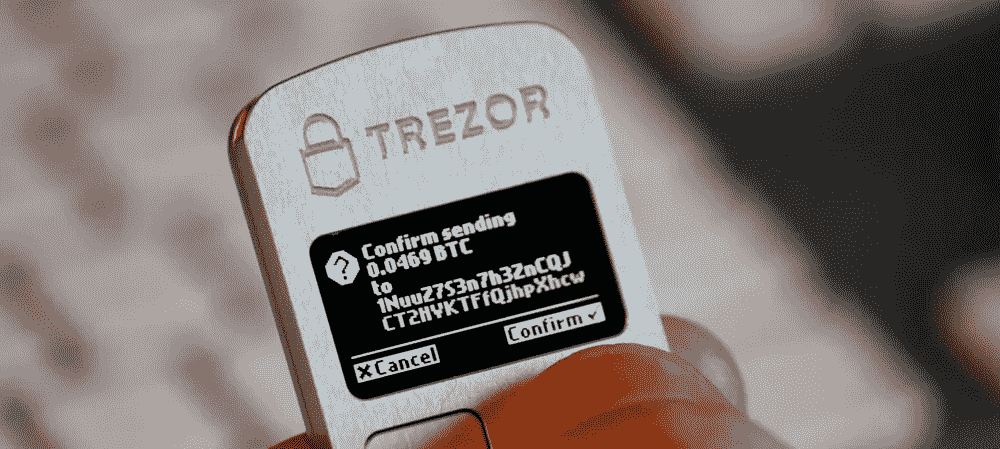

# Telegram 如何解决比特币的基本问题

> 原文：<https://medium.com/hackernoon/how-telegram-will-solve-fundamental-bitcoin-problems-f07b8010e11d>

比特币是目前世界上最受欢迎的加密货币。比特币正是与区块链联系最紧密的东西。在比特币的整个存在过程中，它见证了许多有趣的事情:从卖披萨到交易的迅速下滑。从一开始，比特币就被描绘成:快速、方便、可靠、廉价。但现在你可以理直气壮地宣称，它不方便，不可靠，也不便宜。这些都是比特币的根本问题，能解决这些问题的公司寥寥无几。电报已经在路上了。

# 输入数据

我们了解到 Telegram 计划在 2018 年初推出自己的区块链平台 TON 和 Gram cryptocurrency。该公司进行了两个 ICO 阶段，并收集了 170 万美元。正如我们在 5 月份了解到的，该公司拒绝了第三次公开 ICO 阶段。

截至 3 月中旬，Telegram 在全球拥有超过 2 亿用户。

四月中旬，俄罗斯法院要求封锁电报，因为电报公司拒绝将用户对话的加密密钥传递给联邦安全局。4 月底，伊朗法院禁止电报进入该国。Telegram 在俄罗斯约有 1400 万用户，在伊朗约有 4000 万。

# 问题

以下是安全存储比特币的方法:

*   故障保护:纸质和/或数字备份，有机会对其进行加密和/或在不同地方存储少量部分。
*   防盗:冷藏或硬件保护方式。钱包加密本身并不是防范特洛伊木马程序的安全保护方法，因为密码可以通过键盘记录器读取。

各种安全存储方法的存在，一方面帮助了用户，但另一方面，增加了数据被盗的风险，并影响了使用比特币工作的便利性和速度。没有统一到单一系统中的不统一服务产生了大量的欺诈者。在寻找必要的交换/存储方法的过程中，你会遇到一大堆提供服务的网站，你永远无法确定它们不会欺骗你。考虑到取消交易是不可能的，很有可能你会永远失去大量的金钱。那么靠谱吗？不要太多。

反过来，Telegram 在一个应用程序中积累了必要的服务。现在电报护照的封闭测试已经开始了。该服务将允许识别信使用户。假设用户将立即上传所有必要的数据，然后 Telegram 将能够立即将它们传输到合作伙伴服务，并在 Telegram 内部和外部使用它们。端到端加密保证了数据使用的安全性。这些数据只存储在你的智能手机里，Telegram 无法访问。听起来很不错。

方便、快捷和价格紧密相连。要不要把比特币送快一点？为此付出更多。但是即使高价格也不能保证你能快速交易。如果我们谈论这个每一秒都很重要的世界，并考虑到比特币的利率，总是有相当多的钱处于搁置状态，这就不太方便了。再加上使用上述各种安全方法的时间。

Telegram 如何解决这些问题？一切都很简单。2 亿活跃用户。这对于完美的系统性能来说已经足够了。目前信使号是其竞争对手中最快的。如果他们对付了信使，他们就会对付加密货币的工作速度。尽管公司团队相对较小，但它是由这个星球上最优秀的人才组成的。杜罗夫的所有项目都展现了杰出的才华。电报是最好的。

电报将能够保证方便和快捷。会便宜吗？我们可以尽可能地假设是的。

# 结论

关于 TON 加密货币有很多传言。如果只考虑已被证明的事实，我们可以肯定 Telegram 将能够解决比特币和许多其他加密货币的根本问题。帕维尔·杜罗夫，作为一个公关天才，他已经开始了他的扩张。时间会证明他的系统在正式发布后会如何运作。我们希望这将是加密货币发展的下一步。

[由罗曼·昆采维奇撰写](https://www.linkedin.com/in/roman-kuntsevich-55819515a/)