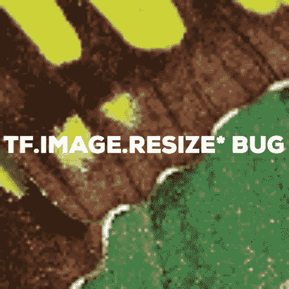
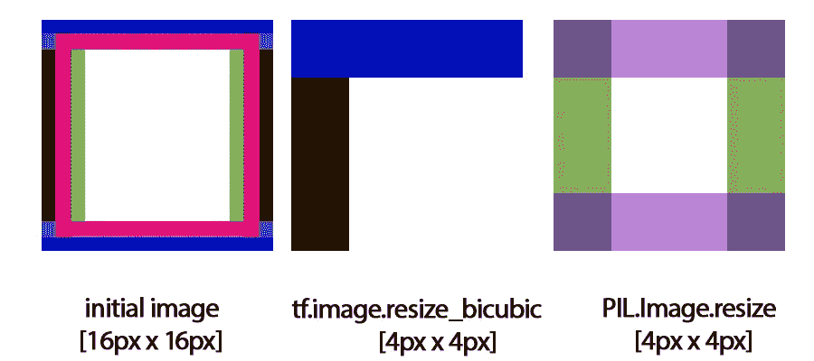

# Tensorflow 的 tf.image.resize 如何偷走了我生命中的 60 天

> 原文：<https://medium.com/hackernoon/how-tensorflows-tf-image-resize-stole-60-days-of-my-life-aba5eb093f35>

## 这是对所有使用视觉内容的 Tensorflow 用户的一个简短警告。简短通知:不要使用任何 **tf.image.resize** 函数！

我正在重写我们的[神经网络图像升级服务](https://letsenhance.io)的代码库——让我们为更大更快的模型和 API 做好准备。当我们处理图像生成(超分辨率、去模糊等)时，我们依赖于典型的图像处理库，如 OpenCV 和 PIL。我一直怀疑使用 Tensorflow 图像处理功能是有意义的——理论上，它们应该更快。因此，我决定坚持使用原生的 Tensorflow 图像预处理和数据集构建工具，使用 dataset.map()将所有张量中的操作都放在我的代码周围。

这个问题相当糟糕——我新的、闪亮的超分辨率代码不仅不能复制任何最先进的网络，甚至不能复制我自己 4 个月前写的代码。最丑陋的部分是超分辨率本身的结果有时非常好，网络在工作，尽管没有达到目标 PSNR，有时会有奇怪的视觉伪像，比如小线条的重叠。

## 让调试开始

最初看起来很小的问题变成了 60 天的挣扎和不眠之夜。我的错误逻辑很简单——网络定义或训练过程有问题。数据预处理肯定是好的，因为我在 Tensorboard 中获得了有意义的结果和对图像处理的视觉控制。

我调整了我能找到的一切，用 Keras、Slim、raw TF 定义了网络——什么都没有，寻找 TF 1.3->1.4->1.5 和不同 CUDA 版本、paddings 行为的变化。我甚至羞于告诉你我最近的怀疑，这涉及到 GPU RAM 和静力学方面的缺陷。我在调整感知损失和风格损失，寻找原因。每一次迭代都需要几天的时间来重新训练，直到得到一些有意义的结果…

昨天看 Tensorboard 的时候发现了**这个 Bug，**。这几乎是潜意识的感觉，图像有问题。我忽略了网络输出，只在 Photoshop 中叠加了目标图像和输入图像(即缩小的目标图像)。这是我得到的。

看起来很奇怪，这里发生了某种位移。完全违背任何逻辑，这不可能是真的！我的代码非常简单。读取图像，裁剪图像，调整图像大小。全在 Tensorflow。

反正 RTFM。tf.image.resize_bicubic 有一个参数——“对齐角”。你到底想怎样缩小图像而不对齐边角呢？你可以！所以这个函数有一个很奇怪的行为已经知道很久了——[读这个线程](https://github.com/tensorflow/tensorflow/issues/6720)。他们无法修复它，因为这会破坏大量旧代码和预先训练好的网络。

> 我们的`tf.image.resize_area`函数甚至不是反射等变的。修复这个很好，但是我担心会破坏旧的模型。

这段代码实际上把你的图像向左上方移动了一个像素。Thread 暗示 TensorFlow 里连插值都破了。2018 年了，各位。这是 TF 的实际降尺度结果。

坚持使用 Scipy/OpenCV/numpy/PIL，无论你喜欢什么图像处理。在我改变它的第二天，我的网络工作得非常好(实际上是第二天，当我看到训练结果的时候)。