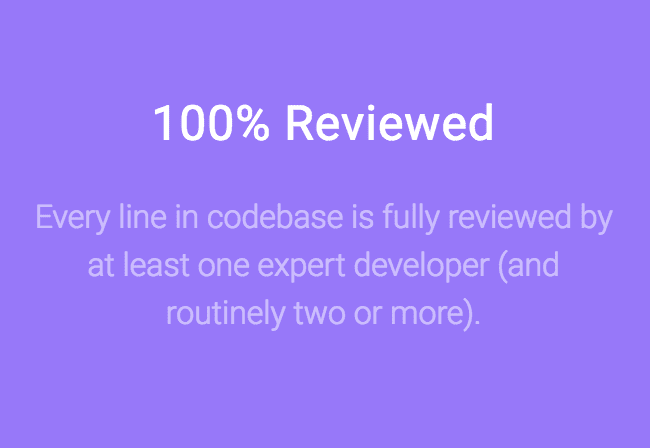

# 1.7 亿美元的以太坊漏洞是如何被阻止的

> 原文：<https://medium.com/hackernoon/how-the-170-million-ethereum-bug-could-have-been-prevented-819053c3b2cb>

> 披露: [**Codacy**](https://goo.gl/s8fRSz) ，自动化代码评审平台，之前赞助过黑客 Noon。对于黑客正午的读者来说，他们的 [**使用这个代码提供 15%的折扣:HACKERNOON**](https://goo.gl/s8fRSz) **。**

170 百万美元一眨眼就没了。直到最近，很难想象这种情况会发生——这种钱不会一夜之间就消失，摧毁它需要非常长的时间。

但上周它做到了——尽管它不是传统的货币。有了加密货币，现在只需要一个人点击几下鼠标就能让数百万人消失。

11 月 7 日，以太坊钱包[奇偶校验](http://parity.io)的一名用户偶然发现了一个漏洞，该漏洞允许他将管理多签名钱包的合同转换为常规钱包地址。这种所谓的[智能合约](https://www.coindesk.com/information/ethereum-smart-contracts-work/)对于实现一组钱包之间的交易至关重要。

转换合同后，用户能够使自己成为所有者。他对发生的事情感到震惊，然后无意中取消了合同，立即导致所有相关的钱包无法使用。用户后来在奇偶校验的 GitHub 上报告了这个错误，然而，由于没有任何方法访问里面的以太网，数百万美元已经被锁在数百个冻结的钱包里。

## 什么？

如果你不是密码专家，这一切听起来可能有点复杂。让我们从一个更容易理解的角度来看这种情况:

假设有人说服了很多人把他们所有的钱都放在一个盒子里，因为它特别安全。不幸的是，没有人知道当盒子移动太多的时候会烧毁。然后你两岁的弟弟发现了这个盒子，它很快就着了火，里面所有的钱在几秒钟内就没了。

然而，根据《平价》杂志的报道，这个故事有一个小插曲——它说钱在技术上并没有消失，它只是被锁在钱包里。但如果是这样的话，似乎目前没有人能够解冻这些资金。

11 月 8 日，该公司发布了全面审计的结果，显示 578 个被冻结的钱包总共有 513，774.16 乙醚，在撰写本文时大约相当于 1.7 亿美元。总共有 573 人受到该事件的影响——这意味着很多人损失了很多钱。

## 收拾残局

这个问题没有快速简单的解决方法——因为[区块链](https://hackernoon.com/tagged/blockchain)的工作方式，可能性非常有限。

最直接的选择是实现一个硬分叉。这有效地创建了一个新版本的区块链，其中事件从未发生，立即使所有资金再次可用。Hard forks 之前在[返还损失的资金](https://blog.ethereum.org/2016/07/20/hard-fork-completed/)方面取得过成功，比如在 2016 年 6 月[大规模黑掉分散风险投资基金 DAO](https://en.wikipedia.org/wiki/The_DAO_(organization)) 之后。要执行一个硬分叉，至少需要网络上 51%的用户来实现，但只用了一个月就说服了足够多的人。

问题是，今天推动一个硬叉子不会那么容易——以太坊社区从那时起已经发展了很多，这意味着让大多数人跳到叉子上要困难得多。

另一个可能更容易的选择是关注 Etherereum 联合创始人 Vitalik Buterin 的早期提案。EIP156 描述了用户回收冻结账户中乙醚的方法。然而，该提案仍在审查中，尚不清楚它是否会被核心以太坊开发者最终实现。

## 技术不是完美的，人类也不是

这不是奇偶校验第一次陷入困境——几个月前，它成为黑客的目标，利用多签名钱包中的一个早期漏洞偷走了 3200 万美元。对此的修复引入了一个新的错误，最终导致了冻结事件。

加密货币有很多优势——它们是一种快速向世界上任何人汇款的好方法，无需依赖银行。通过使用正确的匿名化工具，甚至可以在不暴露身份的情况下做到这一点，从而轻松保护您的隐私。

不幸的是，这也为黑客创造了肥沃的土壤，他们可以悄悄地将资金转移到无法识别的账户。备受瞩目的[加密货币](https://hackernoon.com/tagged/cryptocurrency)黑客攻击有[一长串](https://storeofvalue.github.io/posts/cryptocurrency-hacks-so-far-august-24th/)，排在最前面的是 2014 年 3 月当时占主导地位的交易所 Mt. Gox 的违规事件。在几年的时间里，攻击者能够让 4.73 亿美元的比特币消失得无影无踪。

虽然目前还不清楚钱包冻结是[的意外还是故意之举](https://wccftech.com/frozen-300-million-eth-was-no-accident/)，但这无疑再次证实了加密货币的脆弱性。当密码开发人员引入一个关键错误而陷入困境时，它最终会影响持有真实货币的账户。

为了理解这一切是如何发生的，解释一下比特币和以太坊的区别很重要。虽然比特币只不过是一种交换虚拟货币的方式，但以太坊也将底层技术用于其他用途。通过让开发人员有可能构建在区块链上运行的应用程序，它不仅仅是一种向人们付费的方式——它是一个全球计算平台。因为以太坊比比特币拥有更多的功能，它通常被认为不太安全，因为它有更多可能的利用来源。

奇偶校验是一个建立在以太坊之上的客户端，它使用自己的[开源代码库](https://github.com/paritytech/parity)——包含导致钱包冻结的错误的代码。该公司的网站引以为豪的是，至少有一名专业开发人员的审查率达到了 100%。在这种情况下，这是不够的。

代码中易受攻击的部分在几个月前就已经部署了，并且设法躲过了开源社区和奇偶校验团队的代码审查。由于简单的人为错误，数亿美元现在被卡住了。所有这些都可以通过进行适当的代码审查来避免，这可以在造成不可逆转的损害之前发现错误。

Parity 表示，它定期聘请外部审计师对他们的智能合同进行正式审计，但表示这类问题的解决方案不是进行更多的审计。相反，围绕合同的部署、监控和测试实现更正式的过程和工具会更有意义。这是一个严肃的事实——使用自动化代码审查这样的工具可以显著降低开发失误的几率。

通过自动识别安全问题并确保合规性，自动代码审查使得编写优秀的工作代码变得更加容易。通过使用这些工具，开发人员可以节省多达 30–50%的时间，而他们通常会花在审查上，同时看到他们的代码质量稳步提高。当试图编写伟大的软件时，有一双额外的眼睛来寻找错误会有很大的帮助。

人们会犯错误，所以加倍进行代码审查是个好主意——尤其是当涉及大量资金的时候。拥有一个经过彻底审查的代码库会让你感到安心。

> 在 Codacy 博客 **上阅读更多文章。**