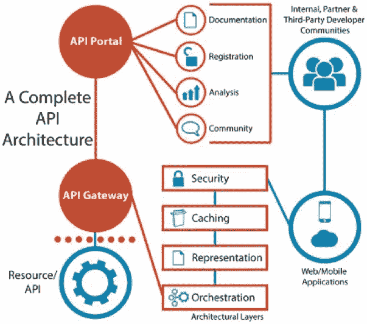
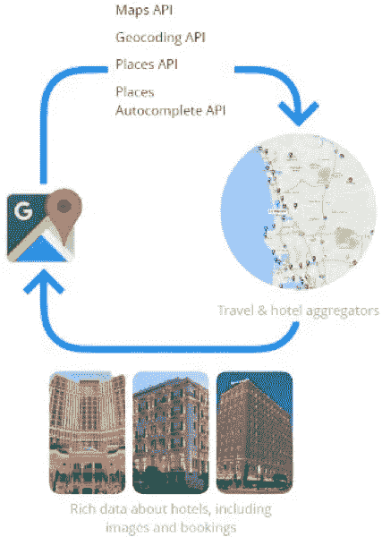
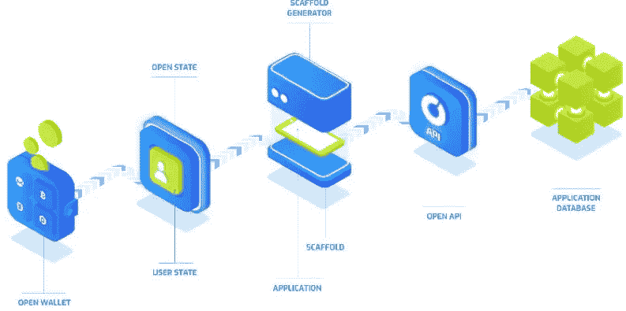

# API 经济如何为区块链带来变革

> 原文：<https://medium.com/hackernoon/how-the-api-economy-is-poised-to-revolutionize-the-blockchain-9e13678041fe>

如果你正在阅读这篇文章，你可能已经在你的智能手机上点击了一个社交媒体应用程序的链接，因为你正在从在家的数字工作中休息。你已经超连接了，这是一个描述技术如何使每个人和每个事物相互联系的概念。

在个人层面上，我们保持联系是因为我们想要获取信息，就像我们想要分享信息一样。最近对朝鲜半岛外交成功的关注让一个温暖人心的故事成为焦点。南方人把大米和装有音乐和电影的 u 盘放在塑料瓶里，然后扔进河里，让北方的兄弟到更远的上游去取。他们期待在不久的将来，他们可以张开双臂欢迎彼此，同时“流式传输”媒体。

*Photo by the Washington Post*

在团队层面，我们保持联系，因为将数据转化为可操作的信息对进步至关重要。人类大约在 20 万年前进化到了现代形态，但真正的进步始于大约公元前 3000 年文字的发明，以及 1000 年后的轮子。无线电通信大约在 130 年前就被发明了，但是是互联网让我们的世界开始了无尽的通信。我们的父母生活在一个没有信息技术的世界，我们生活在一个“数据是新的石油”的世界，我们的孩子有望在一个对石油是什么感到好奇的世界中长大。

在技术层面，我们通过不同的信息技术系统相互交换数据来保持联系。没有官方估计有多少真正的软件，但粗略的猜测是大约 10 亿，并且每天都在增长。

以优步为例，它运行在你的移动操作系统上，而移动操作系统本身是一系列软件的集合，它有登录、搜索、地图、支付、评级、反馈、通知和支持系统。这些都是在后台协同工作的软件，优步应用本身只是一个前端。现在想想不同的移动应用程序、桌面应用程序和网站的数量，它们是前端，而运行应用程序以传输、处理、分析和保护信息的复杂服务器网络是后端。由此产生的复杂生态系统吞噬了我们的整个星球及其轨道，看起来就像一个由数十亿台计算机组成的网格，运行着数十亿个软件，其中大多数都可以与他人交流。

所有这些软件都是由不同的人出于不同的目的开发的。银行的财务系统与工厂的运营管理系统完全不同，工厂的运营管理系统与供应商的库存管理系统也完全不同，而供应商的库存管理系统又与零售商的销售系统完全不同。但是，为了实现端到端的供应链自动化，这些系统需要集成在一起，并相互通信。它们通过 API 来实现。

API 是应用编程接口的缩写。[维基百科](https://en.wikipedia.org/wiki/Application_programming_interface)将其定义为一组用于构建应用软件的子程序定义、协议和工具。通过交换所需的确切数据，API 允许开发人员简单地将他们现有的应用程序与各种其他软件后端集成在一起。

如果你的头脑对无聊的技术细节不感兴趣，那就没什么好理解的了。但是如果你曾经使用过电源插座，你会很快掌握 API 的基本概念。你不需要理解整个电网，你只需要理解插头插入插座，你的设备就能工作。一个 API 可以做一些非常相似的事情，一个复杂的系统可以通过一个普遍理解的入口点变得容易访问。API 将复杂的“电网”转化为简单的电源插座。

虽然上面的例子过于简单，但它的核心可以准确地说明 API 如何使多个独立的系统在最短的时间内集成和交换所需的信息，以及为什么这很重要。API 已经存在了很长一段时间，并且一直在稳步地从特定集成所需的战术资产转变为战略资产，使数字业务得以发展。

一个很好的例子是谷歌地图。谷歌的核心业务是销售广告，他们努力创造一个吸引用户注意力的生态系统，从中收集数据以更好地为他们提供广告。虽然它不是搜索或 Gmail，但谷歌地图是这个生态系统的重要组成部分，也可以说是最好的产品之一。谷歌花了几年时间来构建和改进他们的产品，并成功地让用户再次光顾，同时也告诉他们的朋友。

谷歌在地图方面做了一件重要的事情——他们通过 API 向所有人开放地图。自 2005 年以来，任何网站以及后来的移动应用程序都可以以这样或那样的方式集成谷歌地图。这为第三方产品注入了至关重要的功能，使他们能够专注于开发软件中的其他功能，并集成可用的最佳位置信息，而不必为此开发自己的后端。仅在一周内，谷歌地图 API 就为超过 200 万个不同的应用程序提供信息。

API 的激增使得全新的数字生态系统应运而生，其创新功能为企业带来了新的机遇，丰富了人们的生活。顶尖的数字公司系统地获得了最高的 API 流量，25%的数字公司在 2017 年驱动了 96%的总 API 流量。难怪这种采用和增长的强大循环变得更加强大，因为组织看到了适当的 API 管理如何转化为直接的市场份额增加，并专注于开发能够胜任任务的熟练资源。

寻找有能力的开发人员是任何 IT 组织的使命和痛苦，但是在软件开发人员中，大约 80%的中等资历或以上的人拥有 API 管理技能。相比之下，区块链开发技能几乎无处可寻。2018 年初[的一项研究](https://techcrunch.com/2018/02/14/blockchain-engineers-are-in-demand/)估计，每个区块链开发者有 14 个职位空缺，这个数字不太可能很快减少。仅在上个月就有 100 种新的加密货币推出，在撰写本文时，总计 1.759T2。这个问题源于这样一个事实，即区块链技术是新的，它背后的许多原理的变体是用全新的编程概念和语言实现的，比如 Solidity。

缺乏可用的知识是企业的一个巨大的痛点，这些企业希望从区块链技术实现的加密保护的不可变的无信任自动化中受益。最受欢迎的功能是加密货币支付，因为它更快、更便宜、更直接，并且可以通过编程触发。

该开放平台提供了一个面向 API 的分散支付基础设施，允许加密货币轻松集成到现有应用程序中。它通过将开放 API 链接到常规软件来实现这一点，以一种大多数开发者都熟悉的方式，创建一个“脚手架”或智能合同模板，充当支付网关，并可以很容易地适应特定的用例。

由于它以 API 为中心，开放平台消除了将现有软件与任何类型的区块链集成的所有复杂性，这意味着不需要在任何现有后端上采用任何现有或未来的加密货币。例如，想象一下自动软件许可管理，通过智能合同中以编程方式嵌入的许可模型来触发应用程序使用付费。这将消除定期书面合同续订、订购、许可证审计的需要，并大大简化支付。所有需要做的就是销售软件的公司与他们的客户一起使用开放 API。

通过提供应用程序接受加密货币和相关支付数据所需的缺失组件，开放平台可以支持企业环境中的任何支付场景、软件即服务场景、视频游戏等。任何应用付费方案都可以在任何区块链上轻松部署。

区块链革命将极大地改变从银行、金融和房地产到治理、教育和娱乐的商业垂直领域。开放协议极大地降低了加密货币支付集成的复杂性，并利用了主要存在钱包中的价值 4000 亿美元的加密货币，允许用户在他们想去的任何地方消费，并可以极大地推动区块链技术的采用，同时确保开发者立即公平地获得报酬，而不会受到应用商店的任何削减或延迟支付。如果你有兴趣了解更多，请查看 https://www.openfuture.io/的。