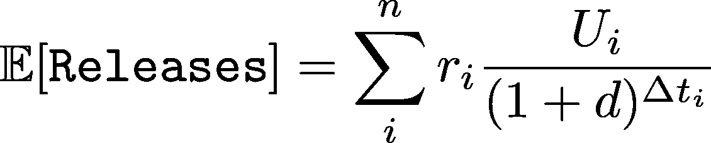

# 最佳产品工程团队如何实现价值最大化

> 原文：<https://medium.com/hackernoon/how-the-best-product-engineering-teams-maximize-value-89170c501e4c>

## 降低风险，消除复杂性，有效排序

To truly maximize user value, you must collaborate on an effective plan to reduce risk. Photo by [rawpixel](https://unsplash.com/photos/ArqZgXYqhjU).

有了完善的信息，工程设计过程可以非常简单:您可以专注于实现功能，同时最小化工程复杂性和风险。但是当有很多产品不确定性时，这就变得更加棘手了。当你不知道它将如何被使用或扩展时，你如何制定一个工程计划？在这些情况下，你需要在产品和工程之间进行强有力的对话——健康的团队不会孤立每个人，而是让他们作为一个团队一起工作。通过这一点，您可以通过最小化产品和工程风险，计划通过增量发布来最大化用户价值。

# 最有趣的工程问题类型

在 Asana，我是几个不同团队的技术负责人，亲眼看到每个团队在工程设计过程中都有自己的乐趣和挑战。例如，一个团队将一个不太好的特性重写到一个新的框架中。这意味着团队有一个定义良好的产品，几乎没有不确定性，因为这个特性已经发布了。在这个团队中，我们只解决工程问题:例如，如何编写高效的查询，我们的新旧框架之间可能影响产品的差异，以及如何构建抽象来利用功能的力量。

我最喜欢的团队类型包括更多的产品协作。当构建强大的新功能时，有许多类型*的风险在起作用——产品和工程是最常见的两种——在规划产品工程项目时，您需要考虑所有这些风险。产品风险可能非常危险:如果您构建了错误的特性，您可能需要在之后重新构建正确的特性。充其量，这意味着浪费一些时间。在最坏的情况下，这意味着建立和维护两个独立的系统，而不是一个。这意味着解决问题的范围完全改变了，因为工程师需要成为产品流程中的合作伙伴，并考虑工程和产品的权衡。

换句话说，参与产品过程的所有阶段。从一开始就这样做，甚至在确定问题陈述和初始假设之前。你将更好地思考产品权衡，成为产品经理的好伙伴。同样，产品经理应该是工程过程中的合作伙伴。他们应该了解复杂性或遗留技术存在于何处，直觉地知道哪些解决方案更简单，等等。成功的合作会带来更好的产品，并以更高的速度交付。

**我见过的一些最常见的风险类型(详见***):**

*   **工程风险——技术方案中是否存在大量未知因素？这是否使用了不常使用的新技术？这是否涉及到许多团队不知道的或者需要更新/重构的旧代码或系统？这会导致稳定性下降吗？**
*   **产品风险—我们对产品计划有信心吗？我们需要迭代这个特性才能让它有用吗？向用户展示后，它会完全失败并需要重做吗？**
*   **团队风险——团队成员的参与程度如何？如果一个里程碑失败了，会让团队失去动力吗？如果出现额外的不确定性或障碍，团队成员会尽快行动吗？团队成员对团队的领导力有多自信？**

# *如何处理这些问题*

*不幸的是，当许多工程师看到多种类型的风险时，他们会关注一个极端。如果存在很大的产品风险，他们会尽快原型化以交付价值，这可能会损害他们未来的生存能力。另一方面，他们可能过度抽象，过于关注长期的特性集，冒着增加复杂性的风险，并延迟交付价值。理想的前进道路是在中间的某个地方，平衡产品和工程问题。*

*如果你在一家产品公司，你的最终目标可能是交付用户价值。有很多需要考虑的:你将交付什么样的用户利益，这会有什么样的风险，什么时候发布，你将增加什么工程债务，等等。危险在于规划项目时没有考虑这些因素。当假设其他人会考虑这些因素时，这种情况可能会发生(即，项目经理会考虑产品风险，而你，工程师，只需要关心工程规划)。*

# *简短的插曲:具体建模*

*请耐心听我说一会儿，我们一会儿就回来——但是从经济学的角度来思考这个问题是有帮助的。假设你有一个项目，你正在为它制定一个工程计划。您可以一次性交付它，或者通过一系列的增量发布来交付。我们希望最大化假设发布的期望值。如果你稍微眯着眼，我们可以用经济学中的[风险调整净现值](https://en.wikipedia.org/wiki/RNPV)同样的方式来建模。我们在不同的时间点有一系列的“释放”,每一次都有不同的风险状况和净值。因为我们更喜欢价值越快越好，所以我们根据价值何时发生来“贴现”价值。*

**

*其中:*

**Ui* 表示来自版本 I 的净值。这结合了几个因素: *Ui=Vi-Di-Ci**

*   **注意:假设这些都是相同的单位——通常是美元，这是一个我们可以翻译的相当通用的单位。**
*   *用户从一个版本中获得多少价值( *Vi* )？例如，他们可以完成以前无法完成的新工作流程。*
*   *用户从一个版本中获得了多少负效用？例如，如果您交付了一个不完整的版本，降低了用户的信任度。*
*   *你的团队在发布中花费了多少成本？例如，5 名工程师花了 2 周时间研究特性。*

**ri* 代表一个释放发生产生值 *Ui* 的概率。这模拟了释放的风险。*

*   **注意:假设一个版本是全有或全无。在实践中，一个版本可能会被推迟，或者它的采用率会低于预期。这可以用更多不同概率的“潜在释放”来模拟。**
*   *例如，这可能是:产品风险(构建错误的东西)，工程风险，等等。*
*   *例如，您可以通过一个早期发布的测试程序来接收反馈，从而降低项目的风险。*

**1/(1+d)^δti*代表“[折扣系数](https://en.wikipedia.org/wiki/Discounting#Discount_factor)*

*   *d 是贴现率——类似风险的不同投资在单位时间内可以获得的价值。*
*   **δti*是版本 I 和 i-1 之间的间隔时间。*

*有了这个，我们可以从一系列的发布中建模预期的用户价值。虽然我从来没有明确地计算过这个，而且这个模型是高度简化的，但它让我们可以比较每个因素与另一个因素以及整个计划的关系。*

# *从模型中获得灵感，实现价值最大化的最佳实践*

*通过我参与的团队和发布会，我积累了一些关于价值最大化的经验。这些也反映在上面的简化模型中。*

***思考发布计划***

*   *你应该积极地将一个特性分成小版本。如果不增加风险或成本，那么将一个特性拆分成多个版本是增加用户价值的好方法。更早、更频繁的交付意味着部分功能可以更快地到达用户手中。在我们的模型中，这反映在产生较低净值的贴现因子上。*
*   *发布计划有许多考虑因素——功能准备情况、市场条件、产品和工程风险——提出计划应该是所有相关方的协作。在项目的初始规划之后，考虑增量发布或早期发布是否有用。*

***关于工程设计的思考***

*   *增加工程债务或复杂性是危险的。它会使所有未来的开发变得复杂，或者给所有未来的版本增加风险。因此，通过工程复杂性进行短期优化会对长期用户价值产生巨大影响。这通常表现为构建“部分”功能，最终导致负债，而不是构建用户价值的最小完整单元。*
*   *平衡很重要——虽然你应该总是考虑未来的工程设计，但你不应该过度工程化，以至于很久以后才向用户交付产品。如果未来存在产品不确定性(例如，不清楚一个特性将如何扩展或一般化)，那么您就冒着[构建错误的抽象](https://www.sandimetz.com/blog/2016/1/20/the-wrong-abstraction)的风险，这会减缓未来的开发。*
*   *所有的工程复杂性都会导致额外的成本或风险，所以在可能的情况下，[规避复杂性](/building-asana/circumventing-engineering-complexity-e1375a49c09a)几乎总是更好。成为产品流程中的合作伙伴将让你有机会思考复杂性的非工程解决方案，从而增加预期价值。*

***关于化解风险***

*   *对工作进行排序非常有帮助，这样可以减轻大规模发布的风险。假设您计划在 6 个月后发布一个大版本，并且产品风险目前很高。您可能有机会通过一个小的早期版本来验证假设，从而将产品风险减半。这将最终使最终版本的预期用户价值翻倍。当使用技术风险较大的新技术时，也可以应用这种技术。如果您在早期用一个小的发布来降低项目的风险，以验证一个工程计划，您将会提高项目的预期价值。*
*   *不同类型的风险相互叠加，因此在一次发布中结合多种类型的风险是很危险的。考虑所有类型的风险，并努力将发布集中在单一类型的风险上(例如，将风险较高的工程与风险较低的产品工作结合起来)。*
*   *从“最小化最坏结果”的角度来思考这个问题是有帮助的。换句话说，想想什么样的风险最大，你有什么应急措施。例如，你的工程设计对 beta 测试后的产品变化有弹性吗？如果没有，考虑在高产品风险领域这样做，或者推迟工程设计，直到你对产品方向有更高的信心。*

# *想看更多这样的帖子？跟着我上[中](/@esp)！*