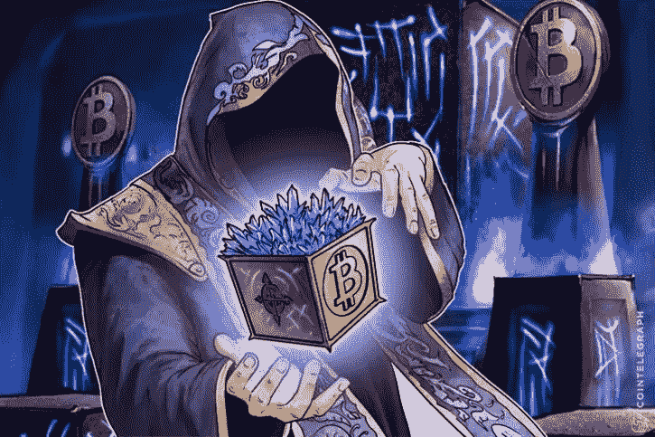

# 区块链如何消除游戏中的欺诈

> 原文：<https://medium.com/hackernoon/how-the-blockchain-eliminates-fraud-in-gaming-283e79536093>

# 区块链如何消除游戏中的欺诈

游戏行业正在经历一个指数增长期，预计到 2022 年价值将超过 2300 亿美元。世界上大约有 22 亿游戏玩家，其中多达 10 亿人将辛苦赚来的钱花在游戏内的购买上。

这么多钱流入各种游戏平台，当然引起了不良演员的注意。然而，如果你关注主流媒体，你只会听说像去年针对索尼 PlayStation 网络的重大数据泄露事件。

事实上，游戏行业多年来一直受到欺诈和较小规模的阴险攻击的困扰。根据 Mike McGuire 博士进行的里程碑式研究 [Into the Web of Profit](https://learn.bromium.com/rprt-web-of-profit.html) ，网络犯罪分子已经投入大量时间将偷来的虚拟商品转换为加密货币。

这使得国际足联，最终幻想，GTA 5 和星球大战在线等游戏成为热门目标，因为它们允许虚拟物品的交易，同时允许秘密对话。然而，虽然基于主机的游戏仍然是最受欢迎的，但[移动游戏市场也在快速增长，其目标是超过 80%的应用商店收入来自游戏](http://mediakix.com/2018/03/mobile-gaming-industry-statistics-market-revenue/#gs.dzGiU1Q)。

这些手机游戏通常遵循免费增值的收入模式，只有通过应用内购买才能赚钱。这意味着玩家愿意平均每款游戏花费 50 美元来提高游戏性，获得虚拟物品，提高他们的地位。

这就创造了一个繁荣的地下灰色市场，在这里可以买卖偷来的虚拟物品、货币、用户凭证，甚至是小抄。这意味着游戏被黑客攻击和操纵来实现这一点！

他们是怎么做到的？让我们直接进去看看。

# 欺诈广告和网络钓鱼攻击

这种老派的技巧仍然有效，人们仍然会上当。为了在游戏中获得优势，玩家在看到广告后仍然很容易被诱惑放弃他们的用户证书。

有时玩家也会被骗去点击游戏开发商网站的钓鱼链接。这通常会导致玩家放弃他们的凭证，这可能会很快导致游戏内资产和货币的重大损失。

# 故障

故障是坏演员使用的一种技术，用来在游戏中创造一种局面，让玩家误以为系统中有故障。这导致玩家反复购买相同的虚拟物品。

如果你去网上游戏论坛看看，你会很快意识到这种欺诈行为在这个行业非常猖獗。不幸的是，有时候是玩家自己上钩把自己打开了。

# 黄金农业

淘金是一种利用 bot 技术重复执行游戏内操作的技术，以利用游戏内促销，赚取数字货币，并赢得虚拟资产等奖励。

同样，如果你只是浏览一下大多数游戏论坛，你会发现解决这个问题有多困难。所有这些虚拟资产最终往往会在地下灰色市场出售。

# 远程访问特洛伊木马

远程访问特洛伊木马基本上是一种恶意软件，旨在当玩家正在登录和玩游戏时窃取玩家的凭据和游戏中的资产。同样，这些虚拟商品在地下市场能卖很多钱。

# 西比尔攻击

在坏演员使用的所有欺诈手段中，[西比尔攻击可能是最流行的](http://www.toptenreviews.com/software/articles/what-is-a-sybil-attack/)。这种类型的攻击侧重于假设多个虚假身份，通过模拟在多个地理位置的存在来欺骗系统。

当 Sybil 攻击成功时，它会导致各种恶意活动，包括淘金。通过使用代理服务器，不良行为者可以利用游戏内的区域促销、稀有限量物品和虚拟货币套利。

# 为什么会发生这一切？

欺诈在游戏行业盛行的原因之一是因为验证应用内购买的方法非常有限。我们目前真正拥有的是监督学习模型和基于规则的系统，它们只能对已知的攻击模式做出反应。

# **为什么这些都很重要？**

随着皮肤交易每年价值数亿美元，现在解决这个问题的关键是不仅要让用户免于损失金钱，还要确保他们继续享受增强的游戏体验。

# **那么有什么解决办法呢？**

对于这个问题，最稳健、最有弹性的解决方案是区块链！

区块链的高度透明和分散的性质使得在交易虚拟物品时不可能进行欺诈。你也不必在充斥着不良行为者的灰色市场中交易，因为 DMarket 提供了一个从事游戏内交易的安全场所。

更棒的是，DMarket 连接了多个游戏宇宙，可以在游戏之间安全地交易虚拟物品。补充说，与区块链智能合同，交易可以发生只需点击一下，而球员正在积极地玩游戏。

它还为游戏开发者提供了额外的好处，因为他们现在可以通过连接到 DMarket 的网络，并进入这个高度安全的快速增长的全球经济，为他们的旧游戏注入活力。