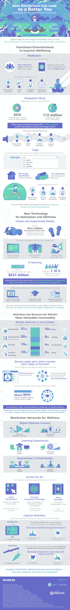

# 区块链将如何增加你的正念

> 原文：<https://medium.com/hackernoon/how-the-blockchain-will-increase-your-mindfulness-f206b25e65a>

区块链正在迅速成为几乎每个行业的普遍技术。在房地产领域，它被用于编制清单、财产记录，甚至是财产股份的民主化所有权。在医疗保健领域，它通过智能合同让医务人员和患者的生活变得更加轻松，智能合同允许患者使用私钥来签署手术和许多其他功能。区块链显示其效用的另一个领域是健康和注意力经济。

基于区块链的新应用和游戏正在利用正念文化的流行。区块链的这些应用融合了音乐流媒体服务、播客和 MOOC 社区的概念，为参与瑜伽和冥想的用户提供货币奖励。健康区块链空间中的许多产品使用增强和虚拟现实为用户提供迷人和真正卓越的体验。

区块链上的瑜伽和冥想为用户和内容创作者提供了不出家门就可以将知识和自我知识货币化的机会。这些实践的游戏化提供了超越内在的、以自我为中心的目标的激励，并有助于建立一个健康和有意识的用户社区。

通过下面由 HighVibe 提供的信息图，了解更多关于[区块链和正念](https://www.highvibe.network/how-blockchain-can-lead-to-a-better-you/)的信息。

