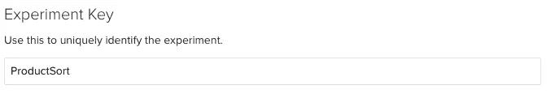
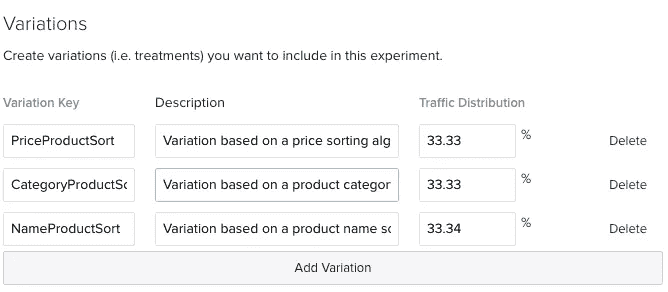
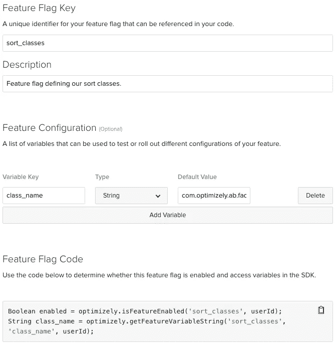
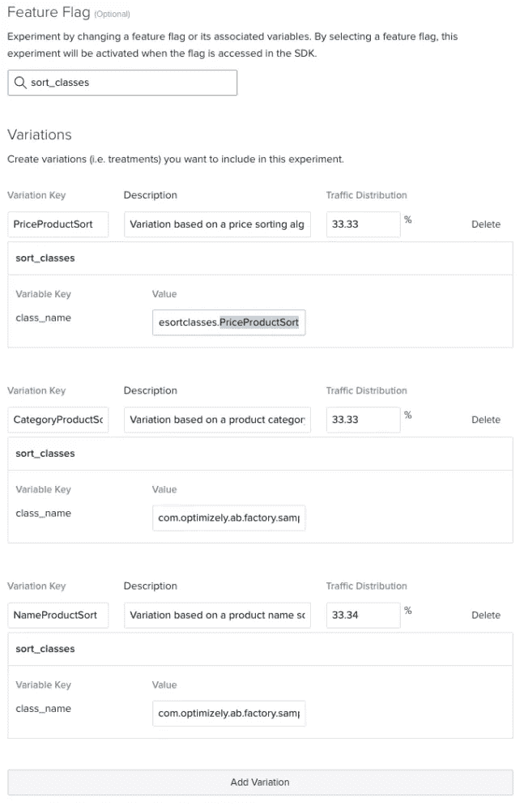
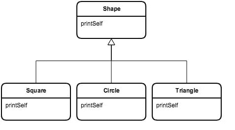
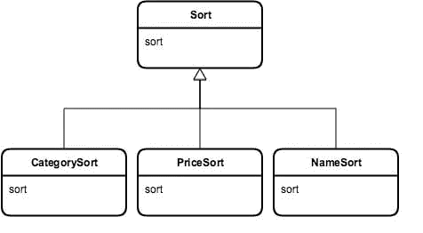

# 工厂模式如何减少技术债务

> 原文：<https://medium.com/hackernoon/how-the-factory-pattern-can-reduce-technical-debt-489943fd07f8>

## 由解决方案工程师 [Albert Sunwoo](https://blog.optimizely.com/author/albertsunwoo/)


> 这篇文章最初出现在[优化博客上。](https://blog.optimizely.com/2017/11/21/minimizing-technical-debt-using-the-factory-pattern/)
> 
> 黑客正午的每周赞助商 [**Optimizely**](http://bit.ly/2zrY2Ui) 是数字体验优化领域的全球领导者，允许企业通过其一流的实验软件平台大幅提升其数字产品、商业和活动的价值。 [**优化**](http://bit.ly/2zrY2Ui) 使产品开发团队能够加速创新，降低新功能的风险，并将数字投资回报率提高高达 10 倍。

# 为什么采用这种方法？

使用 Optimizely X 的全栈 SDK 的实验通常是通过使用代码库中的条件来决定特性变化来实现的。随着实验的进展和实验中明显赢家的出现，一旦不再需要竞争的变体，这种条件代码就会产生技术债务。

该方法还创建了变化条件和实验代码之间的依赖关系，因为 if / else 语句需要知道变化名称，以便将应用程序路由到适当的代码路径。

这可能会成为一个问题，全栈用户经常问我，开发实验代码的最佳实践是什么，它不会在业务逻辑中留下不相关的代码部分，并在引入新的功能变化时允许额外的灵活性。

为了实现这些目标，在实施实验时可以考虑几个选项:

# 标准实现:在业务逻辑中

在业务逻辑中实现特性变化和变化选择代码。

## 赞成的意见

*   短期内容易实现。

## 骗局

*   在业务逻辑中产生技术债务。
*   创建 if / else 条件和实验配置之间的耦合。

# 备选方案 1:使用工厂模式

使用[工厂模式](https://en.wikipedia.org/wiki/Factory_method_pattern)将特性变化选择代码抽象成一个工厂类。

## 赞成的意见

*   实验逻辑与业务逻辑保持分离，最大限度地减少了技术债务。

## 骗局

*   仍然与实验配置相结合。

# 备选方案 2:使用反射的工厂模式

通过在工厂类中使用反射进一步抽象变体代码。

## 赞成的意见

*   实验逻辑与业务逻辑保持分离，最大限度地减少了技术债务。
*   足够通用，可以跨实验重用，没有直接耦合到变体名称。
*   增加添加或删除功能变化的灵活性。

## 骗局

*   反射增加了开销，降低了性能。
*   并非所有语言都提供该功能。

# 实验设置

让我们深入研究每一种方法，看看每一种方法在现实世界中会是什么样子。例如，假设我们想尝试用不同的排序算法向用户展示产品。

使用此示例，我们将在优化的全堆栈中设置一个实验，看起来像这样:

图一。



在这里，我们尝试了三种不同的排序算法，这些算法根据价格、产品所属的类别以及产品的字母名称对产品进行优先排序。我们将在这个排序实验中应用三个不同的实现选项。

# 标准实现:在业务逻辑中

下面的示例代码是 Java 示例代码，如果您开始一个新的 Java 全栈实验，如图 1 所示。

```
//Business Logic
//...
Variation variation = this.optimizelyClient.activate(experimentName, userId);

if(variation.is("CategoryProductSort")){
   CategoryComparator comparator = new CategoryComparator();
   Collections.sort(unSortedList, comparator);
} else if(variation.is("NameProductSort")){
   NameComparator comparator = new NameComparator();
   Collections.sort(unSortedList, comparator);
} else if(variation.is("PriceProductSort")){
   PriceComparator comparator = new PriceComparator();
   Collections.sort(unSortedList, comparator);
}

sort.sort(sampleProductList());

//Continue Business Logic
//…
```

使用这种方法，这些条件可能会直接嵌入到应用程序的业务逻辑中。此外，if / else 条件与我们在全栈实验配置中建立的变体名称直接相关。随着实验的进行，关于如何排序的一种变化可能会成为明显的赢家，使其他变化过时。

不得不清理过时的变体导致 cruft 代码直接嵌入业务逻辑，产生难以消除的技术债务。随着时间的推移，这种技术债务会越积越多，形成混乱的代码库。

# 特征变量

在我们谈论替代方案之前，我想花点时间介绍一下[特性管理](https://blog.optimizely.com/2017/10/18/feature-management/)。在优化的全栈中，你现在可以创建特性标志来表示你的代码中新的或者实验性的功能。特征标志中包括特征变量。使用变量，您可以使用可配置的组件或参数来检测特征。

我们将在工厂模式实现示例中使用这些变量，因为它们比使用变体名称更合适，并且为在工厂模式实现中指定排序算法的名称提供了更大的灵活性..

# 使用特征变量

在工厂类示例中，您会注意到这样一行:

string class name = this . optimizely client . getfeaturevariablestring(feature flag，featureVariable，userId)；

标准实现示例中使用的。

代替这一行:

variation variation = this . optimizely client . activate(experimental name，userId)；

使用基于特征变量的 getFeatureVariableString()，而不是基于变体名称的 activate()，将使我们在指定使用哪种算法时更加灵活。这将在我们进入工厂类实现时派上用场。

# 功能标志设置

让我们看看如何为我们的排序算法实验设置我们的特征标志:

图二。



# 实验中的特征标志

在实验中使用时，特征标志将看起来像:

图三。



我们将使用 class_name 变量来指定要使用的排序实现。您可以看到，用于 class_name 变量的 string 数据类型允许我们使用完全限定的类名，这在我们后面的示例中很有用。

# 备选方案 1:使用工厂模式

如前所述，使用标准实现的替代方法是使用工厂模式。工厂模式是[“四人帮”设计模式](https://en.wikipedia.org/wiki/Design_Patterns)中的一种，用于解决创建对象的问题，而不必指定被创建对象的确切类。当我们试图从业务逻辑中抽象出条件逻辑时，这个解决方案就派上了用场。

在本节中，我们将使用 Java 来演示如何通过实验来使用工厂模式。大多数语言都有自己特定的实现工厂模式的方式，这种方式可以用来应用类似的方法。

# Java 继承示例

我们首先需要为这一部分做一些准备。假设我们有一组简单的对象，它们遵循一个基本的面向对象的继承场景:



Shape 是父接口或抽象类，它设置了任何子对象必须知道如何打印自身的要求。在实验环境中，printSelf 函数将是一个经受实验或受控展示的特性。

这种继承结构类似于一个更真实的例子。例如，让我们回顾一下之前的产品排序示例。我们可以将每个实现封装在自己的类中，而不是在实验条件中实现各种排序算法，当用户处于与该算法相关的变化中时，我们可以调用该类。



在上图中，我们看到不同的排序算法实现封装在 sort 的子类中。

使用排序示例，让我们看看应用程序如何利用这种封装和继承结构:

下面的代码摘录使用 OptimizelyFactory 类只获取与实验变化相关的 Sort 版本。

```
OptimizelyFactory optimizely = new OptimizelyFactory(dataFile);
//...
//...
Sort sortingAlgorithm = optimizelyFactory.getExperimentImpl(“ProductSort”, userId);
sort.sort(sampleProductList());
```

使用标准实现，此时您将从 activate 方法接收一个变体对象，然后您需要使用条件来确定变体代码路径。

然而，使用工厂模式，您需要做的就是依靠工厂类来为您提供适当的实现。将变化条件的负担从业务逻辑转移到工厂类。提高代码的整体整洁性和可维护性。

# 实现工厂模式

让我们看看 OptimizelyFactory 中的 getExperimentImpl 方法，看看这是如何实现的:

```
public ProductSort getExperimentImpl(String experimentName, String userId){
   Variation variation = this.optimizelyClient.activate(experimentName, userId);

   ProductSort retobj = null;

   if(variation.getKey().equals("PriceProductSort")){
       retobj = new CategoryProductSort();
   } else if(variation.getKey().equals("NameProductSort")){
       retobj = new NameProductSort();
   } else if(variation.getKey().equals("CategoryProductSort")){
       retobj = new PriceProductSort();
   } else{
       //Defaulting to price sorting
       retobj = new PriceProductSort();
   }

   return retobj;
}
```

getExperimentImpl 方法使用前面提到的 getFeatureVariableString()方法来获取要使用的排序算法的名称(在这个示例中，不需要使用完全限定的类名，我们只是为了与其他示例保持一致才使用它)。您可以看到，它将创建实现对象的负担从主应用程序代码中剥离出来。因此，基于用户所处的变化创建单独代码路径的逻辑被抽象在工厂类和排序子类中。

回头看看图 1 中的实验设置。您将看到工厂类对于实验名和类名有相应的值。这仍然会在 if / else 条件和实验配置之间产生耦合，但是这些条件现在已经从业务逻辑中删除了，使得实验结束后更容易删除这些条件。

# 备选方案 2:使用反射的工厂模式

反射是一些面向对象编程语言的特性，它允许在运行时检查和实例化对象，而不必在编译时知道它们的类。这在开发实验代码时非常有用。

因为工厂创建的类名在编译时不必知道，所以实验工厂类可以使用优化特性变量的值来为它的客户机标识和实例化对象。

这将工厂类代码从实验配置中分离出来，并允许工厂类保持足够的通用性，以至于工厂类根本不需要实验实现的知识。允许我们对任何基于继承的实验使用相同的工厂类。

反思资源:

[反思百科](https://en.wikipedia.org/wiki/Reflection_(computer_programming))

[Java 反射教程](https://docs.oracle.com/javase/tutorial/reflect/)

```
public T getExperimentImpl(String experimentName, String userId){
   Variation variation = this.optimizelyClient.activate(experimentName, userId);

   T retobj = null;
   try {
       String className = this.packageName + "." + variation.getKey();
       Class cls = Class.forName(className);

       Class partypes[] = new Class[0];
       Constructor ct = cls.getConstructor(partypes);
       retobj = (T)ct.newInstance();
   }
   catch (Throwable e) {
       System.err.println(e);
       e.printStackTrace();
       return null;
   }
   return retobj;
}
```

上面的 getExperimentImpl 版本使用图 3 中指定的变量和 Java 反射来创建实现对象。getFeatureVariableString()的值用于确定需要实例化哪个子类。

应该注意，这里使用了泛型，所以可以使用任何父类。对于 Sort 的情况，我们在创建 OptimizelyReflectionFactory 类的实例时初始化泛型类型。

```
OptimizelyReflectionFactory<ProductSort> optimizely = new OptimizelyReflectionFactory<ProductSort>();
//…
//…
ProductSort sort = optimizely.getExperimentImpl(“ProductSort”, input);
sort.sort(sampleProductList());
```

# 反射性能

虽然 Java 反射的性能在过去几年中有所提高，但重要的是要注意，反射仍然是以牺牲性能来换取抽象的便利性。如果在您的实验用例中，性能考虑高于便利性，那么您应该使用前面提到的基于条件的工厂类。

# 其他语言

反射并不是所有语言都通用的，所以您可能无法自动将变体名称/变量与类实例化联系起来。然而，工厂模式可以用任何语言实现。这允许我们在任何可以使用工厂模式的地方使用相同的方法。

对于其他语言的工厂模式示例，请查看:

[节点工厂模式](http://thenodeway.io/posts/designing-factories/)

[Python 工厂模式](http://python-3-patterns-idioms-test.readthedocs.io/en/latest/Factory.html)

# 开源代码库

关于这两个工厂实现的完整源代码，请查看 [Github](https://github.com/asunwoo/OptimizelyFactory) ！

> 这篇文章最初出现在 [Optimizely 博客上。](https://blog.optimizely.com/2017/11/21/minimizing-technical-debt-using-the-factory-pattern/)
> 
> Hacker Noon 的每周赞助商 Optimizely 是数字体验优化领域的全球领导者，允许企业通过其一流的实验软件平台大幅提升其数字产品、商业和活动的价值。[优化](http://bit.ly/2zrY2Ui)使产品开发团队能够加速创新，降低新功能的风险，并将数字产品的投资回报率提高 10 倍。