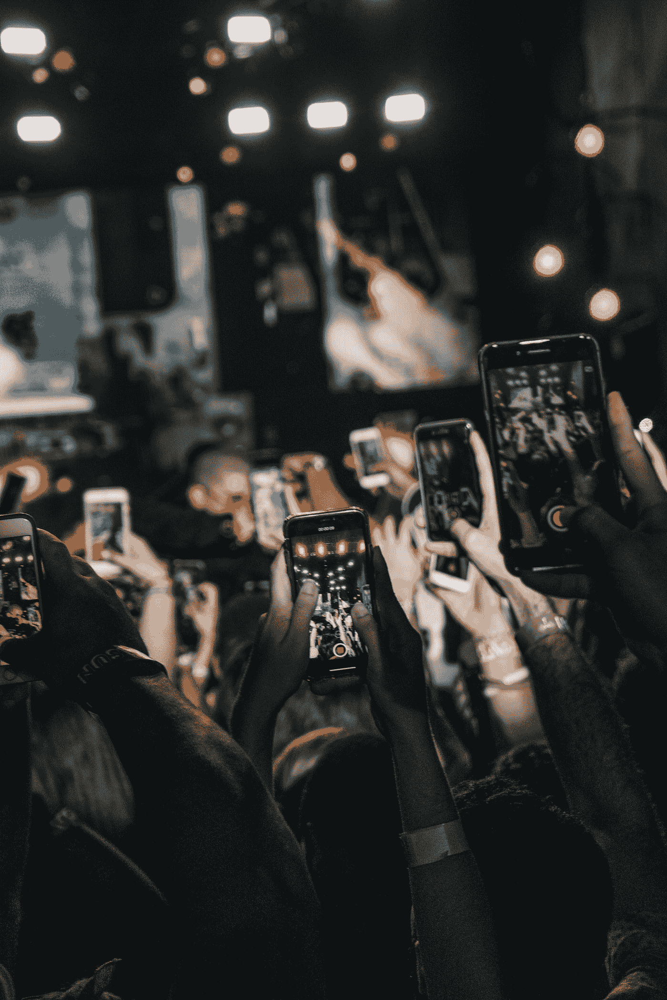
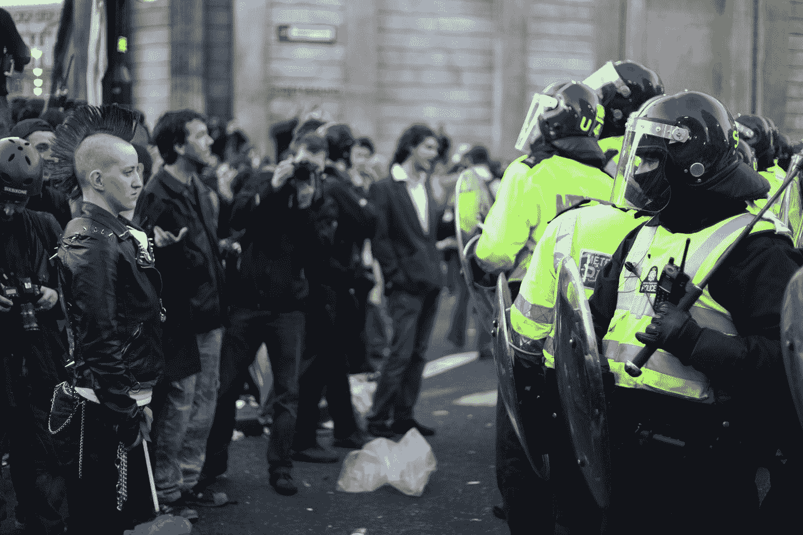
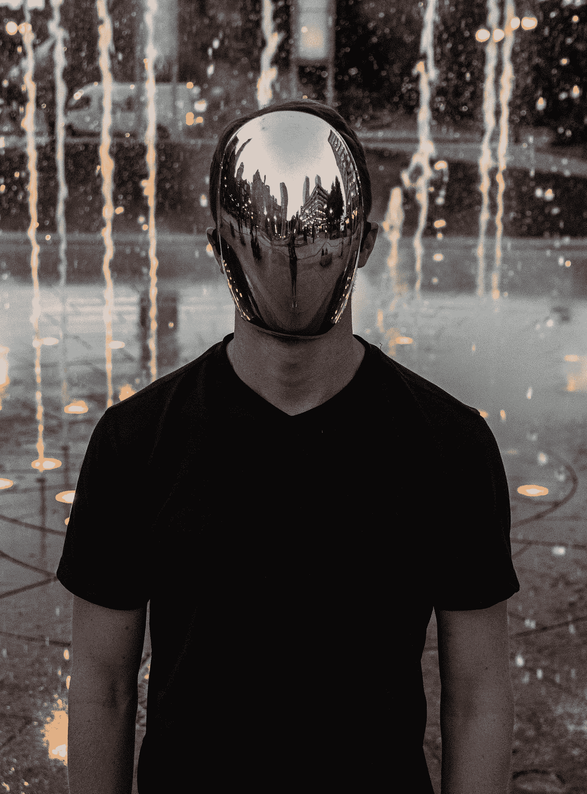
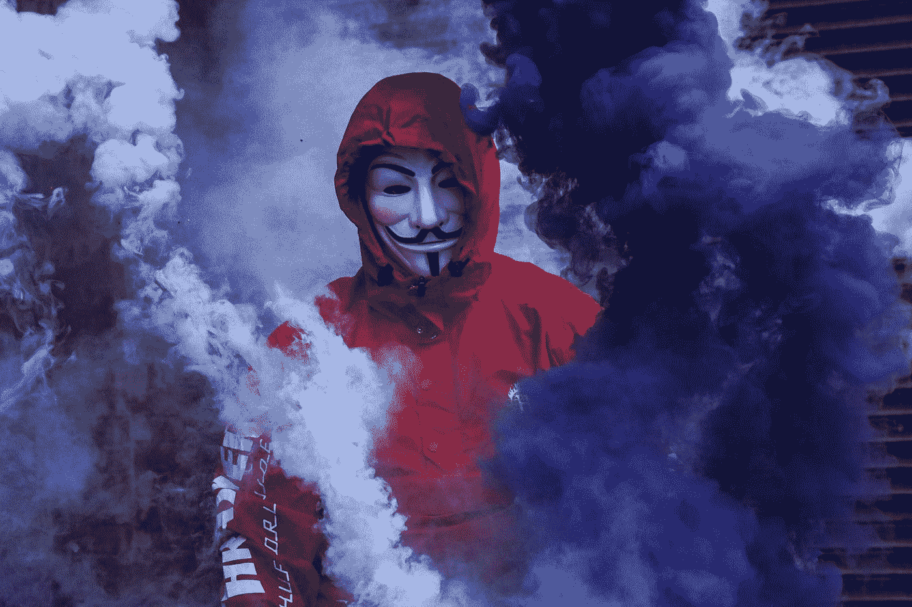

# 下一代如何获得扩展现实平台的所有权

> 原文：<https://medium.com/hackernoon/how-the-next-generation-could-take-ownership-of-extended-reality-platforms-805b62a9d49f>

## 今天的年轻人深深植根于社交平台文化，并因此被它们所控制。如果扩展现实平台像我们预期的那样大，那么年轻人必须能够控制和拥有它。

探索现实-虚拟连续体将如何改变我们的生活、工作、爱情和娱乐的一系列文章。

# 技术统治

现代文化中有一种有趣的偏见——人们受雇主要是为了科学和技术知识，而不是为了人性、道德、宗教或创造性才能。

这似乎是一个无声的点，但它正在导致一个不平衡的社会。

随着那些对数字、测量和过程感兴趣的人获得最好的工作，并成为领导者，我们将会看到人类更柔软、更古老、更精神和更感性的一面被忽视了。

对抽象主义的偏爱造成了新达尔文主义的压力，它再次选择更多的技术基因和迷因。它催生了一种正在改变世界的文化。

## 这是技术官僚的崛起。而且不会停止。

我们已经有数十亿人在视觉上和精神上被植入了他们的智能手机。数百万用户每天被应用程序推来推去，因为计算机算法勒索他们的注意力。即使有了笨重、复杂的手机界面，我们也看到用户在大部分空闲时间里变得“习惯”了。

未来的扩展现实界面将变得如此无缝和自然，以至于在日常生活中不会引人注目。然而，它们将以一种新的方式影响数十亿人类、动物和植物。世界和其中的一切都将由人类设计的扩展现实界面驱动，但由人工智能控制。

# 自然进程

我们生活的这个现代后启蒙时代的世界倾向于选择那些能够理解我们不断构建的复杂性并有效进化它们的人。从进化生物学家的角度来看，这也许只是大自然伟大实验的一次重复。也就是说，昨天我们的祖先使用原始爬行动物的大脑存活了下来。今天，我们利用哺乳动物的新皮层来竞争生存。明天将是计算机系统的外部或外皮层的使用，这将是万物灭绝和延续之间的决定性因素。

人们认为，古老的爬行动物大脑驱动着欲望行为——比如饥饿、繁殖和结合。而新的皮层经过优化，更像是一个抽象的预测系统，通过生物传感器对来自现实的信号进行编码，并通过其自组织成模式识别系统的能力提供冷理解——在现实发生之前预测现实。这允许有机体创建一个对外部世界最小惊讶的模型，同时使用最少的资源，如注意力和能量。至关重要的是，在非人类生物中，这两个回路紧密相连。然而，在人类中，我们已经发展出没有边缘共振的反馈系统——没有情感护栏来控制一切。全球变暖和核武器是系统失控的简单例子。将这些控制系统——那些并不真正关心人类福祉的系统——延伸到我们最深层现实的结构中，可能会制造一场反乌托邦噩梦。

现代人类新大脑皮层的抽象、简化和非情感特征正被印在这个世界上，盖过了其他物种的所有自然行为，甚至挫败了我们自己原始的祖先功能。现代心理学家质疑，滑向更虚拟、更数字化的生活方式是否正在伤害我们，无论是个人还是集体。

现实从自然世界延伸到数字世界是由于外皮层的出现。通用人工智能的深层概念将使用所有现实——以及所有希望它存在的人类和人工头脑——作为认知媒介。它是否应该与我们的自然价值观保持一致，或者被允许取代一切，这取决于它的创造者——我们。

这种向无价值文化的进军，没有比计算机在我们世界中的崛起，以及很快扩展现实在我们生活中的无处不在更明显的了。让我们看看这会如何改变我们。

# 社会文化和阶级

在出生时，你是与生俱来的。外部环境可以触发或沉默基因来表达潜在的特征。在后天培养起作用后，我们中的许多人构建了一套行为来显示或隐藏我们天生的天赋和缺点。我们创造并加入文化——共同的历史影响着我们的感情和归属感。这些社会文化把我们和那些对一定范围的环境刺激有着可预测的敏感反应的人归为一类。当人们被相似的思想包围时，社会、文化和阶级允许他们到达一个最小惊奇的地方。

但是，因为这些文化是“虚构的”心理结构，它们可以被设计成随意包括或排除任何部分的人口。正是对接受的认同创造了社会现实。

例如，如果你对啤酒、足球和打架的刺激表现出正确的反应，你就可以被一个像“工人足球俱乐部”这样的团体所接受。然而，“精英品酒俱乐部”可能会青睐那些能够对泥土污染的葡萄酒做出适当反应的会员。从这个角度来看，每个社交界面都是对一系列特定刺激的预期反应的大门。

然而，刺激反应，导致行为，因此所有的社会文化，仍然被我们的基因所束缚，并由感知的，一致同意的现实所调节。但是，当现实不再是一个单一的远景，而是一个在传播给个人之前可以扩展、扭曲和操纵的远景时，会发生什么呢？这就是政治托辞的现状，剑桥分析公司的活动提供了一些见解。一直都是这样吗？真理一直都是被拉伸的吗？

# 出生权和种姓

世界目前生活在现实的许多延伸中。

例如，印度种姓制度根据人们的职业将他们划分为不同的阶层。具体来说，它将一个人的职业与神在创造时使用的一块肉联系起来。这块肉越“好”，工人的阶级就越高(Purusa 的脚被用来制作 Shudras，即工人阶级)。英国贵族根据祖父母和谁结婚来划分人们。纳粹运动按照曾曾祖父母的身份来划分人们。

这些文化体系中的大多数都假设一个人的能力不可避免地偏向于他们天生的基因。这个基础被认为是如此牢固，以至于在这个人有机会对任何刺激做出反应并表现出行为规范之前，就已经确定了整个一生的界限。(更不用说有机会表达休眠基因、从病毒感染中获得新基因或用 Crispr 编辑基因组了)。许多现存的文化体系主张社会不动，并保持一个阶级的经验在另一个阶级的视野之外。

文化可以被视为应用于物理现实的主观扭曲，它客观上给数百万人带来痛苦。

> 这种现实的隔离，在富人和穷人、帝国主义者和土著人、有神论者和异教徒、民主主义者和自由主义者、1%的人和其他人之间筑起了巨大的想象之墙。

从历史上看，我们的文化告诉我们要寻找肤色、血统、父母职业和其他差异等指标，我们被教导“我们很相似，这很好。他们不同，这是不好的”。因此，社会、文化、国家之间的鸿沟扩大了；冲突增加，全球苦难加剧。人类形成战争部落的这种天生行为与感染和免疫有关。远离可能携带新细菌或病毒的人是明智的，这些细菌或病毒可能会伤害你。但是随着虚拟现实(和医学)等技术的出现，这些担心是没有根据的。

> 扩展的现实意志具有摧毁过去所有偏见的力量。这将是一个伟大的社会平等——每一个人和神的经验都是可用的。一个伟大的精神非人化者——你不能拥有身体，只能是一个形而上学的实体。

# 经验

扩展的现实将会是人类的均衡器。它允许任何人通过耳机体验他人的生活。例如，将能够通过阿拉伯亿万富翁的眼睛看东西——住在一个有 30 个房间的宫殿里，每天都去参观哈莱姆。或者像地球上最穷的人一样生活，一无所有，无人相伴。

有可能在任何地方度过真正的时光，品尝当下的艰难现实。任何地点或生活方式都很容易体验。在 VR 中建造宫殿就像建造古拉格一样简单。

扩展现实也可以改变你穿的衣服，你移动的身体，以及人们对你的反应。

例如，虚拟现实应用程序“我们等待”和“锡德拉的云”允许你以个人方式参与叙利亚难民危机。你被安置在那里，在叙利亚的一个海滩上，没有逃脱的方法。有些人，像你一样的人类，在你周围，都在担心和等待。

> 离开这些 VR 体验而不被改变是不可能的。

“你不在那里，伙计”在越南战争后成为一个流行的迷因，以提供战争现实与非老兵的想法之间的距离。VR 让每个人都‘身临其境’。无论在哪里，无论是谁。所有的虚拟现实体验都让你从个人和社会的角度去看他人的世界。毕竟还是你在经历，很容易被震惊。你可以看到在种族主义的世界里作为一个少数民族是什么感觉，体验被人盯着看是什么感觉。作为一个有魅力的女人走过布鲁克林，被叫花子虐待是什么感觉。或者是一个色狼，在欲望和道德中挣扎的感觉。

扩展现实将允许一个与人见面的新空间——一个 pre justices 没有意义的地方。在虚拟世界里，人们可以有任何肤色，任何声音，属于任何群体。就像互联网的全球化一样——对许多人来说，这将是一个新的开始，也是态度的重新平衡。

# 教育

虽然阶级定义为锁定不平等提供了围墙，但教育带来了反对这些分歧的大锤。教育曾经是一种特权，现在是一种权利，是一种平衡力量。虚拟现实不仅保证了大众教育的普及，还带来了终生的环境学习。虽然学习曾经只能通过导师或间接通过图书馆或互联网获得，但在数字现实中，它很快就会无处不在。

教育是一种奢侈品——去学校、买书和支付教师演出费用是一笔巨大的开销。虚拟现实可以通过规模经济几乎消除所有这些开销。孩子们不再需要去任何地方旅行。书籍只是被数字化地展示在它们所坐的桌子上。而一个老师的优秀表现可以播给大家，反复。甚至学生和知识持有者之间的互动也可以通过人工智能——使用聊天机器人和虚拟互动来取代。

# 道德趋同

将现实延伸到数字画布上只会带来道德上积极的文化变革。网络很难监管。超过 20%的可见网络流量是暴力色情。网络变得越来越黑暗。无数的空间存在的非法内容，如色情电影，并质疑，更糟糕的内容。虚拟世界更难监管。虚拟空间不仅能让你观看，还能让你实施谋杀、强奸和酷刑。

这些第一手的经验每个人都有。你可以在公共场所策划和执行虚拟爆炸。看世界燃烧的乐趣。如果有的话，什么样的(不)道德体验应该被禁止，这甚至没有争议，因为很少有人会听。虚拟世界可用的道德景观将像其创造者的思想一样开放，并对所有人开放。田园诗般的数字增强现实的反文化可能是非常暴力和破坏性的。

# 道德操纵

我们共享的现实也可能被黑暗势力以比今天的潜意识广告更微妙的方式操纵。例如，电影业被禁止在幕间休息前播放 25 毫秒的爆米花图像，因为这样做效果太好了。

扩展现实空间不在这项立法之下，因此提供商可以展示微秒图像或音频技巧来转移人类行为。通过使用能够启动与人类内化学系统的边缘共振的算法来操纵思维，在基于网络的媒体中已经很常见了——并且在扩展的现实空间中是不可避免的。

# 反文化

社会需要反文化来检验现状。年轻人被迫反文化。世界上伟大的运动，如佛教、基督教、狭义相对论(可能还有脸书)都是由年轻人反抗当权派创造的。

今天的年轻人深深植根于社交平台文化，并因此被它们所控制。如果扩展现实平台像我们预期的那样大，那么年轻人必须能够控制和拥有它们。

他们绝不能让全球企业、资本主义的成功或政治历史来决定这些变革工具能做什么和不能做什么。他们必须建立自己的平台，不要被锁定在监控和广告中的免费社交网络所诱惑。

## 自由的代价是个人主义。如果你不能控制你的现实，你将失去执行你意志的力量。

随着大型平台在现实中推出他们的扩展，我们希望看到同样的剧本被使用。但我们应该小心，不要让苹果强迫我们只使用他们“规定的”围墙花园现实。我们不应该让脸书欺骗我们签署一份合同，给他们所有的权利。我们不应该让谷歌给我们一个免费的数字世界——以换取他们出售你的数据做广告。我们正在创造的扩展现实应该保持开放，远离技术法西斯主义。

无论是谁控制了这个新的现实，都将比任何现存的政府更加强大。扩展现实将成为这个世界的首选现实(我们大多数人已经选择了它)。

很可能下一个反文化将建立自己的现实和自己的经济。数字现实将打破规则。毕竟，我们正在构建的对现实的扩展不会遵循物理定律。AR 涂鸦会在半空中盘旋。帮派可以随意改变肤色和种族，以表示对一种新的种族的忠诚。这种对经典现实的不服从将引发社会规范的问题。年轻人可能会问，为什么老年人会用装脏纸的口袋来交换临时的和浪费的东西。

# XR，有什么用？

如上所述，我们已经生活在一个扩展现实的经典世界中。我们头脑中的传统文化创造了排外的社会——虚拟的墙，阻止其他人进入。这些文化过去需要很长时间才能形成，并在人口中代代相传。但是随着数字工具的兴起，我们正在分享新的主观现实，这正在以惊人的速度创造新的人类文化。

而这仅仅是开始的开始。

就人类将看到的变化而言，未来 10 年将使之前的 10 年相形见绌。而这大部分都会发生在一个延伸的现实中。

你喜欢我们的帖子吗？您可以在[媒体](https://medium.com/ninjar-com)上发表评论并加入聊天

我们希望收到您的来信。来推特、[脸书](https://www.facebook.com/Ninjar-1546188488814672/)和 [LinkedIn](https://www.linkedin.com/company/ninjar/) 上找我们吧