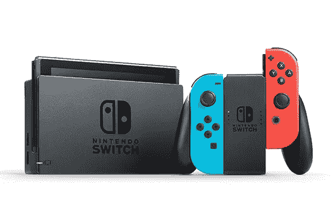

# 任天堂 Switch 如何通过不可挽回地烧断自己的保险丝来防止降级

> 原文：<https://medium.com/hackernoon/how-the-nintendo-switch-prevents-downgrades-by-irreparably-blowing-its-own-fuses-884bd3b7a8ba>

自远程更新开始以来，降级预防一直是消费者和公司之间的猫捉老鼠游戏。任天堂的开关采用了一种令人担忧的策略，通过在每次更新时永久修改你的设备来防止[固件](https://hackernoon.com/tagged/firmware)降级。虽然这不是一个新概念(Xbox 360 早在 2007 年就这么做了)，但这是防止最终用户根据自己的喜好修改设备的更大努力的一部分。

The Nintendo Switch was released on March 3, 2017, and is currently on version 5.0.2

任天堂 Switch 使用一个 [Nvidia Tegra X1](https://en.wikipedia.org/wiki/Tegra#Tegra_X1) SoC，它带有一个保险丝驱动器。这允许它以编程方式熔断保险丝——永久修改设备，使其无法恢复到以前的状态。

# 它是如何工作的

引导加载程序验证特定的保险丝 [FUSE_RESERVED_ODM7](http://switchbrew.org/index.php?title=Fuses#FUSE_RESERVED_ODM7) ，以防止降级。[1]每个软件版本都希望熔断不同数量的保险丝，如果多于预期数量，它将无法引导，如果少于预期数量，它将熔断这些保险丝，然后继续引导。保险丝烧断是不可逆转的——一旦设定，就永远无法撤销。从理论上讲，物理修改 SoC 并更换保险丝是可能的，但这种方法非常具有侵入性且非常昂贵，因此不是一个真正的选择。

ODM_RESERVED 熔丝组中有 256 位，有 8 个 ODM_RESERVED。这允许 32 个保险丝，或 32 个未来的固件版本(只要他们在每个主要版本上烧一个保险丝)。

Each firmware version with its respective expected number of burnt fuses (Table courtesy of SwitchBrew)

# 变通办法

就在本周，Switch BootROM 的第一个严重漏洞发布了。这不是一个可远程修补的漏洞，这意味着目前大约 1500 万台设备都是易受攻击的，并且在其生命周期内将继续易受攻击。fail0verflow 还发布了一个 [Linux 侧加载器](https://github.com/fail0verflow/shofel2)，尽管在撰写本文时它还没有为公众准备好。

[1][http://switchbrew.org/index.php?title=Fuses#Anti-downgrade](http://switchbrew.org/index.php?title=Fuses#Anti-downgrade)