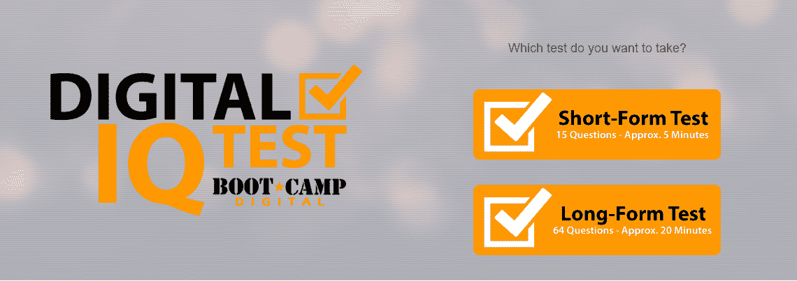
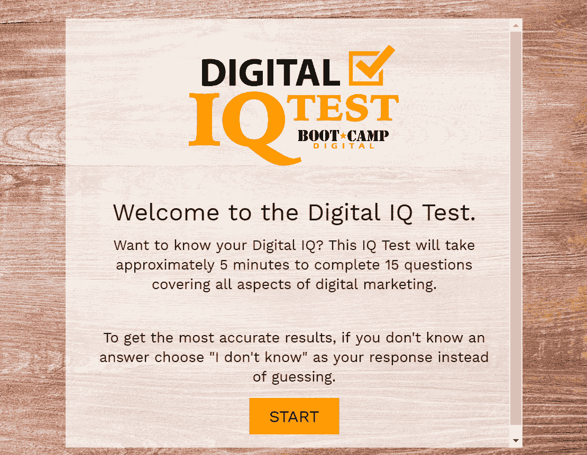
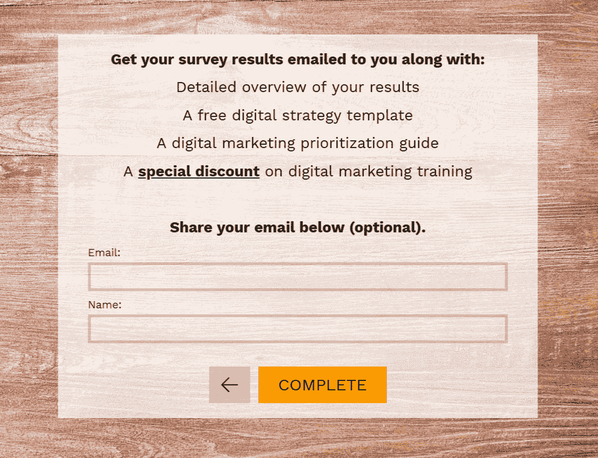
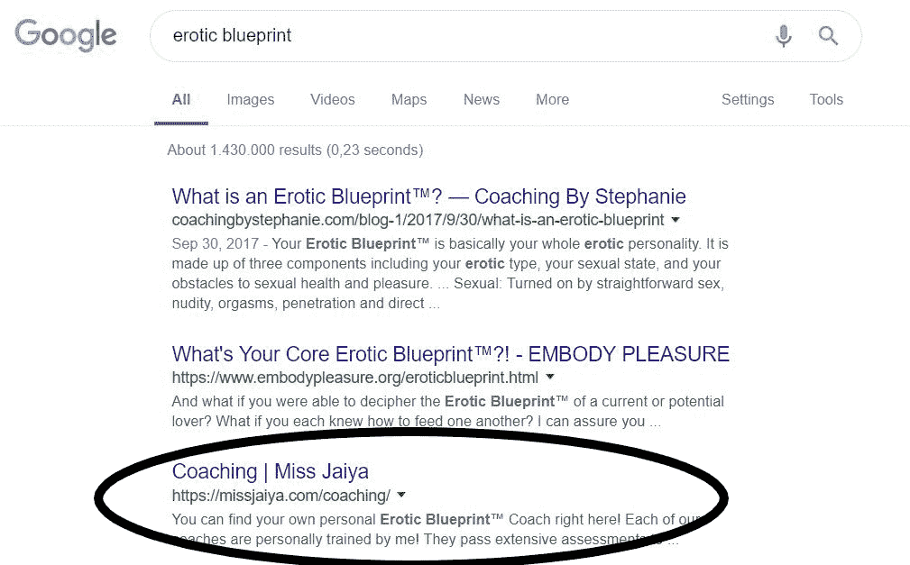
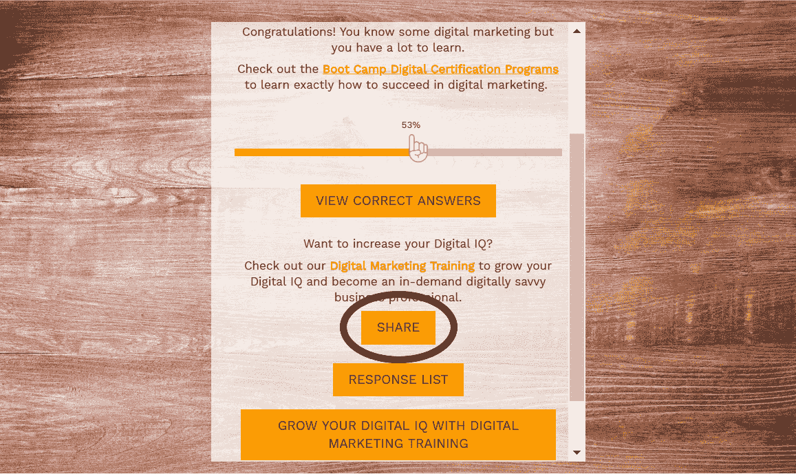
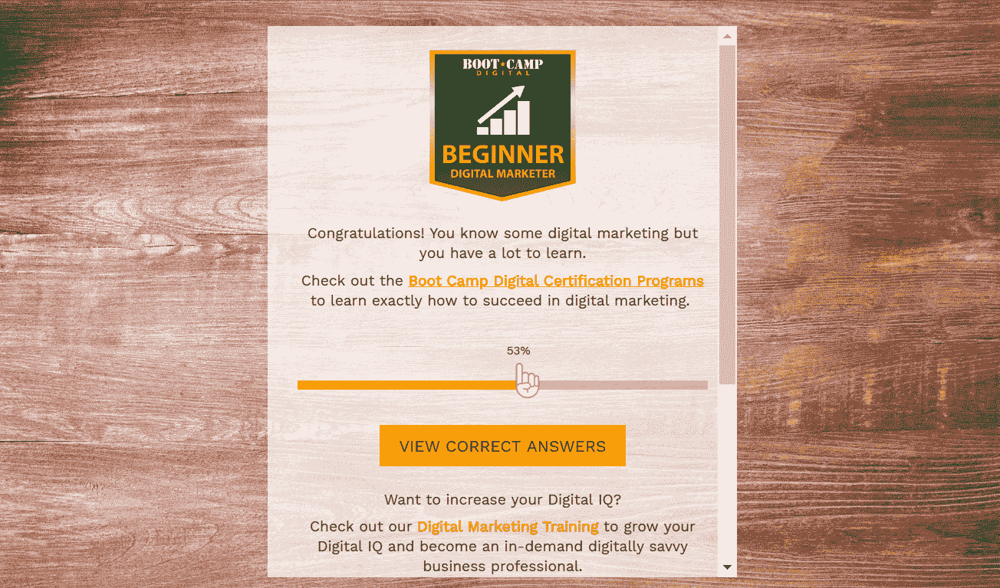
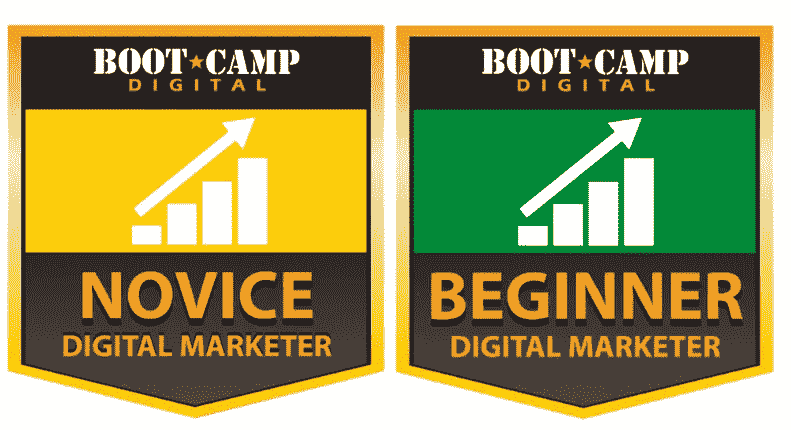

# 该机构的数字智商测试如何产生漏斗顶端的线索[案例研究]

> 原文：<https://medium.com/hackernoon/how-this-agencys-digital-iq-test-generates-top-of-funnel-leads-case-study-ec284ee0c847>

您是否在努力创造足够多的漏斗顶端销售线索，以保持您的销售漏斗畅通无阻？

别担心，你不是唯一一个。

5 年前，许多网站提供信息产品，如电子书、网络研讨会、白皮书和各种独家内容，以换取电子邮件地址(大多数人认为这是漏斗顶端的领先优势)。

这些策略奏效了，而且在某种程度上仍然如此，但今天每个人和他们的母亲都提供这种免费赠品。

说服人们提供电子邮件地址以换取电子书变得更加困难。

或者，人们使用一个假的或备用的电子邮件地址来处理这些事情，因为大多数收件箱已经收到了足够多的电子邮件。

如今，你需要一些别的东西来真正从竞争中脱颖而出。

但那会是什么呢？

# 介绍销售线索挖掘测验

数字新兵训练营的首席执行官克里斯塔·内赫也在纠结同样的问题。

她经营着一家专门从事社交媒体和数字营销培训的机构，像许多其他人一样，他们提供信息产品。

他们的表现还不错，但几个月后，她看到越来越少的线索进来。

她得到的线索质量都在下降。

她需要新的东西。

就在那时，她和她的机构想出了一个名为“数字智商测试”的领先一代测验。

# 短格式对长格式

实际上，数字新兵训练营提供两种智商测试。简答题有 15 个问题，长答题有 64 个问题

突击测验:你认为哪个测验表现最好？

事实证明，长测试比短测试更好，因为有 64 个问题的智商测试有更高的转化率。

花时间和精力参加长时间测试的人更有可能给出他们的电子邮件地址，因为他们更有责任感和兴趣。

# 销售线索挖掘测验是如何进行的？

这个想法很简单，让人们填写几个问题，衡量他们在社交媒体和数字营销方面的知识，并给他们一些有价值的东西作为回报。

他们使用这个测试有两个原因:

1.  你的数字智商与你对培训的兴趣直接相关，而培训是他们的核心业务。如果有人花时间参加测试，这通常意味着他们有兴趣学习更多关于数字营销的知识。
2.  它帮助人们更好地了解他们的技能。一般来说，有两种人，一种说“我什么都不知道”，但这只是一小部分人。还有很多人会说:“哦，我什么都懂。”

但是俗话说“知道的越少，越觉得自己知道”。

数字智商测试的好处在于，它帮助人们看到他们知道和不知道的领域。这有助于他们更好地了解自己的技能，我们可以利用这些见解鼓励他们加入我们的培训计划。

克里斯塔选择留下电子邮件是可选的。

很奇怪，不是吗？

她认为，那些提供电子邮件地址的人会获得更高的质量，并有更大的机会转化为付费客户。此外，它还消除了许多虚假邮件或低质量的线索。

然而，为了吸引回答者提供他们的电子邮件地址，他们为他们的培训课程添加了一张折扣券，并向那些留下电子邮件地址的人展示了他们的成果。

# 但是为什么要用测验来产生线索呢？

在你的营销策略中使用小测验仍然是[最被低估的内容类型之一。](https://www.impactbnd.com/blog/3-of-the-most-underrated-types-of-content-you-should-try)

尤其是因为小测验是互联网上最常分享的内容之一？

实际上，[2017 年脸书上分享最多的前 10 个](http://buzzsumo.com/blog/the-most-shared-facebook-content-posts-videos/)帖子中有 2 个是小测验。他们在创造销售线索以及以互动的方式发现受众的需求和偏好方面创造了奇迹。人们更有可能参与测验，而不是参与静态内容或填写联系表格。

最重要的是，互动内容如测验产生的转化率是静态内容的两倍。

作为一家公司，你可以更多地了解你的受众，这样你就可以根据他们的测验结果来推广相关的产品或服务。

# 你如何推广小测验？

像大多数内容一样，你不能只是创建它就完事了。为了使它成功，你需要积极地推广它。有多种方法可以让你的测验吸引尽可能多的眼球。

*   **有机地**

有机地推广你的内容是一个公司可能犯的最大的错误之一。有了纯有机策略，你可以免费转化和吸引新客户。

这是每个人都想要的，对吗？

国际知名的获奖性学家 Jaiya 也提出了类似的想法。她的互动测验被称为“情色蓝图”。

这个测验帮助人们发现并谈论性和他们的性行为。这项测试已经启动并运行了不到一年，平均每月带来 5000 条新线索，最高可达 20000 条。感谢它在谷歌的高排名。

*   **付费广告**

Krista 尝试了付费广告，但是它很快变得非常昂贵。因为他们不需要电子邮件地址，他们查看他们的每次点击成本，然后将其转换为每次转换成本。获取电子邮件地址变得非常昂贵，因为最终很多人都不愿意分享他们的电子邮件地址。所以投资回报并不存在。

*   **通过社交分享**

通过分享平均分，你可以对其进行基准测试，比如“这是你可以做的”，并推广你的课程和培训。

另一种方法是将其分类，这样人们就知道他们在搜索引擎优化、社交媒体和在线广告上的得分。这将使它变得更加有趣和有价值。

# 收集电子邮件地址后会发生什么？

一旦获得了销售线索的电子邮件地址，您应该做什么？

像 Krista 一样，您可以轻松地使用结果来细分您的受众。当人们完成测试时，他们会收到基于他们分数的个性化结果。

克里斯塔是这样做的:

考试成绩不好的人会收到一个新手或初学者徽章。Boot Camp Digital 鼓励他们去做认证或获得一个全权限通行证，在那里他们可以真正学到他们需要知道的一切，以获得更多的信心和更好的结果。

在测试中得分高的人会获得中级或高级徽章。他们已经知道很多关于数字营销的知识，但总有改进的空间。他们可以参加高级课程或加入专家小组，以了解数字营销的最新趋势。

总有改进的空间。

对于未来，Krista 希望向受访者发送一份个性化报告，其中包含对所有数字营销方面的分析，以及参与者相对于平均水平或基准的表现。

Krista 希望更多地关注促销。从领先一代的角度来看，这不仅会让数字智商测试成为更有效的工具，给人们带来新的有趣的东西。但他们也可以接触到网站和现有渠道之外的人，这将使这种策略成为一个全垒打。

[阅读完整的案例研究。](https://surveyanyplace.com/boot-camp-digital-case-study/)