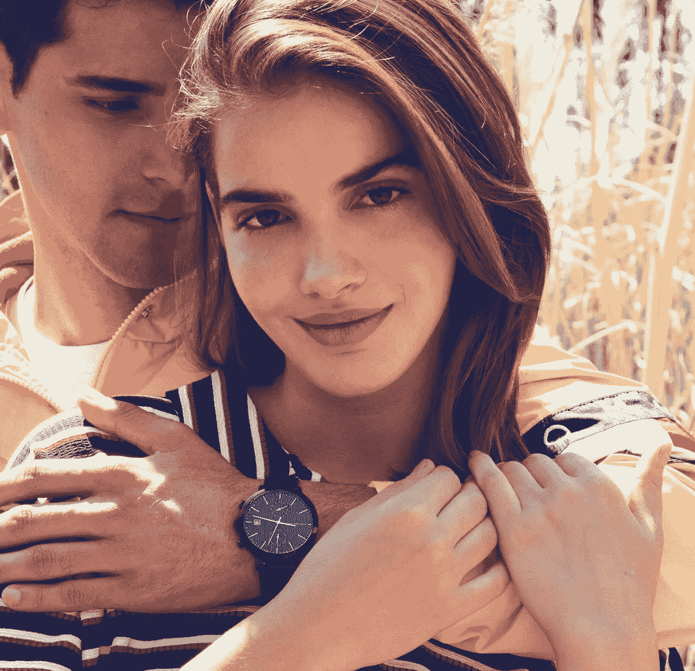

# 这家手表公司如何应对昂贵的顶级品牌

> 原文：<https://medium.com/hackernoon/how-this-wrist-watch-company-can-take-on-expensive-top-of-the-line-brands-ecc455f779cc>

世界上有那么多国际[腕表](https://hackernoon.com/tagged/wrist-watch)公司。但是很难找到一个价格合理的。最近，一家名为 [Niklaas Fritz](https://hackernoon.com/tagged/niklaas-fritz) (NF)的新制表公司找到我，对他们的产品进行评估。他们简单而又酷的设计给我留下了深刻的印象。

如今，手表不仅仅是用来看时间或核对时间的。更多的是展示你的风格和个性。你戴的手表类型决定了你的个性。这是一种激情和表达自己的方式。

# 那么 NF 有什么蹊跷？

NF 以合理的价格提供高质量的手表，他们声称他们的手表质量优于他们的竞争对手。

他们在腕表中使用了多种奢华材料，如蓝宝石水晶、全粒面皮革和不锈钢。价格较低的时计的独特设计和奢华感使它们脱颖而出，将竞争对手甩在身后。

> Niklaas Fritz 的创始人兼首席执行官 Juan Pablo 表示:“市场上有许多优质腕表，但价格昂贵，因此并非所有人都能买得起。”。“这就是我创立 NF 的原因，以实惠的价格提供优质的时计。”

这个品牌适合所有年龄的人，无论是青少年还是 30 岁的男性/女性，他们都想去不同的地方旅行，同时保持自己的风格，并有值得记住的经历。就像这款手表一样，带着自信和优雅去任何地方。

# 定价

价格从 150 美元到 200 美元不等，对于高质量的产品来说是可以承受的。特别是对时尚和腕表感兴趣的人，会发现 NF 时计独特、现代、经典。

此外，据其首席执行官称，Niklass Fritz 将于今年推出，现在可以在众筹期间以早鸟折扣购买。

没有什么比戴一只好看的手表更有品位的了。NF 戴在你手上看起来最有品位。所以，不要错过购买你最喜欢的手表的时间。保持优雅！

[Niklaas Fritz](https://niklaasfritzwatches.com/) Kickstarter 活动现已上线。点击这里[认捐](https://www.kickstarter.com/projects/1395520808/niklaas-fritz-watches-transcending-time?ref=project_build)。