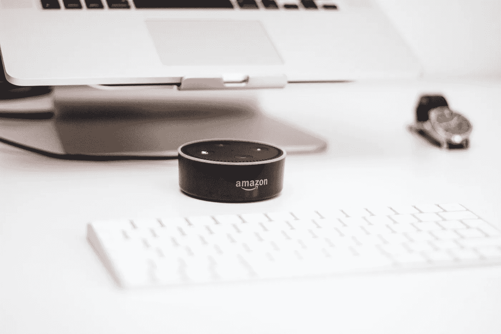

# 如何访问和管理您的语音命令数据

> 原文：<https://medium.com/hackernoon/how-to-access-and-manage-your-voice-command-data-f2a88c3015af>

过去的几年对于语音激活的命令服务来说是巨大的。似乎每个主要的科技制造商在市场上都有一个。

无论您使用的是亚马逊的 Alexa T1、T2 的谷歌 T3 助手、苹果的 Siri 还是微软的 Cortana，都很难忽视免提革命。

但是您的通信安全吗？您的命令是否真的保留在您和设备之间？所有这些信息都存储在哪里？

在决定是否要每天使用这些个人助理时，回答这些问题至关重要。

当需要访问、管理或删除您的命令历史时，它们也很重要。

# 始终打开？

与普遍观点相反的是，大多数这些设备并不“总是开着”。相反，他们只是在激活命令或“唤醒词”发出后才开始记录。

在 [Alexa 和回声设备](http://abc13.com/technology/how-amazon-echo-listens-and-what-it-stores-/1678523/)的情况下，命令是“Alexa”。对于[谷歌助手](http://www.newsobserver.com/news/business/biz-columns-blogs/article87059847.html)，这个短语是“OK Google”一些设备允许您从几种不同的唤醒词中进行选择。例如，Alexa 用户可以在默认单词“Alexa”和另外两个选项之一“Amazon”或“Echo”之间进行选择

所以在你说出这个神奇的短语之前，录音是不会开始的。这甚至可能足以让你安心。但需要注意的是，这些设备还会将您的语音命令存储在云中。因此，他们是黑客的主要目标。

# 将个人助理变成个人窃听装置

像大多数新技术一样，这些语音激活的命令服务[容易受到网络攻击](https://www.wired.com/story/amazon-echo-wiretap-hack/)。

亚马逊回声设备已经被黑了。英国安全专家马克·巴恩斯(Mark Barnes)最近展示了恶意软件如何将消费品变成实时音频监控流。你可以在他的官方博客上找到他的研究。

马克的黑客有一个很大的缺陷——它需要访问设备，并且需要对目标硬件进行物理修改。尽管如此，他的概念证明足以让全球许多消费者担忧。

# 蓝精灵的黎明

另一个黑客攻击——一个利用蓝牙技术的攻击——是在 2017 年末被发现的。

这种被称为 [BlueBorne](https://thehackernews.com/2017/11/amazon-alexa-hacking-bluetooth.html) 的攻击不涉及对任何设备的物理访问。它甚至不需要最终用户点击任何链接或打开任何文件。

因此，BlueBorne 有可能在亚马逊 Echo 和谷歌 Home 等设备的当前用户中造成广泛的破坏。

BlueBorne 只会越来越糟。该漏洞还可能控制远程设备，并感染同一网络上的所有其他设备。

好像这还不够，大多数现代恶意软件或反病毒程序甚至不会检测到攻击。

令人欣慰的是，这些设备中的大多数已经收到了固件更新，以修补漏洞。根据最近的估计，仍然有大约 2000 万台设备——主要是亚马逊 Echo 和谷歌 Home 产品——容易受到影响。

# 控制和管理您的文件

大多数设备都能让你轻松管理你的文件。亚马逊 Echo 允许你通过导航到你的设备设置和你的历史文件夹来[删除单个录像](https://www.cnet.com/how-to/amazon-echo-saves-all-your-voice-data-heres-how-to-delete-them/)。

在那里，只需点击一个项目，然后点击“删除录音”来完成操作。要删除所有内容，请在亚马逊官方网站登录您的亚马逊 Echo 帐户，然后导航至“管理录音”

虽然苹果最近披露 [Siri 存储数据长达 18 个月](http://www.zdnet.com/article/apple-stores-your-voice-data-for-two-years/)，但你可以关闭语音听写和 Siri 的辅助，以防止语音记录和存档。

[Google Home 用户可以通过导航到其 Google 账户的“我的活动”部分来删除过去的记录](https://www.cnet.com/how-to/how-to-delete-your-google-home-voice-recordings/)。就像亚马逊 Echo 一样，Google Home 可以让你删除单个或整组文件。

# 安全可靠地使用语音命令服务

虽然像亚马逊 Echo 和谷歌 Home 这样的设备代表了智能家居技术的巨大进步，但它们也不是没有缺点。

为了安全可靠地使用这些产品，请确保使用最新的补丁程序和增强功能来更新它们。

删除你过去的信息是一个很好的做法，可以在黑客攻击发生时将损失降至最低，但这也会妨碍你的设备的个性化。

最终，它归结为平衡您的安全性和隐私与您需要的功能数量。

*图片由*[*Piotr Cichosz*](https://unsplash.com/photos/eds4moomBRk?utm_source=unsplash&utm_medium=referral&utm_content=creditCopyText)