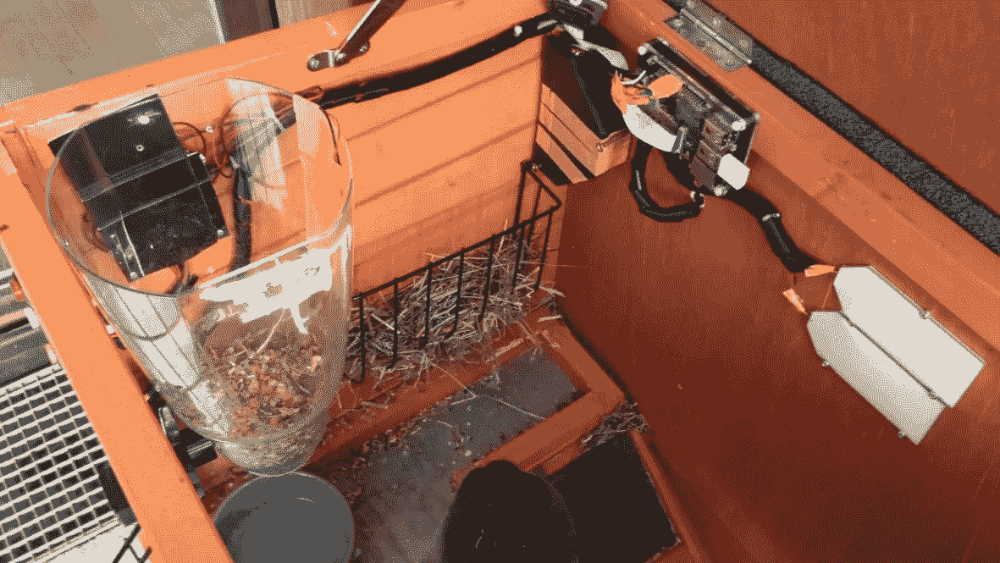
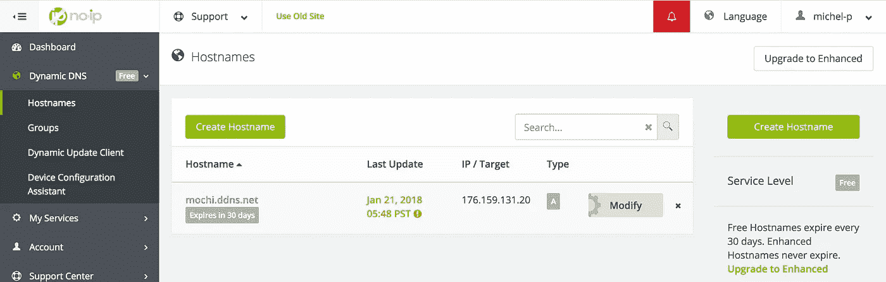
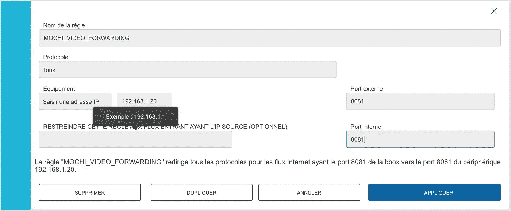
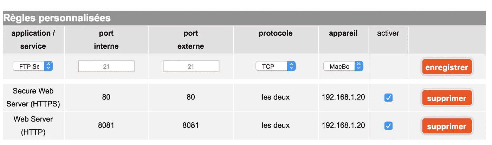
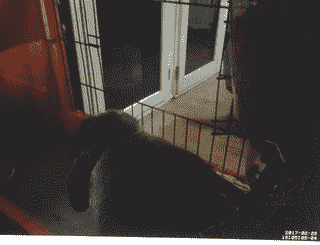
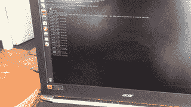

# 如何从任何地方访问您的 Raspberry Pi 相机

> 原文：<https://medium.com/hackernoon/how-to-access-your-raspberry-pi-camera-from-anywhere-544ab9e5bacc>

这篇文章是关于如何用树莓派监视你的宠物的系列文章的一部分，不要错过这里的第一步: [**用树莓派相机服务器监视你的宠物**](https://hackernoon.com/spy-your-pet-with-a-raspberry-pi-camera-server-e71bb74f79ea) 在这里我描述了如何设置相机流服务器！



Final result of the tutorials : a full connected cage !

为了从任何地方访问您的 Raspberry Pi，您需要能够进入您的家庭网络！从任何地方访问它的唯一方法是什么？你的 IP 地址！它基本上就像你的家庭地址，但在互联网上。

然而，大多数家庭网络的 IP 地址在一定时间后会动态改变。假设你直接用它来访问你的 PI，它只能工作很短时间，然后你需要回家再检查一次。

> 哦！那么我们是否可以在 Raspberry Pi 中创建一个脚本来检查我们的 IP 地址并将其发送回给我们呢？

你可以的！但假设你想建立一个网站或应用程序，使用这个 IP 来访问你的 PI，你将不得不不断地做更新来改变 IP。这很烦人，对吧？

> 然后，也许我可以要求家里有固定的 IP 地址？

是啊！但是大多数互联网提供商仍然对固定 IP 地址收费。这就是为什么我使用免费的 DDNS 工具。

# 无 ip 的动态 DNS

为了从任何地方访问我的 PI，我使用了一种叫做动态 DNS 或域名服务器的服务。它包括什么？

*   您为您的家庭网络选择一个名称，它会将请求重定向到存储在非 ip 服务器上的 IP 地址。我选择了[http://mochi.ddns.net](http://mochi.ddns.net)
*   您在您的 Raspberry PI 中安装 no-ip 脚本。这将确保您的家庭 IP 地址存储在 no-ip 总是更新。

> 我使用 [no-ip](https://www.noip.com/) 服务，因为你可以有一个免费的动态域名系统。网上还有很多其他服务，你可以选择任何适合你的服务。原理是一样的。

## 第一步:创建你的域名



在[订阅](https://www.noip.com/)之后，在仪表板中，只需进入“动态 DNS”部分。然后“创建主机名”。在下一个屏幕上选择一个名称，让选项默认并验证。现在让我们回到我们的圆周率！

## 步骤 2:在您的 PI 上安装 no-ip 脚本

先从 no-ip 下载脚本吧。在 Raspberry PI 终端上:

```
**# Create the directory, step into, and download the script**
mkdir /home/pi/noip
cd /home/pi/noip
*wget* [*http://www.no-ip.com/client/linux/noip-duc-linux.tar.gz* tar](http://www.no-ip.com/client/linux/noip-duc-linux.tar.gztar) vzxf noip-duc-linux.tar.gz
```

这应该已经创建了另一个目录，其中包含一个由最新版本的 no-ip 脚本命名的文件夹。

```
**# Install no-ip script!** *cd noip-****<the_version_you_have_downloaded>***sudo make install
```

您将被提示使用您的 no-ip 帐户登录。之后，当被问及希望多久触发一次更新时，我推荐 15 分钟。现在让我们启动服务吧！

```
sudo /usr/local/bin/noip2
**# To confirm the service is running properly**
sudo noip2 ­-S
```

最后一步，我们希望自动启动服务。如果我们不这样做，您将不得不在每次重新启动 Pi 后都这样做。

```
**# Open the boot file**
sudo nano /etc/rc.local**# Add this line at the bottom of the file (just before exit 0)**
/usr/local/bin/noip2
```

搞定了。现在我们有了一个自动系统，可以单独更新我们的域名 IP！棘手的部分来了。

# 配置您的 internet box

好的，我们有一个域名，它总是重定向到我们的家庭网络。然而，你的互联网盒子(又名**路由器**)不知道如何处理传入的请求！我们需要问*“嘿，请把进来的请求重定向到树莓派”。*所有的路由器都是不一样的，最好的办法就是用你的品牌和型号在网页上搜索“端口转发”。我会在这里强调你必须做的主要事情。

## **连接到你的路由器管理面板**

在 web 浏览器上，在 URL 栏中键入您的路由器 IP 地址。通常是 192.168.1.1 或 192.168.1.254。如果没有，它应该在你的路由器手册的某个地方。

1.  登录。默认情况下，凭据通常是 admin & admin 或 0000。
2.  在路由器管理页面中，找到**端口转发**部分。

## 配置端口转发到您的 PI

找到端口转发后，您需要添加一个新规则。下面是一个参数及其含义的示例。



French BBOX port forwarding configuration



French Livebox port forwarding configuration with a additional rule for a web server (80). From left to right : Application, internal port, external port, protocol, device, active

**内部端口**:raspberry Pi 上的端口，请求应该被重定向到该端口。在我们的例子中，如果你遵循第一个教程，视频流服务器在 8081。

**外部端口**:我们不希望所有请求都重定向到我们的 PI。只有那些针对摄像头服务器的。因为我们将使用浏览器或应用程序来访问我们的 Pi，所以我们可以使用任何我们想要的端口来请求我们的家庭网络。(例如，我们将使用 [http://mochi.ddns.net:XXXX)。](http://mochi.ddns.net:8081).)为了简单起见，我用了和视频流服务器一样的:8081。

**协议**:设置为全部。

**IP 地址/设备**:您家庭网络中 Pi 的 IP。这就是我们将要重定向传入请求的地方，这样它们就可以到达我们的 Pi。要找到它，请键入以下命令(在您的 Pi 上):

```
ifconfig
```

在命令行响应中，找到**“inet addr”**，这将为您提供 Raspberry Pi IP

```
wlan0 Link encap:Ethernet HWaddr 80:1f:02:aa:12:58
      **inet addr:192.168.1.8** Bcast:192.168.1.255 Mask:255.255.255.0
      ...
```

> 我们实际上是在告诉我们的路由器:请用端口 8081 将所有外界请求重定向到端口 8081 上的 raspberry Pi。

添加规则后，您可能需要重启路由器，最后我们都设置好了！

# 从任何地方访问您的 Raspberry PI 相机流

在上一个教程中，我们学习了如何安装 **Motion Pi。**还记得您为流服务器配置**端口的步骤吗？该端口是您系统上视频流的入口。现在我们要使用它…非常简单！**

⚠️尝试使用不同于你家的连接。例如，在你的智能手机上。当在本地网络中时，尝试使用 DDNS 可能不起作用。这是**路由器**的一个限制。

**从网上测试你的相机！**https://**<your _ ddns _ name>**. ddns . net:**<motion _ port>**

## **认证摄像机服务器**

为了保护您的相机，您可以添加用户名和密码。如果您已经按照[之前的教程](https://hackernoon.com/spy-your-pet-with-a-raspberry-pi-camera-server-e71bb74f79ea)使用 motion，您可以:

```
sudo vim /etc/motion/motion.conf
# Add this line in the file
webcontrol_authentication username:password
```

更多细节和选项见[运动文件](https://motion-project.github.io/motion_config.html#webcontrol_authentication)。

所有这些教程也适用于您的 raspberry PI 上的任何公开服务。例如，你可以在一个网络服务器上建立一个网站。(那么端口将是 80)。



Capture from a distant browser



Connected food dispenser! (Next article)

在我的下一篇文章中，我将向你展示如何用你的树莓派 来建造一个食物分发器，然后用网络服务器从任何地方**触发它**！

如果你喜欢这篇文章，并且它帮助你在你的 Pi 上构建了你自己的远程系统，请贴一张它=D！

非常感谢您的阅读。回头见。