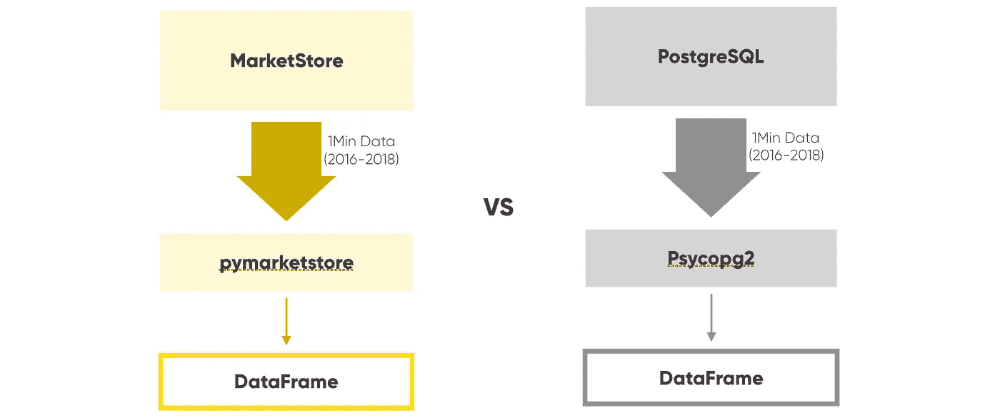

# 由 MarketStore 支持的人工智能交易的比特币价格数据速度提高了 50 倍

> 原文：<https://medium.com/hackernoon/how-to-achieve-50x-faster-bitcoin-price-data-queries-6864bed9349f>

在我们的上一篇文章“[如何在五分钟](https://blog.alpaca.markets/blog/2018/5/8/how-to-setup-bitcoin-historical-price-data-for-algo-trading-in-fiveminutes)内建立用于 Algo 交易的比特币历史价格数据”中，我们介绍了如何在五分钟内建立[比特币](https://hackernoon.com/tagged/bitcoin)价格数据，我们在开源的 [MarketStore](https://github.com/alpacahq/marketstore) 上获得了很多很好的反馈和贡献。


Photo by [chuttersnap](https://unsplash.com/photos/l75UcYjdiC0?utm_source=unsplash&utm_medium=referral&utm_content=creditCopyText) on [Unsplash](https://unsplash.com/search/photos/speed?utm_source=unsplash&utm_medium=referral&utm_content=creditCopyText)

# 数据速度非常重要

今天，我想告诉您 MarketStore 使用相同数据的速度有多快，以便您可以看到使用令人惊叹的开源金融时间序列数据库的性能优势。

## 更快的数据意味着更多的回溯测试和更多的机器学习训练

更快的数据意味着我们的交易算法需要更多的回溯测试和更多的机器学习训练。我们在这个领域看到了许多成功的基于机器学习的交易算法，但我们学到的关键点之一是**数据速度非常重要**。这不仅对于回溯测试很重要，对于**训练人工智能风格的算法也很重要，因为它本质上需要一个迭代过程**。

这是另一篇一步一步带你看的文章。但是 TL；博士，它真的很快。

# 设置



上次，我们展示了如何使用 MarketStore 设置历史每日比特币价格数据。

这一次，我们使用称为后台工作器的相同机制存储所有分钟级别的历史价格，但是配置略有不同。

```
root_directory: /project/data/mktsdb
listen_port: 5993
# timezone: "America/New_York"
log_level: info
queryable: true
stop_grace_period: 0
wal_rotate_interval: 5
enable_add: true
enable_remove: false
enable_last_known: false
triggers:
  - module: ondiskagg.so
    on: "*/1Min/OHLCV"
    config:
      destinations:
        - 5Min
        - 15Min
        - 1H
        - 1D
bgworkers:
  - module: gdaxfeeder.so
    name: GdaxFetcher
    config:
      query_start: "2016-01-01 00:00"
      base_timefame: “1Min”
      symbols:
        - BTC
```

## 将近 2.5 年，有超过 100 万根棒线

与上次不同的是，从 2016 年 1 月 1 日开始，后台工作器配置为获取 1 分钟棒线数据，而不是 1 天棒线数据。也就是**差不多 2.5 年有 100 多万根棒线**。您需要让服务器运行一天左右来填充所有数据，因为 GDAX 的历史价格 API 不允许您快速获取那么多数据点。

同样，数据提取工人小心地控制数据提取速度，以防 API 返回“速率限制”错误。所以你只需要睡一觉。

这里的附加配置称为“磁盘上聚合”触发器。它的作用是聚合较低分辨率的 1 分钟条形数据(此处为 5 分钟、15 分钟、1 小时和 1 天)。

## 检查较长的时间范围，以验证进/出信号

在一个典型的交易策略中，**你将需要检查更长的时间范围来验证进场/出场信号，即使你在分钟级别上工作**。所以这是一个非常重要的特性。您需要非常复杂的 LEFT JOIN 查询来实现 SQL 中相同的时间窗口聚合。但是使用 MarketStore，您所需要的只是配置文件中的这一小部分。

我们在本次测试中使用的机器是一台典型的 Ubuntu 虚拟机，配有 8 个英特尔至强处理器 E5–2673 v3 @ 2.40 GHz、32GB 内存和固态硬盘。

# 基准

我们将在 [python](https://hackernoon.com/tagged/python) 中拥有一个 DataFrame 对象，它保存了自 2016 年 1 月以来来自服务器的比特币的所有分钟级历史价格数据。我们比较 MarketStore 和 PostgreSQL。

## *不幸的是，这个领域的很多人都在使用某种 SQL 数据库*

PostgreSQL 并不真的是这种类型数据的存储库，但是不幸的是，这个领域的很多人都在使用某种 SQL 数据库来达到这个目的，因为没有其他选择。这就是我们建立 MarketStore 的原因。

PostgreSQL 端的比特币数据的表定义是这样的。

```
btc=# \d prices
             Table "public.prices"
 Column |            Type | Modifiers
--------+-----------------------------+-----------
 t      | timestamp without time zone |
 open   | double precision            |
 high   | double precision            |
 low    | double precision            |
 close  | double precision            |
 volume | double precision            |
```

代码如下所示。

```
# For postgres
def get_df_from_pg_one(conn, symbol):
   tbl = f'"{symbol}"'
   cur = conn.cursor()
   # order by timestamp, so the client doesn’t have to do it
   cur.execute(f"SELECT t, open, high, low, close, volume FROM {tbl} ORDER BY t")
   times = []
   opens = []
   highs = []
   lows = []
   closes = []
   volumes = []
   for t, open, high, low, close, volume in cur.fetchall():
       times.append(t)
       opens.append(open)
       highs.append(high)
       lows.append(low)
       closes.append(close)
       volumes.append(volume) return pd.DataFrame(dict(
       open=opens,
       high=highs,
       low=lows,
       close=closes,
       volume=volumes,
   ), index=times)# For MarketStore
def get_df_from_mkts_one(symbol):
   params = pymkts.Params(symbol, '1Min', 'OHLCV')
   return pymkts.Client('http://localhost:6000/rpc'
                        ).query(params).first().df()
```

## 获取 DataFrame 对象不需要太多的客户端代码

输入和输出基本相同，给出一个符号名，通过网络查询远程服务器，得到一个数据帧。MarketStore 的一个强大优势是**您不需要太多的客户端代码来获取 DataFrame 对象**，因为 wire 协议被设计为高效地给出一组数字。

# 结果呢

## 首先，PostgreSQL

```
%time df = example.get_df_from_pg_one(conn, 'prices')
CPU times: user 8.11 s, sys: 414 ms, total: 8.53 s
Wall time: 15.3 s
```

## 和市场商店

```
%time df = example.get_df_from_mkts_one('BTC')
CPU times: user 109 ms, sys: 69.5 ms, total: 192 ms
Wall time: 291 ms
```

当然，两种结果看起来都一样，如下图所示。

```
In [21]: df.head()
Out[21]:
                      open high low close   volume
2016-01-01 00:00:00  430.35 430.39 430.35  430.39 0.0727
2016-01-01 00:01:00  430.38 430.40 430.38  430.40 0.9478
2016-01-01 00:02:00  430.40 430.40 430.40  430.40 1.6334
2016-01-01 00:03:00  430.39 430.39 430.36  430.36 12.5663
2016-01-01 00:04:00  430.39 430.39 430.39  430.39 1.9530In [22]: df.shape
Out[22]: (1198274, 5)
```

## 50 倍的差异

当时一个比特币大约是 430 美元……无论如何，**你可以看到 0.3 秒和 15 秒之间的差异，这大约是 50 倍的差异**。请记住，您可能需要一次又一次地获得相同的数据，用于不同类型的回溯测试和优化以及 ML 训练。

此外，你可能不仅想查询比特币，还想查询其他硬币、股票和法定货币，因为整个数据库通常不适合你的主内存。

## MarketStore 的可扩展性优势

MarketStore 可以非常高效地在一个查询中提供多个符号/时间范围，而使用 PostgreSQL 和其他关系数据库，您需要一次查询一个表，因此当您需要多个工具时，MarketStore 还具有可伸缩性优势。

## 查询美股 7.7K 符号

为了给这种力量一点感觉，下面是作为内部测试对美国股票的 7.7K 符号进行查询的结果。

```
%time dfs = example.get_dfs_from_pg(symbols)
CPU times: user 52.9 s, sys: 2.33 s, total: 55.3 s
Wall time: 1min 26s%time dfs = example.get_dfs_from_mkts(symbols)
CPU times: user 814 ms, sys: 313 ms, total: 1.13 s
Wall time: 6.24 s
```

同样，数据量是相同的，在这种情况下，每个数据帧都不像比特币那样大，但扩展到大量工具时，差异是显著的(超过 10 倍)。你可以想象在现实生活中，这两个因素(每台仪器和多台仪器)会成倍增加数据成本。

## 羊驼一直在我们的生产中使用 MarkStore

羊驼一直在我们的生产中使用 MarkStore，用于我们的专有客户和我们自己的 algo 交易用例。令人惊讶的是，这个软件对每个人都是免费的，我们利用这项技术来帮助我们的 algo 交易客户。

[](https://medium.com/automation-generation)

## 请关注[羊驼](/@alpacahq)和[自动化世代](https://medium.com/automation-generation)关于金融市场、算法交易、技术的新帖子。

## 你可以找到我们[@羊驼 HQ](https://twitter.com/AlpacaHQ) ，如果你用 twitter 的话。

[](https://medium.com/automation-generation)

如果你是一名黑客，并且可以创建一些在金融市场中工作的很酷的东西，请查看我们的项目"[免佣金股票交易 API](https://alpaca.markets/?utm_source=medium&utm_medium=blog&utm_campaign=strategy_list&utm_content=part1) "，在那里我们免费提供简单的 REST 交易 API 和实时市场数据。

经纪服务由 FINRA/SIPC 成员 Alpaca Securities LLC([Alpaca . markets](https://alpaca.markets/?utm_source=medium&utm_medium=blog&utm_campaign=strategy_list&utm_content=part1))提供。羊驼证券有限责任公司是 AlpacaDB，Inc .的全资子公司。