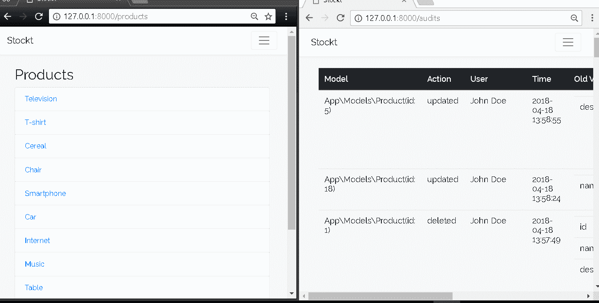

# 如何给你的 Laravel 项目添加实时审计跟踪

> 原文：<https://medium.com/hackernoon/how-to-add-a-realtime-audit-trail-to-your-laravel-project-a2fa70411c88>

审计线索是对数据模型所做的所有更改的记录。模型是可以存储在数据库中的任何实体，例如用户或产品。审计条目通常包含有关变更类型(创建、更新或删除)、*谁*进行了变更，以及*何时*进行了变更的信息。审计追踪通常用于大型应用程序中，在这些应用程序中，需要跟踪一个或多个模型随时间的变化。

在本教程中，我们将为一个简单的股票应用程序设置一个可供管理员访问的审计跟踪仪表板。我们的仪表板将实时更新，让我们可以随时看到更新。这是我们应用程序的预览:



# 先决条件

1.  PHP 7.1.3 或更高版本
2.  设计者
3.  推销账户。在这里创建一个。

# 设置

我们将从我构建的一个小型股票管理应用程序开始。您可以通过运行以下命令从 GitHub 克隆项目:

```
git clone [https://github.com/shalvah/stockt.git](https://github.com/shalvah/stockt.git)
```

您也可以直接从[这个链接下载源代码。](https://github.com/shalvah/stockt/archive/master.zip)

然后`cd`进入项目文件夹并安装依赖项:

```
composer install
```

接下来，将`.env.example`复制到一个名为`.env`的新文件中。运行以下命令生成应用程序加密密钥:

```
php artisan key:generate
```

最后，在`database`目录中创建一个名为`database.sqlite`的文件，并运行以下命令来设置和填充数据库:

```
php artisan migrate --seed
```

# 创建审计仪表板

我们将使用 [laravel-auditing](http://laravel-auditing.com/) 包来处理审计。让我们安装软件包:

```
composer require owen-it/laravel-auditing
```

接下来，我们将发布审计表的数据库迁移并运行它们:

```
php artisan auditing:install
php artisan migrate
```

我们将审核产品的变更。让我们配置我们的产品模型，以便审计包可以跟踪它。在您的`Product`型号(`app/Models/Product.php`)中:

*   `use`的`OwenIt\Auditing\Auditable`特质
*   `implement``OwenIt\Auditing\Contracts\Auditable`界面:

```
<?php

    namespace App\Models;

    use Illuminate\Database\Eloquent\Model;
    use OwenIt\Auditing\Contracts\Auditable;

    class Product extends Model implements Auditable
    {
      use \OwenIt\Auditing\Auditable;

      // ...
    }
```

现在，每当对产品进行更改时，更改的详细信息将记录在`audits`表中。

我们需要对我们的审计配置做一个小小的改变，这样`Audit`模型就可以正确地映射到我们的`User`模型。这将使我们能够编写像`$audit→user→name`这样的代码来检索做出更改的用户的名字。在文件`config/audit.php`中，用我们的用户模型的类名(`App\Models\User::class`)替换`user`数组中`model`的值

```
'user' => [
      'primary_key' => 'id',
      'foreign_key' => 'user_id',

      // replace the line below
      'model'       => App\User::class,

      // with this
      'model'       => App\Models\User::class,
    ],
```

现在，转到审计仪表板。首先，我们将创建一个只允许管理员用户查看页面的中间件。创建一个名为`AllowOnlyAdmin`的文件。php 在`app/Http/Middleware`中有如下内容:

```
<?php

    namespace App\Http\Middleware;

    use Closure;
    use Illuminate\Support\Facades\Auth;

    class AllowOnlyAdmin
    {
        public function handle($request, Closure $next)
        {
            if (Auth::user()->is_admin) {
                return $next($request);
            }

            abort(403);
        }
    }
```

接下来，在`routes/web.php`的末尾添加审核路线:

```
Route::get('audits', 'AuditController@index')
    ->middleware('auth', \App\Http\Middleware\AllowOnlyAdmin::class);
```

让我们创建控制器。我们将生成文件`app/Http/Controllers/AuditController`。php 通过运行:

```
php artisan make:controller AuditController
```

在`AuditController`类中创建一个`index`方法，内容如下:

```
public function index()
{
    $audits = \OwenIt\Auditing\Models\Audit::with('user')
        ->orderBy('created_at', 'desc')->get();
    return view('audits', ['audits' => $audits]);
}
```

让我们为我们的审计构建视图。创建包含以下内容的文件`resources/views/audits.blade.php`:

```
[@extends](http://twitter.com/extends)('layouts.app')

    [@section](http://twitter.com/section)('content')
      <div class="container">
        <table class="table" >
          <thead class="thead-dark">
            <tr>
              <th scope="col">Model</th>
              <th scope="col">Action</th>
              <th scope="col">User</th>
              <th scope="col">Time</th>
              <th scope="col">Old Values</th>
              <th scope="col">New Values</th>
            </tr>
          </thead>
          <tbody id="audits">
            [@foreach](http://twitter.com/foreach)($audits as $audit)
              <tr>
                <td>{{ $audit->auditable_type }} (id: {{ $audit->auditable_id }})</td>
                <td>{{ $audit->event }}</td>
                <td>{{ $audit->user->name }}</td>
                <td>{{ $audit->created_at }}</td>
                <td>
                  <table class="table">
                    [@foreach](http://twitter.com/foreach)($audit->old_values as $attribute => $value)
                      <tr>
                        <td><b>{{ $attribute }}</b></td>
                        <td>{{ $value }}</td>
                      </tr>
                    [@endforeach](http://twitter.com/endforeach)
                  </table>
                </td>
                <td>
                  <table class="table">
                    [@foreach](http://twitter.com/foreach)($audit->new_values as $attribute => $value)
                      <tr>
                        <td><b>{{ $attribute }}</b></td>
                        <td>{{ $value }}</td>
                      </tr>
                    [@endforeach](http://twitter.com/endforeach)
                  </table>
                </td>
              </tr>
            [@endforeach](http://twitter.com/endforeach)
          </tbody>
        </table>

      </div>
    [@endsection](http://twitter.com/endsection)
```

您可以通过运行以下命令来启动您的应用程序:

`php artisan serve`

然后在 [http://localhost:8000](http://localhost:8000/) 上访问你的 app。这个`stockt`应用有两个默认用户:一个管理员用户(Administrator， [admin@stockt.test](mailto:admin@stockt.test) )和一个普通用户(John Doe， [john@stockt.test](mailto:john@stockt.test) )。(两个密码:`secret`)以 John Doe 和管理员的身份登录您的应用程序，并对主页上显示的一些产品进行更改。然后以管理员身份访问[http://localhost:8000/audits](http://localhost:8000/audits)查看所有用户所做的所有更改列表。

# 实时显示新审计

现在我们已经让我们的审计仪表板工作，但我们需要重新加载页面，每当我们希望看到任何新的变化。这就是我们由 Pusher 驱动的实时功能的用武之地。我们来实施吧。

首先，我们将在后端设置 Pusher。安装推杆拉韦尔组件:

```
composer require pusher/pusher-http-laravel 
php artisan vendor:publish --provider="Pusher\Laravel\PusherServiceProvider"
```

编辑您的`config/pusher.php`,使其看起来像这样:

```
'connections' => [
      'main' => [
        'auth_key' => env('PUSHER_APP_KEY'),
        'secret' => env('PUSHER_APP_SECRET'),
        'app_id' => env('PUSHER_APP_ID'),
        'options' => [
          'cluster' => env('PUSHER_APP_CLUSTER'),
        ],
        'host' => null,
        'port' => null,
        'timeout' => null,
      ],
    ],
```

登录[您的 Pusher 仪表盘](http://app.pusher.com/)并创建一个新应用。从**应用密钥**部分复制您的应用凭证，并将其添加到您的`.env`文件中:

```
PUSHER_APP_ID=your-app-id
PUSHER_APP_KEY=your-app-key
PUSHER_APP_SECRET=your-app-secret
PUSHER_APP_CLUSTER=your-app-cluster
```

> *注意:Laravel 有时会缓存旧的配置，因此为了让项目看到您的新配置值，您可能需要运行命令* `*php artisan config:clear*`

每当创建一个新的审计时，`laravel-auditing`包就会触发一个名为`Audited`的事件。我们将监听这个事件，并在 Pusher 上触发一个`new-audit`事件。我们的前端将监听这个事件，并向表中添加新的审计项。

创建事件监听器，`app/Listeners/AuditedListener.php`，内容如下:

```
 <?php

    namespace App\Listeners;

    use OwenIt\Auditing\Events\Audited;
    use Pusher\Laravel\Facades\Pusher;

    class AuditedListener
    {
      public function handle(Audited $event)
      {
        $audit = $event->audit->toArray();
        $audit['user_name'] = $event->audit->user->name;
        Pusher::trigger('audits', 'new-audit', ['audit' => $audit]);
      }
    }
```

接下来，我们将在`app/Providers/EventServiceProvider.php`中注册事件监听器:

```
class EventServiceProvider extends ServiceProvider
    {
      protected $listen = [
          \OwenIt\Auditing\Events\Audited::class => [
              \App\Listeners\AuditedListener::class
              ]
      ];

      // ...
    }
```

下面是我们将用来处理该事件的代码。我们拉进`pusher-js`库，订阅`audits`频道并绑定到`new-audit`事件。当一个事件进来时，我们建立一个新的行并将其插入到表的顶部。将代码添加到您的`resources/views/audits.blade.php`的末尾:

```
<script src="[https://js.pusher.com/4.2/pusher.min.js](https://js.pusher.com/4.2/pusher.min.js)"></script>
    <script>
      var socket = new Pusher("your-app-key", {
          cluster: 'your-app-cluster',
      });
      socket.subscribe('audits')
          .bind('new-audit', function (data) {
              var audit = data.audit;
              var $modelCell = $('<td>').text(audit.auditable_type + '(id: ' + audit.auditable_id + ')');
              var $eventCell = $('<td>').text(audit.event);
              var $userCell = $('<td>').text(audit.user_name);
              var $timeCell = $('<td>').text(audit.created_at);

              function createSubTable(values) {
                var $table = $('<table>').addClass('table');
                  for (attribute in values) {
                    $table.append(
                      $('<tr>').append(
                        $('<td>').text(attribute),
                        $('<td>').text(values[attribute])
                      )
                    );
                  }
                  return $table;
              }

              var $oldValuesTable = createSubTable(audit.old_values)
              var $newValuesTable = createSubTable(audit.new_values)

              var $oldValuesCell = $('<td>').append($oldValuesTable);
              var $newValuesCell = $('<td>').append($newValuesTable);

              $newRow = $('<tr>').append(
                $modelCell,
                $eventCell,
                $userCell,
                $timeCell,
                $oldValuesCell,
                $newValuesCell
              );
              $('#audits').prepend($newRow);
          });
    </script>
```

将`your-app-key`和`your-app-cluster`替换为您的 Pusher app 密钥和集群，我们就完成了！

让我们测试一下这个应用程序。如前所述启动您的应用程序。在一个浏览器中以 John Doe 的身份登录，在另一个浏览器中以 Administrator 的身份登录，这样就可以维护并发会话。尝试以 John Doe 的身份更改某些产品，同时以管理员的身份查看控制面板。这些更改应该会实时显示在仪表板上。

# 结论

在本文中，我们向现有应用程序添加了一个审计仪表板。我们已经通过在审计发生时在仪表板上显示审计来添加实时功能。感谢 Laravel 和 Pusher，我们能够以最小的压力实现这些目标。你可以在 [GitHub](http://github.com/shalvah/stockt-audited) 上查看完整应用的源代码。

*原载于* [*推手的博客*](https://pusher.com/tutorials/realtime-audit-trail-laravel) *。*