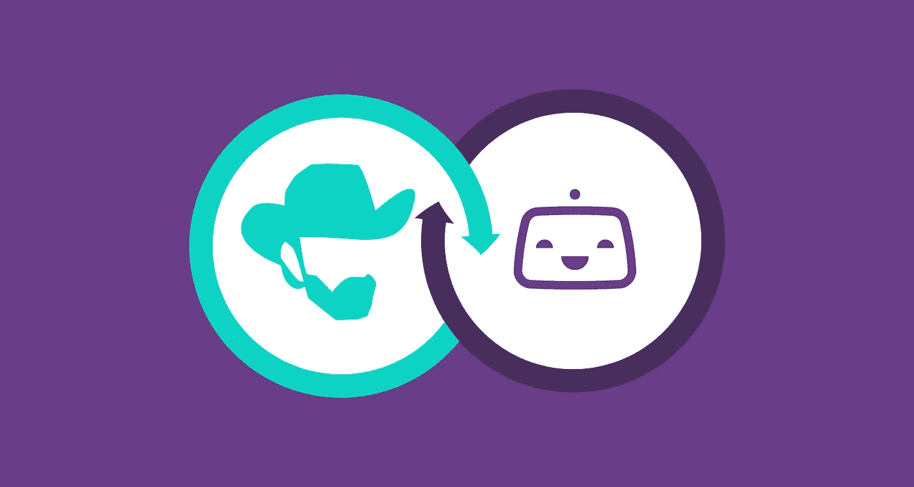

# 如何将 Chuck Norris 笑话添加到 Bitrise 构建日志中

> 原文：<https://medium.com/hackernoon/how-to-add-chuck-norris-jokes-to-bitrise-build-logs-6a02a4a72c7>

你可能认为 CI(持续集成)只包括技术任务，如单元测试、代码编译或静态代码分析。然而，**有时候你可能想给无聊的构建日志**:)增加一点乐趣，如果你熟悉 Jenkins **你可能听说过** [**查克·诺里斯插件**](https://plugins.jenkins.io/chucknorris) ，其中**给构建**增加了关于 [**查克·诺里斯**](https://en.wikipedia.org/wiki/Chuck_Norris) **的有趣事实/笑话。**

在我向您展示如何将这样的功能添加到 [Bitrise.io](https://www.bitrise.io/) 之前，让我解释一下，什么是 Bitrise.io。

## 什么是 Bitrise.io？

[**Bitrise**](https://devcenter.bitrise.io/) **是一家持续集成和交付(CI/CD)平台即服务(PaaS)，主要专注于移动应用开发。几年前，在 Droids On Roids，我们将 CI/CD 平台从 [Jenkins](https://jenkins.io/) 换成了 Bitrise。这次迁移的主要原因是更好地适应移动(原生 Android 和 iOS 项目)和更快地修复错误(例如，Jenkins Android emulator 插件中的 [this my PR](https://github.com/jenkinsci/android-emulator-plugin/pull/61) 已经等待了大约 1.5 年的审查)。然而，Bitrise 上缺少了一个额外的小功能…没有查克·诺里斯笑话的[集成](https://www.bitrise.io/integrations/steps)。**

## 实现 Chuck Norris 笑话集成

向构建日志添加笑话的过程非常简单。我们只需要获得一个笑话文本，并将其打印到日志中。当然，我们不能忘记适当的错误处理。

让我们从安装 [Bitrise CLI](https://app.bitrise.io/cli) 和调用`bitrise :step create`开始。你可以在我之前的博客文章中找到更多关于步骤创建的信息:[如何在 Go-Flutter 示例中创建 Bitrise 步骤](https://www.thedroidsonroids.com/blog/how-to-create-bitrise-step-in-go-flutter-example)。

Bitrise **官方支持两个编写集成的工具包(所谓的步骤):**[**bash**](https://www.gnu.org/software/bash/)**(shell 脚本)和** [**go**](https://golang.org/) **。**乍一看，这个集成看起来微不足道，因此它可能是 shell 脚本的一个很好的候选。然而，由于我们需要一些基本的逻辑，如验证或错误处理，而 Bitrise 提供了可以帮助我们的库，我们将使用 golang toolkit。

## ➡笑话的来源

詹金斯插件使用[硬编码笑话文本](https://github.com/jenkinsci/chucknorris-plugin/blob/master/src/main/java/hudson/plugins/chucknorris/FactGenerator.java)。这是实现起来最简单的源代码。然而，它也有一个主要的缺点。添加一个新笑话需要每次发布一个新版本的 Bitrise 步骤。这些版本中的每一个都需要得到批准，用户需要在他们的[工作流](https://devcenter.bitrise.io/getting-started/getting-started-workflows/)中[更新步骤版本](https://devcenter.bitrise.io/getting-started/getting-started-steps/#managing-step-versions)(除非他们选择了“总是最新”版本)。通常，将数据从逻辑中分离出来是一个好主意。

我们可以从外部免费的 API 获取笑话。比如[**chuck Norris . io**](https://api.chucknorris.io)**。这个包含许多不同的笑话，它是开源的，支持纯文本回复，所以它完全符合我们的需求。不过，也有[其他替代方案](https://www.google.com/search?q=chuck+norris+api)。**

## ➡配置

虽然这一步执行的任务看起来很简单——我们只需要下载笑话并显示它们，但是通过允许配置一些参数来引入一点灵活性也是有用的。首先是 API 主机 URL，出于隐私原因，可能需要使用不同于公共 chucknorris.io 的 URL，例如自托管实例。chucknorris.io 的所有后端组件都是[开源的](https://github.com/chucknorris-io)，所以应该不成问题。

其次，我们可能要**定制段子类别**。人们可能更喜欢某个特定的。API 中有一个查询参数。

**配置参数使用** [**步进输入**](https://devcenter.bitrise.io/bitrise-cli/step-inputs/) **指定。**它们在工作流编辑器 GUI 中显示为表单字段，并作为环境变量注入到构建中。新生成的步骤包含样本输入。当添加实际输入时，我们可以基于它。定制后，输入部分应该如下所示:

请注意以下几点:

1.  输入名称(`category`和`api_base_url`)使用小写字母书写。
2.  `api_base_url`被标记为必填项，这一事实将在工作流编辑器中得到反映。
3.  `api_base_url`的默认值设置为`https://api.chucknorris.io`，因此用户不需要明确指定。

好了，我们已经定义了输入。现在我们可以尝试读取它们的值。幸运的是，Bitrise 提供了 [steputils](https://github.com/bitrise-tools/go-steputils) 库，它为我们做了所有的工作。我们只需要为配置定义数据结构:

请注意 Go 和 YAML 不同的命名规则。使用 [struct 标签](/golangspec/tags-in-golang-3e5db0b8ef3e)指定名称映射以及附加属性(值是否需要)。现在我们可以简单地从环境中读取输入:

如果出现错误(例如，所需的输入不存在)，我们会在构建日志中打印一条消息，并以失败代码退出，不会执行后续指令。

## ➡听懂了笑话

下载笑话的过程可以分为几个阶段。首先，我们需要基于配置参数(API 主机 URL 和类别)创建一个 HTTP 请求:

请注意，我们请求纯文本响应，因此不需要在接下来的步骤中处理它来获得实际的笑话文本。所有的错误都会传播给调用者，我们将在顶层函数中处理它们。

接下来，我们执行请求:

这里唯一的定制是超时设置为 20 秒。这很重要，因为默认情况下超时是无限的，所以 step 可能会挂起构建。

最后，我们可以从响应中读取文本:

我们需要显式地检查 HTTP 状态代码。如果没有这些，在出现错误的情况下，我们可以开玩笑说文本是 *500 内部服务器错误*。请注意，错误消息以小写字母开头。将它们大写是错误的，因为它们以后会被附加到前缀上。

将所有这些步骤连接在一起后，我们应该得到如下代码:

除了调用上述函数，我们还有延迟响应体关闭。它将在封闭函数完成后关闭。请注意，如果关闭失败，我们不能将此错误返回给调用者。我们记录下来，而不仅仅是忽略。吞咽错误被认为是一种不好的做法，像 [errcheck](https://github.com/kisielk/errcheck) 这样的静态代码分析工具会抱怨这一点。

## ➡展示输出

当我们有一个笑话文本时，我们唯一需要做的就是将它打印到构建日志中，其中包含了在构建过程中打印到标准输出和标准错误的所有内容。此外，我们可以将笑话文本作为步骤[输出](https://devcenter.bitrise.io/bitrise-cli/step-outputs/)导出，这样它可能会被后续步骤使用，例如通过在 slack 消息中发布。最后，我们的主(顶层)函数如下所示:

注意，我们使用了来自 [go-utils](https://github.com/bitrise-io/go-utils) 的`log`来打印彩色消息。如果成功，我们不需要用代码`0`显式退出，因为这是默认值。此外，导出需要使用 [envman](https://devcenter.bitrise.io/tips-and-tricks/expose-environment-variable/) 来完成，envman 将导出添加到后续步骤可访问的 envstore 中。如果我们只是[为当前进程设置](https://golang.org/pkg/os/#Setenv)环境变量，它将在步骤完成后丢失。请记住，输出应该在`step.yml`中声明，以便在工作流编辑器中可见。按照惯例，输出名称用大写字母书写:

## 步骤属性

默认情况下，当 Bitrise 上的步骤失败时，整个构建被视为失败，并且不会执行后续步骤。这些行为不符合我们的用例。我们希望总是得到笑话(即使前面的一些步骤已经失败了)，并且**我们不希望在得到笑话的过程中那些失败影响到整体的构建结果**。例如，用户很不高兴[拉取请求状态检查](https://help.github.com/articles/about-status-checks/)仅因下载 Chuck Norris 笑话期间的错误而失败，并且 PR 无法合并。

**为了实现期望的行为，我们需要通过将** `**is_always_run**` **和** `**is_skippable**` **设置为 true 来调整步骤配置。**第一个步骤告诉我们，即使构建被标记为失败(前面的一些步骤已经失败)，也应该开始该步骤。用户将能够在工作流编辑器中覆盖该设置。Skippable step 意味着它的失败不会影响整个构建状态——它仍然可以成功。如果你真的需要一个笑话，可以在`bitrise.yml`配置文件中覆盖这个设置。

## 需要一个成功的团队？

我们是 100%基于办公室的团队，在移动& web 应用程序开发方面有 7 年的经验

[估算项目](https://www.thedroidsonroids.com/estimate-project)

## 词中之词

Bitrise steplib 提交清单[中的一个元素](https://github.com/bitrise-io/bitrise-steplib/blob/master/PULL_REQUEST_TEMPLATE.md)表示该步骤应该在其 repo 中包含测试工作流。默认情况下，它包括运行步骤。然而，Bitrise 提供了几个实用程序，用于持续集成 Go 中编写的步骤: [golint](https://www.bitrise.io/integrations/steps/golint) ， [errcheck](https://www.bitrise.io/integrations/steps/errcheck) 和 [Go test](https://www.bitrise.io/integrations/steps/go-test) 。所有这些步骤都需要知道哪个是被测试的 Go 包。最简单的方法是使用 [Go list](https://www.bitrise.io/integrations/steps/go-list) step。完整的工作流程如下所示:

注意，我们在那里添加了 [go vet](https://golang.org/cmd/vet/) 。这是 Golang 的官方静态分析工具。

## 出版

Bitrise devcenter 包含[教程](https://devcenter.bitrise.io/bitrise-cli/create-your-own-step/#sharing-a-new-step)关于分享自己的步骤。然而，还有一个`share-this-step`工作流，它结合了所有这些指令。步骤共享过程需要`MY_STEPLIB_REPO_FORK_GIT_URL`环境变量。可以使用`.bitrise.secrets.yml`文件提供，如下所示:

默认情况下，该文件被忽略，不会签入版本控制。我们还增加了一点改进。我们检索当前的 git 标签:`--tag $(git describe --tags --exact-match)`，而不是在`BITRISE_STEP_VERSION`变量中硬编码步骤版本。在这种情况下，没有必要在两个不同的地方分配相同的版本——在 git 标签和`bitrise.yml`中。真理只有一个来源。

## 包裹

正如你所看到的，持续集成不仅包括技术任务，你也可以做有趣的事情:)在 Bitrise CI 平台的情况下，我们可以很容易地以 steps 的形式开发和共享我们自己的扩展。

完整的源代码可以在 [GitHub](https://github.com/DroidsOnRoids/bitrise-step-chuck-norris) 上获得。

