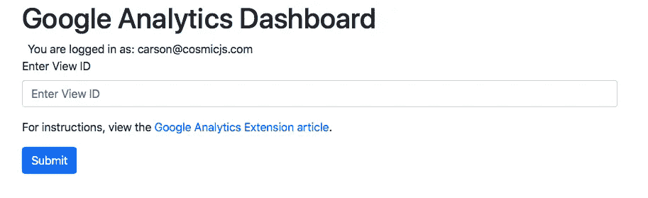
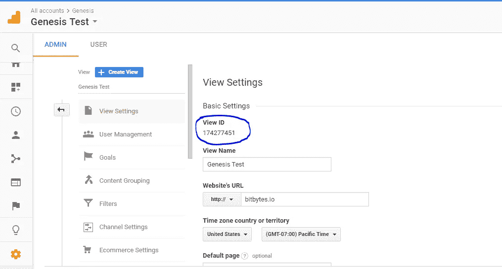
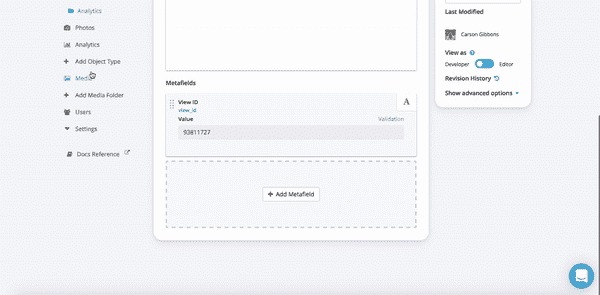

# 如何在 Cosmic JS 中添加谷歌分析洞察

> 原文：<https://medium.com/hackernoon/how-to-add-google-analytics-insights-in-cosmic-js-5fb8191f21d0>

Cosmic JS 扩展使开发人员和编辑人员扩展 Cosmic JS 的功能成为可能。开发人员可以创建交互式视图、连接第三方 API 和定制编辑器体验。

最近由 Cosmic JS 社区构建的一个例子是[谷歌分析扩展](https://cosmicjs.com/extensions/google-analytics)，它允许团队成员直接在他们的 [Cosmic JS](https://cosmicjs.com) 桶仪表板中轻松查看分析见解。在这篇博客中，我将向你展示如何通过三个简单的步骤将 Google Analytics 扩展安装并集成到你的 Cosmic JS 仪表板中。

**TL；DR:** [谷歌分析扩展](https://cosmicjs.com/extensions/google-analytics) [谷歌分析扩展代码库](https://github.com/cosmicjs/google-analytics-extension) [谷歌分析扩展文章](https://cosmicjs.com/articles/google-analytics-extension-jgntlka0)

**第一步:安装谷歌分析扩展到你的宇宙 JS 桶**

**步骤 2:通过您的视图 ID 将您的扩展连接到 Google Analytics**

**您的 GA 视图 ID 可以在 GA >设置>视图设置>视图 ID** 中找到

**第三步:从您的 Cosmic JS 仪表盘查看见解&分析🚀**

我希望本教程对你有所帮助。如果您对 Cosmic JS 系统中的内容编辑器特性有任何问题或意见，我很乐意倾听。你可以参考我的 [Cosmic JS 个人资料](https://cosmicjs.com/carsongibbons)来获取更多关于如何直观地导航 Cosmic JS 仪表盘的内容。