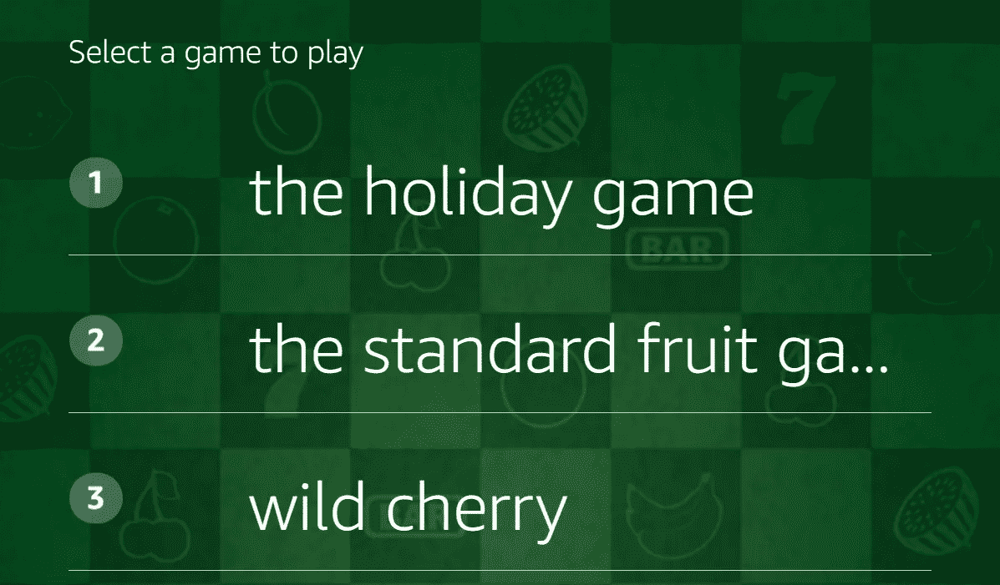

# 如何将技能产品添加到你的 Alexa 技能中

> 原文：<https://medium.com/hackernoon/how-to-add-in-skill-products-to-your-alexa-skill-fa57adbcd55e>


自从亚马逊宣布能够为开发 Alexa 技能的开发者提供技能内购买，我已经为两种不同的技能添加了四项优质内容。我最近发表了一篇关于[为什么您应该考虑添加优质内容](/@garrettvargas/why-you-should-add-premium-content-to-your-alexa-skill-spoiler-its-not-for-the-money-17118879096f)的文章，在这篇文章中，我将通过一步一步的代码示例向您展示如何通过 ASK SDK 实现这一点。

## 技能产品的类型

在进入代码之前，我想回顾一下亚马逊为 Alexa 提供的技能产品(或 ISP)的类型，你可以使用它们的不同方式，以及关于你何时以及多久提醒你的客户关于你的内容的一些注意事项。

您的技能可以提供三种类型的 ISP:

*   **权利**:这些产品基本上是一个开关。他们通常会在您的技能范围内选择一项功能，一旦客户购买了该产品，他们就可以持续使用该功能。这些都是典型的功能，如扩展包，额外的水平，或高级音效。
*   **订阅**:订阅提供对某个功能或内容的访问，但与授权不同，客户按月或按年为该功能付费。一旦取消，用户将无法访问高级功能。您通常会为具有持续发展内容的功能提供订阅，例如访问歌曲或视频库。您也可以通过订阅提供免费试用期。
*   **易耗品**:易耗品是可以购买、使用、再购买的产品。例子包括游戏中的额外生命或设定数量的提示。

一旦你决定了你想提供哪种类型的产品，你就应该考虑如何向你的顾客传达这种产品的信息。你可以在主页上描述你的技能，但由于许多客户没有仔细阅读内容，你需要通过你的语音内容让他们了解你提供的产品。让用户意识到这些内容并提高你的转化率的最好方法是在谈话的自然部分进行，这时优质内容可能会有用:

*   如果你为一个游戏提供一个有额外关卡的扩展包，你可能想在一个已经完成所有内置关卡的返回用户启动你的技能时提供它。
*   如果你提供一个不同的游戏作为多游戏技能的一部分，你可能想在用户试图从一个游戏切换到另一个游戏时提供它。
*   如果你提供额外的生命或提示，你可能想在玩家用完他们当前所有的生命或提示时提供，作为继续游戏的一种方式。
*   这也是一个最佳实践，让客户探索你能提供什么——回应诸如“你有什么可买的？”
*   如果客户拒绝了购买优质内容的提议，你应该进入指数补偿模式——在随后的技能使用中越来越少地提供内容。我建议你不要完全停止提供你的优质内容。我见过拒绝追加销售的客户最终接受了报价。



Selecting a new machine in Slot Machine

对于代码示例，我将引用我在吃角子老虎机技能中提供购买的一个高级游戏。老虎机允许客户玩多台机器，他们可以说“选择不同的游戏”，从一台机器切换到另一台机器。我的优质内容可以在三个地方之一呈现给用户——当他们第一次启动技能时，当他们切换到不同的机器时，以及在连续玩同一台机器给定时间后。

## 使用 CLI 添加您的产品

为了给你的 Alexa 技能添加一个技能内产品，你必须使用 ASK CLI。如果您还没有使用 CLI，[请按照这些说明中的步骤 1–3](https://developer.amazon.com/docs/smapi/quick-start-alexa-skills-kit-command-line-interface.html)进行设置。一旦你设置好了，你会想要克隆你想要添加一个高级产品的技能。使用克隆命令完成此操作

```
ask clone
```

这将为您提供一个您的 Alexa 技能列表。使用箭头键选择您想要克隆的技能，然后按 enter 键。如果您在机器上使用 Lambda 函数，克隆将复制技能清单、元数据和代码。有了这个本地副本之后，转到新克隆的技能的根目录，并使用这个命令来设置您的内置技能产品。

```
ask add isp
```

这将为您提供一个可以添加的产品类型列表

```
List of in-skill product types you can choose (Use arrow keys)
> Consumable
  Entitlement
  Subscription
```

选择您想要使用的模板，并接受您看到的默认模板。完成后，系统会提示您输入新技能产品的名称。假设你叫它`extragame`。这将在您的技能的 isp 文件夹中创建一个名为`extragame.json`的新文件。

打开这个文件，你会看到一些需要填写的细节来描述你的技能。具体来说，您需要提供名称、描述、图标(108x108 和 512x512 格式)以及一些描述产品定价和发布日期的发布细节。同样值得注意的是，你需要提供一个隐私政策的链接。不要担心，你可以通过在线搜索“Alexa 技能隐私政策”找到几个可以利用的政策示例

一旦您填写了这些信息，您就可以使用`ask deploy`来部署您的技能，它将为您的技能上传新产品设置。

## 检查产品可用性

现在您已经上传了产品设置，您需要在代码中添加支持。你应该做的第一件事是使用`MonetizationServiceClient`来检查当用户启动你的技能时哪些产品是可用的。以下代码显示了如何做到这一点，并在会话属性中保存每个产品的可用性:

```
const ms = handlerInput.serviceClientFactory.getMonetizationServiceClient();return ms.getInSkillProducts(event.request.locale)
.then((inSkillProductInfo) => {
  let state;
  attributes.paid = {}; if (inSkillProductInfo) {                  
    inSkillProductInfo.inSkillProducts.forEach((product) => {
      if (product.entitled === 'ENTITLED') {
        state = 'PURCHASED';
      } else if (product.purchasable == 'PURCHASABLE') {
        state = 'AVAILABLE';
      }

      if (state) {
        attributes.paid[product.referenceName] = {
          productId: product.productId,
          state: state,
        };
      }
    }
  });
})
.catch((error) => {
  // Ignore errors
});
```

现在，在您的`attributes.paid`对象中，您有一个所有产品的列表，状态设置为`PURCHASED`或`AVAILABLE`。当您尝试销售产品时，您可以对照该对象来查看他们是否已经购买了该产品，或者该产品是否可供他们购买。

## 设置追加销售响应

提供购买产品的代码可能有点复杂。基本上，你要把购买请求交给 Alexa，在这个过程中退出你的用户会话。Alexa 将处理与客户的互动和支付流程，包括提供亚马逊当时可能正在运行的任何折扣。然后，您的代码将通过一个新的会话和客户是否购买您的产品的结果被回调。

对 Alexa 的`Connections.SendRequest`响应开启了这个过程。幸运的是，您可以传递一个令牌作为这个响应的一部分，这个响应将作为新会话请求的一部分返回给您。我发现这很方便，并使用它来让我知道我提供的是哪种产品(记住，我支持多种产品)，以及哪个处理程序向我发送了请求(因为我可以在多个位置进行追加销售)。这允许我无缝地将用户放回到交互流中。如果他们拒绝了购买回复，我知道在我用报价打断他们之前他们想做什么，所以我可以把他们放回原处。如果他们接受了购买，我也有上下文，所以可以在代码的适当部分删除他们。例如，如果用户在选择新游戏的过程中被出售一个假日主题的老虎机，我会使用一个名为`holiday.select`的令牌

下面是这段代码的样子:

```
// Create an upsell directive
const directive = {
  'type': ' Connections.SendRequest’,
  ‘name’: ‘Upsell’,
  ‘payload’: {
  ‘InSkillProduct’: {
    productId: attributes.paid[upsellProduct].productId,
   },
  ‘upsellMessage’: 'We have a holiday themed game available for purchase, want to hear more?',
 },
  ‘token’: 'holiday.select',
};return handlerInput.responseBuilder
  .addDirective(directive)
  .withShouldEndSession(true)
  .getResponse();
```

注意`upsellMessage`字段需要是明文。Alexa 读取时，您为不同声音或语音变化设置的任何 SSML 标签都将被忽略。从客户交互的角度来看，他们会听到这样的话——注意，在用户对你的代码设置的 upsellMessage 说“是”之后，交互直接由 Alexa 处理:

> Alexa，选择一台新机
> 我们有一款假日主题游戏可供购买，想听更多吗？
> 是
> 这会将假日游戏添加到您可以玩的老虎机列表中。Prime 会员节省 0.19 美元。如果没有 Prime，您的价格是 0.99 美元加税。你想要购买它吗？
> 是
> 请说出您的 4 位数代码以确认购买。

如果你处理的是明确的购买而不是追加销售(例如，响应“Alexa，购买假日游戏”这样的请求)，那么你在指令中设置`name`为“购买”并删除`upsellMessage`字段。您仍然需要设置令牌，以便当它们返回到您的技能时，您可以处理响应。

不要忘记取消消息！同样，像购买案例一样，您需要支持一种允许客户退款的话语(“Alexa，退款给假日游戏”)。对于这个消息，您将指令中的`name`设置为‘取消’,并再次删除`upsellMessage`字段。

## 处理用户响应

无论用户对您的追加销售请求是同意还是反对，或者如果在购买流程中出现其他错误，您的技能都将通过一个请求类型为`Connections.Response`的新会话来调用，然后您可以将用户带到他们的自然继续点。如果他们在选择新机器并购买时听到这条消息，我会将他们放入所选的机器并准备好进行游戏。如果他们拒绝购买，我会告诉他们我们还有哪些机器，这样他们就可以继续选择新机器。如果在购买过程中出现某种错误，我会让他们进入相同的流程，就好像他们拒绝购买一样。Alexa 会处理告诉他们有一个错误，所以我们的代码没有必要重复。响应的处理程序如下所示:

```
canHandle: function(handlerInput) {
  const request = handlerInput.requestEnvelope.request;
  return (request.type === 'Connections.Response');
},
handle: function(handlerInput) {
  const event = handlerInput.requestEnvelope;
  const attributes = handlerInput.attributesManager.getSessionAttributes(); // options[0] will be the name of the game we were selling
  // options[1] will be the intent they were sold in
  const options = event.request.token.split('.');
  const accepted = (event.request.payload &&
    ((event.request.payload.purchaseResult == 'ACCEPTED') ||
    (event.request.payload.purchaseResult == 'ALREADY_PURCHASED')));
  let nextAction = options[1]; if ((event.request.name === 'Upsell') && !accepted) {
    // Don't upsell them again on the next round
    attributes.noUpsell = true;
  } // Did they accept?
  if (accepted) {
    // If this is was a cancellation remove it
    if (event.request.name === 'Cancel') {
      attributes[options[0]] = undefined;
      if (attributes.paid && attributes.paid[options[0]]) {
        attributes.paid[options[0]].state = 'AVAILABLE';
      }
    } else {
      // We'll auto-select
      // Make sure we put it into the list of paid products as purchased
      if (attributes.paid && attributes.paid[options[0]]) {
        attributes.paid[options[0]].state = 'PURCHASED';
      }
      nextAction = 'autoselect';
    }
  } // And go to the appropriate next step
  // Select, SelectYes, Spin, and Launch are intent handlers
  if (nextAction === 'select') {
    return Select.handle(handlerInput);
  } else if (nextAction === 'autoselect') {
    attributes.gameToSelect = options[0];
    return SelectYes.handle(handlerInput);
  } else if (nextAction === 'spin') {
    return Spin.handle(handlerInput);
  } else {
    // Just drop them directly into a game
    return Launch.handle(handlerInput);
  }
```

您会注意到，除了设置新机器(如果选中)并移交给适当的下一个意向进行处理之外，如果用户收到追加销售消息并拒绝了它，还有代码设置一个`noUpsell`标志。这是为了避免无限循环，因为我将用户放回到他们之前所在的路径。在显示追加销售消息之前，我的代码检查是否设置了该标志以避免无限循环。这也有助于确保客户在会话期间只听到一次追加销售信息，从而获得更好的客户体验。

我希望你觉得这个指南有用，并祝你好运添加优质内容到你自己的 Alexa 技能！