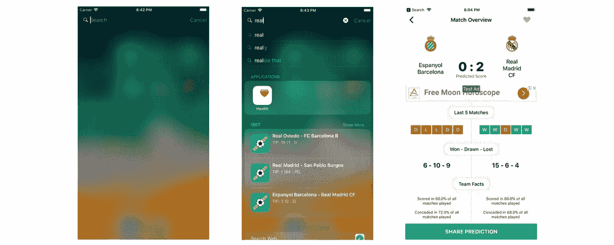
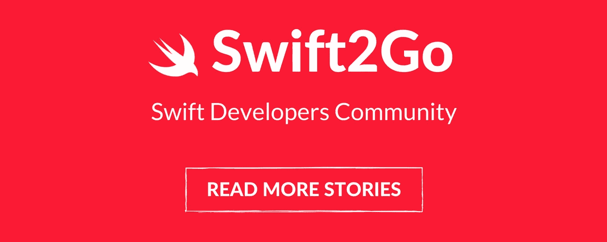

# 如何将 Spotlight 支持添加到您的 iOS 应用程序

> 原文：<https://medium.com/hackernoon/how-to-add-spotlight-support-to-your-ios-app-4a89054aff89>

## Swift 教程将使您的应用程序在 Spotlight search 中可用

[http://apple.co/2CrlXDf](http://apple.co/2CrlXDf)

对于任何拥有移动应用的个人或创业公司来说，最大的挑战是如何提高用户留存率。你可以吸引用户下载 app，但是第一次使用后会怎样？

有的用户会把你的 app 删了，有的觉得有用就留着。但是，这并不总是意味着他们会使用它，如果他们把它安装在他们的手机上。通常，这款应用程序可能会被隐藏在某个文件夹中，或者数百个已安装的应用程序中。

> 这就是为什么我们需要想办法**提醒**用户我们的应用是存在的。

苹果为我们提供了许多 [iOS](https://hackernoon.com/tagged/ios) 功能，这些功能可以提高我们应用的可见性，即使用户不使用它。比如像 [*聚光灯*](https://hackernoon.com/tagged/spotlight) *，今日 Widget* ， *iMessage* ，*推送通知，Siri 等等功能..*。

在本教程中，我将介绍如何为您的 iOS 应用程序正确使用 Spotlight 功能。我最近在我的最新 iOS 应用程序 [*中实现了这个功能，名为 1BET*](http://apple.co/2CrlXDf) ，所以你将看到的所有截图都来自那里。

# 聚光灯

Spotlight 是 iOS 中一个超级强大的搜索功能，可以搜索支持它的已安装应用程序的内容。这类似于你在 Safari 上的搜索体验。它还与 Siri 同步，并为您提供热门歌曲部分。你可以通过从主菜单向下滑动来定位 Spotlight。

**我将讲述关于 Spotlight 最重要的两件事:**

1.  让您的内容可以在 Spotlight 上搜索到；
2.  将按下的项目拦截回您的 iOS 应用程序；

## #1 创建可搜索的内容

如果我们希望我们的应用程序内容出现在 Spotlight 中，我们需要使用 [CoreSpotlight](https://developer.apple.com/documentation/corespotlight) 框架。为了创建可搜索的内容，我们需要熟悉:

*   [CSSearchableItemAttributeSet](https://developer.apple.com/documentation/corespotlight/cssearchableitemattributeset)-指定您希望在 Spotlight 中显示的属性(即标题、内容描述、缩略图)。
*   [CSSearchableItem](https://developer.apple.com/documentation/corespotlight/cssearchableitem) -这个类表示搜索项。我们可以分配一个 ***唯一标识符*** 用于引用对象，一个 ***域*** 用于管理组中的项目，一个 ***属性集*** 用于传递我们为该对象创建的*CSSearchableItemAttributeSet*。
*   [CSSearchableIndex](https://developer.apple.com/documentation/corespotlight/cssearchableindex)——一个负责索引 Spotlight 上内容的类。它需要一个数组 *CSSearchableItem。*

现在，让我们看看这三个类一起工作的例子。👇

这是我在 [1BET](http://apple.co/2CrlXDf) 中处理聚光灯支持的方式…

CoreSpotlight 框架有自己的规则，我们必须遵守。 *CSSearchableItem* 是我们需要利用的数据模型，以便让聚光灯正常工作。如您所见，我正在迭代我的数据模型，并使用我需要的属性创建 *CSSearchableItem* 对象。之后，只需将所有新创建的项目添加到一个数组中，并将其传递给 *CSSearchableIndex。*

此时，当您开始搜索时，您需要在 Spotlight 中看到结果。就是这样！😉

> 注意:当然还有比上面看到的更多的属性。你可以在苹果官方文档中找到。

**域名什么时候有用？** *CSSearchableItem*域属性可能相当有用。如果你对我们为什么需要域名有任何困惑，我现在将解释一种情况…在我的例子中，我有 2 个不同的域名`matches`和`news`。*比赛*域填充有比赛投注提示，*新闻*填充有最新的体育文章。

现在，我只在某些特定情况下显示*新闻*。这意味着有时我不想让他们出现在聚光灯下。如果你已经把它们添加到了索引中，它们将会留在那里。这意味着我们需要找到一种方法来删除该域(组)中的所有条目。👇

使用 CSSearchableIndex，我们可以轻松地删除特定领域的所有可搜索项目。您也可以同时添加多个域。

## #2 截取按下的项目

在这种情况下，用户发现您在 Spotlight 上的一些搜索结果很有趣，并希望看到更多信息。用户点击该项目，会自动重定向到您的应用程序。但是，如果我们没有正确拦截该项目，用户将只会出现在应用程序的初始屏幕上，而不是被重定向到特定的内容。

[http://apple.co/2CrlXDf](http://apple.co/2CrlXDf)

这是一个用户如何打开 Spotlight，进行搜索，并通过点击其中一个项目重定向到比赛概览屏幕的流程。

**App Delegate** 首先，转到`AppDelegate.swift`添加下面的片段。这个方法将触发根视图控制器内部的`restoreUserActivityState()`。您还可以注意到，我们正在传递包含已按下项目数据的 [NSUserActivity](https://developer.apple.com/documentation/foundation/nsuseractivity) 对象。👇

> *注意:我的根视图控制器的位置如示例所示。你必须用你自己的逻辑去改变它。*

**UIViewController** 最后一步是打开您在 AppDelegate 方法中转换的视图控制器，并在那里覆盖*restoreuractivitystate()*。👇

如果您从一开始就遵循了本教程，您会注意到我们正在将一个唯一标识符*传递给我们创建的每个*[*CSSearchableItem*](https://developer.apple.com/documentation/corespotlight/cssearchableitem)。restoreUserActivityState 将向我们返回该标识符，这将使我们能够找到合适的对象，并提供用户应该导航到的合适的视图控制器。**

****这就是这篇教程，我希望它能帮助你学会如何为你的 iOS 应用程序添加 Spotlight 支持。我也希望这个特性能给你的分析软件带来积极的推动。📈****

**如果你能，我将不胜感激👏或者分享这个故事，以便其他人可以找到它并从中学习。干杯！**

****

## **查看我的最新项目:**

** [## BetScore:Google Play 上的足球博彩技巧、比分和赔率应用

### 我们提供高胜率的专业足球技巧。每个比赛模拟包含三个预测…

play.google.com](https://play.google.com/store/apps/details?id=betting.tips.goals)  [## Google Play 上的篮球、曲棍球和手球应用程序的下注技巧

### 超过 500，000 名职业博彩客户、体彩投注者和体育博彩爱好者信任我们的日常体育博彩…

play.google.com](https://play.google.com/store/apps/details?id=betting.tips.sportsbet) 

## 阅读更多我在媒体上的作品:

 [## 引入干净的 Swift 架构(VIP)

### 忘了 MVC 吧，现在！

hackernoon.com](https://hackernoon.com/introducing-clean-swift-architecture-vip-770a639ad7bf)  [## 使用 Swift 4 在 iOS 上使用 Google Maps SDK 的终极指南

### 许多 iOS 应用程序使用谷歌地图。这是一个非常普遍的特点，所以我决定准备一个终极指南…

medium.freecodecamp.org](https://medium.freecodecamp.org/how-you-can-use-the-google-maps-sdk-with-ios-using-swift-4-a9bba26d9c4d)  [## SWIFT —带有 XIB 文件的自定义 UIView

### 用 XIB 文件定制 UIView 是 iOS 开发中非常常见的做法。自定义 UIView 类不包含 XIB 文件…

medium.com](/theappspace/swift-custom-uiview-with-xib-file-211bb8bbd6eb)  [## 如何将 Spotlight 支持添加到您的 iOS 应用程序

### Swift 教程将使您的应用程序在 Spotlight search 中可用

hackernoon.com](https://hackernoon.com/how-to-add-spotlight-support-to-your-ios-app-4a89054aff89)  [## 核心数据关系

### 理解一对一和一对多关系

hackernoon.com](https://hackernoon.com/core-data-relationships-d813ed66ba8c)  [## 了解 Xcode 9 中的自动布局

### 所有你需要知道的关于自动布局

hackernoon.com](https://hackernoon.com/understanding-auto-layout-in-xcode-9-2719710f0706) 

## 订阅我的时事通讯:**