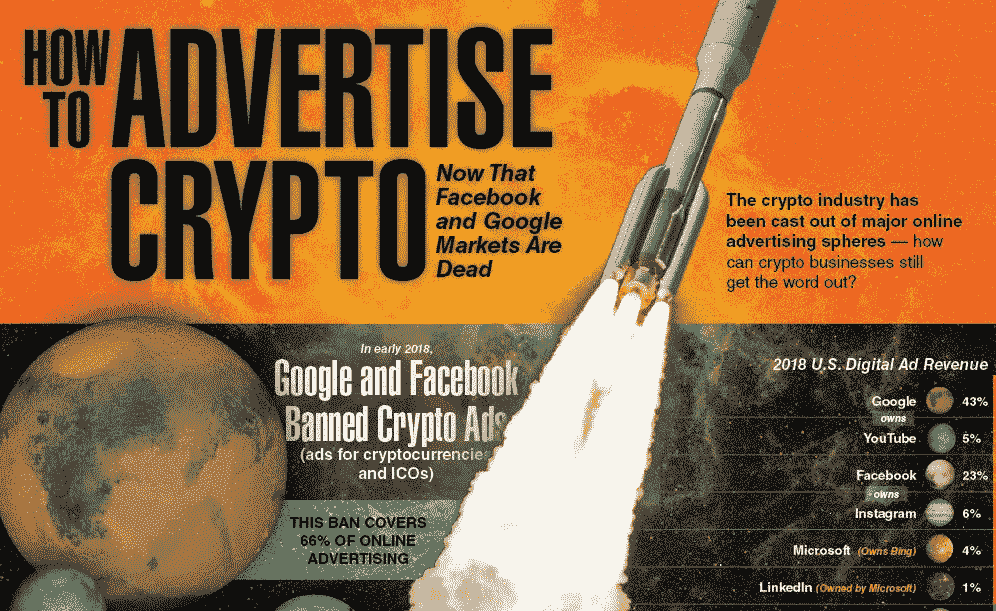
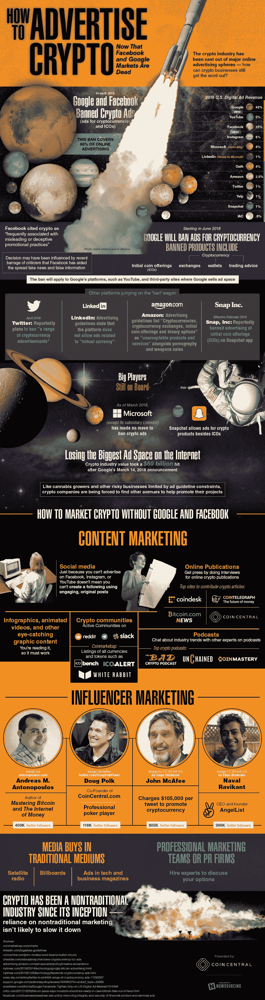

# 既然你在谷歌、脸书和推特上被禁，如何在 Crypto 上做广告

> 原文：<https://medium.com/hackernoon/how-to-advertise-in-crypto-now-that-youre-banned-in-google-facebook-and-twitter-874943ff2cb9>

引用加密货币广告“经常与误导或欺骗性的促销活动相关联”，脸书和谷歌从 2018 年 6 月开始正式禁止这些平台上的加密广告。禁令涵盖所有类型的加密货币和 ico 的广告，占在线广告的 66%。随着一些最大的广告市场关闭，crypto 将何去何从？

像之前的大麻市场一样，crypto 发现自己受到广告准则的限制。加密公司被迫寻找与消费者联系的新途径和方法，并推广他们的项目。这意味着远离社交媒体，从头开始开展活动。影响者营销、导师角色和良好的媒体互动在加密营销领域已经变得至关重要，依靠专家的话语和思想来接触人们，而不是横幅广告。这种全新的个性化方式为原本完全数字化的行业开辟了更广泛的消费者互动，甚至可以说禁令是塞翁失马，焉知非福。

从播客到 YouTube，甚至到 Twitch，加密行业已经把目光放得比谷歌或脸书更远了。请看这张来自 Coin Central 的[信息图，了解更多关于加密广告的变化，在哪里可以找到可靠的加密内容，以及加密营销互动的未来。](https://coincentral.com/how-to-advertise-in-crypto-info/)

