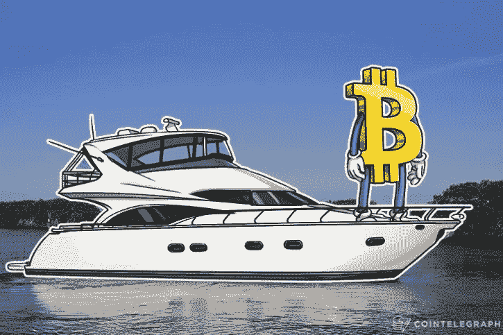
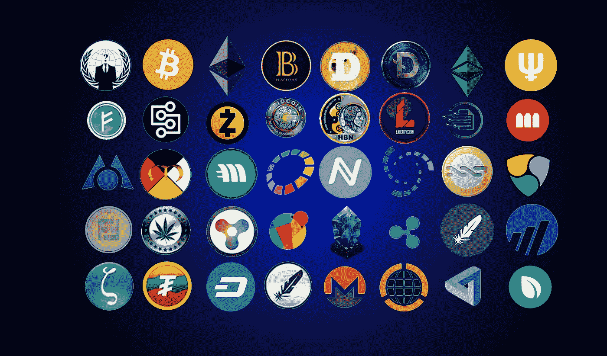

# 如何通过交易和投资加密货币赚钱

> 原文：<https://medium.com/hackernoon/how-to-almost-make-millions-by-trading-cryptocurrency-2f7bd5c1cedd>

比特币！莱特币！以太坊！—激动！不知所措！还有什么不可以。

它无处不在。你的同事讨论它，你的朋友讨论它，有一个欣喜若狂的奶奶的新闻报道，因为她“进入”了比特币([没有说谎](https://www.wsj.com/articles/bitcoin-mania-even-grandma-wants-in-on-the-action-1511996653))。

Well.

你也想加入神秘的加密货币世界，将你的美元、欧元或英镑转换成比特币或替代币，这似乎有更好的未来或未来回报。**100 倍？2200x？好的，我马上就要。**

文明人拒绝使自己适应环境。相反，他改变了环境来适应自己。

他建造了城市、道路、车辆和机械。他架设电线来运行他的省力装置。但是他不知道何时何地该停止。他越是改善他的环境使生活变得容易，他就把它变得越复杂。现在，他的孩子被判处 10 到 15 年的学校教育，只是为了学习如何在他们出生的这个复杂而危险的环境中生存。拒绝适应周围环境的文明人，现在发现他不得不时时刻刻适应和再适应他自己创造的环境。

例如，如果这一天被称为星期一，数字 7:30 出现了，你必须从你的家庭环境中脱离出来，重新适应一个完全不同的环境。**八点意味着每个人都要看起来很忙。10:30 意味着你可以停止忙碌 15 分钟。然后，你又得看起来很忙。**

你的一天被分割成了碎片。

在每一段时间里，你都在适应新的环境。

但是在密码世界里，没有时钟或日历告诉你做这个或那个。总是星期五，或者星期三晚上，如果你喜欢的话。或者周日。

这是教科书上对随时随地工作的定义。

Well….

如果我告诉你有一场革命正在酝酿，远远超出了比特币的范畴，会怎么样？一场革命就在我们眼皮底下发生。数十亿美元在没有任何政府或中央机构干预的情况下从不同纬度转移出去？一个全天候开放的市场。没有障碍。

你早上买的 [VEN](https://www.vechain.com/) ？可能是一个把他的英语卖给菲律宾人的苏格兰人说的。都是通过香港的交易所。所有这一切都正在发生。就在我们说话的时候。

一个没有国界和官僚主义的世界。在这个世界里，投资完全由你决定和控制，你是这笔钱的合法所有者。历史上从未有过涉及普通人的如此级别、如此规模的资金转移。

不再有华尔街提供的复杂、混乱的术语。他们使用的一半词语都是编造的，让你相信只有他们能做他们所做的事情。

你所需要的只是一个基本的互联网连接，一个加密交易所的交易账户(我用的是币安)，一笔启动资金，你可以关注并从中获取线索的博客和交易者，以及耐心。

好吧。我现在准备好了。我准备丢掉工作，每天交易 4 个小时，然后笑着去银行兑现。

我在谷歌上搜索“如何在加密中赚钱”，我观看 YouTube 视频，这些视频向我承诺“从这些替代硬币中获得 100 倍的回报”，“或“下一个比特币是什么”。

然后

我得到了一些听起来很漂亮的硬币，有名人支持，承诺如果我买下它，我将过上不用工作的生活。哦，迈克菲今天早上刚刚在推特上发布了这个消息。再过几个月就和我的助学贷款说再见吧。我要申请抵押贷款，透支我的信用卡，然后买下所有这些硬币。毕竟，这些是*下一个比特币*，会让我**富有**。

此时，你必须在脑海中记住一面红旗的图像。

Well……

交易加密货币是一种赚钱的好方法，然而，它并不像许多人描述的那样简单。

每种货币都有几个不同的潜在因素影响其价格。

比特币无疑是最成功的一种，但这主要是因为它被广泛接受。尤其是如果你继续在黑暗网络上购物，你会怀疑比特币是否比美元更有价值。

*那我为什么要读这个呢？当我在斐济群岛海岸停泊的私人游艇上度假时，使我一夜之间成为百万富翁的秘密药剂在哪里？*

答案是-

**零。**

无论是网上还是网下，无论是面对面还是随叫随到，都没有任何东西能告诉你把钱投到哪里，几个月后再回来，醒来时投资组合的收益是+742%。你看的那些博客，看的那些视频？他们知道的和你一样多。就像一个淘气的印度神人。

你看，我们如此迷失在寻找答案和赋予随机结果的意义中，以至于我们无法理解为什么。

因果关系表明，世界上的机构，或现象，通过它一件事(原因)在一定条件下产生，导致其他东西(效果)。

它没有说明的是，有无数的变量同时发生，导致了最终的结果。

市场也是如此。有 100 种不同的因素会影响某一特定硬币或代币的每一分的增加。任何一个人确信地告诉**你**X 币一个月内会涨 2 倍，很可能是过于乐观，或者是在 X 币达到有利价格时将价格推高而抛售。

你不想成为**那个**的家伙。

一个交易者，至少是我认识的和交谈过的交易者，从来不会说出一个特定的价格，也不会确定几天后 X 会在哪里。他们知道事情不是这样的，即使在最乐观的情况下，市场也是由每秒 10 个其他因素决定的，这些因素你无法控制，而且会极大地影响结果。

当涉及到加密市场时，这些效应被放大了。

想想吧。

你花了一天的时间交易你在过去一周中选择的硬币 X。跟踪趋势，完成仔细的基本面分析，既然市场看涨，把你所有的资金都投入进去，因为它只会上涨，对吗？

你给自己倒上最好的苏格兰威士忌，依偎在泰国丝绸睡衣里，亲吻你的妻子道晚安。(上次涟漪反弹进行得非常顺利)。

关灯。晚安。我意识到了巨大的回报。

I earn money while sleeping.

**我提到过加密市场全天候运行吗？**

在你睡觉的时候，一名中国官员决定禁止加密货币。

你看，这里可能有各种政治动机和反垄断情绪等等。但受这种偏见支配的是你心爱的投资组合。你忘记设置**止损**了。

听到这个消息，中国人迅速抛售他们所能抛售的。有人发推特说这一进展，韩国人认为下一个禁止加密的国家是他们。FUD*扩散开来。奥兹们看着价格往南走，开始抛售，接着是印度人，阿拉伯人(不是说他们需要密码才能发财)，几个小时后，这东西就打到欧洲了。Reddit 陷入困境，subreddits 陷入疯狂。Hackernoon 的文章是写的。4chan 忙着做模因。Buzzfeed 报道称，比特币终于破灭了，没有进一步投资的人可以得到一分来证明自己是对的。*

八小时后，你醒来发现一场血战。你心爱的作品集到处都是红色。新闻充斥着秘密讣告。“专家”们在这个问题上给出了他们自己的观点。你发现自己在问“刚刚发生了什么？”

山姆大叔，你睡着的时候，全世界都在哭泣。

沮丧，并挽救任何剩余的利润，你可以资助泰国之旅，你认为在你的头上，你继续出售你的立场亏损。*我当初为什么会卷入这件事？*

两天后，中国一家小报报道禁令解除。

如果你认为这是假设，我强烈建议谷歌搜索“【2017 年 8 月加密货币崩溃”。除了中国还没有真正解禁加密货币。

关键是，这样的事情发生了，没有人能告诉你两天，两小时，两分钟后，X 的价格会在哪里。没有人。因此，你应该有保留地接受这样的建议。

显然，这样的新闻并不是每天都会发生，但有时很多投资者会离开一枚特定的硬币，从而导致价格下跌。

有了经验和交易指标的使用，你学会了**预先确定**市场何时下跌，并退出市场，保护你的利润和密码尊严。

发生的事情是，你学会拿起鱼竿，装上鱼饵，自己去钓鱼。这样，你肯定知道你钓到的鱼是高质量的蓝鳍金枪鱼，还是沙丁鱼。

就像我之前说的。每种货币都有几个不同的潜在因素影响其价格。

这样的新闻随时都可能发生。但是，你没有失去你所有的投资，而是设置了止损，确定了一个*对冲，*如果发生这样的灾难，**不要**最终卖掉你的头寸。

市场在这里，区块链是未来。句号。

最强大的经济体识别技术以及技术如何帮助他们，并利用技术优势实现经济增长的飞跃。在权力角力最激烈的时候，一个国家禁止加密货币将是倒退十步。

接受亏损需要强大的胃，但避免恐慌性抛售需要更强的手。

并不是说我提倡著名的“霍德林”，当你交易，甚至投资时，这不是一个很好的策略。

就像一个自我实现的预言。你卖。你把价格降下来。不为别的，只为 FUD。

你感到害怕吗？很好。想得到安慰吗？YouTube 和 Tron 可能是答案。

Absolutely NO.

还在读书？太好了。来按摩一下那双铁手，学学钓鱼吧。

我们需要一艘船。

从最基本的开始，有两种硬币构成了这个市场的支柱-

比特币。还有以太坊。

Rivals ?

只不过他们根本没有真正竞争。

比特币的基础与以太币非常不同。

实际上更多的是这样。

两者都为投资者提供了不同的用例，并且是一个重要的平台，在这个平台上可以建立一个*令牌*并向公众出售。

对于投资者来说，在投资任何东西之前，确定用例是非常非常重要的。

**比特币**完全绕过传统银行机构。它将第三方——连同他们所有的费用和减速——从金融系统中移除。它以透明的方式向网络(区块链)广播事务。

**以太坊**向世界介绍了一种叫做*的智能合约。*它专注于运行任何分散应用程序的编程代码。

什么是智能合约？一种计算机代码，它促进了金钱、数据、汽车、妓女、大麻、财产、行星的交换。任何事。就像一台自动操作的机器一样，当程序员决定给出的特定列表中的所有条件都满足时，运行在区块链上的智能合约就会运行。与比特币不同，以太坊平台允许任何东西完全按照编程在它的系统上运行，没有任何审查、欺诈或干扰的可能性。

比特币交换价值。以太坊平台几乎可以交换和执行任何东西。

“嗯，现在我知道这些鱼不是来自同一个海洋。”

就像 Etheruem 一样，我们还有其他几个平台即将推出，它们都有自己独特的产品，开发者可以在这些产品上编写分散式应用程序(d App)，从而发展生态系统。

尼奥。QTUM。EOS。阿切因。所有平台。

*“但是以上这些对我有什么帮助呢？”*

很简单，通过识别和投资一个**平台**，它有一个强大的路线图，一个强大的团队，多个 dApps 开发排队，以及强大的合作伙伴关系即将到来，你就有机会在硬币仍然便宜几百，一百，几美元，甚至几便士的时候购买它。

始终**研究**并留意有价值的信息，让你对投资充满信心。

**买船前调研。**

这是你的第一笔投资。你的交易组合的支柱。你最相信的支柱创造了你前进的道路。这是你的船。

**一个*强大的平台。***

It is now a fucking ship thou.

***我已经起航了。让我们抓一些鱼。***

海里有很多种鱼。

有些味道不错。有些味道不好。有些是骨质的，有些是有毒的。

有些种类有一百万个样本，有些有十亿个。

就像我们的海洋生态系统一样，每种特定的加密货币都可能有一百万枚硬币，甚至十亿枚。

在投资时，所有这些都必须考虑在内，毕竟，金枪鱼的市场比沙丁鱼大，阿拉斯加鳕鱼的市场比金枪鱼和沙丁鱼都大。

这些硬币被称为替代硬币，通常是你投资的第二部分。你用来 ***摇摆交易*** *的部分，即*在市场变动时，在识别价格变动和模式后，在每周的时间间隔内获利。

***什么是 altcoin？***

除了比特币或以太坊之外的任何硬币，在这个词的隐含意义上。然而，我们希望将平台币纳入我们的主要资产，即*船*，而不是用它们来进行交易。(这部分完全取决于你，选择最适合你的交易策略和目标的。)

没有人会在意你是否购买了一种没有需求、不为顾客服务、对世界没有好处的代用币或代币。由于诱人的加密新闻使回报声音，有 30 个巨大的损失，每枚硬币去了 10 倍。

如果你的 altcoin 没有市场，就没有理由买。

## 那么我在买一个 ***山寨币*** 之前，寻找的因素是什么呢？

1.  **他们的网站功能正常吗？**

说真的。它是一个靠不住的操作还是一个合适的，工作正常的，没有 bug 的网站？注意明显的危险信号。

**2。它有强大的团队吗？**

你的硬币的成功很大程度上取决于团队成员的质量。你看，以太坊或任何其他平台都会有一个代码**覆盖**它来与区块链一起工作。这意味着分散的应用程序并不是完美的。因为代码是由人类编写的，所以智能契约的好坏取决于编写它们的人。代码错误或疏忽会导致意想不到的不利行为。如果代码中的错误被利用，除了获得网络共识并重写底层代码之外，没有任何有效的方法可以阻止攻击或利用。

强大的技术团队可以防止所有这些问题。

**3。白皮书是什么样的？**

这一步解决你所有的问题，给你硬币的重要细节，它解决的问题，它如何解决，以及硬币的技术。

不要跳过这一步。毕竟，你对加密货币的投资主要集中在**技术**，而不是其他任何东西。

**4。向创始人问好。**

不是字面上的，而是虚拟的。像跟踪前任一样跟踪他们。查看他们的社交媒体账户，这真的有助于了解每个创始人的心态。他们是刚毕业的大学生，想通过跳上区块链的火车来赚大钱吗？还是他们有着多年的技术经验，并与社区互动，明确专注于*建筑技术。*

创始人是公司的引擎。

此外，检查他们的路线图，并判断他们是否始终如一地交付？是否有非外部因素造成的延误？他们是否放弃了任何早期的项目？

**5。硬币供应是什么样子的？**

硬币供应量越高，未来每枚硬币的价格就越低。简单的经济学！

也就是说，BTC 定价如此之高的原因是因为它的硬币供应量只有 2100 万枚。如果 BTC 有 20 亿枚硬币，它的价格会是…..嗯…几便士。

**6。** **最后，看看他们的社区！**

Reddit，Telegram，Instagram。创始人和团队与早期投资者、投资者以及几乎所有加入渠道的人保持联系。

好吧，一切都好。我现在应该买硬币吗？

在投资之前，有几件事需要考虑。**记住**，很多前 100 的硬币都是 Vapourware。你不会想现在冲动购买，然后在价格下跌时被骗。

这些是我们相信的山寨币，而不是我们不相信的垃圾币。

Cointelegraph, 2017.

**购买前最后一次权衡风险**
购买代用币是一种投资。一项风险太大的投资，如果出现问题，在财务上毫无意义，因为你最终可能会失去一切。风险的大小可以通过上述因素和/或它们的组合来衡量。

**设定出场价格**
交易者花数小时微调进场策略，但在糟糕的出场情况下，账户资金告罄。事实上，我们大多数人都缺乏有效的退出计划，经常以最糟糕的价格出局。

我们还需要从根本上确定何时兑现一枚硬币，而不是希望它上涨。每一枚硬币都有市场上限和有限的硬币供应量，一枚硬币只能增长这么多。

当 Ripple (XRP)涨到 2.5 美元时，我最早按下了卖出按钮。为什么？比特币的交易量很高，消息很乐观，人们认为它是下一个比特币，宣传力度很大。一切都有利于价格进一步上涨！但是，我有一个退出计划，甚至在我买 Ripple 之前就以 1.8 美元卖出，打算用利润投资其他 alt。它涨得更高，更高，甚至在我提现后，它一直涨到 3.70 美元！

**另类投资的过去趋势**
在金融行业，随着市场根据需求和供应的力量进行调整，情况变化得非常快。你应该调查你所购买的替代硬币的历史趋势，并由专家进行预测。这样做可以防止你在获得替代硬币时没有考虑到的信息，但这些信息会显著影响它们的价值。

太好了，我终于买到了我的硬币。这些鱼看起来很好吃！

# 了解密码市场的本质

关于比特币，以及一般的加密货币，你需要知道的第一件也是最重要的事情是，“加密货币”是一个轻微的用词不当。

当然，也有商店和经纪人接受比特币，而且这个数字还在与日俱增。房子、汽车、直升机都被比特币购买了。咖啡已经买了恒星流明。根据一些报道，莱特币已经被用来购买产品。

然而，95%的人并不把比特币或其他硬币当作“货币”。更确切地说，它更像是一种金融商品，一种由未来技术驱动的*资产*，这将在未来几年带来巨大的投资回报。

因此，这些加密资产价值来自它们的潜在用途。

事实上，大多数交易的代用币都不是储值手段。相反，它们得到了旨在削弱相关行业的产品和企业的支持。

**VeChain** (VEN)旨在通过其独特的 RFID 产品检测假冒产品来扰乱供应链行业。

Genesis Vision (GVT)是一个新的分散平台，旨在将交易所、经纪商、交易员和投资者聚集在一起。这将是一个完全透明的平台，以促进专业交易者和投资者之间的借贷。

**Icon** (ICX)为银行、医院和大学提供独特的区块链解决方案。韩国人还没有发现这枚属于他们自己的硬币。

**0x** (ZRX)是一个允许分散交换 ERC-20 令牌的协议，基本上是运行在以太坊区块链上的任何令牌

就像这些一样，有 100 种硬币在那里，由坚实的团队和他们旨在破坏的行业支持。

这是未来的全球股票市场。

通过理解这一点，我们从临时的 100 倍隔夜回报的心态转变为永久的，缓慢而稳定的每月 2 倍回报的心态。

投资可靠的技术建立强大的投资组合。

一家有可能在几年内达到七位数的公司。

但是像许多未知商品一样，加密资产容易受到市场风险和价格波动的影响。这方面被一些人视为一个巨大的机会，而其他人则希望尽可能保持。

因此，不要根据某个 YouTuber、Instragrammer 或名人的言论乱花钱是非常必要的。很可能他们在这些项目中有既得利益，这就是为什么人们更多地听说 Tron 或 Bitconnect，而不是 Waltonchain 或 Loopring。

等等！当人们谈论交易时，我通常看到图表和蜡烛，听到各种其他术语。那些都在哪里？

我们还没到卖鱼的时候。至少不是我们认为是 A-1 材料的鱼。我们绝对不会卖掉这艘船！

在每一个投资组合中，将其中的大部分作为值得信赖的投资是非常重要的。一个是你相信的，一个是在该硬币的*需求*增加后，未来会卖得更高的，而*供给*就是**你**。

为此，我们采用**基本方法**来分析投资组合的这一部分。通过检查相关的经济、金融和其他定性和定量因素，对证券进行评估，试图衡量其内在价值。

在未来很长一段时间内，加密资产将永远是一种未知的商品。他们只是没有传统股票市场的技术指标，而这些指标通常是用来分析资产的。

大多数股票或债券可以根据工具的某些特性进行分析。例如，股票有市盈率和股息，而债券有回报率。加密资产没有容易衡量的基本要素。

*这是否意味着我们不必看到任何图表？*

你当然会。现在，我们已经完成了文章的这一部分，以及作品集，我们继续处理数据。我们抓住特定硬币的市场情绪，并使用**价格行动**进行交易以获得投资回报的部分。

这就创造了两个收入来源。第一，我们从投资、持有和摇摆交易中获得的收入；第二，在识别和转移到下一个硬币之前，我们可以看到很多价格波动。

就像传统市场一样，一些公司变得价值数十亿，一些公司成为独角兽并失败了，而一些公司表现出巨大的前景并以失败告终，或者几年后被公司收购。

因此，就像每只股票一样，我们不能指望每枚硬币都永远是投资组合中不变的一部分。

有些鱼你挂起来作为战利品，有些你放在鱼缸里，有些你用橄榄油在锅里煎。

# 保护飞船。

大海显然不是一个平静的地方。

天气的随机变化本身就是外力的支持者，它能把美丽的海洋背景变成波涛汹涌的邪恶洋流。

但是当这样的事情发生时，水手们会怎么做呢？他们会带着所有的东西跳进海里，希望出现奇迹吗？他们会在大洋中间打 911 吗？

告诉我自从泰坦尼克号后你最后一次听到人们跳下船或乘救生艇？

航运和贸易行业已经存在了几个世纪，它是世界经济的基石。

有经验的水手知道波涛汹涌的水域来，波涛汹涌的水域去。恐慌只会导致错误的判断和仓促的情况。

[甚至死亡。](http://www.newsweek.com/cryptocurrency-crash-sees-suicide-hotline-appear-reddit-forum-bitcoin-price-783412)

这同样适用于我们的交易世界。

在一个受各种外部力量支配的市场中，必须采取充分的预防措施来避免巨大的损失甚至潜在利润的损失。

**最常被滥用但却很明智的一句话是**、**低买高卖**。

仍然有一些人从不学习，因为你可以看到他们反复犯错。检查任何论坛或 subreddit，应该有帖子说他们如何在高峰期购买，因为他们害怕被火车甩下，然后他们恐慌抛售。

这是最简单也是最笨的赔钱方式。毕竟，我们在购买之前没有花足够的时间进行基本面分析吗？

你认为未来有足够的增长空间的稳健投资中的这种颠簸，不应该阻止你持有。尤其是你全职工作，没有时间主动交易的情况下。

就像恶劣的天气一样，一些事件会试图扰乱你的投资组合，比如—

*   **规定。**如果政府发表声明或推动影响加密货币的特定法规，你可以打赌价格会对此做出反应(有时是积极的，通常是消极的)。在中国禁止 ICOs 的时候，以太坊的价格在 15 天内下跌了 41%(从 386.83 美元/ETH 跌至 228.06 美元)。
*   **媒体影响力。与政府监管一样，媒体曝光会极大地影响加密资产的价格。每当一位公众人物发表关于加密货币的声明，或者一家主要零售商开始接受加密货币作为一种支付形式，你都会看到市场的反应。**
*   **技术的变化。**当加密资产的核心技术受到影响时(通过更新或发现缺陷)，加密资产的价格也会受到影响。
*   **鲸鱼。**严格来说，这是一件秘密的事情，这些家伙积累了如此多的 BTC 或瑞士联邦交易所，以至于他们有足够的能力通过批量购买、批量出售或设置虚假的买卖墙来操纵市场。(我将在本系列的下一部分详细解释买/卖墙。)

幸运的是，一些快速的预损害控制有助于一夜好眠。

**您的定价策略正确吗**

大多数业余密码交易者没有定价策略。专业交易者总是运用他们的定价方法来成功发现适合他们的交易策略。这确实很难，因为金融证券的定价比其他东西(比如电视或牙医门诊)的定价更难，而且需要不断优化以适应动态的市场。您可以在这里学习加密定价的基础知识: [**加密货币定价:基础透视**](http://goo.gl/TN8dSs) **。**

由于密码固有的波动性，定价变得更加困难。当我们说低买高卖时，它实际上是使用定价策略来确定预期的证券(在这种情况下是 Cryptos)是定价过低(多头)还是定价过高(空头)。

**学习如何有效管理风险**

人们喜欢更快地削减利润，进一步承担损失。准备好你的风险管理策略。不要交易不适合你风险的东西。这是纪律。如果没有适当的风险管理技术，你将无法在任何种类的交易(密码或期货或其他)中坚持更久。让你的买入和退出的目标价格围绕多个有利的价格(像一个梯子)设置，并最大化你的风险回报率。

**知道什么时候不交易**

这很关键。当专业人士知道不要交易时，他们的感觉就会发展到一定程度。太多时候，业余交易者想利用他们在 YouTube 上学到的一切。你必须知道什么时候不交易。当市场给你提供了一个支持你“优势”的机会时，当它不再停留在原地时，就跳进去。不要强行采取无法与你的优势互补的立场。

*太好了。永远不要把鱼扔掉。永远不要弃船。永远不要相信卖坏鱼的渔夫。*

幸运的是，你在海洋中并不孤单。那里有成千上万的善良的人们定期讨论季节的*捕获量，世界各地的*天气*，你捕到的*鱼*的潜力，要升级的*新船。这是一个很长的名单。

*说什么？*

是啊！人们。本质上善良，但有时对他们的硬币完全忠诚，他们从硬币技术、公告、新闻、评论等方面讨论加密世界。一个活跃的生态系统**不像**传统市场，只有雄心勃勃的人和专业人士分享有价值的股票信息，这可能会也可能不会影响你的投资组合

这是密码，宝贝！

通过嗅出论坛、不和群、电报群、subreddits、GitHub、Slack，甚至 4Chan，你将与这个市场、这个未来、这个领域的世界上最早的采纳者建立网络，这个领域将改变我们所知的金融体系。

这个全球生态系统从不睡觉，你可以随时查看人们在谈论什么，交易什么，抱怨什么，甚至抱怨什么。

当一千个人在讨论一个项目时，肯定会有很多相互矛盾的观点、想法和分析。但是，不要沮丧，将集体意见(通常倾向于一个方向)与您自己的研究进行比较，并询问社区问题。也许甚至分享你自己的发现！

事实上，我最大的两个 ROI 是由于我在寻找新硬币时潜伏在不同的子街道上。我碰巧看到有人提到 RaiBlocks，这是一种基于即时支付的新货币，交易费用为零。

对我来说，它看起来确实很整洁，但我在查看 RaiBlocks 网站和白皮书之前睡了几天。

不知不觉，我就迷上了。这太美了。

我承认我不理解他们使用的**格** **格**技术，我仍然不理解。但是硬币在真实世界中的使用案例，以及相对较低的硬币供应量和较低的市值吸引了我，我把一些以太坊的利润投入其中。当时大概是 1 美元。

两个月后。RaiBlocks 达到了 30 美元。

都是因为我在 Reddit 上偶然发现的一个帖子。现在想起来，我应该给那家伙 1 XRB 的小费。

Look at that. #turnon

这些都是实实在在的金钱收益，都归功于社区，这个 24*7 全天候呼吸、交谈和食用密码的生态系统。

作为投资者，你应该充分利用这一点，每天花几个小时听听关于最好和最新硬币的对话、争论和辩论，以及用户发现的**骗局和危险信号**。

总有人会发现狗屎，并免费提供给社区，从而保护一大堆人免受不良投资的影响。

**利用免费知识。**

在投资 Crypto 时，你不可能处于困境。毕竟是 ***数字*** 是有原因的。

把这些收藏起来！—

**在 Reddit 上-**

r/加密货币 r/比特币 r/加密市场 r/金融

(几乎所有的硬币都有一个子编辑。使用搜索栏输入硬币名称，第一个结果应为 r/(硬币名称)。对于 RaiBlocks，它是 r/raiblocks。对于 NEO，是 r/neo。如果你的硬币没有子分币，那么……远离它。)

**硬币网站**应该在页面末尾有一个官方电报或不和谐链接。这是强烈推荐的，因为开发人员、经理，甚至是 CEO 都可以直接与社区互动。跟踪业务以及团队是否兑现承诺是至关重要的。如果他们不是，这是一个危险信号！

在 **GitHub** 上，团队实时发布代码、补丁并修复缺陷。这表明了该团队强烈的职业道德和远见，**积极地**增加了投资者的信心。使用搜索选项找到您的投资，检查软件方面的进展。

4chan 是一个商业和金融论坛，这些天来大多都充斥着加密帖子。尽管名声不好，4chan 的用户并不傻。快速阅读不会有害处。我们不是来寻求投资建议的，只是来看看是否有任何消息或谣言会影响我们的投资。

每有一个人提供有价值的信息，就有五个人是完全基于价格和直觉指标交易的菜鸟。

新手买了一枚硬币，声称到月底它会涨 5 倍，这不是那种能产生持续稳定结果的交易。

对于那些仅仅预测一枚硬币价格而没有任何潜在基本面细节的人的建议，要持保留态度，更不用说价格行为的技术细节了(实际“交易”的方式)

## **撞车时要聪明**

如果你是那位穿着泰国丝绸睡衣感到寒冷，并在早上诉诸恐慌性抛售的绅士，那么有一大堆策略等着你。

1.  **持有，或 HODLing，**不是一个伟大的策略，不管其他人告诉你什么。

如果你在硬币 X 上投资了 100 美元，第二天就出现了大规模的 FUD 或影响市场的 1000 个因素中的任何一个，你真的觉得持有你亲爱的投资是明智的吗？

没有。

有可能在公元前 2000 年，有一种威胁生命的疾病意味着向太阳、月亮、上帝祈祷，几乎向任何东西祈祷来治愈它。直到有一天，某个家伙发现了一种植物和草药的混合物，这种混合物效果更好，还能救命。

我确信宗教信仰有很大的意义，但除了医学领域或金融市场。

如果硬币跌到 10 美元、5 美元、2 美元，然后是几便士，会怎么样？你还会坚持吗？

既然我们在这里讨论的是崩盘，让我们假设你有一个由 10 枚硬币组成的甜蜜投资组合，每枚投资 100 美元。

对我来说，HODL 似乎不是一个可行的策略。

进入保证金销售。

**2。保证金销售，或卖空**

在明显的熊市期间，你有两个选择。持有并希望，或者做空那个婊子来获利，而其他人都持有并希望。

我不建议在每天的市场中卖空，也不建议在牛市中卖空。卖空是有风险的，只应在市场飙升时进行。

也就是说，如果市场连续 5 天下跌，红色的投资组合围绕着市场，**也就是说**你在到达低点之前卖空。

假设硬币 X 即将大幅下跌，我们决定以每枚 50 美元的价格做空 100 枚硬币。(为了简单起见，采用 X/USD 的交易对。)

**卖空是如何发生的:**

1.  找一个允许保证金交易的加密交易所。Eg — Bitfinex 和 Bitmex。
2.  将资金转入保证金账户，并下单币 x 的**保证金卖出**
3.  交易所将“借用”不同来源中的一个——它自己的库存、其他客户或另一个经纪人。
4.  一旦股票被经纪自营商借入或“找到”，它们将在市场上出售，所得款项将存入你的保证金账户。

您的账户将被存入 7，500 美元，其中 5，000 美元来自以 50 美元的价格卖空 100 枚 X 硬币，另外还有 2，500 美元(即 5，000 美元的 50%)作为您的**保证金。**

***Bitfinex 提供 3.3 倍的追加保证金杠杆。以上计算是一个例子。**

你的看涨期权被证明是正确的，几天后，X 的交易价格是 30 美元。你在这个价位找到一个支撑，价格似乎会横向运行。这是一个完美的时间来关闭短期和口袋里你的利润。

因此，你以 3000 美元购买 100 X。**毛利 2000 块。(不包括通常很低的外汇佣金和利率。)**

还有那个。你如何在超级熊市中获利。

并非一切都那么美好。这就是我们所说的市场。如果你在那次看涨期权中看错了，你就失去了上涨价格的差价，也就是说，如果 X 飙升至 70 美元。在这种情况下，你的损失是 2000 美元(即 5000 美元到 7000 美元)。

在海上，船只很容易遭到海盗的袭击。这片海也不安全！

Beware.

## 如何保护自己的加密货币？

到目前为止，我们已经有了一些，并决定买入这个快速扩张的市场，可能是为了交易，但最有可能的是，打算长期持有一定数量的特定货币。

但万一黑客或电脑漏洞让你失去一切，这又有什么好处呢？

聪明点，做正确的事。

**您和您自己对您的加密资产负责。**

事实上，我要把丹尼尔·杰弗里斯写的这篇精彩的文章链接起来，他是一位全职作家和密码交易员，我密切关注并钦佩他的工作。花一点时间通读他关于加密安全的精彩文章。没有比这更好的解释了。

[https://hacker noon . com/eight-simple-rules-for-protecting-your-cryptocurrency-5 cdddc 9 f 674d](https://hackernoon.com/eight-simple-rules-for-protecting-your-cryptocurrency-5cdddc9f674d)

至此，我结束了加密货币交易两部分系列的第一部分。我知道这篇文章的标题有点像点击诱饵，但我们肯定能在几周内从它身上赚到**100 万只小智**。

*facepalm*

玩笑归玩笑，遵循这些步骤帮助我最初的 1000 美元投资在几个月内以最小的时间投入增长到 27000 美元。仅使用这些步骤。全职工作时，可靠的基本面分析和定期交易是增加收入的唯一途径。我不是在宣传我的收获或吹嘘我的地位，但我想这也算是某种概念的证明。

这也是在 11 月和 12 月疯狂的牛市之前，所以我们不要把利润归因于此。

继续前进，我们钓鱼之旅的下一部分展示了交易的另一面。

**一种技术分析方法。**

使用隐喻和其他简单的日常例子，我的目标是带给你们-

1.  烛台和它们意味着什么？
2.  预测硬币涨跌的成交量指标。
3.  海龟交易手册推广的趋势交易。
4.  为什么要根据**价格行为**而不是价格来交易？
5.  稳定的交易系统的重要性。
6.  识别快速获利的短期头寸。
7.  我遵循的交易策略。
8.  链接到我关注和崇拜的交易者和团体。这些人是最值得信任和最好的资源。

再见，水手！

****************************************************************

鼓掌 1 次或 50 次。它帮助我获得曝光率。谢谢大家！

_

阐述我多年来的想法，并超级热衷于写区块链、交易、加密货币和生活。

我的目标是以一种精致、易懂的方式将加密货币带给大众。复杂无助于任何人，有偏见的媒体也是如此。

是的，我认为这个系统是一个巨大的谎言，是时候改变它了。

_

#longlivecrypto。

***************************************************************