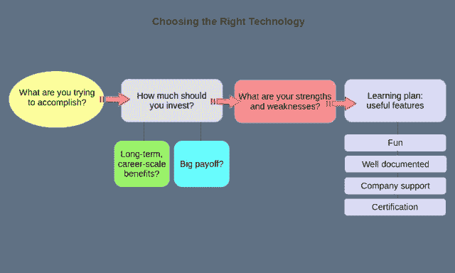

# 如何学习新技术

> 原文：<https://medium.com/hackernoon/how-to-approach-learning-a-new-technology-a4850f4aedd6>

*本文改编自我的书，* [*为技术而解决:如何在疯狂变化的技术世界里快速学习有价值的新技能*](https://learntech.bootstrap-it.com) *。*

每个人都会做梦，有些梦最终会转化为计划。必须说，偶尔，一个计划甚至会激发一些轻微的运动。但是成绩呢？我们不要忘乎所以。

成长是艰难的。然而，有些事情是我们可以控制的，这有助于整个过程。你总是需要一定的心理韧性和纪律——我不确定这些东西是可以教会的——所以这是你的责任。但是有一些技术和技巧是专门针对技术学习的，可以让你保持动力，找到正确的心态。如图所示，这就是我们将在本章中讨论的内容。

A decision flow that might produce smart learning choices

## 识别需要解决的问题

在投入下一次学习冒险之前，花点时间问自己几个问题是值得的。清楚你为什么做某事可以改进你做这件事的方式。这个想法是为你自己设计一个学习计划，既适合你现在的情况，又适合你一两年后的目标。

首先，你希望从这项新技术中获得什么？这项技能可以弥补你的职业或知识中目前缺少的东西？
您是一名系统管理员，有时很难理解您所服务的开发人员的需求，还是一名开发人员，有时想启动您自己的测试环境，看看您的应用程序实际上会如何运行？你能听到你当前工作的时钟在滴答作响吗？你想利用你现有的技能快速掌握新技能吗？

这种清晰有什么帮助呢？嗯，首先，它肯定会使你不太可能浪费时间去投资那些最终不会有帮助的东西。但是最大的“节省”来自于知道你应该挖多深。

这里有一个明显的例子。如果你正在考虑从事 Linux 管理工作，那么你应该寻找一门涵盖所有 Linux 工具的课程(例如，像我的 [Linux in Action book](https://www.manning.com/books/linux-in-action?a_aid=bootstrap-it&a_bid=4ca15fc9&chan=Solving1) )。但是如果你只对挑选安全地提供和启动你的 web 应用程序所需的工具感兴趣，那么你可能会更好地拥有一个简单的操作指南——在 web 上搜索*install web app on lamp server*可能会发现这种指南。

你还应该尝试计算潜在的回报:如果学习一项新技术可能会让你得到一份薪水相当高的工作，那么花时间和金钱去上更长的课程，甚至学习认证考试，都是值得的。但是，从另一方面来说，如果好处不那么明显，那么你可能要限制你的学习范围，在业余时间继续学习。

也许最重要的是，你应该确保你的新学习项目与你的特长和背景相匹配。雄心是伟大的，让自己走出舒适区会有一千个理由让你受益。但是，如果说，一个系统管理员或者一个 Java 开发人员的日常工作从来没有吸引过你，那么让一个不切实际的野心驱使你去做一些你可能会后悔的事情是愚蠢的。

我不知道你怎么样，但我知道很多人的梦想把他们推向了灾难性的失败。拿我的一个表哥做对的例子。他真的认为他想成为一名牙医，而且他有足够的智慧和动力去做这件事。但在做出最终决定之前，他花了一周时间坐在牙医的办公室里观察。一周结束时，他下定决心:这份工作不适合他。

对比我的堂兄和许多专业人士——包括一些不错的牙医——我知道谁的选择很糟糕，而且在几年内，通常以出局告终。

还是那句话:当所有的事情都说了，做了，计划必须适合问题——*你的问题*——它要解决的问题。

# 从学习中获取最大收益

如果你能再耐心听我说一会儿，我想再探讨一些关于选择的想法。我们将在[这本书](https://learntech.bootstrap-it.com)的后面谈到实际的学习工具和最佳实践，但是有些事情只有在事先充分计划好的情况下才能做得更好——教育就是其中之一。

让我们想象一下，你已经将你的下一个技术选项缩小到一个简短的主题列表，这个列表很好地匹配了你的背景、需求和对市场趋势的理解。你现在可以用什么样的过滤器来挑选出最佳选择？

所有的事情都是平等的，这些考虑应该告诉你，所有的事情都是不平等的。

*   期待你会喜欢学习是很重要的。自然，其他因素，比如以前对技术大环境的熟悉程度，也会产生影响。举个例子，Linux LXC 容器的背景会让学习 Docker 更容易。但是没有什么比热情更有助于击退黑暗。因此，如果两个选项之间的唯一区别是你对其中一个的兴奋，那么每次都选择兴奋。
*   旧的就是新的。当然，每个人都喜欢用尖端的东西工作。但是自己快速上手需要文档，一项已经存在了一段时间的技术可能会比刚推出的技术有更多的 wikis、指南、操作指南和堆栈溢出线程。在早期阶段，即使是供应商的官方文档也往往有点粗糙。尽早参与到 bug 报告和文档中来是非常好的，但是如果你想快速起步，那就坚持使用更成熟的产品。记住:你的时间也是一笔巨大的成本。
*   学习至少一些成熟的技术还有另一个好处:意想不到的就业机会。对于 COBOL 程序员来说，可能没有一个广阔而持久的市场，但是如果你的邻居中有一家公司(或者，更有可能是政府部门)恰好在运行其管理员最近退休的遗留基础设施，那么拥有 COBOL 经验的人可能会找到一个幸福的归宿。这并不是说您必须在像 COBOL 这样古老的技术上投入太多时间，但是它确实说明了使用旧平台的另一个潜在好处。一点创造性的计划有时会有回报。
*   没有足够的业余时间学习？问问你的老板:你的公司可能会让你参加在线课程，或者利用他们的时间做研究。一些公司积极鼓励这种学习，经常指定你每月工作时间的一定比例来学习新技能。更好的是，许多组织在更成熟的在线学习平台上拥有企业账户——比如我的课程所在的[Pluralsight.com](http://pluralsight.pxf.io/c/1191769/424552/7490?subId1=solving&u=https%3A%2F%2Fapp.pluralsight.com%2Fprofile%2Fauthor%2Fdavid-clinton)——让他们的员工可以无限制地访问课程和其他工具。
*   一份好的证书可以让雇主或客户更容易相信你知道自己在做什么。但是它也可以帮助你到达你确实知道你在做什么的那一点。这是因为，正如我经常说的，一个设计良好的认证是它自己的奖励。通常情况下，仔细阅读 cert 公布的考试目标会自动将您与日常使用该工具所需的核心主题联系起来，并向您介绍您可能需要的特性和功能。话虽如此，certs 在 IT 领域——用于系统管理、网络和安全任务——比用于编程语言更有效。

# 保持灵感

你知道是怎么回事。在开始一个新的学习项目的几天后，你发现自己陷入了复杂的语法和混乱的文件夹和配置文件层的泥沼中。你激动人心的长期梦想感觉遥遥无期，你的热情开始消退。我从没告诉过你这很容易，对吧？预计困难时期，并为此做好计划。

这里有一些你可以纳入这些计划的想法。

## 倒着学

考虑打破一些规则。不要按顺序研究你的技术的所有主题和领域，从简单到复杂，记忆脱离实际环境的抽象细节。取而代之的是学习细节，但只有当它们成为实用和有趣项目的一部分时才是有用的。

真的吗？这是你能逃脱的吗？在试图掌握一项新技术时，你能认真避免死记硬背吗？在完成任何实际工作之前，难道没有太多的基本细节需要你事先了解吗？

也许吧。当然，除非你在做实际的、令人满意的、引人注目的任务时，找到了记录细节的方法。只要你能做到面面俱到，没人会受伤。

这是我与曼宁在一个月的午餐时间里撰写《学习亚马逊网络服务》和《T2 Linux 在行动》两本书时所采用的哲学。我们的想法是从第一章开始就向读者介绍真实世界的项目，同时确保在这本书完成时，我们已经检查了所有的框。下面是我在 Linux 中对它的描述:

> 不要担心，在 Linux 管理职业生涯的最初几年中需要的所有核心技能和功能都将被涵盖——并且涵盖得很好——但只有在实际的关键任务项目中真正需要时。当你完成后，你将会学到很多你从传统资源中学到的东西，但是你也会知道如何完成十几个主要的管理项目。轻松应对更多挑战。

看看你能否在*你的*学习项目中找到这样做的方法。

## 分段学习

将大项目分解成更小的逻辑步骤。这样，即使你还没有制作出一个最终的工作产品，你仍然能够自信地指出你已经完成的组件。成功完成 80%的任务听起来感觉比盯着一堆半生不熟的失败尝试要好得多。它给你一个坚实的基础，让你可以继续前进到下一个 20%。

这种方法的一个变体是在开始一个项目之前花几分钟/几个小时，鸟瞰一下你需要做的所有事情。挑出容易摘到的果子——你已经基本理解或者你已经找到简单的文档的东西——并且首先关注那些。如果你按照我将在下一章向你展示的方式正确地记录你的成功，你可以走一些令人满意和有效的捷径。

## 保持平衡健康的生活方式

你知道:吃好睡好，锻炼身体，时不时出去走走，和家人朋友保持密切联系……给妈妈打电话。你保证过你会的。

*本文改编自我的书，* [*为技术而解决:如何在疯狂变化的技术世界中快速学习有价值的新技能*](https://www.amazon.com/gp/product/1976916178/ref=as_li_qf_sp_asin_il_tl?ie=UTF8&tag=projemun-20&camp=1789&creative=9325&linkCode=as2&creativeASIN=1976916178&linkId=706abb68f3b2c3837786ba1a03ccba92) *(也有网络版***)。**