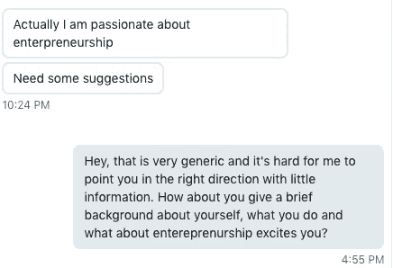
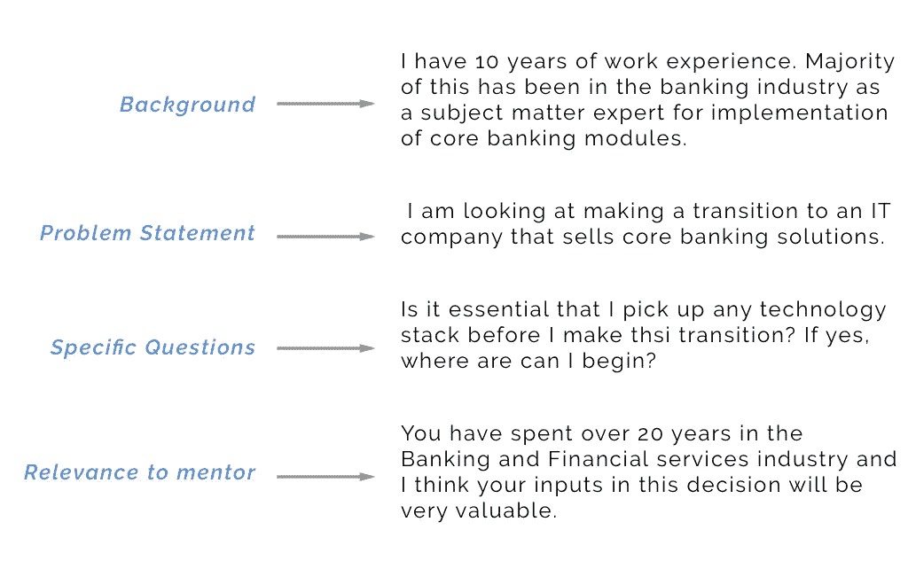

# 如何向陌生人寻求建议

> 原文：<https://medium.com/hackernoon/how-to-ask-an-unknown-person-for-advice-2bd0d4a9c520>

Photo by [Evan Dennis](https://unsplash.com/photos/i--IN3cvEjg?utm_source=unsplash&utm_medium=referral&utm_content=creditCopyText) on [Unsplash](https://unsplash.com/search/photos/question?utm_source=unsplash&utm_medium=referral&utm_content=creditCopyText)

我在 LinkedIn 上注册了导师。人们写信给我，询问关于创业以及总体职业生涯的建议。我从向我寻求建议的人那里学到了一些东西。这篇文章是关于你可以从寻求建议中得到最大的收获。我也回答了一个常见的问题。

## 第一原则:我们为什么要寻求建议？

*   找到更好的做事方法。
*   从别人的错误中学习。

当我面临一个重要的决定，但缺乏打电话的经验/数据时，我通常会寻求建议

我会问我的导师有什么选择。或者我会告诉他们选项，问他们在我的情况下会选择什么，为什么。我仍然必须做出选择，这可能与我的导师所说的相反。我的想法是，当我没有清晰的数据时，我可以得到清晰的数据。

这让我们想到了当你寻求建议或指导时最重要的事情。尤其是对方不认识你的时候。

**如何组织你的查询？**

我职业中心的一个坏例子:

那家伙再也没回来。我总是想知道他期望从我这里得到什么回应。

以下是您的查询中的重要元素:

1.  背景
2.  定义问题
3.  询问具体问题
4.  定义导师为什么能提供帮助
5.  追踪

**背景:**总是给出一个关于你自己的背景。尤其是当你向一个完全陌生的人伸出手时。这个背景必须与后面的问题相关。如果你问的是与职业相关的问题，概述一下你的经历。

**明确问题:**明确自己的问题。你要联系的人并不了解你。他们正抽出宝贵的时间来帮助你。

**问具体的问题:**一般性的问题最多只能得到一般性的回答。询问与你的导师/顾问的专业知识相关的具体问题。

比方说，我想和处于成长阶段的[初创企业](https://hackernoon.com/tagged/start-up)的[首席执行官](https://hackernoon.com/tagged/ceo)谈谈。我这样做是因为他/她已经跨越了早期阶段的障碍。他们也会筹集几轮资金。我想了解他/她在筹集前几轮资金时面临的挑战。问题被很好地定义，导师肯定有答案。如果我问他一个问题，比如“我怎样才能成为一名企业家？”，他/她就不知道怎么回应了。

**跟进:**这是整个过程中必不可少的一环。你寻求建议&然后采取行动。只要你知道你为什么这么做，你的行动不一定要和别人的建议一致。不管怎样，让你的导师/顾问知道你做了什么以及为什么做是一种礼貌。这对双方都有帮助。这也为进一步对话铺平了道路。经常回来检查并保持联系。

我构建了一个例子来指出寻求建议/指导的良好结构。

An example for good structure

# 不要期望得到某种回应而去寻求建议

很多时候，我们问人们问题，希望他们能强化我们的信念。这是一个可怕的想法。当你问一个问题时，要乐于接受别人的回答，否则就不要问。我见过人们在反馈会议、评估、解决方案评审等场合这样做。糟透了。当你听到一些与你的信仰相反的事情时，你会很受伤。但这比让某人变得和蔼可亲更有帮助，这样你就不会心烦意乱。

在创业的背景下，人们经常会问:

## 你觉得我的产品怎么样？

不要利用他人来膨胀你的自我或强化你的感知。问别人，因为你想知道。

> 任何人对企业家做的最糟糕的事情之一就是，当他们认为这不是个好主意时，告诉他们这是个好主意。他们能做的最糟糕的事情就是说你应该恢复联系，让你挂着。

因为你认为我的产品很糟糕，所以我感觉不好是正常的。我必须振作起来，做我第二天要做的事情。请记住，如果很多人都告诉我同样的负面反馈，那一定是哪里出了问题。

## 该不该辞职全力以赴？

没人能告诉你，除了你。看了几篇博客，看了几部电影，人就兴奋了。请记住，许多成功的人都写了它，失败的人有更大的问题要处理。他们不会马上写出来。不要看了博客就不干了。别喝几品脱就戒了。测量你的跑道，了解利害关系(你的家庭，家属等)。)然后放手一搏。

我注意到问这个问题的人希望我说是。这并没有免除他们的责任，但以某种奇怪的方式，他们有这样的想法。

在结束之前，我想谈谈另一个常见的问题以及如何解决它。

## 我如何在我的组织中成长或推进我的职业生涯？

当谈到职业道路时，我通常可以在我的组织或其他组织中找到答案。假设我是一名商业分析师，想了解我的职业应该是什么样子。我看着我的老板，他/她的老板，顺着链条往上走。看他们每个人有多少经验。这应该给我一个高层次的图片。接下来，我会选择另一个我想去工作并做同样事情的组织。LinkedIn 是一个寻找的好地方。接下来，为你梦想中的公司做练习。

下一步是评估我的技能。我通过阅读市场上的职位描述来做这件事。然后我在最常见的点上给自己打分。这会告诉我我的立场。接下来，我为我老板的职位做了同样的事情，我知道我需要什么来达到目的。如此等等。

感谢阅读。