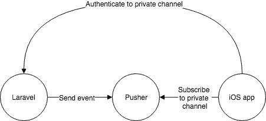
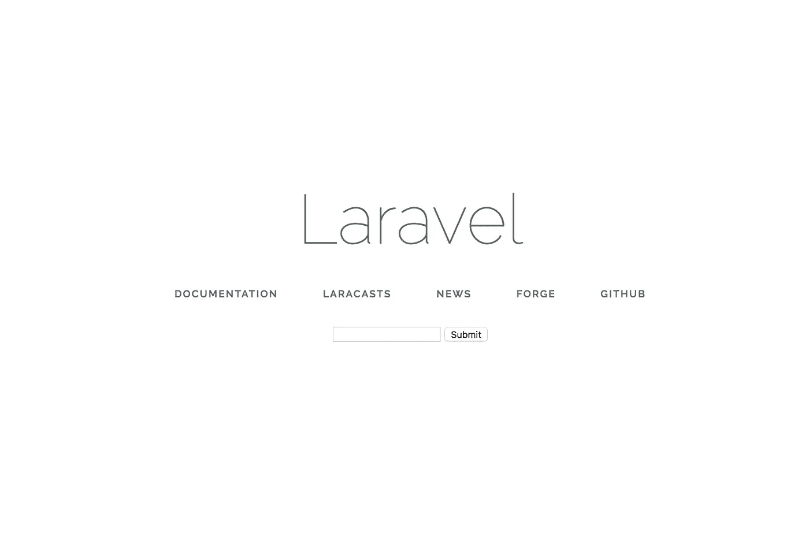
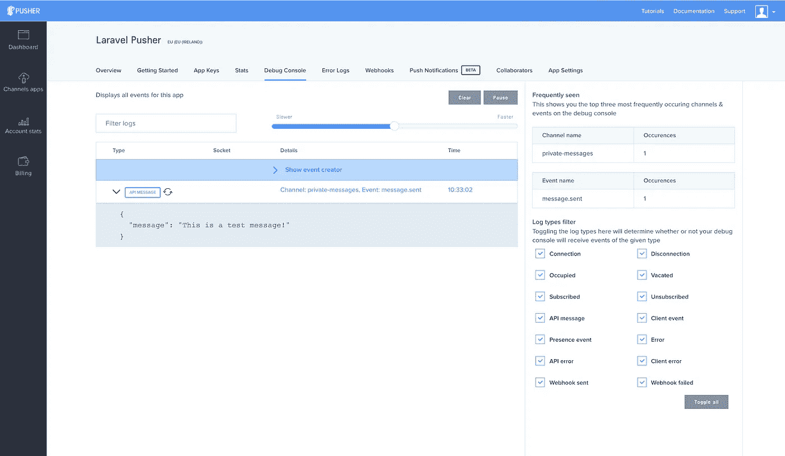

# 如何通过 Laravel 护照认证推销商(第一部分)

> 原文：<https://medium.com/hackernoon/how-to-authenticate-for-pusher-through-laravel-passport-part-1-7269edda0276>


Photo by [Cristina Gottardi](https://unsplash.com/@cristina_gottardi?utm_source=medium&utm_medium=referral) on [Unsplash](https://unsplash.com?utm_source=medium&utm_medium=referral)

假设您有一个 Laravel 应用程序、一个 iOS 应用程序和一些在这些应用程序之间推送的数据。iOS 应用程序需要尽快(实时)显示来自 Laravel 应用程序的数据。这就是 Pusher 派上用场的地方。在这 2 篇文章系列的第一部分中，我们将设置 Laravel 来处理带有 Laravel Passport 的认证请求，并且我们将配置 Pusher 来发送事件。

我创建了下图来说明这个过程:



1.  iOS 应用程序尝试对私有通道进行鉴定。这是通过从 Laravel 应用程序请求访问来完成的。
2.  如果认证成功，套接字令牌被发送回 iOS。
3.  使用套接字令牌，iOS 可以订阅 Pusher 中的私有通道。
4.  如果 Laravel 通过私有通道发送事件，iOS 能够接收到它😃

这看起来相当简单，但是认证过程比预期的要难一些。由于我找不到任何关于如何通过实现 oauth 的 Laravel Passport 进行身份验证的好教程，所以我想写一个简单的教程。

## 设置推动器

要使用 Pusher 作为广播服务，您可以在这里创建一个免费账户[。在 pusher 中创建一个名为 laravel-pusher 的应用程序，例如，当应用程序成功创建时，您将使用各种代码来实现 Pusher。搜寻着*。env* 实现。让它开着，因为我们以后会用到它。](https://dashboard.pusher.com/accounts/sign_up)

## 设置 Laravel

使用以下命令设置一个新的 Laravel 项目:

```
$ composer create-project laravel/laravel laravel-pusher
```

这将创建一个带有新的 laravel 项目的目录 laravel-pusher。接下来，我们将安装 Laravel Passport 和 Pusher 依赖项:

```
$ composer require laravel/passport pusher/pusher-php-server
```

为了简洁起见，我不会解释 Laravel Passport 的整个安装过程，但是这里的[是文档提供的安装指南。](https://laravel.com/docs/5.6/passport#installation)

如果我们敞开心扉。我们将看到各种环境变量。我们正在寻找的产品如下:

```
PUSHER_APP_ID=
PUSHER_APP_KEY=
PUSHER_APP_SECRET=
PUSHER_APP_CLUSTER=mt1
```

现在我们回到 Pusher 网站，你应该还在你的浏览器中，将代码从 Pusher 复制粘贴到你的。环境文件。Pusher_APP_CLUSTER 变量不是由 PUSHER 提供的，而是填充您在创建 PUSHER 应用程序时选择的集群。

另一个重要步骤是将`BROADCAST_DRIVER`设置为`pusher`。

因为 iOS 将请求访问订阅 Pusher，所以我们需要创建一个 HTTP 路由来处理身份验证请求。我们将在 routes/api.php 中创建路由。

> 因为路由放在 routes/api.php 文件中，所以它会自动以/api 作为前缀。完整路径将是/api/broadcast/auth。

此路由指向一个尚不存在的控制器。创建控制器:

```
php artisan make:controller Api\\BroadcastAuthController
```

这将在 app\Http\Controllers 和控制器本身中创建一个名为 Api 的文件夹。以下方法将鉴定来自 iOS 应用程序的请求:

在这个方法中，我们将使用传入通道名和套接字 id 直接调用推送器库。`socket_auth`方法将创建一个套接字令牌，我们可以在将来来自 iOS 应用程序的请求中使用它。

## 前端

我们将创建一个简单的文本输入来发送消息给 Pusher。



Enter a message to submit

继续创建一个漂亮的主题网页或将我的表单 HTML 复制到你的`welcome.blade.php`

接下来，我们将在 web.php 中创建我们在上面的 HTML 中引用的路由:

当发布到`/broadcasting`时，我们将发送一个带有输入文本的事件。要向 Laravel 发送事件，我们可以为此创建一个单独的类:

```
php artisan make:event SendMessage
```

在这个事件中，我们将设置一个名为`$message`的类变量，该变量可用于 iOS 应用程序。记住，Laravel 事件中的所有`public`变量对于正在监听事件的应用程序都是可用的。课程的内容将是:

这将在通道`messages`中发送一个名为`message.sent`的事件。消息的内容可以在`$message`变量中找到。

> 打开 Pusher 仪表盘中的调试控制台，测试是否有事件发生！



Pusher dashboard

这是我们将要构建两个可以通过 websockets 相互通信的应用程序系列的第 1 部分。这里的重点是通过 Laravel Passport 进行认证。你可以在 [GitHub](https://github.com/mratiebatie/laravel-pusher) 上找到本教程的所有代码。

**Sjors van Dongen 是一位荷兰人，对发展、创业和个人成长充满热情。他目前正在为他的数字访客注册软件** [**工作**](https://incheckert.nl)